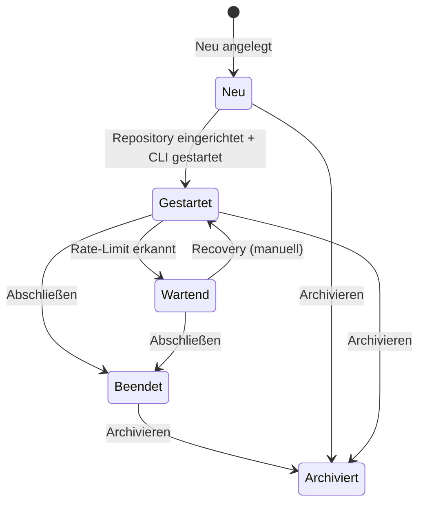
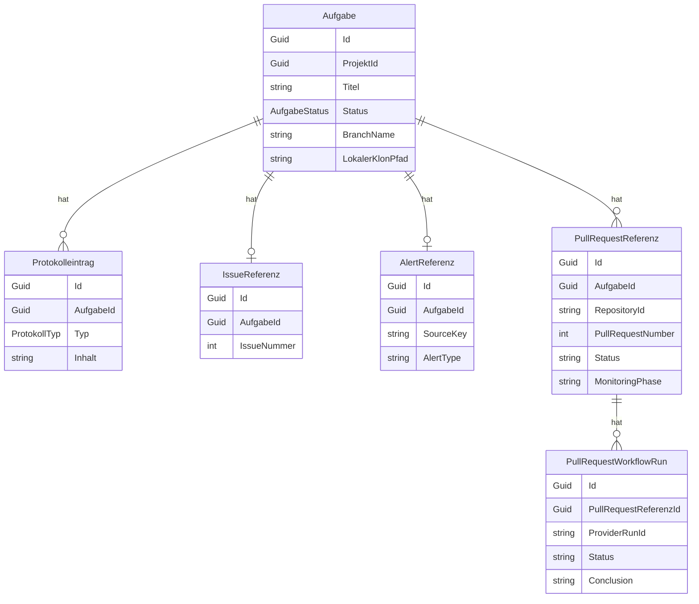

# Aufgaben & KI-Entwicklungsprozess — Datenmodell

## Entitäten

### `Aufgabe`

| Eigenschaft | Typ | Beschreibung |
|-------------|-----|--------------|
| `Id` | `Guid` | Primärschlüssel |
| `ProjektId` | `Guid` | FK → Projekt |
| `GitRepositoryId` | `Guid?` | FK → GitRepository |
| `Titel` | `string` | Aufgabentitel |
| `AnforderungsBeschreibung` | `string?` | Prompt-Vorlage / Anforderungstext |
| `Status` | `AufgabeStatus` | Aktueller Status (siehe unten) |
| `BranchName` | `string?` | Name des Git-Branches |
| `LokalerKlonPfad` | `string?` | Lokaler Pfad des geklonten Repositories |
| `AgentenpaketName` | `string?` | Name des Agentenpakets |
| `AgentenName` | `string?` | Name des gewählten Agenten |
| `KiPluginPrefix` | `string?` | Plugin-Prefix des KI-Plugins |
| `ErstellungsDatum` | `DateTimeOffset` | Anlagezeitpunkt |
| `AbschlussDatum` | `DateTimeOffset?` | Abschlusszeitpunkt |
| `AktiveRunId` | `string?` | Run-ID eines laufenden KI-Prozesses |
| `LastHeartbeatUtc` | `DateTimeOffset?` | Letzter Heartbeat-Zeitstempel |
| `LetzterCliStartUtc` | `DateTimeOffset?` | Zeitpunkt des letzten echten CLI-Prozessstarts; dient als stabile Sortiergrundlage fuer aktive Aufgabenlisten |
| `RecoveryVersion` | `int` | Concurrency-Token für Recovery |
| `VorschlagPrompt` | `string?` | Gespeicherter Rate-Limit-Prompt-Vorschlag |
| `VorschlagAusfuehrenAbUtc` | `DateTimeOffset?` | Geplanter Ausführungszeitpunkt des Vorschlags |
| `AlertReferenz` | `AlertReferenz?` | Optionale Herkunftsreferenz, wenn die Aufgabe aus einem SCM-Alert erstellt wurde |
| `PullRequests` | `ICollection<PullRequestReferenz>` | Persistierte Pull Requests, die aus der Aufgabe heraus erstellt wurden |

### `Protokolleintrag`

| Eigenschaft | Typ | Beschreibung |
|-------------|-----|--------------|
| `Id` | `Guid` | Primärschlüssel |
| `AufgabeId` | `Guid` | FK → Aufgabe |
| `Zeitstempel` | `DateTimeOffset` | Zeitpunkt des Eintrags |
| `Typ` | `ProtokollTyp` | `Prompt`, `KiAntwort`, `GitAktion`, `StatusUebergang`, `TestErgebnis`, `CliOutput`, `RateLimit`, `SystemMeldung` |
| `Inhalt` | `string` | Inhalt (Markdown) |
| `AgentName` | `string?` | Name des Agenten |

### `IssueReferenz`

| Eigenschaft | Typ | Beschreibung |
|-------------|-----|--------------|
| `Id` | `Guid` | Primärschlüssel |
| `AufgabeId` | `Guid` | FK → Aufgabe |
| `IssueNummer` | `int` | Issue-Nummer im Provider |
| `Titel` | `string` | Titel des Issues |
| `IssueUrl` | `string?` | Direkt-URL zum Issue |

### `AlertReferenz`

| Eigenschaft | Typ | Beschreibung |
|-------------|-----|--------------|
| `Id` | `Guid` | Primärschlüssel |
| `AufgabeId` | `Guid` | FK -> Aufgabe |
| `Provider` | `string` | SCM-Provider, z. B. `github` |
| `RepositoryId` | `string` | Repository-Kennung beim Provider |
| `AlertType` | `string` | Alert-Art, initial `CodeScanning` |
| `SourceKey` | `string` | Providerweit stabile Alert-Kennung zur Duplikatvermeidung |
| `AlertUrl` | `string?` | Direkt-URL zum ursprünglichen Alert |
| `Titel` | `string` | Alert-Titel zum Zeitpunkt der Konvertierung |
| `Severity` | `string?` | Von GitHub gelieferte Severity |
| `State` | `string?` | Von GitHub gelieferter Alert-Status |
| `RuleId` | `string?` | Code-Scanning-Regelkennung |
| `ToolName` | `string?` | Name des meldenden Code-Scanning-Tools |

`SourceKey` ist eindeutig indiziert. Dadurch kann derselbe GitHub-Code-Scanning-Alert auch bei parallelen oder wiederholten UI-Aktionen nicht mehrfach als lokale Aufgabe gespeichert werden.

### `PullRequestReferenz`

| Eigenschaft | Typ | Beschreibung |
|-------------|-----|--------------|
| `Id` | `Guid` | Primärschlüssel |
| `AufgabeId` | `Guid` | FK -> Aufgabe |
| `Provider` | `PullRequestProvider` | Provider des Pull Requests, initial `GitHub` |
| `RepositoryId` | `string` | Repository-Identifier beim Provider, z. B. `owner/repo` |
| `PullRequestNumber` | `int` | Pull-Request-Nummer beim Provider |
| `ProviderPullRequestId` | `string?` | Optionale eindeutige Provider-ID |
| `Url` | `string` | Direkt-URL zum Pull Request |
| `Titel` | `string` | Pull-Request-Titel |
| `SourceBranch` | `string` | Quellbranch |
| `TargetBranch` | `string` | Zielbranch |
| `HeadSha` | `string?` | Head-SHA des Pull Requests |
| `MergeCommitSha` | `string?` | Merge-Commit-SHA, sofern bekannt |
| `Status` | `PullRequestStatus` | Providerstatus des Pull Requests |
| `MergeStatus` | `PullRequestMergeStatus` | Mergebarkeit beziehungsweise Merge-Status |
| `MonitoringPhase` | `PullRequestMonitoringPhase` | Lokale Monitoring-Phase |
| `LastCheckedUtc` | `DateTimeOffset?` | Zeitpunkt der letzten Statusprüfung |
| `NextCheckUtc` | `DateTimeOffset?` | Zeitpunkt der nächsten Statusprüfung |
| `LastError` | `string?` | Sichtbarer Fehler oder Blockierungsgrund |
| `CreatedUtc` | `DateTimeOffset` | Erstellungszeitpunkt des lokalen Referenzeintrags |

### `PullRequestWorkflowRun`

| Eigenschaft | Typ | Beschreibung |
|-------------|-----|--------------|
| `Id` | `Guid` | Primärschlüssel |
| `PullRequestReferenzId` | `Guid` | FK -> PullRequestReferenz |
| `ProviderRunId` | `string` | Run-ID beim Provider |
| `Name` | `string` | Workflow- oder Check-Name |
| `Url` | `string?` | Direkt-URL zum Workflow-Run |
| `HeadSha` | `string?` | Head-SHA des Workflow-Runs |
| `BranchName` | `string?` | Branch des Workflow-Runs |
| `Status` | `WorkflowRunStatus` | Laufstatus |
| `Conclusion` | `WorkflowRunConclusion` | Abschlussbewertung |
| `StartedAtUtc` | `DateTimeOffset?` | Startzeitpunkt, sofern bekannt |
| `CompletedAtUtc` | `DateTimeOffset?` | Abschlusszeitpunkt, sofern bekannt |
| `IsPostMerge` | `bool` | Kennzeichnet Runs, die nach einem Merge beobachtet werden |
| `UpdatedUtc` | `DateTimeOffset` | Letzter lokaler Aktualisierungszeitpunkt |

## Statusübergänge

```mermaid
stateDiagram-v2
    [*] --> Neu : Neu angelegt
    Neu --> Gestartet : Repository eingerichtet + CLI gestartet
    Gestartet --> Wartend : Rate-Limit erkannt
    Gestartet --> Beendet : Abschließen
    Wartend --> Beendet : Abschließen
    Wartend --> Gestartet : Recovery (manuell)
    Beendet --> Archiviert : Archivieren
    Neu --> Archiviert : Archivieren
    Gestartet --> Archiviert : Archivieren
```

## Beziehungen

```mermaid
erDiagram
    Aufgabe {
        Guid Id
        Guid ProjektId
        string Titel
        AufgabeStatus Status
        string BranchName
        string LokalerKlonPfad
    }
    Protokolleintrag {
        Guid Id
        Guid AufgabeId
        ProtokollTyp Typ
        string Inhalt
    }
    IssueReferenz {
        Guid Id
        Guid AufgabeId
        int IssueNummer
    }
    AlertReferenz {
        Guid Id
        Guid AufgabeId
        string SourceKey
        string AlertType
    }
    PullRequestReferenz {
        Guid Id
        Guid AufgabeId
        string RepositoryId
        int PullRequestNumber
        string Status
        string MonitoringPhase
    }
    PullRequestWorkflowRun {
        Guid Id
        Guid PullRequestReferenzId
        string ProviderRunId
        string Status
        string Conclusion
    }
    Aufgabe ||--o{ Protokolleintrag : "hat"
    Aufgabe ||--o| IssueReferenz : "hat"
    Aufgabe ||--o| AlertReferenz : "hat"
    Aufgabe ||--o{ PullRequestReferenz : "hat"
    PullRequestReferenz ||--o{ PullRequestWorkflowRun : "hat"
```

## CLI-Ausgabeprotokoll

CLI-Ausgaben werden ohne neue Tabelle im bestehenden `Protokolleintrag`-Modell gespeichert:

| Feld | Wert bei CLI-Ausgabe |
|------|----------------------|
| `AufgabeId` | Die Aufgabe, deren ConPTY-Sitzung den Output erzeugt hat |
| `Typ` | `ProtokollTyp.CliOutput` |
| `Inhalt` | Eine dekodierte Ausgabezeile aus dem Terminal-Output |
| `Zeitstempel` | Persistenzzeitpunkt des Protokolleintrags |

`ProtokollService.AddCliOutputAsync` ist der zentrale Persistenzpfad. Erkennt die Methode in einer Ausgabezeile einen Rate-Limit-Marker, wird zusätzlich ein `ProtokollTyp.RateLimit`-Eintrag erzeugt.
