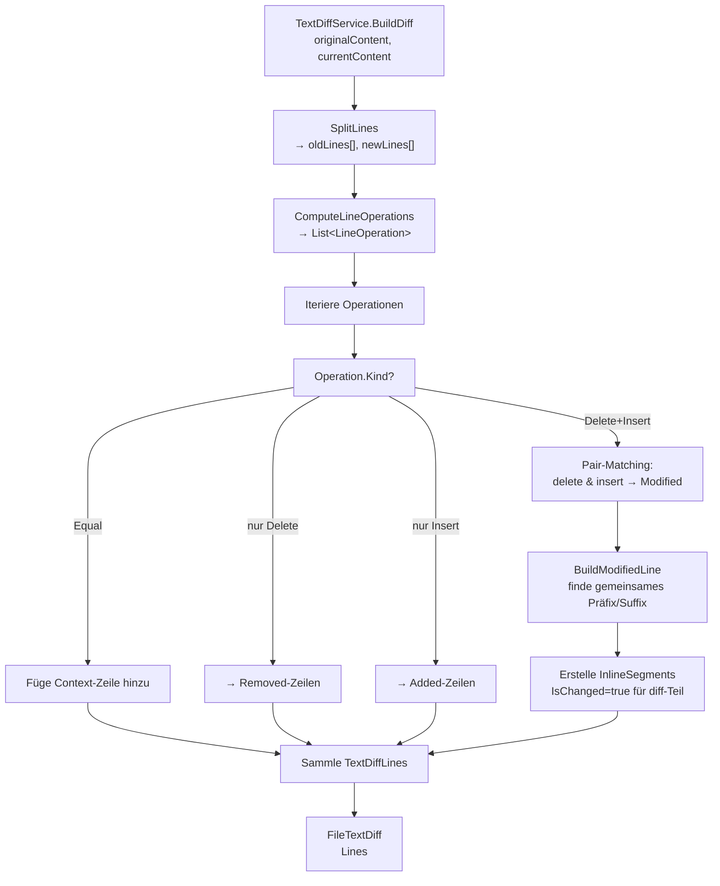

← [Zurück zur Übersicht](index.md)

# Dateiexplorer — Technischer Ablauf

## Übersicht

Der Dateiexplorer ist ein integrales Register der `TaskDetailView`, das zwei unabhängige Anzeigemodi orchestriert:
1. **Standardmodus:** Lazy-Loading des lokalen Arbeitsbaums (initial nur 2 Ebenen, beim Aufklappen werden weitere Ebenen nachgeladen)
2. **Vergleichsmodus:** Commit-basierte Darstellung geänderter Dateien mit Diff-Rendering (bereits mit Lazy-Loading via `BranchCommit.ChildrenLoaded`)

Die Implementierung verwendet Presentation-Model-Pattern (`FileExplorerViewModel`), dedizierte Services (`IGitWorkspaceBrowserService`, `ITextDiffService`) und speichert Zwischenergebnisse (Baum, Commits, Diffs) in `ObservableCollection`s für UI-Binding. Der Standardmodus nutzt progressive Tiefenentwicklung für Performance-Optimierung bei großen Repositories.

## Ablauf — Komponenten und deren Interaktion

### Komponenten

| Komponente | Typ | Zweck |
|-----------|-----|-------|
| `TaskDetailViewModel` | ViewModel | Übergeordnetes ViewModel der Aufgabendetailansicht; delegiert Explorer-Logik an `FileExplorerViewModel` |
| `FileExplorerViewModel` | ViewModel | Presentation Model des Explorers: verwaltet Baum/Commits, Auswahl, Dateiinhalt, Diff-Zeilen, Modus und Commands |
| `FileExplorerView` | UserControl | Oberflächenpräsentation: Mode-Toggle-Buttons, TreeView mit HierarchicalDataTemplate, GridSplitter, Inhalt-/Diff-Anzeige rechts |
| `IGitWorkspaceBrowserService` | Interface | Abstrahiert Git-Backend (Arbeitsbaum-Aufzählung, Snapshot-/Datei-/Commit-Laden) |
| `GitWorkspaceBrowserService` | Service | Konkrete Implementierung: lädt Arbeitsbaum (Directory-Walk), Snapshot (Commits), Dateivorschauen mit Binär-Erkennung |
| `ITextDiffService` | Interface | Abstrahiert Zeilendiff-Erzeugung |
| `TextDiffService` | Service | Konkrete Implementierung: berechnet `FileTextDiff` mit Added/Removed/Modified/Context-Zeilen und Inline-Segmenten |
| `DiffViewer` | UserControl | Zeilenweiser Diff-Renderer: ItemsControl mit Hintergrund-Farben pro Zeile und Inline-Runs für geänderte Wortteile |
| `DiffLineStatusToBrushConverter` | IValueConverter | Wandelt `DiffLineStatus` (Added/Removed/Modified/Context) in Hintergrund-Brush um |
| `WorkspaceFileNode` | DTO/ViewModel | Baum-Knoten (domain) mit Properties: `Name`, `RelativePath`, `IsDirectory`, `Children`, `Status`, `CommitSha` (für Vergleich) |
| `TextDiffLine` | Value Object | Eine Diff-Zeile mit `Content`, `Status`, `OldLineNumber`, `NewLineNumber`, `InlineSegments` |
| `DateibrowserAnsichtsmodus` | Enum | Modus-Umschalter: `Standard` vs. `Vergleich` |
| `WorkingTreeWalkContext` | Internal Class | Kontext für Directory-Walk (enthält `RootPath`, `MaxDepth`, `CancellationToken`, `NodeCount` zum Zählen aufgezählter Knoten) |

## Programmabläufe

### 1. Dateiexplorer öffnen (Standardmodus mit Lazy-Loading)

```
Benutzer: Klick auf "Dateien"-Button
  ↓
TaskDetailViewModel.DateiViewCommand
  ↓
  setze IsFileExplorerViewSelected = true
  ↓
FileExplorerView wird sichtbar (Binding an Visibility)
  ↓
FileExplorerViewModel.InitialisierenAsync(aufgabe.LokalerKlonPfad)
  ↓
  1. setze AktuellerModus = DateibrowserAnsichtsmodus.Standard
  2. rufe LadeArbeitsbaumAsync() auf
    ↓
    IGitWorkspaceBrowserService.LoadWorkingTreeAsync(repositoryPath, maxInitialDepth=2)
      ↓
      Erstelle WorkingTreeWalkContext(repositoryPath, maxDepth=2, cancellationToken)
      Rufe WalkWorkingTreeDirectory(repositoryPath, rootNodes, currentDepth=0, context) auf
        ↓
        Enumiere Verzeichnisse und Dateien im aktuellen Pfad
        skip .git
        Für jedes Verzeichnis:
          - Erstelle WorkspaceFileNode mit Depth=0 (Wurzel) oder Depth=1 (direkte Kinder)
          - wenn currentDepth + 1 < maxDepth (d.h. noch innerhalb der Grenzen):
              ChildrenLoaded = true, rekursiv weitere Ebenen laden
          - sonst (Grenztiefe erreicht):
              ChildrenLoaded = false, füge Platzhalter-Kindknoten hinzu (IsPlaceholder=true)
        Für jede Datei:
          - Erstelle WorkspaceFileNode mit IsDirectory=false
      ↓
      SortNodes: Sortiere Knoten (Verzeichnisse zuerst, dann Dateien, alphabetisch)
      Platzhalter bleiben unsortiert an ihrem Platz
      ↓
      → IReadOnlyList<WorkspaceFileNode> (Wurzelknoten + Ebene 1, Ebene 2+ nur mit Platzhaltern)
    ↓
    Wurzelknoten ← neue Wurzelknoten
  ↓
TreeView rendert Baum via HierarchicalDataTemplate
  - Verzeichnisse mit ChildrenLoaded=false und Platzhalter zeigen den Aufklapp-Pfeil an
```

**Beteiligte Klassen:**
- `TaskDetailViewModel` (Umschalter)
- `FileExplorerViewModel` (Initialiserung, Modus-Steuerung, `InitialLoadDepth`-Konstante)
- `FileExplorerView` (UI-Binding)
- `IGitWorkspaceBrowserService` (Lazy-Loading-Service-Interface)
- `GitWorkspaceBrowserService` (Directory-Walk mit Tiefenbegrenzung, `WalkWorkingTreeDirectory`, `AddDirectoryNode`, `AddFileNode`, `WorkingTreeWalkContext`)
- `WorkspaceFileNode` (mit neuen Properties: `Depth`, `ChildrenLoaded`, `IsPlaceholder`, `Children: ObservableCollection<WorkspaceFileNode>`)

**Sicherheitsfeatures:**
- `.git`-Verzeichnis automatisch ausgeschlossen
- Knoten-Obergrenze bei sehr großen Repositories (`MaxWorkingTreeNodeCount = 100_000`)
- `MaxLazyLoadDepth = 64` schützt vor zirkulären Symlinks und Endlostiefe

---

### 1.5 Verzeichnis aufklappen — Lazy-Load einer Ebene

```
Benutzer: Klick auf ▶ neben einem Verzeichnisknoten (mit ChildrenLoaded=false)
  ↓
TreeViewItem.Expanded-Event feuert
  ↓
FileExplorerView.OnBaumKnotenExpanded(e.OriginalSource: TreeViewItem)
  ↓
  wenn DataContext: WorkspaceFileNode node
    vm.LadeKinderAsync(node) via SafeFireAndForget
      ↓
      Validierungen:
        - node.IsDirectory == true && node.ChildrenLoaded == false
        - _repositoryPath nicht null/leer
      ↓
      IGitWorkspaceBrowserService.LoadSubtreeAsync(_repositoryPath, node.RelativePath, node.Depth + 1)
        ↓
        Erstelle WorkingTreeWalkContext(repositoryPath, maxDepth=depth+1, cancellationToken)
        Rufe WalkWorkingTreeDirectory(fullParentPath, childNodes, depth, context) auf
          ↓
          Enumiere unmittelbare Kinder von fullParentPath
          skip .git
          Für jedes Kind:
            - Erstelle WorkspaceFileNode mit Depth=depth
            - wenn kind ist Verzeichnis:
                ChildrenLoaded = false, füge Platzhalter-Kindknoten hinzu
          ↓
          SortNodes: sortiere Knoten (Platzhalter bleiben an ihrem Platz)
        ↓
        → IReadOnlyList<WorkspaceFileNode> (unmittelbare Kinder mit optional ihren Platzhaltern)
      ↓
      Auf Dispatcher-Thread:
        node.Children.ReplaceAll(neueKinder)  # ersetzt Platzhalter durch echte Kinder
        node.ChildrenLoaded = true
      ↓
TreeView zeigt neue Kinder
```

**Beteiligte Klassen:**
- `FileExplorerView` (Code-Behind, Event-Handler `OnBaumKnotenExpanded`)
- `FileExplorerViewModel` (Methode `LadeKinderAsync`)
- `IGitWorkspaceBrowserService.LoadSubtreeAsync` (Service-Methode)
- `GitWorkspaceBrowserService` (Directory-Walk einer Ebene)
- `WorkspaceFileNode` (mit `ReplaceAll`-Extension auf `Children`)

**Fehlerbehandlung:**
- Bei Exception wird geloggt und `node.ChildrenLoaded` bleibt `false` (Platzhalter bleibt, erneutes Aufklappen möglich)

---

### 1.6 Verzeichnis zuklappen — Bereinigung von Groß-Enkel-Knoten

```
Benutzer: Klick auf ▼ neben einem aufgeklappten Verzeichnisknoten
  ↓
TreeViewItem.Collapsed-Event feuert
  ↓
FileExplorerView.OnBaumKnotenCollapsed(e.OriginalSource: TreeViewItem)
  ↓
  wenn DataContext: WorkspaceFileNode node
    vm.BeraeumeKnoten(node)
      ↓
      Iteriere über die direkten Kinder von node:
        für kind in node.Children:
          wenn kind.IsDirectory && kind.ChildrenLoaded:
            kind.Children.ReplaceAll([WorkspaceFileNode.CreatePlaceholder(kind.Depth + 1)])
            kind.ChildrenLoaded = false
      ↓
      Invariante wiederhergestellt: pro Verzeichnis ist maximal eine Ebene mehr geladen als sichtbar
      (der zugeklappte Knoten selbst bleibt sichtbar + seine direkten Kinder bleiben geladen,
       Knoten mit Depth > node.Depth + 1 sind entfernt und werden durch Platzhalter ersetzt)
      ↓
TreeView zeigt weniger Knoten (tiefer geladene Knoten entfernt)
```

**Beteiligte Klassen:**
- `FileExplorerView` (Code-Behind, Event-Handler `OnBaumKnotenCollapsed`)
- `FileExplorerViewModel` (Methode `BeraeumeKnoten`)
- `WorkspaceFileNode` (mit `ReplaceAll`-Extension und `CreatePlaceholder`-Fabrik-Methode)

**Zweck der Bereinigung:**
- Speicher sparen bei tiefen Navigationen
- Konsistente Invariante beibehalten

---

### 2. Datei auswählen und Inhalt anzeigen

```
Benutzer: Klick auf Datei-Knoten im TreeView
  ↓
AusgewaehlterKnoten = knoten (Binding)
  ↓
DateiLadenAsync(knoten, CancellationToken)
  ↓
  wenn knoten.IsDirectory: abbruch (nichts tun)
  ↓
  IGitWorkspaceBrowserService.LoadPreviewAsync(repositoryPath, knoten)
    ↓
    Lies Dateiinhalt (File.ReadAllText oder 1 MB Limit)
    Prüfe auf Binärinhalt (null-bytes)
    bei Binär oder > 1 MB: FilePreview(IsBinary=true/IsTooBig=true)
    sonst: FilePreview(CurrentContent=text)
    ↓
    → FilePreview
  ↓
  wenn FilePreview.IsBinary oder IsTooBig:
    DateiInhalt ← Hinweistext ("[Binärdatei]" oder "[Datei > 1 MB]")
  sonst:
    DateiInhalt ← FilePreview.CurrentContent
  ↓
  leere DiffZeilen (Standard-Modus hat kein Diff)
  ↓
TextBlock/ScrollViewer rechts zeigt DateiInhalt (Read-Only)
```

**Beteiligte Klassen:**
- `FileExplorerViewModel` (Auswahl-Logik, Async-Handling, Platzhalter-Guard)
- `IGitWorkspaceBrowserService` (Datei-Laden)
- `FilePreview` (Vorschau mit Metadaten)
- `FileExplorerView` (Binding an DateiInhalt und DiffZeilen)

**Platzhalter-Guard:**
```
AusgewaehlterKnoten-Setter:
  wenn knoten.IsPlaceholder == true:
    DateiInhalt ← null
    DiffZeilen.Clear()
    return (keine weiteren Operationen)
```
Dies verhindert, dass technische Platzhalter-Knoten als Auswahl behandelt werden.

---

### 3. In Vergleichsmodus wechseln

```
Benutzer: Klick auf "Vergleich"-Button
  ↓
VergleichCommand → VergleichAsync()
  ↓
  1. setze AktuellerModus = DateibrowserAnsichtsmodus.Vergleich
  2. rufe IGitWorkspaceBrowserService.LoadSnapshotAsync(repositoryPath) auf
    ↓
    Git diff --name-status -z origin/HEAD..HEAD (oder origin/main..HEAD)
    Bestimme Basisreferenz robust (origin/HEAD → origin/main → main → master)
    Parse diff-tree Output
    Gruppiere nach Commits (mittels git log --reverse main..HEAD)
    ↓
    → WorkspaceSnapshot { BranchCommits, ... }
  ↓
  CommitGruppen ← snapshot.BranchCommits
  leere Wurzelknoten (wechsel vom Standard)
  leere DiffZeilen
  ↓
TreeView rendert Commits als aufklappbare Wurzelknoten
  (Commit.Subject + Commit.ShortSha, z. B. "feat: Explorer (a1b2c3d)")
  InitiallyCollapsed=true
```

**Beteiligte Klassen:**
- `FileExplorerViewModel` (Modus-Wechsel)
- `IGitWorkspaceBrowserService` (Snapshot-Laden, Git-Integration)
- `WorkspaceSnapshot`, `BranchCommit` (Domain Value Objects)

---

### 4. Commit aufklappen (Vergleichsmodus)

```
Benutzer: Klick auf ▶ neben Commit-Knoten
  ↓
  Gebundenes Expand-Event auf BranchCommit
  (über Attached Behavior oder TreeViewItem.Expanded)
  ↓
  wenn BranchCommit.ChildrenLoaded == false:
    CommitAufklappenAsync(commit)
      ↓
      IGitWorkspaceBrowserService.LoadCommitFilesAsync(repositoryPath, commit.Sha)
        ↓
        git show --name-status <commit.Sha>
        Parse ChangeType (Added/Modified/Deleted)
        Baue WorkspaceFileNode-Hierarchie auf (wie im Standard)
        ↓
        → IReadOnlyList<WorkspaceFileNode>
      ↓
      commit.Files ← neue WorkspaceFileNodes
      commit.ChildrenLoaded ← true
    ↓
TreeView zeigt die Dateien des Commits mit Status-Icons
```

**Beteiligte Klassen:**
- `FileExplorerViewModel` (Lazy-Loading-Logik)
- `IGitWorkspaceBrowserService` (Commit-Datei-Laden)
- `BranchCommit` (mit `Files` Collection und `ChildrenLoaded` Flag)

---

### 5. Geänderte Datei inspizieren (Vergleichsmodus)

```
Benutzer: Klick auf Datei unterhalb eines Commits
  ↓
AusgewaehlterKnoten = datei-knoten (mit CommitSha)
  ↓
DateiLadenAsync(knoten, CancellationToken)
  ↓
  IGitWorkspaceBrowserService.LoadCommitPreviewAsync(repositoryPath, knoten)
    ↓
    git show <commit>:<file> → CurrentContent
    Arbeitsbaum-Inhalt oder HEAD → OriginalContent
    (je nach ChangeType Added/Modified/Deleted)
    ↓
    → FilePreview { OriginalContent, CurrentContent, IsBinary, IsTooBig, ChangeType }
  ↓
  wenn FilePreview.IsBinary oder IsTooBig:
    DateiInhalt ← Hinweistext
    leere DiffZeilen
  sonst:
    ITextDiffService.BuildDiff(originalContent, currentContent)
      ↓
      Berechne Zeilendiff (Added/Removed/Modified/Context)
      Pro Modified-Zeile: berechne Inline-Segmente (gemeinsames Präfix/Suffix)
      ↓
      → FileTextDiff { Lines }
    ↓
    DiffZeilen ← diff.Lines
    DateiInhalt ← leer (wird vom DiffViewer überschrieben)
  ↓
DiffViewer rendert DiffZeilen
  (mit Hintergrund-Farben und Inline-Runs)
```

**Beteiligte Klassen:**
- `FileExplorerViewModel` (Auswahl-Logik)
- `IGitWorkspaceBrowserService` (Datei-Vorschau mit Commit-Context)
- `ITextDiffService` (Zeilendiff-Erzeugung)
- `TextDiffLine`, `InlineDiffSegment` (Value Objects)
- `DiffViewer` (UI-Rendering)

---

### 6. Aktualisieren

```
Benutzer: Klick auf "↻ Aktualisieren"-Button
  ↓
AktualisierenCommand → AktualisierenAsync()
  ↓
  wenn AktuellerModus == Standard:
    StandardAnsichtAsync() (wie Ablauf 1)
  sonst:
    VergleichAsync() (wie Ablauf 3)
  ↓
Baum/Commits werden neu geladen und angezeigt
```

## Diagramm — Zeilendiff-Berechnung



## Fehlerbehandlung

- **Nicht existierender Repository-Pfad:** `LoadWorkingTreeAsync` liefert leere Liste; `InitialisierenAsync` setzt Hinweis
- **Git-Fehler beim Diff:** `LoadSnapshotAsync` logt Exception; `CommitGruppen` bleibt leer oder zeigt Fehlerhinweis
- **Binärdateien:** `FilePreview.IsBinary=true` → Hinweistext statt Inhalt
- **Datei > 1 MB:** `FilePreview.IsTooBig=true` → Hinweistext statt Inhalt (Schutz vor Memory-Overhead)
- **Leere oder ungültige Diffs:** `BuildDiff` liefert leere `FileTextDiff.Lines` ohne Exception

## Performance-Überlegungen

- **Standardmodus:** Directory-Walk mit fester Obergrenze (z. B. 10.000 Knoten); bei Überschreitung wird Hinweis angezeigt
- **Vergleichsmodus:** Commits werden lazy geladen (`ChildrenLoaded` Flag); Dateien eines Commits nur bei Aufklappen
- **Caching:** `WorkspaceFileNode`-Bäume werden im ViewModel gecacht, bis `AktualisierenCommand` aufgerufen wird
- **Diff-Rendering:** `DiffViewer` nutzt ItemsControl (nicht virtualisiert); bei Diffs mit 1000+ Zeilen kann es zu leichten UI-Verzögerungen kommen
