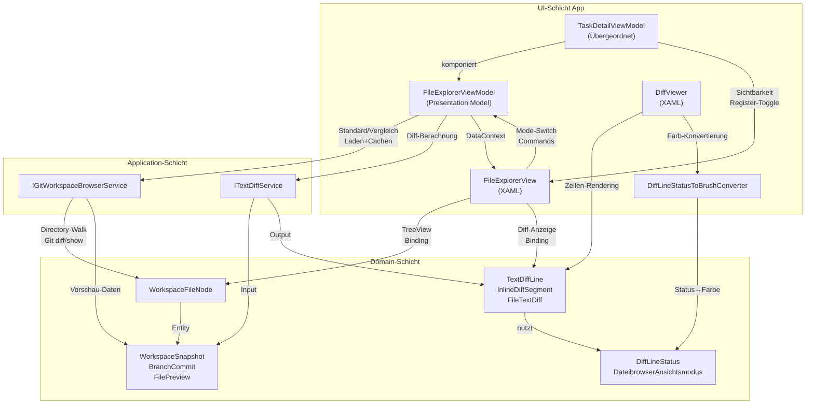

← [Zurück zur Übersicht](index.md)

# Dateiexplorer — Architektur

## Beteiligte Komponenten

| Komponente | Schicht | Rolle |
|-----------|--------|-------|
| `TaskDetailViewModel` | Presentation (App) | Übergeordnetes ViewModel; delegiert Explorer-Logik und verwaltet Sichtbarkeitszustand |
| `FileExplorerViewModel` | Presentation (App) | Presentation Model des Explorers; orchestriert alle Explorer-Funktionen (Baum, Commits, Diff, Modus) |
| `FileExplorerView` | UI (App) | XAML-UserControl; Split-View mit Mode-Buttons, TreeView und Inhalts-/Diff-Anzeige |
| `DiffViewer` | UI (App) | Wiederverwendbarer UserControl für zeilenweises Diff-Rendering mit Farbkodierung |
| `DiffLineStatusToBrushConverter` | UI (App) | IValueConverter für Umwandlung von DiffLineStatus in Hintergrund-Brush |
| `DateibrowserAnsichtsmodus` | Presentation (App) | Enum für Modus-Steuerung (Standard vs. Vergleich) |
| `IGitWorkspaceBrowserService` | Application | Interface für Git-Backend-Operationen (Arbeitsbaum mit Lazy-Loading, Commits, Dateivorschauen) |
| `GitWorkspaceBrowserService` | Application | Konkrete Implementierung mit Directory-Walk, Lazy-Loading-Support; nutzt `ICliRunner` für Git-Aufrufe und File-System-APIs |
| `WorkingTreeWalkContext` | Application | Interne Hilfsklasse für Directory-Walk-Kontext (speichert `RootPath`, `MaxDepth`, `CancellationToken`, `NodeCount`) |
| `ITextDiffService` | Application | Interface für zeilenweisen Präsentations-Diff |
| `TextDiffService` | Application | Konkrete Implementierung; berechnet Diff ohne DB-Abhängigkeit |
| `WorkspaceFileNode` | Domain | Value Object für Baum-Knoten (Directory-Walk und Commit-Files) |
| `TextDiffLine`, `InlineDiffSegment`, `FileTextDiff` | Domain | Value Objects für Diff-Daten |
| `WorkspaceSnapshot`, `BranchCommit`, `FilePreview` | Domain | Value Objects für Git-Backend-Daten |
| `DiffLineStatus` | Domain | Enum für Zeilen-Status (Added/Removed/Modified/Context) |

## Abhängigkeiten und Kommunikationsmuster



## Schichtenarchitektur

### UI-Schicht (App)
- **TaskDetailView** stellt das neue Register bereit
- **FileExplorerView** ist spezialisiert auf die Dateiexplorer-Oberfläche (Mode-Buttons, TreeView, Splitter)
- **DiffViewer** ist eine wiederverwendbare Komponente für Diff-Rendering
- Alle ViewModels nutzen Property-Binding für reaktive Aktualisierungen

### Presentation-Schicht (App.ViewModels)
- **FileExplorerViewModel** ist das Presentation Model für alle Explorer-Funktionen
- Verwaltet Observable Collections (`Wurzelknoten`, `CommitGruppen`, `DiffZeilen`)
- Commands für Benutzer-Interaktionen (`StandardAnsichtCommand`, `VergleichCommand`, `AktualisierenCommand`)
- Delegation an Application-Layer Services, nicht direkte Datenbankzugriffe

### Application-Schicht
- **IGitWorkspaceBrowserService**: Abstrahiert Git-Backend-Operationen mit Lazy-Loading-Support
  - `LoadWorkingTreeAsync(repositoryPath, maxInitialDepth = 2, ...)` — Directory-Walk mit Tiefenbegrenzung (initial 2 Ebenen)
  - `LoadSubtreeAsync(repositoryPath, parentPath, depth, ...)` — Lazy-Load einzelner Ebenen beim Aufklappen
  - `LoadSnapshotAsync()` — Commit-Listing
  - `LoadPreviewAsync()` / `LoadCommitPreviewAsync()` — Datei-Inhalt
  - `LoadCommitFilesAsync()` — Commit-spezifische Dateien
- **ITextDiffService**: Abstrahiert Zeilendiff-Erzeugung
  - `BuildDiff()` — aus Alt/Neu-Inhalt zu `FileTextDiff`

### Domain-Schicht
- **Value Objects** für Datenmodelle: `WorkspaceFileNode`, `TextDiffLine`, `InlineDiffSegment`, `FileTextDiff`, `BranchCommit`, `FilePreview`, etc.
- **Enums** für Typsicherheit: `DiffLineStatus`, `DateibrowserAnsichtsmodus`
- Keine Geschäftslogik, reine Datenschichten

## Datenfluss

### Standardmodus — Lazy-Loading Directory-Walk

```
Benutzer öffnet Register
  ↓
TaskDetailViewModel.Aufgabe.LokalerKlonPfad
  ↓
FileExplorerViewModel.InitialisierenAsync(pfad)
  ↓
IGitWorkspaceBrowserService.LoadWorkingTreeAsync(pfad, maxInitialDepth=2)
  ↓
  WorkingTreeWalkContext(pfad, maxDepth=2, ct)
  Directory.EnumerateFileSystemEntries() → File-System (nur 2 Ebenen)
  skip .git, baue WorkspaceFileNode-Baum mit Platzhaltern auf Grenztiefe
  ↓
Wurzelknoten: ObservableCollection<WorkspaceFileNode> (2 Ebenen + Platzhalter)
  ↓
FileExplorerView.TreeView.ItemsSource → Wurzelknoten
  ↓
HierarchicalDataTemplate rendert Baum (Verzeichnisse mit Platzhaltern zeigen ▶-Pfeil)

Benutzer: Klick auf ▶ neben Verzeichnis
  ↓
TreeViewItem.Expanded-Event
  ↓
FileExplorerView.OnBaumKnotenExpanded(node)
  ↓
FileExplorerViewModel.LadeKinderAsync(node)
  ↓
IGitWorkspaceBrowserService.LoadSubtreeAsync(pfad, node.RelativePath, node.Depth+1)
  ↓
  Lade eine Ebene unterhalb node.RelativePath
  ↓
node.Children.ReplaceAll(neueKinder)
node.ChildrenLoaded = true
  ↓
TreeView zeigt neue Kinder statt Platzhalter

Benutzer: Klick auf ▼ neben Verzeichnis
  ↓
TreeViewItem.Collapsed-Event
  ↓
FileExplorerView.OnBaumKnotenCollapsed(node)
  ↓
FileExplorerViewModel.BeraeumeKnoten(node)
  ↓
Für jedes Kind in node.Children mit IsDirectory && ChildrenLoaded:
  Ersetze echte Großkinder durch Platzhalter
  ChildrenLoaded = false
  ↓
Speicher wird freigegeben, Invariante bleibt konsistent
```

### Vergleichsmodus — Git Diff

```
Benutzer: Klick auf "Vergleich"
  ↓
FileExplorerViewModel.VergleichAsync()
  ↓
IGitWorkspaceBrowserService.LoadSnapshotAsync(pfad)
  ↓
  git diff-tree --name-status origin/HEAD..HEAD
  git log --reverse main..HEAD (robust Basisreferenz)
  parse Output → WorkspaceSnapshot { BranchCommits[] }
  ↓
CommitGruppen: ObservableCollection<BranchCommit>
  ↓
FileExplorerView.TreeView.ItemsSource → CommitGruppen
  ↓
Commit-Knoten sind collapsed (ChildrenLoaded=false)
  
Benutzer: Klick auf ▶ Commit
  ↓
CommitAufklappenAsync(commit)
  ↓
IGitWorkspaceBrowserService.LoadCommitFilesAsync(pfad, sha)
  ↓
  git show --name-status <sha> → WorkspaceFileNode[]
  commit.ChildrenLoaded=true
  ↓
TreeView zeigt Dateien des Commits
  
Benutzer: Klick auf geänderte Datei
  ↓
FileExplorerViewModel.DateiLadenAsync(knoten)
  ↓
IGitWorkspaceBrowserService.LoadCommitPreviewAsync(pfad, knoten)
  ↓
  git show <sha>:<path> (commit-Version)
  Arbeitsbaum oder HEAD (alte Version je nach ChangeType)
  → FilePreview { OriginalContent, CurrentContent }
  ↓
ITextDiffService.BuildDiff(original, current)
  ↓
  ComputeLineOperations() → Added/Removed/Modified/Context
  BuildModifiedLine() → Inline-Segmente
  → FileTextDiff { Lines[] }
  ↓
DiffZeilen: ObservableCollection<TextDiffLine>
  ↓
DiffViewer.ItemsSource → DiffZeilen
  ↓
Hintergrund-Farbe pro Zeile via DiffLineStatusToBrushConverter
Inline-Runs für geänderte Wortteile
```

## Caching und Speicherung

- **Baum im Standard-Modus**: Gecacht in `Wurzelknoten` bis `AktualisierenCommand`
- **Commits im Vergleichsmodus**: Gecacht in `CommitGruppen`; Dateien eines Commits lazy geladen (`ChildrenLoaded` Flag)
- **Datei-Inhalte**: Nicht gecacht; jede Auswahl löst `LoadPreviewAsync` aus (einfacher, aber ggf. langsam bei häufigem Wechsel)
- **Diff-Zeilen**: Gecacht in `DiffZeilen` Collection; neue Diff bei neuer Dateiauswahl

## Sicherheit

- **Path-Traversal-Schutz**: `GitWorkspaceBrowserService.CombinePath()` prüft, dass aufgelöste Pfade innerhalb des Repository-Roots bleiben
- **`.git`-Ausschluss**: Directory-Walk in `LoadWorkingTreeAsync()` skippt `.git` Verzeichnis
- **Binär-Erkennung**: `FilePreview` prüft auf Null-Bytes; große Dateien (> 1 MB) werden nicht vollständig geladen
- **Read-Only-Anzeige**: Inhalte werden nur zur Anzeige geladen, nicht zum Bearbeiten

## Performance-Charakteristiken

- **Standardmodus Initial:** O(k) Directory-Walk mit k = Dateien in den ersten 2 Ebenen; deutlich schneller als vollständiger Walk
- **Standardmodus Lazy-Load:** O(f) pro aufgeklapptem Verzeichnis mit f = direkte Kinder; auf Abruf nachgeladen
- **Vergleichsmodus:** O(c) für Commits, dann O(f) pro aufgeklapptem Commit mit f = Dateien im Commit (bereits mit Lazy-Loading)
- **Diff-Berechnung:** O(n log n) für `ComputeLineOperations()` (Longest Common Subsequence-ähnlich); inline-Segmente O(m) mit m = Zeilenlänge
- **UI-Rendering:** TreeView ist virtualisiert; DiffViewer ist nicht virtualisiert (kann bei 1000+ Zeilen langsam werden)
- **Speicher:** Lazy-Loading spielt bei tiefen Navigationen gut — pro Knoten ist maximal eine Ebene mehr geladen als angezeigt; Zuklappen-Bereinigung gibt Speicher frei

## Zuverlässigkeit und Fehlertoleranz

- **Git-Fehler** beim Snapshot-Laden: Exception wird geloggt; `CommitGruppen` wird nicht gefüllt, Hinweis wird angezeigt
- **Nicht existierender Pfad**: `LoadWorkingTreeAsync()` liefert leere Liste; UI zeigt leeren Baum
- **Cancellation**: Alle async Operationen unterstützen `CancellationToken`; Benutzer-Umschaltung zwischen Modi bricht alte Operationen ab
- **Speicher**: Große Dateien (> 1 MB) und Binärdateien werden geschützt (kein vollständiges Laden in Speicher)
