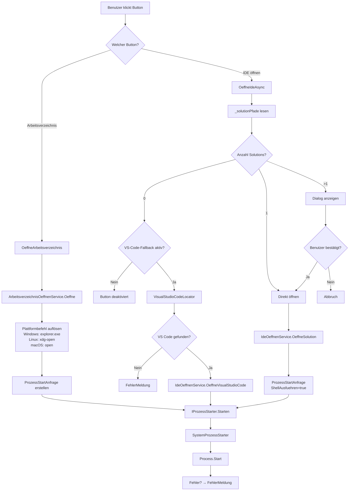

← [Zurück zur Übersicht](index.md)

# Dateisystem-Integration — Technischer Ablauf

## Übersicht

Das Feature implementiert zwei plattformabhängige Dateiexplorer-Funktionen über eine abstrakte `IProzessStarter`-Schnittstelle. Prozessstart-Anfragen werden gekapselt, geloggt und entweder direkt ausgeführt (Production) oder aufgezeichnet (Test). Solutions werden beim Laden der Aufgabe gecacht; ein modaler Dialog ermöglicht Auswahl bei mehreren Dateien. Ohne Solution kann optional ein VS-Code-Fallback greifen, wenn die Programmeinstellung aktiviert ist.

## Ablauf

### 1. Arbeitsverzeichnis öffnen

1. Benutzer klickt Button im Ribbon → `TaskDetailViewModel.OeffneArbeitsverzeichnisCommand.Execute()` wird aufgerufen.
2. `TaskDetailViewModel.OeffneArbeitsverzeichnis()` ruft `ArbeitsverzeichnisOeffnenService.Oeffne(_aufgabe.LokalerKlonPfad)` auf.
3. `ArbeitsverzeichnisOeffnenService` ermittelt den plattformabhängigen Befehl:
   - Windows: `explorer.exe` + Verzeichnispfad (als Argument mit Anführungszeichen)
   - Linux: `xdg-open` + Verzeichnispfad
   - macOS: `open` + Verzeichnispfad
4. Service erstellt `ProzessStartAnfrage(DateiName="explorer.exe", Argumente="\"C:\\...\"", ShellAusfuehren=false)`.
5. Service ruft `IProzessStarter.Starten(anfrage)` auf.
6. `SystemProzessStarter` mappt die Anfrage auf `ProcessStartInfo` und ruft `Process.Start()` auf.
7. Der Prozess wird gestartet; Fehler werden geloggt und in `FehlerMeldung` angezeigt.

Beteiligte Komponenten:
- `TaskDetailView.xaml` — Ribbon-Button
- `TaskDetailViewModel` — Command-Handler
- `ArbeitsverzeichnisOeffnenService` — Plattformauflösung und Service-Logik
- `IProzessStarter` (Gateway) — Abstraktionsschicht
- `SystemProzessStarter` — Reale Implementierung
- `ProzessStartAnfrage` — Value Object für Prozessstart-Parameter

### 2. IDE öffnen (Caching der Solutions)

Beim Laden einer Aufgabe (Property `Aufgabe` wird gesetzt):

1. `TaskDetailViewModel.Aufgabe` Setter wird aufgerufen.
2. Setter ruft `IdeOeffnenService.FindeSolutions(value?.LokalerKlonPfad)` auf.
3. `IdeOeffnenService.FindeSolutions()`:
   - Prüft, ob der Pfad nicht null/leer und das Verzeichnis existiert.
   - Ruft `Directory.EnumerateFiles(arbeitsverzeichnis, "*.sln", SearchOption.TopDirectoryOnly)` auf.
   - Sortiert die Ergebnisse alphabetisch (OrdinalIgnoreCase).
   - Gibt die Liste als `IReadOnlyList<string>` zurück (leer, wenn keine Solutions gefunden).
4. Feld `_solutionPfade` speichert das Ergebnis.
5. Property `SolutionsVorhanden` / Binding `SolutionFileExists` wird geändert.
6. `TaskDetailViewModel` lädt `ide.vscode.openWhenNoSolutionFound` über `AppEinstellungService`.
7. `KannIdeOeffnen` wird neu bewertet: `true` bei vorhandener Solution oder bei vorhandenem Arbeitsverzeichnis und aktiviertem VS-Code-Fallback.

Beteiligte Komponenten:
- `TaskDetailViewModel.Aufgabe` Setter — Trigger für Solution-Suche
- `IdeOeffnenService.FindeSolutions()` — Dateisuche und Sortierung
- `_solutionPfade` Feld — Gecachte Ergebnisse

### 3. IDE öffnen (Dialog bei mehreren Solutions)

1. Benutzer klickt Button → `TaskDetailViewModel.OeffneIdeCommand.Execute()` wird aufgerufen → `OeffneIdeAsync()` wird aufgerufen.
2. Prüfung der gecachten `_solutionPfade`:
   - **Genau eine Solution:** Sprung zu Schritt 4 (direkt öffnen).
   - **Mehrere Solutions:** Weiterfahrt mit Schritt 3a.
   - **Keine Solution:** Wenn der VS-Code-Fallback deaktiviert ist, ist der Button deaktiviert. Wenn er aktiviert ist, wird das Arbeitsverzeichnis in VS Code geöffnet.
3a. **Dialog anzeigen:**
   - `TaskDetailViewModel` ruft `_dialogService.ShowSolutionSelectionDialogAsync(_solutionPfade, ct)` auf.
   - `WpfDialogService.ShowSolutionSelectionDialogAsync()`:
     - Erstellt `SolutionSelectionDialogViewModel` mit der Liste der Pfade.
     - Erstellt Modal-Dialog `SolutionSelectionDialog` mit `Owner = MainWindow`.
     - Zeigt Dialog mittels `Application.Current.Dispatcher.InvokeAsync()` (UI-Thread).
     - Wartet auf Benutzeraktion:
       - **OK:** Gibt `SelectedSolution`-Pfad zurück.
       - **Abbrechen:** Gibt `null` zurück.
   - ViewModel erhält die Rückgabe.
   - **Wenn `null` (Abbruch):** Ablauf endet hier.
   - **Wenn Pfad:** Weiterfahrt mit Schritt 4.

Beteiligte Komponenten:
- `TaskDetailViewModel` — Verzweigungslogik
- `IDialogService.ShowSolutionSelectionDialogAsync()` — Dialog-Gateway
- `WpfDialogService` — Dialog-Anzeige und Koordination
- `SolutionSelectionDialog` — WPF-Fenster (Modal)
- `SolutionSelectionDialogViewModel` — Presentation Model

### 3b. IDE öffnen (VS-Code-Fallback)

1. Bei `0` gefundenen Solutions prüft `TaskDetailViewModel`, ob `_openVisualStudioCodeWhenNoSolutionFound` gesetzt ist.
2. Ist die Einstellung deaktiviert, endet der Ablauf ohne Prozessstart.
3. Ist die Einstellung aktiviert, ruft `TaskDetailViewModel` `IdeOeffnenService.OeffneVisualStudioCode(Aufgabe.LokalerKlonPfad)` auf.
4. `IdeOeffnenService` validiert das Arbeitsverzeichnis und fragt `IVisualStudioCodeLocator.Locate()` ab.
5. `VisualStudioCodeLocator` sucht zuerst `code.cmd` und `code` in `PATH`, danach typische Windows-Pfade unter `%LOCALAPPDATA%`, `%ProgramFiles%` und `%ProgramFiles(x86)%`.
6. Bei Treffer erstellt der Service `ProzessStartAnfrage(DateiName=<code-Pfad>, Argumente="\"<Arbeitsverzeichnis>\"", ShellAusfuehren=false)`.
7. Wenn kein VS Code gefunden wird, setzt das ViewModel die Meldung: „Keine Visual-Studio-Solution gefunden und Visual Studio Code wurde nicht gefunden."

### 4. IDE öffnen (Prozessstart)

1. Mit dem ermittelten Solution-Pfad (entweder direkt bei einer Solution oder nach Dialog-Auswahl) ruft `TaskDetailViewModel` `IdeOeffnenService.OeffneSolution(solutionPfad)` auf.
2. `IdeOeffnenService.OeffneSolution()` erstellt `ProzessStartAnfrage(DateiName=solutionPfad, Argumente=null, ShellAusfuehren=true)`.
3. Service ruft `IProzessStarter.Starten(anfrage)` auf.
4. `SystemProzessStarter` mappt auf `ProcessStartInfo` mit `UseShellExecute=true` (Shell-Execute).
5. `Process.Start()` startet den Prozess; das Betriebssystem ruft den registrierten Handler für `.sln` auf (üblicherweise Visual Studio).
6. Fehler werden geloggt und in `FehlerMeldung` angezeigt.

Beteiligte Komponenten:
- `TaskDetailViewModel.OeffneIdeAsync()` — Koordination
- `IdeOeffnenService.OeffneSolution()` — Service-Methode
- `IProzessStarter` (Gateway)
- `SystemProzessStarter` — Reale Implementierung

## Diagramm

## Fehlerbehandlung

### Prozessstart-Fehler

Wenn `SystemProzessStarter.Starten()` eine Ausnahme wirft (z. B. Befehl nicht gefunden, keine Berechtigung):

1. Ausnahme wird geloggt mit vollständigen Details (`DateiName`, `Argumente`, `ShellAusfuehren`).
2. `TaskDetailViewModel` fängt die Ausnahme (in `OeffneArbeitsverzeichnis()` oder `OeffneIdeAsync()`) ab.
3. Fehlermeldung wird in Property `FehlerMeldung` gespeichert.
4. UI zeigt Fehler-Banner an.
5. Benutzer kann den Fehler einblenden (durch Fehlerbanner-Klick oder Bestätigung).

### Keine Solution gefunden

Wenn `IdeOeffnenService.FindeSolutions()` eine leere Liste zurückgibt:

1. Property `SolutionFileExists` wird `false`.
2. Ist `ide.vscode.openWhenNoSolutionFound` deaktiviert, gibt `OeffneIdeCommand.CanExecute()` `false` zurück.
3. Ist die Einstellung aktiviert und ein Arbeitsverzeichnis vorhanden, kann der Button geklickt werden.
4. Beim Klick wird VS Code über `IVisualStudioCodeLocator` gesucht. Ohne Treffer wird eine verständliche Fehlermeldung angezeigt.

### Dialog-Abbruch

Wenn Benutzer im `SolutionSelectionDialog` auf „Abbrechen" klickt:

1. `ShowSolutionSelectionDialogAsync()` gibt `null` zurück.
2. `OeffneIdeAsync()` bricht ab, ruft nicht `OeffneSolution()` auf.
3. Keine Fehlermeldung; kein Prozess wird gestartet.

## Test-Implementierung

Im Test-Modus (wenn `SOFTWARESCHMIEDE_TEST_DB_PATH` gesetzt ist):

1. `App.xaml.cs` registriert `AufzeichnenderProzessStarter` statt `SystemProzessStarter`.
2. `AufzeichnenderProzessStarter.Starten()` serialisiert die `ProzessStartAnfrage` und schreibt sie als Zeile in eine Logdatei (`prozess-starts.log` neben der Test-DB).
3. Tatsächliche Prozesse werden nicht gestartet.
4. E2E-Tests lesen die Logdatei über `WpfTestBase.WaitForProzessStartEintragAsync()` und prüfen, ob der erwartete Eintrag vorhanden ist.
