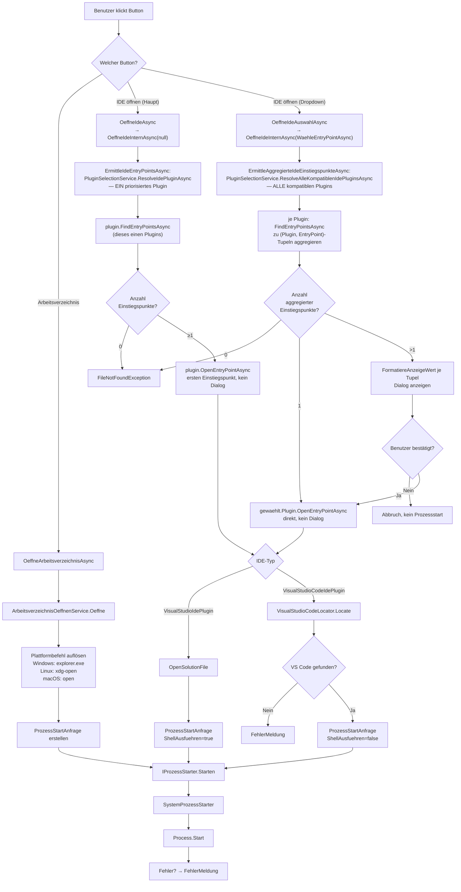

← [Zurück zur Übersicht](index.md)

# Dateisystem-Integration — Technischer Ablauf

## Übersicht

Das Feature implementiert zwei plattformabhängige Dateiexplorer-Funktionen über eine abstrakte `IProzessStarter`-Schnittstelle. Prozessstart-Anfragen werden gekapselt, geloggt und entweder direkt ausgeführt (Production) oder aufgezeichnet (Test). „IDE öffnen" ist als Split-Button umgesetzt (Haupt- und Dropdown-Teil), die seit der Multi-Plugin-Aggregation **unterschiedliche** Plugin-Auflösungen verwenden: Der Haupt-Button löst bei jedem Klick über `PluginSelectionService.ResolveIdePluginAsync()` genau **ein** priorisiertes IDE-Plugin auf (`TaskDetailViewModel.ErmittleIdeEntryPointsAsync()`, unverändert gegenüber dem ursprünglichen Single-Plugin-Verhalten; kein Vorab-Caching mehr beim Laden der Aufgabe) und fragt es generisch über `IIdePlugin.FindEntryPointsAsync()` nach seinen verfügbaren Einstiegspunkten (bei `VisualStudioIdePlugin`: je gefundener `.sln`/`.slnx`-Datei ein Einstiegspunkt; bei `VisualStudioCodeIdePlugin`: immer genau einer, das Repository-Root); bei mehreren Einstiegspunkten wird immer direkt der erste geöffnet (kein Dialog). Der Dropdown-Button löst stattdessen über `PluginSelectionService.ResolveAlleKompatiblenIdePluginsAsync()` **alle** aktivierten, `Explicit`- oder `Fallback`-kompatiblen IDE-Plugins auf (`TaskDetailViewModel.ErmittleAggregierteIdeEinstiegspunkteAsync()`), fragt **jedes** davon nach seinen Einstiegspunkten und aggregiert die Ergebnisse zu `(Plugin, EntryPoint)`-Tupeln; nur wenn diese aggregierte Gesamtliste mehr als einen Eintrag enthält (der Dropdown-Teil ist dann sichtbar), zeigt er ein modales Dialogfenster mit plugin-qualifizierten Anzeigewerten (Format „{PluginName}: {Bezeichnung}") zur Auswahl an — der gewählte Eintrag wird über das zu ihm gehörende Plugin geöffnet, nicht zwingend über das für den Haupt-Button priorisierte. Ist kein Plugin explizit kompatibel, greift automatisch das erste aktive Fallback-Plugin (standardmäßig Visual Studio Code).

## Ablauf

### 1. Arbeitsverzeichnis öffnen

1. Benutzer klickt Button im Ribbon → `TaskDetailViewModel.OeffneArbeitsverzeichnisCommand.Execute()` wird aufgerufen.
2. `TaskDetailViewModel.OeffneArbeitsverzeichnisAsync()` wird aufgerufen (async void Command-Handler).
3. ViewModel ermittelt das effektive Arbeitsverzeichnis:
   - Liest `Aufgabe.GitRepository.StartKonfiguration` (optional).
   - Ruft `WorkingDirectoryResolver.DetermineEffectiveWorkingDirectoryAsync(LokalerKlonPfad, startConfig, gitPlugin: null, CancellationToken)` auf.
   - `WorkingDirectoryResolver` kombiniert den Repository-Root mit dem optionalen `WorkingDirectoryRelativePath` und validiert das Ergebnis.
   - Rückgabe: effektives Arbeitsverzeichnis (z. B. `C:\repos\project\src\backend` falls `WorkingDirectoryRelativePath="src/backend"`).
4. ViewModel ruft `ArbeitsverzeichnisOeffnenService.Oeffne(effectiveWorkdir)` mit dem aufgelösten Pfad auf.
5. `ArbeitsverzeichnisOeffnenService` ermittelt den plattformabhängigen Befehl:
   - Windows: `explorer.exe` + aufgelöster Verzeichnispfad (als Argument mit Anführungszeichen)
   - Linux: `xdg-open` + aufgelöster Verzeichnispfad
   - macOS: `open` + aufgelöster Verzeichnispfad
6. Service erstellt `ProzessStartAnfrage(DateiName="explorer.exe", Argumente="\"C:\\...\\backend\"", ShellAusfuehren=false)`.
7. Service ruft `IProzessStarter.Starten(anfrage)` auf.
8. `SystemProzessStarter` mappt die Anfrage auf `ProcessStartInfo` und ruft `Process.Start()` auf.
9. Der Prozess wird gestartet; Fehler werden geloggt und in `FehlerMeldung` angezeigt (z. B. bei nicht-existentem oder nicht-erreichbarem Verzeichnis).

Beteiligte Komponenten:
- `TaskDetailView.xaml` — Ribbon-Button
- `TaskDetailViewModel` — Command-Handler, Auflösung des Arbeitsverzeichnisses
- `WorkingDirectoryResolver` — Auflösung des effektiven Arbeitsverzeichnisses mit Validierung
- `ArbeitsverzeichnisOeffnenService` — Plattformauflösung und Service-Logik
- `IProzessStarter` (Gateway) — Abstraktionsschicht
- `SystemProzessStarter` — Reale Implementierung
- `ProzessStartAnfrage` — Value Object für Prozessstart-Parameter

### 2. IDE öffnen (CanExecute und Dropdown-Sichtbarkeit)

Der Haupt-Teil des Split-Buttons (`OeffneIdeCommand`/`OeffneIdeAuswahlCommand`) ist bereits aktiv, sobald ein gültiges Arbeitsverzeichnis existiert — unabhängig davon, ob eine Solution gefunden wird. Der Dropdown-Teil ist zusätzlich nur sichtbar, wenn die **aggregierte Gesamtanzahl** an Einstiegspunkten über alle aktivierten, kompatiblen Plugins hinweg mindestens zwei beträgt — nicht nur die Anzahl des einen für den Haupt-Button priorisierten Plugins:

1. `TaskDetailViewModel.Aufgabe` Setter setzt `ShowFileExplorerPanel` (gültiger `LokalerKlonPfad`, Verzeichnis existiert).
2. `KannIdeOeffnen` liefert direkt `ShowFileExplorerPanel` zurück (`CanExecute` für beide Commands).
3. Am Ende von `LadenAsync()` wird zusätzlich einmalig `AktualisiereKannIdeAuswaehlenAsync(ct)` aufgerufen: Sie ruft `ErmittleAggregierteIdeEinstiegspunkteAsync()` auf (dieselbe Multi-Plugin-Ermittlung wie das eigentliche Öffnen über den Dropdown-Button: `ResolveAlleKompatiblenIdePluginsAsync()` + je Plugin `FindEntryPointsAsync()`), öffnet dabei aber nichts, sondern setzt nur `KannIdeAuswaehlen = eintraege.Count >= 2`, damit der Dropdown-Button des `RibbonSplitButton` bereits beim ersten Anzeigen der Ansicht korrekt sichtbar/unsichtbar ist. Ermittlungsfehler (fehlendes Plugin, Zugriffsfehler etc.) führen dabei lediglich zu `KannIdeAuswaehlen = false`, nicht zu einer angezeigten `FehlerMeldung`.
4. Beim tatsächlichen Öffnen (Schritt 3) wird dieselbe aggregierte Ermittlung erneut ausgeführt und `KannIdeAuswaehlen` erneut aktualisiert — auch beim Klick auf den Haupt-Button (zusätzlich zur dortigen Single-Plugin-Ermittlung), damit die Dropdown-Sichtbarkeit auch nach einem Haupt-Button-Klick aktuell bleibt. Es gibt kein Caching der Einstiegspunkte zwischen Laden und Öffnen.

Beteiligte Komponenten:
- `TaskDetailViewModel.Aufgabe` Setter — setzt `ShowFileExplorerPanel`
- `TaskDetailViewModel.KannIdeOeffnen` — CanExecute für `OeffneIdeCommand`/`OeffneIdeAuswahlCommand`
- `TaskDetailViewModel.KannIdeAuswaehlen` — steuert die Sichtbarkeit des Dropdown-Teils des `RibbonSplitButton`, basiert auf der aggregierten Gesamtanzahl über alle kompatiblen Plugins
- `TaskDetailViewModel.AktualisiereKannIdeAuswaehlenAsync()` — berechnet `KannIdeAuswaehlen` einmalig am Ende von `LadenAsync()` über `ErmittleAggregierteIdeEinstiegspunkteAsync()`
- `TaskDetailViewModel.BerechneKannIdeAuswaehlen()` — reine Hilfsmethode: `entryPointCount >= 2`

### 3. IDE öffnen (Plugin-Auflösung, Einstiegspunkt-Ermittlung und Dialog bei mehreren Einstiegspunkten)

Der Split-Button „IDE öffnen" besteht aus einem Haupt- und einem Dropdown-Teil (Dropdown nur sichtbar, wenn `KannIdeAuswaehlen` `true` ist, d. h. mindestens zwei aggregierte Einstiegspunkte ermittelt wurden). Haupt- und Dropdown-Button verwenden ab hier **unterschiedliche** Plugin-Auflösungspfade:

1. Benutzer klickt Haupt- oder Dropdown-Button:
   - **Haupt-Button:** `TaskDetailViewModel.OeffneIdeCommand.Execute()` → `OeffneIdeAsync(ct)` → ruft `OeffneIdeInternAsync(waehleEntryPointAsync: null, ct)` auf.
   - **Dropdown-Button:** `TaskDetailViewModel.OeffneIdeAuswahlCommand.Execute()` → `OeffneIdeAuswahlAsync(ct)` → ruft `OeffneIdeInternAsync(waehleEntryPointAsync: WaehleEntryPointAsync, ct)` auf.
2. `OeffneIdeInternAsync()` ermittelt zunächst `effectiveWorkdir` über `ErmittleEffektivesArbeitsverzeichnisAsync()`, dann verzweigt sie nach dem Button:

**2a. Haupt-Button (`waehleEntryPointAsync is null`) — Single-Plugin-Pfad, unverändert:**
   - Ruft `ErmittleIdeEntryPointsAsync(effectiveWorkdir, ct)` auf:
     - Ruft `_pluginSelectionService.ResolveIdePluginAsync(effectiveWorkdir, ct)` auf:
       - Ermittelt die aktivierten IDE-Plugins (`PluginActivationService.GetEnabledIdePluginsAsync()`) in der konfigurierten Reihenfolge (`plugins.ide.order`).
       - Prüft jedes Plugin über `CheckCompatibilityAsync(effectiveWorkdir, ct)`.
       - Das erste `Explicit`-kompatible Plugin gewinnt sofort (z. B. `VisualStudioIdePlugin` bei gefundener `.sln`/`.slnx`); die Schleife bricht dabei ab.
       - Andernfalls gewinnt das erste `Fallback`-kompatible Plugin (z. B. `VisualStudioCodeIdePlugin`, das sich immer als Fallback meldet).
       - Sind keine Plugins aktiviert oder kompatibel, liefert `IPluginManager.GetDefaultIdePlugin()` das Ergebnis (mindestens ein IDE-Plugin bleibt systemseitig immer aktiv).
     - Ruft anschließend `plugin.FindEntryPointsAsync(effectiveWorkdir, ct)` auf diesem **einen** aufgelösten Plugin auf.
   - Ruft zusätzlich `ErmittleAggregierteIdeEinstiegspunkteAsync()` auf, um `KannIdeAuswaehlen` zu aktualisieren (siehe Schritt 2b).
   - **0 Einstiegspunkte:** `FileNotFoundException` wird geworfen.
   - **≥1 Einstiegspunkt:** Der erste wird direkt via `plugin.OpenEntryPointAsync()` geöffnet, kein Dialog (Weiterfahrt mit Schritt 5).

**2b. Dropdown-Button — Multi-Plugin-Aggregationspfad (neu):**
   - Ruft ausschließlich `ErmittleAggregierteIdeEinstiegspunkteAsync(effectiveWorkdir, ct)` auf:
     - Ruft `_pluginSelectionService.ResolveAlleKompatiblenIdePluginsAsync(effectiveWorkdir, ct)` auf:
       - Ermittelt die aktivierten IDE-Plugins in konfigurierter Reihenfolge (identische Hilfsmethode `GetOrderedEnabledIdePluginsAsync()` wie bei `ResolveIdePluginAsync()`).
       - Prüft jedes Plugin über `CheckCompatibilityAsync(effectiveWorkdir, ct)` — **ohne** bei einem `Explicit`-Treffer abzubrechen.
       - Sammelt alle `Explicit`-kompatiblen Plugins in einer Liste, alle `Fallback`-kompatiblen in einer zweiten.
       - Rückgabe: `explicitPlugins` gefolgt von `fallbackPlugins` (beide in der konfigurierten Reihenfolge); ist keine der beiden Listen gefüllt, eine einelementige Liste mit `GetDefaultIdePlugin()`.
     - Ruft für **jedes** zurückgegebene Plugin `plugin.FindEntryPointsAsync(effectiveWorkdir, ct)` auf; schlägt die Ermittlung für ein Plugin fehl, wird der Fehler geloggt und mit den übrigen Plugins fortgefahren.
     - Aggregiert alle Ergebnisse zu einer Liste von `(Plugin, EntryPoint)`-Tupeln (Plugin-Reihenfolge sowie Einstiegspunkt-Reihenfolge je Plugin bleiben erhalten).
   - Aktualisiert `KannIdeAuswaehlen` auf Basis der aggregierten Gesamtanzahl.
   - **0 aggregierte Einstiegspunkte:** `FileNotFoundException` wird geworfen.
   - **Genau 1 aggregierter Einstiegspunkt:** wird direkt geöffnet, kein Dialog (Weiterfahrt mit Schritt 5).
   - **Mehr als 1 aggregierter Einstiegspunkt:** Weiterfahrt mit Schritt 4a (Dialog).

4a. **Dialog anzeigen (nur beim Dropdown-Button, bei mehr als einem aggregierten Einstiegspunkt):**
   - `OeffneIdeInternAsync()` ruft den `WaehleEntryPointAsync`-Callback mit allen aggregierten `(Plugin, EntryPoint)`-Tupeln auf.
   - Der Callback bildet jedes Tupel über `FormatiereAnzeigeWert(plugin, entryPoint)` auf einen plugin-qualifizierten Anzeigewert ab: `"{PluginName}: {Bezeichnung}"`, wobei `Bezeichnung` = `entryPoint.DisplayName ?? Path.GetFileName(entryPoint.Path)` — ist `Bezeichnung` bereits identisch mit `PluginName` (z. B. bei `VisualStudioCodeIdePlugin`), wird nur `PluginName` angezeigt (kein Doppel-Label).
   - Ruft `_dialogService.ShowSolutionSelectionDialogAsync(anzeigeWerte, ct)` auf.
   - `WpfDialogService.ShowSolutionSelectionDialogAsync()`:
     - Erstellt `SolutionSelectionDialogViewModel` mit der Liste der Anzeigewerte.
     - Erstellt Modal-Dialog `SolutionSelectionDialog` mit `Owner = MainWindow`.
     - Zeigt Dialog mittels `Application.Current.Dispatcher.InvokeAsync()` (UI-Thread).
     - Wartet auf Benutzeraktion:
       - **OK:** Gibt den gewählten Anzeigewert zurück.
       - **Abbrechen:** Gibt `null` zurück.
   - **Wenn `null` (Abbruch):** `WaehleEntryPointAsync()` liefert `null`; `OeffneIdeInternAsync()` beendet den Ablauf, kein Prozessstart.
   - **Wenn Anzeigewert:** `WaehleEntryPointAsync()` sucht den Listenindex des gewählten Anzeigewerts (nicht Stringgleichheit, da theoretisch mehrere Einträge denselben Anzeigewert liefern könnten) und gibt das zugehörige `(Plugin, EntryPoint)`-Tupel zurück; `OeffneIdeInternAsync()` ruft damit `gewaehlt.Value.Plugin.OpenEntryPointAsync()` auf (siehe Schritt 6) — also das zum gewählten Eintrag gehörende Plugin, nicht zwingend das für den Haupt-Button priorisierte. Ablauf endet danach.

Beteiligte Komponenten:
- `TaskDetailViewModel.OeffneIdeAsync()` / `OeffneIdeAuswahlAsync()` — Einstiegspunkte für Haupt- und Dropdown-Button, delegieren beide an `OeffneIdeInternAsync()`
- `TaskDetailViewModel.OeffneIdeInternAsync()` — gemeinsame Implementierung: verzweigt intern nach Button zwischen Single-Plugin- und Multi-Plugin-Pfad, öffnet und aktualisiert `KannIdeAuswaehlen`
- `TaskDetailViewModel.ErmittleIdeEntryPointsAsync()` — Single-Plugin-Ermittlungslogik (Plugin + Einstiegspunkte), genutzt vom Haupt-Button
- `TaskDetailViewModel.ErmittleAggregierteIdeEinstiegspunkteAsync()` — Multi-Plugin-Ermittlungslogik ((Plugin, EntryPoint)-Tupel über alle kompatiblen Plugins), genutzt vom Dropdown-Button und von `AktualisiereKannIdeAuswaehlenAsync()`
- `TaskDetailViewModel.FormatiereAnzeigeWert()` — plugin-qualifizierte Anzeige-Formatierung für den Dialog
- `TaskDetailViewModel.WaehleEntryPointAsync()` — Auswahl-Callback für den Dropdown-Button
- `PluginSelectionService.ResolveIdePluginAsync()` — Single-Plugin-Auflösung (Haupt-Button)
- `PluginSelectionService.ResolveAlleKompatiblenIdePluginsAsync()` — Multi-Plugin-Auflösung (Dropdown-Button)
- `IIdePlugin.CheckCompatibilityAsync()` — Kompatibilitätsprüfung je Plugin
- `IIdePlugin.FindEntryPointsAsync()` — generische Einstiegspunkt-Ermittlung je Plugin
- `IDialogService.ShowSolutionSelectionDialogAsync()` — Dialog-Gateway
- `WpfDialogService` — Dialog-Anzeige und Koordination
- `SolutionSelectionDialog` — WPF-Fenster (Modal)
- `SolutionSelectionDialogViewModel` — Presentation Model

### 5. IDE öffnen (direktes Öffnen über den ermittelten Einstiegspunkt)

Bei genau einem gefundenen bzw. aggregierten Einstiegspunkt, beim Fallback-Verhalten des Haupt-Buttons (mehrere Einstiegspunkte des einen aufgelösten Plugins, kein Dialog) sowie nach einer Dialog-Auswahl im Dropdown-Button (das zum gewählten `(Plugin, EntryPoint)`-Tupel gehörende Plugin, das nicht zwingend dasselbe sein muss wie das für den Haupt-Button aufgelöste) ruft `TaskDetailViewModel.OeffneIdeInternAsync()` `plugin.OpenEntryPointAsync(entryPoint, ct)` auf:

- **`VisualStudioIdePlugin.OpenEntryPointAsync()`:** Öffnet die Solution-Datei des übergebenen `IdeEntryPoint` per Shell-Execute (siehe Schritt 6).
- **`VisualStudioCodeIdePlugin.OpenEntryPointAsync()`:**
  1. Fragt `IVisualStudioCodeLocator.Locate()` ab.
  2. `VisualStudioCodeLocator` sucht zuerst `code.cmd` und `code` in `PATH`, danach typische Windows-Pfade unter `%LOCALAPPDATA%`, `%ProgramFiles%` und `%ProgramFiles(x86)%`.
  3. Bei Treffer erstellt es `ProzessStartAnfrage(DateiName=<code-Pfad>, Argumente="\"<Pfad des Einstiegspunkts>\"", ShellAusfuehren=false)` — **mit dem aufgelösten Arbeitsverzeichnis-Pfad**, nicht zwingend dem Repository-Root.
  4. Ohne Treffer wirft es `InvalidOperationException("Visual Studio Code wurde nicht gefunden.")`; `OeffneIdeInternAsync()` fängt das ab und setzt `FehlerMeldung = "IDE konnte nicht geöffnet werden: Visual Studio Code wurde nicht gefunden."`.

### 6. IDE öffnen (Prozessstart eines Einstiegspunkts)

1. Innerhalb von `VisualStudioIdePlugin.OpenEntryPointAsync()` (Schritt 5) wird letztlich die interne `VisualStudioIdePlugin.OpenSolutionFile()`-Hilfsmethode aufgerufen.
2. Diese erstellt `ProzessStartAnfrage(DateiName=solutionPfad, Argumente=null, ShellAusfuehren=true)`.
3. `IProzessStarter.Starten(anfrage)` wird aufgerufen.
4. `SystemProzessStarter` mappt auf `ProcessStartInfo` mit `UseShellExecute=true` (Shell-Execute).
5. `Process.Start()` startet den Prozess; das Betriebssystem ruft den registrierten Handler für `.sln` auf (üblicherweise Visual Studio).
6. Fehler werden in `OeffneIdeInternAsync()` geloggt und in `FehlerMeldung` angezeigt.

Beteiligte Komponenten:
- `TaskDetailViewModel.OeffneIdeInternAsync()` — Koordination (gemeinsam für Haupt- und Dropdown-Button)
- `VisualStudioIdePlugin.OpenEntryPointAsync()` / `OpenSolutionFile()` — Solution-Start
- `IProzessStarter` (Gateway)
- `SystemProzessStarter` — Reale Implementierung

## Diagramm

```mermaid
flowchart TD
    A["Benutzer klickt Button"] --> B{"Welcher Button?"}
    B -->|Arbeitsverzeichnis| C["OeffneArbeitsverzeichnisAsync"]
    B -->|"IDE öffnen (Haupt)"| D["OeffneIdeAsync<br/>→ OeffneIdeInternAsync(null)"]
    B -->|"IDE öffnen (Dropdown)"| D2["OeffneIdeAuswahlAsync<br/>→ OeffneIdeInternAsync(WaehleEntryPointAsync)"]

    C --> E["ArbeitsverzeichnisOeffnenService.Oeffne"]
    E --> F["Plattformbefehl auflösen<br/>Windows: explorer.exe<br/>Linux: xdg-open<br/>macOS: open"]
    F --> G["ProzessStartAnfrage erstellen"]
    G --> H["IProzessStarter.Starten"]
    H --> I["SystemProzessStarter"]
    I --> J["Process.Start"]
    J --> K["Fehler? → FehlerMeldung"]

    D --> L["ErmittleIdeEntryPointsAsync:<br/>PluginSelectionService.ResolveIdePluginAsync<br/>— EIN priorisiertes Plugin"]
    L --> L2["plugin.FindEntryPointsAsync<br/>(dieses einen Plugins)"]
    L2 --> M{"Anzahl<br/>Einstiegspunkte?"}
    M -->|0| M0["FileNotFoundException"]
    M -->|"≥1"| Z["plugin.OpenEntryPointAsync<br/>ersten Einstiegspunkt, kein Dialog"]

    D2 --> L3["ErmittleAggregierteIdeEinstiegspunkteAsync:<br/>PluginSelectionService.ResolveAlleKompatiblenIdePluginsAsync<br/>— ALLE kompatiblen Plugins"]
    L3 --> L4["je Plugin: FindEntryPointsAsync<br/>zu (Plugin, EntryPoint)-Tupeln aggregieren"]
    L4 --> M2{"Anzahl<br/>aggregierter<br/>Einstiegspunkte?"}
    M2 -->|0| M0
    M2 -->|1| Z2["gewaehlt.Plugin.OpenEntryPointAsync<br/>direkt, kein Dialog"]
    M2 -->|">1"| P["FormatiereAnzeigeWert je Tupel<br/>Dialog anzeigen"]
    P --> Q{"Benutzer bestätigt?"}
    Q -->|Nein| R["Abbruch, kein Prozessstart"]
    Q -->|Ja| Z2

    Z --> R2{"IDE-Typ"}
    Z2 --> R2
    R2 -->|VisualStudioIdePlugin| S["OpenSolutionFile"]
    R2 -->|VisualStudioCodeIdePlugin| V["VisualStudioCodeLocator.Locate"]
    V --> W{"VS Code gefunden?"}
    W -->|Nein| X["FehlerMeldung"]
    W -->|Ja| Y["ProzessStartAnfrage<br/>ShellAusfuehren=false"]
    Y --> H
    S --> T["ProzessStartAnfrage<br/>ShellAusfuehren=true"]
    T --> H
```

## Fehlerbehandlung

### Arbeitsverzeichnis-Auflösung (Fehler)

Wenn `WorkingDirectoryResolver.DetermineEffectiveWorkingDirectoryAsync()` eine Ausnahme wirft (z. B. das konfigurierte Unterverzeichnis existiert nicht oder ist nicht erreichbar):

1. Ausnahme wird geloggt mit Details (konfig. Pfad, Grund: `DirectoryNotFoundException`, `UnauthorizedAccessException`, etc.).
2. `TaskDetailViewModel` fängt die Ausnahme ab (in `OeffneArbeitsverzeichnisAsync()` bzw. `OeffneIdeInternAsync()`, gemeinsam für Haupt- und Dropdown-Button).
3. Fehlermeldung wird in Property `FehlerMeldung` gespeichert (z. B. „Arbeitsverzeichnis konnte nicht geöffnet werden: Verzeichnis nicht gefunden").
4. UI zeigt Fehler-Banner an.
5. Buttons bleiben inaktiv, solange das konfigurierte Arbeitsverzeichnis nicht erreichbar ist.

### Prozessstart-Fehler

Wenn `SystemProzessStarter.Starten()` eine Ausnahme wirft (z. B. Befehl nicht gefunden, keine Berechtigung):

1. Ausnahme wird geloggt mit vollständigen Details (`DateiName`, `Argumente`, `ShellAusfuehren`, aufgelöster Pfad).
2. `TaskDetailViewModel` fängt die Ausnahme (in `OeffneArbeitsverzeichnisAsync()` oder `OeffneIdeInternAsync()`) ab.
3. Fehlermeldung wird in Property `FehlerMeldung` gespeichert.
4. UI zeigt Fehler-Banner an.
5. Benutzer kann den Fehler einblenden (durch Fehlerbanner-Klick oder Bestätigung).

### Keine Solution gefunden

Wenn kein Plugin explizit kompatibel ist (kein `VisualStudioIdePlugin` mit gefundener `.sln`/`.slnx`):

1. `OeffneIdeCommand.CanExecute()` (Haupt-Button) und `OeffneIdeAuswahlCommand.CanExecute()` (Dropdown-Button) bleiben unabhängig davon `true`, solange ein Arbeitsverzeichnis vorhanden ist (`ShowFileExplorerPanel`); die Sichtbarkeit des Dropdown-Buttons selbst hängt zusätzlich an `KannIdeAuswaehlen` (aggregierte Gesamtanzahl von mindestens zwei Einstiegspunkten über alle aktivierten, kompatiblen Plugins hinweg, nicht nur des einen priorisierten Plugins).
2. Beim Klick auf den Haupt-Button liefert `PluginSelectionService.ResolveIdePluginAsync()` das erste aktive Fallback-Plugin (standardmäßig `VisualStudioCodeIdePlugin`) oder — falls kein Plugin aktiv/kompatibel ist — `IPluginManager.GetDefaultIdePlugin()`. Beim Klick auf den Dropdown-Button liefert `PluginSelectionService.ResolveAlleKompatiblenIdePluginsAsync()` entsprechend alle aktiven Fallback-Plugins (bzw. `GetDefaultIdePlugin()` als einelementige Liste, falls keines aktiv/kompatibel ist).
3. Beim Klick liefert `plugin.FindEntryPointsAsync()` für `VisualStudioCodeIdePlugin` immer genau einen Einstiegspunkt (das Repository-Root); dieser wird direkt über `plugin.OpenEntryPointAsync()` geöffnet, wobei VS Code über `IVisualStudioCodeLocator` gesucht wird. Ohne Treffer wird eine verständliche Fehlermeldung angezeigt, ohne dass ein Prozess gestartet wird.

### Dialog-Abbruch

Wenn Benutzer im `SolutionSelectionDialog` (nur über den Dropdown-Button erreichbar) auf „Abbrechen" klickt:

1. `ShowSolutionSelectionDialogAsync()` gibt `null` zurück.
2. `WaehleEntryPointAsync()` in `TaskDetailViewModel` gibt daraufhin ebenfalls `null` zurück.
3. `OeffneIdeInternAsync()` bricht ab, ruft nicht `plugin.OpenEntryPointAsync()` auf.
4. Keine Fehlermeldung; kein Prozess wird gestartet.

## Test-Implementierung

Im Test-Modus (wenn `SOFTWARESCHMIEDE_TEST_DB_PATH` gesetzt ist):

1. `App.xaml.cs` registriert `AufzeichnenderProzessStarter` statt `SystemProzessStarter`.
2. `AufzeichnenderProzessStarter.Starten()` serialisiert die `ProzessStartAnfrage` und schreibt sie als Zeile in eine Logdatei (`prozess-starts.log` neben der Test-DB).
3. Tatsächliche Prozesse werden nicht gestartet.
4. E2E-Tests lesen die Logdatei über `WpfTestBase.WaitForProzessStartEintragAsync()` und prüfen, ob der erwartete Eintrag vorhanden ist.
