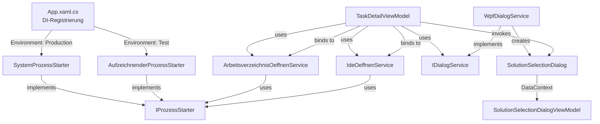

← [Zurück zur Übersicht](index.md)

# Dateisystem-Integration — Architektur

## Beteiligte Komponenten

| Komponente | Typ | Rolle |
|------------|-----|-------|
| `IProzessStarter` | Interface (Domain.Interfaces) | Gateway-Abstraktion für Prozessstart; entkoppelt `System.Diagnostics.Process` von der Domain-Logik. |
| `ProzessStartAnfrage` | Value Object (Domain.ValueObjects) | Kapselt Prozessstart-Parameter (`DateiName`, `Argumente`, `ShellAusfuehren`) ohne System.Diagnostics-Abhängigkeit. |
| `SystemProzessStarter` | Klasse (Infrastructure.Services) | Reale Implementierung von `IProzessStarter`; mappt auf `ProcessStartInfo` und ruft `Process.Start()` auf. |
| `AufzeichnenderProzessStarter` | Klasse (Infrastructure.Services) | Test-Implementierung von `IProzessStarter`; schreibt `ProzessStartAnfrage` in Logdatei statt echte Prozesse zu starten. |
| `ArbeitsverzeichnisOeffnenService` | Klasse (Application.Services) | Löst Plattformbefehl auf (Windows/Linux/macOS) und delegiert Prozessstart. |
| `IdeOeffnenService` | Klasse (Application.Services) | Findet `.sln`-Dateien und öffnet sie per Shell-Execute. |
| `TaskDetailViewModel` | Klasse (App.ViewModels) | Stellt Commands bereit und koordiniert Dialog/Service-Aufrufe. |
| `IDialogService` / `WpfDialogService` | Interface / Klasse (App.Services) | Dialog-Gateway; implementiert `ShowSolutionSelectionDialogAsync()`. |
| `SolutionSelectionDialog` | WPF-Window (App.Views) | Modales Fenster für Solution-Auswahl bei mehreren Dateien. |
| `SolutionSelectionDialogViewModel` | Klasse (App.ViewModels) | Presentation Model für Dialog; verwaltet Solution-Liste und Benutzer-Auswahl. |

## Abhängigkeiten

```
Domain-Schicht (Abstraktion):
├─ IProzessStarter (Interface, kein konkreter Service)
└─ ProzessStartAnfrage (Value Object, unabhängig)

Infrastructure-Schicht (Reale / Test-Implementierung):
├─ SystemProzessStarter (implementiert IProzessStarter)
└─ AufzeichnenderProzessStarter (implementiert IProzessStarter)

Application-Schicht (Services):
├─ ArbeitsverzeichnisOeffnenService
│  └─ Abhängigkeit: IProzessStarter
├─ IdeOeffnenService
│  └─ Abhängigkeit: IProzessStarter
└─ (keine DB/Repository-Abhängigkeiten)

App-Schicht (UI/ViewModels):
├─ TaskDetailViewModel
│  ├─ ArbeitsverzeichnisOeffnenService
│  ├─ IdeOeffnenService
│  └─ IDialogService
├─ WpfDialogService (implementiert IDialogService)
│  └─ Erstellt SolutionSelectionDialog und SolutionSelectionDialogViewModel
└─ SolutionSelectionDialog (XAML)
   └─ DataContext: SolutionSelectionDialogViewModel
```

Sicherheitsrichtlinien für `IProzessStarter`:
- Plattformabhängige Prozessstart-Logik bleibt in `SystemProzessStarter` (Infrastructure).
- Die Domain-Schicht (Services wie `ArbeitsverzeichnisOeffnenService`) kennt nur `IProzessStarter`.
- Test-Implementierung (`AufzeichnenderProzessStarter`) wird via Dependency Injection in `App.xaml.cs` getauscht (ähnlich `IPseudoConsoleProcessLauncher`).

## Datenfluss

### Arbeitsverzeichnis öffnen

```
Benutzer klickt Button
  ↓
TaskDetailViewModel.OeffneArbeitsverzeichnisCommand
  ↓
OeffneArbeitsverzeichnis() Methode
  ↓
ArbeitsverzeichnisOeffnenService.Oeffne(LokalerKlonPfad)
  ↓
Plattformbefehl auflösen (Explorer/xdg-open/open)
  ↓
ProzessStartAnfrage erstellen
  ↓
IProzessStarter.Starten(anfrage)
  ├─→ SystemProzessStarter (Production)
  │   ↓
  │   Process.Start()
  │   ↓
  │   OS-Dateiexplorer
  │
  └─→ AufzeichnenderProzessStarter (Test)
      ↓
      Logdatei schreiben (prozess-starts.log)
```

### IDE öffnen

```
Benutzer klickt Button
  ↓
TaskDetailViewModel.OeffneIdeAsync()
  ↓
_solutionPfade lesen (beim Aufgabe-Laden gecacht)
  ↓
Verzweigung nach Anzahl der Solutions:
  ├─→ Keine: Button deaktiviert (kein Klick möglich)
  ├─→ Eine: Direkt zu Prozessstart
  └─→ Mehrere: Dialog anzeigen
       ↓
       IDialogService.ShowSolutionSelectionDialogAsync()
         ↓
         WpfDialogService (UI-Thread)
           ↓
           SolutionSelectionDialog (Modal)
             ↓
             SolutionSelectionDialogViewModel
               ↓
               Benutzer wählt Solution oder bricht ab
                 ↓
                 Rückgabe: Pfad oder null
  ↓
IdeOeffnenService.OeffneSolution(gewählterPfad)
  ↓
ProzessStartAnfrage mit ShellAusfuehren=true
  ↓
IProzessStarter.Starten(anfrage)
  ├─→ SystemProzessStarter: Process.Start() mit Shell-Execute
  └─→ AufzeichnenderProzessStarter: Logdatei schreiben
  ↓
IDE (z. B. Visual Studio) öffnet Solution
```

## Diagramm



## Skalierung und Zuverlässigkeit

### Fehlertoleranz

- **Prozessstart-Fehler:** Vollständig abgefangen und geloggt. Fehler blockiert nicht die Anwendung.
- **Dateisuche-Fehler:** `IdeOeffnenService.FindeSolutions()` gibt leere Liste bei jedem Fehler zurück (sicherer Fallback).
- **Dialog-Abbruch:** Normales Verhalten, keine Fehlerbehandlung erforderlich.

### Caching und Performance

- **Solution-Caching:** `_solutionPfade` wird einmalig beim Laden der Aufgabe gefüllt (synchroner `Directory.EnumerateFiles()`-Aufruf auf oberster Ebene).
- **Typischerweise schnell:** Für ein durchschnittliches Repository mit 1–5 Solutions dauert `FindeSolutions()` < 10 ms.
- **Keine rekursive Suche:** Verhindert Performance-Degradation in großen Verzeichnisstrukturen.

### Test-Isolation

- **Separate Logdatei:** Test-Prozessstart-Anfragen werden in `prozess-starts.log` neben der Test-DB aufgezeichnet, nicht in der Production-Log.
- **Keine echten Prozesse:** `AufzeichnenderProzessStarter` startet nie echte Prozesse, isoliert Tests vollständig.
- **Unkritisch für Parallelisierung:** Mehrere Tests können gleichzeitig laufen, da jeder Test seine eigene Testdatenbank und Logdatei hat.
