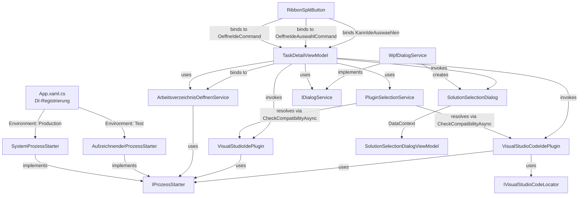

← [Zurück zur Übersicht](index.md)

# Dateisystem-Integration — Architektur

## Beteiligte Komponenten

| Komponente | Typ | Rolle |
|------------|-----|-------|
| `IProzessStarter` | Interface (Domain.Interfaces) | Gateway-Abstraktion für Prozessstart; entkoppelt `System.Diagnostics.Process` von der Domain-Logik. |
| `ProzessStartAnfrage` | Value Object (Domain.ValueObjects) | Kapselt Prozessstart-Parameter (`DateiName`, `Argumente`, `ShellAusfuehren`) ohne System.Diagnostics-Abhängigkeit. |
| `SystemProzessStarter` | Klasse (Infrastructure.Services) | Reale Implementierung von `IProzessStarter`; mappt auf `ProcessStartInfo` und ruft `Process.Start()` auf. |
| `AufzeichnenderProzessStarter` | Klasse (Infrastructure.Services) | Test-Implementierung von `IProzessStarter`; schreibt `ProzessStartAnfrage` in Logdatei statt echte Prozesse zu starten. |
| `WorkingDirectoryResolver` | Klasse (Application.Services, statisch) | Löst das effektive Arbeitsverzeichnis auf durch Kombination von Repository-Root mit optionalem konfiguriertem `WorkingDirectoryRelativePath`; validiert das Ergebnis. Stellt `ResolveEffectiveWorkingDirectory()` (sync) und `DetermineEffectiveWorkingDirectoryAsync()` (async) zur Verfügung. |
| `ArbeitsverzeichnisOeffnenService` | Klasse (Application.Services) | Löst Plattformbefehl auf (Windows/Linux/macOS) und delegiert Prozessstart mit aufgelöstem Arbeitsverzeichnis. |
| `IVisualStudioCodeLocator` | Interface (Application.Services) | Abstraktion zur Auflösung eines startbaren Visual-Studio-Code-Befehls. |
| `VisualStudioCodeLocator` | Klasse (Infrastructure.Services) | Sucht `code.cmd`/`code` in `PATH` und typischen Windows-Installationspfaden. |
| `TaskDetailViewModel.OeffneIdeInternAsync` | Methode (App.ViewModels) | Gemeinsame Implementierung für Haupt- und Dropdown-Button. Haupt-Button (`waehleEntryPointAsync is null`): löst über `ErmittleIdeEntryPointsAsync()`/`PluginSelectionService.ResolveIdePluginAsync()` **ein** zuständiges `IIdePlugin` auf und ruft dessen `IIdePlugin.FindEntryPointsAsync()` auf; öffnet bei ≥1 Einstiegspunkt direkt den ersten. Dropdown-Button: löst über `ErmittleAggregierteIdeEinstiegspunkteAsync()`/`PluginSelectionService.ResolveAlleKompatiblenIdePluginsAsync()` **alle** kompatiblen `IIdePlugin`s auf, aggregiert deren `FindEntryPointsAsync()`-Ergebnisse zu `(Plugin, EntryPoint)`-Tupeln; verzweigt nach deren Gesamtanzahl (0 → Exception, 1 → direkt öffnen, >1 → Dialog-Callback) und öffnet den gewählten Einstiegspunkt über das zugehörige `plugin.OpenEntryPointAsync()`. |
| `PluginSelectionService` | Klasse (Application.Services) | Löst über `ResolveIdePluginAsync(repositoryPath, ct)` das eine für das Arbeitsverzeichnis zuständige, priorisierte `IIdePlugin` auf: erstes explizit kompatibles Plugin gewinnt, sonst erstes fallback-kompatibles aktives Plugin, sonst `IPluginManager.GetDefaultIdePlugin()`. Zusätzlich liefert `ResolveAlleKompatiblenIdePluginsAsync(repositoryPath, ct)` **alle** aktivierten, explizit oder fallback-kompatiblen `IIdePlugin`s als sortierte Liste (erst alle Explicit-, dann alle Fallback-kompatiblen, jeweils in konfigurierter `plugins.ide.order`-Reihenfolge) — genutzt vom Dropdown-Button, um Einstiegspunkte über mehrere Plugins hinweg zu aggregieren. Beide Methoden teilen sich die private Hilfsmethode `GetOrderedEnabledIdePluginsAsync()`. |
| `IIdePlugin` | Interface (Domain.Interfaces) | Vertrag für IDE-Plugins: `CheckCompatibilityAsync()` (Explicit/Fallback/Incompatible) sowie das generische Mehreinstiegspunkt-Paar `FindEntryPointsAsync()`/`OpenEntryPointAsync()`. |
| `IdeEntryPoint` | Value Object (Plugin.Contracts.Domain.ValueObjects) | Immutabler Datenträger für einen konkreten IDE-Einstiegspunkt (`Path`, optional `DisplayName`). |
| `VisualStudioIdePlugin` | Klasse (Domain.PluginImpl) | Eingebautes IDE-Plugin für Visual Studio; `Explicit`-kompatibel bei vorhandener `.sln`/`.slnx`-Datei; `FindEntryPointsAsync()` liefert je gefundener Solution-Datei einen `IdeEntryPoint`, `OpenEntryPointAsync()` öffnet den gewählten Einstiegspunkt per Shell-Execute. |
| `VisualStudioCodeIdePlugin` | Klasse (Domain.PluginImpl) | Eingebautes IDE-Plugin für Visual Studio Code; immer `Fallback`-kompatibel; `FindEntryPointsAsync()` liefert immer genau einen `IdeEntryPoint` (das Repository-Root), `OpenEntryPointAsync()` öffnet das Arbeitsverzeichnis über `IVisualStudioCodeLocator`/`code`. |
| `TaskDetailViewModel` | Klasse (App.ViewModels) | Stellt Commands bereit und koordiniert Dialog/Service-Aufrufe; nutzt `WorkingDirectoryResolver` zur Auflösung des Arbeitsverzeichnisses; `OeffneIdeInternAsync()` löst für den Haupt-Button Plugin und Einstiegspunkte über `ErmittleIdeEntryPointsAsync()` (Single-Plugin) auf, für den Dropdown-Button über `ErmittleAggregierteIdeEinstiegspunkteAsync()` (Multi-Plugin-Aggregation über alle kompatiblen Plugins) — und übergibt bei mehreren aggregierten `(Plugin, EntryPoint)`-Kandidaten (nur über den Dropdown-Button) einen Auswahl-Callback (`WaehleEntryPointAsync`) für den Solution-Auswahl-Dialog, der die Kandidaten über `FormatiereAnzeigeWert()` plugin-qualifiziert anzeigt. |
| `IDialogService` / `WpfDialogService` | Interface / Klasse (App.Services) | Dialog-Gateway; implementiert `ShowSolutionSelectionDialogAsync()`. |
| `SolutionSelectionDialog` | WPF-Window (App.Views) | Modales Fenster für Solution-Auswahl bei mehreren Dateien. |
| `SolutionSelectionDialogViewModel` | Klasse (App.ViewModels) | Presentation Model für Dialog; verwaltet Solution-Liste und Benutzer-Auswahl. |

## Abhängigkeiten

```
Domain-Schicht (Abstraktion):
├─ IProzessStarter (Interface, kein konkreter Service)
└─ ProzessStartAnfrage (Value Object, unabhängig)

Infrastructure-Schicht (Reale / Test-Implementierung):
├─ SystemProzessStarter (implementiert IProzessStarter)
└─ AufzeichnenderProzessStarter (implementiert IProzessStarter)

Application-Schicht (Services):
├─ WorkingDirectoryResolver (statische Utility-Klasse)
│  ├─ `ResolveEffectiveWorkingDirectory()` (sync, für UI-Caching)
│  ├─ `DetermineEffectiveWorkingDirectoryAsync()` (async, für Command-Handler)
│  └─ `ValidateWorkingDirectory()` (Validierung und Fehlerbehandlung)
├─ ArbeitsverzeichnisOeffnenService
│  └─ Abhängigkeit: IProzessStarter
├─ PluginSelectionService
│  ├─ Abhängigkeit: IPluginManager (liefert u. a. VisualStudioIdePlugin, VisualStudioCodeIdePlugin)
│  ├─ Abhängigkeit: PluginActivationService (aktivierte IDE-Plugins, Reihenfolge über plugins.ide.order)
│  ├─ ResolveIdePluginAsync() → ein priorisiertes Plugin (Haupt-Button)
│  └─ ResolveAlleKompatiblenIdePluginsAsync() → alle kompatiblen Plugins (Dropdown-Button)
└─ (keine direkten DB/Repository-Abhängigkeiten von ArbeitsverzeichnisOeffnenService)

App-Schicht (UI/ViewModels):
├─ TaskDetailViewModel
│  ├─ WorkingDirectoryResolver (zur Auflösung des Arbeitsverzeichnisses)
│  ├─ ArbeitsverzeichnisOeffnenService
│  ├─ PluginSelectionService (zur Auflösung des IDE-Plugins)
│  ├─ IDialogService (zeigt Dialog bei mehreren IdeEntryPoint-Kandidaten)
│  └─ Commands: OeffneIdeCommand, OeffneIdeAuswahlCommand (Split-Button-Muster)
├─ WpfDialogService (implementiert IDialogService)
│  └─ Erstellt SolutionSelectionDialog und SolutionSelectionDialogViewModel
├─ SolutionSelectionDialog (XAML)
│  └─ DataContext: SolutionSelectionDialogViewModel
└─ RibbonSplitButton (neue WPF-Komponente)
   └─ Bindet OeffneIdeCommand und OeffneIdeAuswahlCommand
```

Sicherheitsrichtlinien für `IProzessStarter`:
- Plattformabhängige Prozessstart-Logik bleibt in `SystemProzessStarter` (Infrastructure).
- Die Domain-Schicht (Services wie `ArbeitsverzeichnisOeffnenService`) kennt nur `IProzessStarter`.
- Test-Implementierung (`AufzeichnenderProzessStarter`) wird via Dependency Injection in `App.xaml.cs` getauscht (ähnlich `IPseudoConsoleProcessLauncher`).

## Datenfluss

### Arbeitsverzeichnis öffnen

```
Benutzer klickt Button
  ↓
TaskDetailViewModel.OeffneArbeitsverzeichnisCommand
  ↓
OeffneArbeitsverzeichnisAsync() Methode (async)
  ↓
WorkingDirectoryResolver.DetermineEffectiveWorkingDirectoryAsync()
  ├─ Kombiniert LokalerKlonPfad + WorkingDirectoryRelativePath
  ├─ Validiert das Ergebnis (existiert, ist erreichbar)
  └─ Rückgabe: aufgelöstes Arbeitsverzeichnis (z. B. C:\repo\src\backend)
  ↓
ArbeitsverzeichnisOeffnenService.Oeffne(effectiveWorkdir)
  ↓
Plattformbefehl auflösen (Explorer/xdg-open/open mit aufgelöstem Pfad)
  ↓
ProzessStartAnfrage erstellen
  ↓
IProzessStarter.Starten(anfrage)
  ├─→ SystemProzessStarter (Production)
  │   ↓
  │   Process.Start() mit aufgelöstem Pfad
  │   ↓
  │   OS-Dateiexplorer öffnet aufgelöstes Verzeichnis
  │
  └─→ AufzeichnenderProzessStarter (Test)
      ↓
      Logdatei schreiben (prozess-starts.log mit aufgelöstem Pfad)
```

### IDE öffnen (Haupt-Button — direkt öffnen)

```
Benutzer klickt Haupt-Button des Split-Buttons (aktiv sobald ShowFileExplorerPanel true ist)
  ↓
TaskDetailViewModel.OeffneIdeCommand.OeffneIdeAsync()
  ↓
WorkingDirectoryResolver.DetermineEffectiveWorkingDirectoryAsync()
  └─ Rückgabe: aufgelöstes Arbeitsverzeichnis (z. B. C:\repo\src\backend)
  ↓
PluginSelectionService.ResolveIdePluginAsync(effectiveWorkdir, ct)
  ├─ Prüft alle aktivierten IDE-Plugins (Reihenfolge aus plugins.ide.order) via CheckCompatibilityAsync()
  ├─ Erstes Explicit-kompatibles Plugin gewinnt (z. B. VisualStudioIdePlugin bei gefundener .sln/.slnx)
  ├─ Sonst erstes Fallback-kompatibles aktives Plugin (z. B. VisualStudioCodeIdePlugin, immer Fallback)
  └─ Sonst IPluginManager.GetDefaultIdePlugin()
  ↓
plugin.FindEntryPointsAsync(effectiveWorkdir, ct)  — generisch für jedes IIdePlugin
  ├─→ VisualStudioIdePlugin: ein IdeEntryPoint je gefundener .sln/.slnx-Datei
  └─→ VisualStudioCodeIdePlugin: immer genau ein IdeEntryPoint (Repository-Root)
  ↓
Anzahl gefundener Einstiegspunkte?
  ├─→ 0: FileNotFoundException
  │
  ├─→ Genau 1: sofort weiter zu plugin.OpenEntryPointAsync() (kein Dialog)
  │
  └─→ Mehr als 1: Fallback — erster Einstiegspunkt wird direkt geöffnet, kein Dialog
  ↓
plugin.OpenEntryPointAsync(entryPoint, ct)
  ├─→ VisualStudioIdePlugin: öffnet die Solution-Datei des Einstiegspunkts per Shell-Execute
  └─→ VisualStudioCodeIdePlugin: IVisualStudioCodeLocator.Locate()
        ├─→ Kein Treffer: wirft InvalidOperationException → FehlerMeldung, kein Prozessstart
        └─→ Treffer: ProzessStartAnfrage für code "<Pfad des Einstiegspunkts>"
              ↓
              IProzessStarter.Starten(anfrage)
                ├─→ SystemProzessStarter: Process.Start()
                └─→ AufzeichnenderProzessStarter (Test): Logdatei schreiben
              ↓
              IDE öffnet den Einstiegspunkt (Arbeitsverzeichnis / Solution)
```

### IDE öffnen (Dropdown-Button — aggregierte Auswahl über alle kompatiblen Plugins)

```
Benutzer klickt Dropdown-Button des Split-Buttons
(nur sichtbar, wenn die AGGREGIERTE Gesamtanzahl an Einstiegspunkten ≥2 ist)
  ↓
TaskDetailViewModel.OeffneIdeAuswahlCommand.OeffneIdeAuswahlAsync()
  ↓
WorkingDirectoryResolver.DetermineEffectiveWorkingDirectoryAsync()
  └─ Rückgabe: aufgelöstes Arbeitsverzeichnis
  ↓
PluginSelectionService.ResolveAlleKompatiblenIdePluginsAsync(effectiveWorkdir, ct)
  ├─ Prüft ALLE aktivierten IDE-Plugins (Reihenfolge aus plugins.ide.order) via CheckCompatibilityAsync()
  │  — kein früher Abbruch beim ersten Explicit-Treffer wie bei ResolveIdePluginAsync()
  └─ Rückgabe: alle Explicit-kompatiblen Plugins, gefolgt von allen Fallback-kompatiblen Plugins
     (jeweils in konfigurierter Reihenfolge)
  ↓
TaskDetailViewModel.ErmittleAggregierteIdeEinstiegspunkteAsync():
für JEDES zurückgegebene Plugin: plugin.FindEntryPointsAsync(effectiveWorkdir, ct)
  ├─ Fehler bei einzelnem Plugin → geloggt, übersprungen (Aggregation läuft weiter)
  └─ Rückgabe: (Plugin, EntryPoint)-Tupel aller Plugins aggregiert, Plugin-/Einstiegspunkt-Reihenfolge erhalten
  ↓
Anzahl aggregierter Einstiegspunkte?
  ├─→ 0: FileNotFoundException
  │
  ├─→ Genau 1: sofort weiter zu plugin.OpenEntryPointAsync() (Dialog nicht nötig)
  │
  └─→ Mehr als 1:
        ↓
        TaskDetailViewModel.waehleEntryPointAsync(eintraege, ct) — Dialog-Callback
          ↓
          eintraege.Select(e => FormatiereAnzeigeWert(e.Plugin, e.EntryPoint))
          → „{PluginName}: {Bezeichnung}" bzw. nur „{PluginName}" (falls Bezeichnung == PluginName)
          ↓
          IDialogService.ShowSolutionSelectionDialogAsync(anzeigeWerte)
            ↓
            WpfDialogService (UI-Thread) → SolutionSelectionDialog (Modal) → SolutionSelectionDialogViewModel
              ↓
              Benutzer wählt Anzeigewert oder bricht ab → Rückgabe: Anzeigewert oder null
          ↓
          Callback bildet Anzeigewert über Listenindex zurück auf (Plugin, EntryPoint)-Tupel ab
          → Rückgabe: (Plugin, EntryPoint) oder null
        ↓
        null? → Ablauf endet, kein Prozessstart (Abbruch durch Benutzer)
        (Plugin, EntryPoint)? → weiter zu plugin.OpenEntryPointAsync() — Plugin des gewählten Tupels,
                                 nicht zwingend das für den Haupt-Button priorisierte Plugin
  ↓
plugin.OpenEntryPointAsync(entryPoint, ct)
  └─ Die zum gewählten Eintrag gehörende IDE öffnet den gewählten Einstiegspunkt
```

Welche IDE-Plugins aktiv sind und in welcher Reihenfolge sie geprüft werden, konfigurieren Anwender über **Einstellungen → Plugins → Integrierte Entwicklungsumgebungen (IDE)** (`PluginActivationService`, Setting `plugins.ide.order`). Mindestens ein IDE-Plugin bleibt dabei stets aktiv, sodass weder `ResolveIdePluginAsync` noch `ResolveAlleKompatiblenIdePluginsAsync` je ohne Ergebnis zurückkehren.

## Diagramm


```mermaid
graph TD
    A["App.xaml.cs<br/>DI-Registrierung"]
    A -->|Environment: Production| B["SystemProzessStarter"]
    A -->|Environment: Test| C["AufzeichnenderProzessStarter"]
    
    B -->|implements| D["IProzessStarter"]
    C -->|implements| D
    
    E["ArbeitsverzeichnisOeffnenService"] -->|uses| D
    L["VisualStudioIdePlugin"] -->|uses| D
    M["VisualStudioCodeIdePlugin"] -->|uses| D
    M -->|uses| N["IVisualStudioCodeLocator"]

    P["PluginSelectionService"] -->|resolves via CheckCompatibilityAsync| L
    P -->|resolves via CheckCompatibilityAsync| M

    G["TaskDetailViewModel"] -->|uses| E
    G -->|uses| P
    G -->|invokes| L
    G -->|invokes| M
    G -->|uses| H["IDialogService"]
    
    I["WpfDialogService"] -->|implements| H
    I -->|creates| J["SolutionSelectionDialog"]
    J -->|DataContext| K["SolutionSelectionDialogViewModel"]
    
    G -->|invokes| J
    G -->|binds to| E
    
    RB["RibbonSplitButton"] -->|binds to OeffneIdeCommand| G
    RB -->|binds to OeffneIdeAuswahlCommand| G
    RB -->|binds KannIdeAuswaehlen| G
```

## Skalierung und Zuverlässigkeit

### Fehlertoleranz

- **Prozessstart-Fehler:** Vollständig abgefangen und geloggt. Fehler blockiert nicht die Anwendung.
- **Dateisuche-Fehler:** `VisualStudioIdePlugin.FindEntryPointsAsync()` gibt eine leere Liste bei jedem Fehler zurück (sicherer Fallback); `TaskDetailViewModel.OeffneIdeInternAsync()` wirft in diesem Fall eine aussagekräftige `FileNotFoundException`.
- **Dialog-Abbruch:** Normales Verhalten, keine Fehlerbehandlung erforderlich.

### Caching und Performance

- **`CanExecute` ohne Vorab-Suche:** `OeffneIdeCommand.CanExecute`/`OeffneIdeAuswahlCommand.CanExecute` hängen nur von `ShowFileExplorerPanel` (vorhandenes Arbeitsverzeichnis) ab, nicht von einer Einstiegspunkt-Suche.
- **Einmalige Vorab-Ermittlung nur für Dropdown-Sichtbarkeit:** Am Ende von `LadenAsync()` ruft `AktualisiereKannIdeAuswaehlenAsync()` einmalig `ErmittleAggregierteIdeEinstiegspunkteAsync()` auf (Kompatibilitätsprüfung + `FindEntryPointsAsync()` **je aktiviertem, kompatiblem Plugin**, nicht nur des einen priorisierten), um `KannIdeAuswaehlen` anhand der aggregierten Gesamtanzahl zu setzen und damit die Sichtbarkeit des Dropdown-Teils des Split-Buttons zu bestimmen — ohne dabei etwas zu öffnen. Die eigentliche Öffnen-Aktion beim Klick führt für den jeweiligen Button dieselbe Ermittlung erneut aus (Haupt-Button: `ErmittleIdeEntryPointsAsync()` für das eine priorisierte Plugin, zusätzlich `ErmittleAggregierteIdeEinstiegspunkteAsync()` zur Aktualisierung von `KannIdeAuswaehlen`; Dropdown-Button: ausschließlich `ErmittleAggregierteIdeEinstiegspunkteAsync()`) — kein Zwischenspeichern der Einstiegspunkte.
- **Typischerweise schnell:** Für ein durchschnittliches Repository mit 1–5 Solutions dauert `VisualStudioIdePlugin.FindEntryPointsAsync()` < 10 ms.
- **Keine rekursive Suche:** Verhindert Performance-Degradation in großen Verzeichnisstrukturen.

### Test-Isolation

- **Separate Logdatei:** Test-Prozessstart-Anfragen werden in `prozess-starts.log` neben der Test-DB aufgezeichnet, nicht in der Production-Log.
- **Keine echten Prozesse:** `AufzeichnenderProzessStarter` startet nie echte Prozesse, isoliert Tests vollständig.
- **Unkritisch für Parallelisierung:** Mehrere Tests können gleichzeitig laufen, da jeder Test seine eigene Testdatenbank und Logdatei hat.
