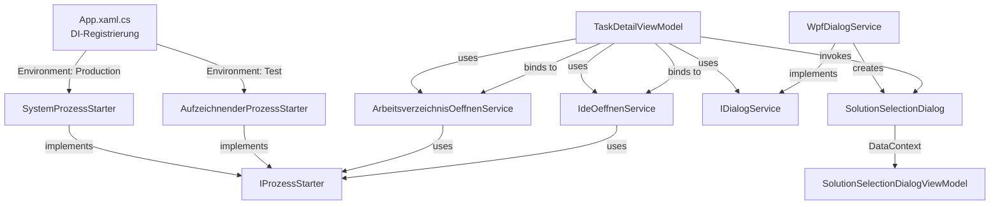

← [Zurück zur Übersicht](index.md)

# Dateisystem-Integration — Architektur

## Beteiligte Komponenten

| Komponente | Typ | Rolle |
|------------|-----|-------|
| `IProzessStarter` | Interface (Domain.Interfaces) | Gateway-Abstraktion für Prozessstart; entkoppelt `System.Diagnostics.Process` von der Domain-Logik. |
| `ProzessStartAnfrage` | Value Object (Domain.ValueObjects) | Kapselt Prozessstart-Parameter (`DateiName`, `Argumente`, `ShellAusfuehren`) ohne System.Diagnostics-Abhängigkeit. |
| `SystemProzessStarter` | Klasse (Infrastructure.Services) | Reale Implementierung von `IProzessStarter`; mappt auf `ProcessStartInfo` und ruft `Process.Start()` auf. |
| `AufzeichnenderProzessStarter` | Klasse (Infrastructure.Services) | Test-Implementierung von `IProzessStarter`; schreibt `ProzessStartAnfrage` in Logdatei statt echte Prozesse zu starten. |
| `WorkingDirectoryResolver` | Klasse (Application.Services, statisch) | Löst das effektive Arbeitsverzeichnis auf durch Kombination von Repository-Root mit optionalem konfiguriertem `WorkingDirectoryRelativePath`; validiert das Ergebnis. Stellt `ResolveEffectiveWorkingDirectory()` (sync) und `DetermineEffectiveWorkingDirectoryAsync()` (async) zur Verfügung. |
| `ArbeitsverzeichnisOeffnenService` | Klasse (Application.Services) | Löst Plattformbefehl auf (Windows/Linux/macOS) und delegiert Prozessstart mit aufgelöstem Arbeitsverzeichnis. |
| `IVisualStudioCodeLocator` | Interface (Application.Services) | Abstraktion zur Auflösung eines startbaren Visual-Studio-Code-Befehls. |
| `VisualStudioCodeLocator` | Klasse (Infrastructure.Services) | Sucht `code.cmd`/`code` in `PATH` und typischen Windows-Installationspfaden. |
| `IdeOeffnenService` | Klasse (Application.Services) | Findet `.sln`-Dateien im **aufgelösten Arbeitsverzeichnis**, öffnet sie per Shell-Execute und startet optional VS Code mit dem aufgelösten Arbeitsverzeichnis. |
| `TaskDetailViewModel` | Klasse (App.ViewModels) | Stellt Commands bereit und koordiniert Dialog/Service-Aufrufe; nutzt `WorkingDirectoryResolver` zur Auflösung des Arbeitsverzeichnisses vor Weitergabe an Services. |
| `IDialogService` / `WpfDialogService` | Interface / Klasse (App.Services) | Dialog-Gateway; implementiert `ShowSolutionSelectionDialogAsync()`. |
| `SolutionSelectionDialog` | WPF-Window (App.Views) | Modales Fenster für Solution-Auswahl bei mehreren Dateien. |
| `SolutionSelectionDialogViewModel` | Klasse (App.ViewModels) | Presentation Model für Dialog; verwaltet Solution-Liste und Benutzer-Auswahl. |

## Abhängigkeiten

```
Domain-Schicht (Abstraktion):
├─ IProzessStarter (Interface, kein konkreter Service)
└─ ProzessStartAnfrage (Value Object, unabhängig)

Infrastructure-Schicht (Reale / Test-Implementierung):
├─ SystemProzessStarter (implementiert IProzessStarter)
└─ AufzeichnenderProzessStarter (implementiert IProzessStarter)

Application-Schicht (Services):
├─ WorkingDirectoryResolver (statische Utility-Klasse)
│  ├─ `ResolveEffectiveWorkingDirectory()` (sync, für UI-Caching)
│  ├─ `DetermineEffectiveWorkingDirectoryAsync()` (async, für Command-Handler)
│  └─ `ValidateWorkingDirectory()` (Validierung und Fehlerbehandlung)
├─ ArbeitsverzeichnisOeffnenService
│  └─ Abhängigkeit: IProzessStarter
├─ IdeOeffnenService
│  ├─ Abhängigkeit: IProzessStarter
│  └─ Abhängigkeit: IVisualStudioCodeLocator
└─ (keine DB/Repository-Abhängigkeiten)

App-Schicht (UI/ViewModels):
├─ TaskDetailViewModel
│  ├─ WorkingDirectoryResolver (zur Auflösung des Arbeitsverzeichnisses)
│  ├─ ArbeitsverzeichnisOeffnenService
│  ├─ IdeOeffnenService
│  ├─ AppEinstellungService
│  └─ IDialogService
├─ WpfDialogService (implementiert IDialogService)
│  └─ Erstellt SolutionSelectionDialog und SolutionSelectionDialogViewModel
└─ SolutionSelectionDialog (XAML)
   └─ DataContext: SolutionSelectionDialogViewModel
```

Sicherheitsrichtlinien für `IProzessStarter`:
- Plattformabhängige Prozessstart-Logik bleibt in `SystemProzessStarter` (Infrastructure).
- Die Domain-Schicht (Services wie `ArbeitsverzeichnisOeffnenService`) kennt nur `IProzessStarter`.
- Test-Implementierung (`AufzeichnenderProzessStarter`) wird via Dependency Injection in `App.xaml.cs` getauscht (ähnlich `IPseudoConsoleProcessLauncher`).

## Datenfluss

### Arbeitsverzeichnis öffnen

```
Benutzer klickt Button
  ↓
TaskDetailViewModel.OeffneArbeitsverzeichnisCommand
  ↓
OeffneArbeitsverzeichnisAsync() Methode (async)
  ↓
WorkingDirectoryResolver.DetermineEffectiveWorkingDirectoryAsync()
  ├─ Kombiniert LokalerKlonPfad + WorkingDirectoryRelativePath
  ├─ Validiert das Ergebnis (existiert, ist erreichbar)
  └─ Rückgabe: aufgelöstes Arbeitsverzeichnis (z. B. C:\repo\src\backend)
  ↓
ArbeitsverzeichnisOeffnenService.Oeffne(effectiveWorkdir)
  ↓
Plattformbefehl auflösen (Explorer/xdg-open/open mit aufgelöstem Pfad)
  ↓
ProzessStartAnfrage erstellen
  ↓
IProzessStarter.Starten(anfrage)
  ├─→ SystemProzessStarter (Production)
  │   ↓
  │   Process.Start() mit aufgelöstem Pfad
  │   ↓
  │   OS-Dateiexplorer öffnet aufgelöstes Verzeichnis
  │
  └─→ AufzeichnenderProzessStarter (Test)
      ↓
      Logdatei schreiben (prozess-starts.log mit aufgelöstem Pfad)
```

### IDE öffnen

```
Benutzer klickt Button
  ↓
TaskDetailViewModel.OeffneIdeAsync()
  ↓
WorkingDirectoryResolver.DetermineEffectiveWorkingDirectoryAsync()
  └─ Rückgabe: aufgelöstes Arbeitsverzeichnis (z. B. C:\repo\src\backend)
  ↓
_solutionPfade lesen (beim Aufgabe-Laden im aufgelösten Verzeichnis gecacht)
  ↓
Verzweigung nach Anzahl der Solutions im aufgelösten Verzeichnis:
  ├─→ Keine: Bei deaktiviertem Fallback kein Klick; bei aktiviertem Fallback VS Code mit aufgelöstem Pfad starten
  ├─→ Eine: Direkt zu Prozessstart
  └─→ Mehrere: Dialog anzeigen
       ↓
       IDialogService.ShowSolutionSelectionDialogAsync()
         ↓
         WpfDialogService (UI-Thread)
           ↓
           SolutionSelectionDialog (Modal)
             ↓
             SolutionSelectionDialogViewModel
               ↓
               Benutzer wählt Solution oder bricht ab
                 ↓
                 Rückgabe: Pfad oder null
  ↓
IdeOeffnenService.OeffneSolution(gewählterPfad)
  ↓
ProzessStartAnfrage mit ShellAusfuehren=true
  ↓
IProzessStarter.Starten(anfrage)
  ├─→ SystemProzessStarter: Process.Start() mit Shell-Execute
  └─→ AufzeichnenderProzessStarter: Logdatei schreiben
  ↓
IDE (z. B. Visual Studio) öffnet Solution aus aufgelöstem Verzeichnis
```

### IDE öffnen ohne Solution mit VS Code

```
TaskDetailViewModel lädt Aufgabe
  ↓
WorkingDirectoryResolver.ResolveEffectiveWorkingDirectory() — aufgelöst
  ↓
IdeOeffnenService.FindeSolutions(effectiveWorkdir) liefert leere Liste
  ↓
AppEinstellungService liest ide.vscode.openWhenNoSolutionFound
  ↓
KannIdeOeffnen = Arbeitsverzeichnis vorhanden und Einstellung true
  ↓
Benutzer klickt IDE öffnen
  ↓
IdeOeffnenService.OeffneVisualStudioCode(effectiveWorkdir)
  — übergeben: aufgelöstes Arbeitsverzeichnis (z. B. C:\repo\src\backend)
  ↓
IVisualStudioCodeLocator.Locate()
  ├─→ Kein Treffer: FehlerMeldung
  └─→ Treffer: ProzessStartAnfrage für code "<aufgelöstes Arbeitsverzeichnis>"
      ↓
      IProzessStarter.Starten(anfrage)
      ↓
      VS Code öffnet mit aufgelöstem Verzeichnis als Working Directory
```

## Diagramm


```mermaid
graph TD
    A["App.xaml.cs<br/>DI-Registrierung"]
    A -->|Environment: Production| B["SystemProzessStarter"]
    A -->|Environment: Test| C["AufzeichnenderProzessStarter"]
    
    B -->|implements| D["IProzessStarter"]
    C -->|implements| D
    
    E["ArbeitsverzeichnisOeffnenService"] -->|uses| D
    F["IdeOeffnenService"] -->|uses| D
    
    G["TaskDetailViewModel"] -->|uses| E
    G -->|uses| F
    G -->|uses| H["IDialogService"]
    
    I["WpfDialogService"] -->|implements| H
    I -->|creates| J["SolutionSelectionDialog"]
    J -->|DataContext| K["SolutionSelectionDialogViewModel"]
    
    G -->|invokes| J
    G -->|binds to| E
    G -->|binds to| F
```

## Skalierung und Zuverlässigkeit

### Fehlertoleranz

- **Prozessstart-Fehler:** Vollständig abgefangen und geloggt. Fehler blockiert nicht die Anwendung.
- **Dateisuche-Fehler:** `IdeOeffnenService.FindeSolutions()` gibt leere Liste bei jedem Fehler zurück (sicherer Fallback).
- **Dialog-Abbruch:** Normales Verhalten, keine Fehlerbehandlung erforderlich.

### Caching und Performance

- **Solution-Caching:** `_solutionPfade` wird einmalig beim Laden der Aufgabe gefüllt (synchroner `Directory.EnumerateFiles()`-Aufruf auf oberster Ebene).
- **Typischerweise schnell:** Für ein durchschnittliches Repository mit 1–5 Solutions dauert `FindeSolutions()` < 10 ms.
- **Keine rekursive Suche:** Verhindert Performance-Degradation in großen Verzeichnisstrukturen.

### Test-Isolation

- **Separate Logdatei:** Test-Prozessstart-Anfragen werden in `prozess-starts.log` neben der Test-DB aufgezeichnet, nicht in der Production-Log.
- **Keine echten Prozesse:** `AufzeichnenderProzessStarter` startet nie echte Prozesse, isoliert Tests vollständig.
- **Unkritisch für Parallelisierung:** Mehrere Tests können gleichzeitig laufen, da jeder Test seine eigene Testdatenbank und Logdatei hat.
