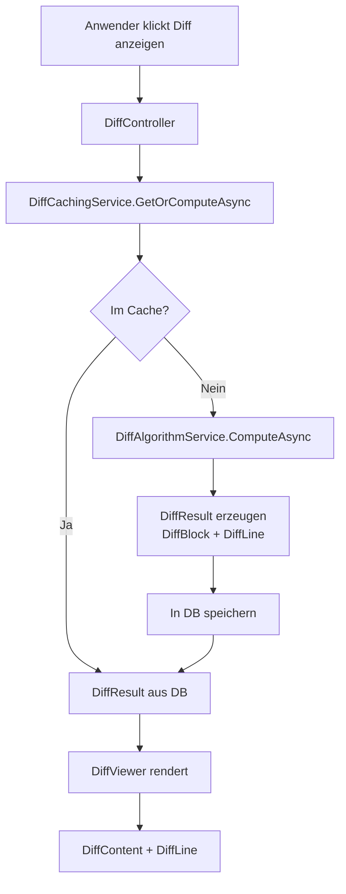

# Diff-Anzeige — Technischer Ablauf

## Übersicht

Der Diff wird durch `DiffService` berechnet, optional von `DiffCachingService` gecacht und als `DiffResult` mit enthaltenen `DiffBlock`- und `DiffLine`-Objekten gespeichert. Der API-Controller `DiffController` stellt Endpunkte für die Blazor-Komponenten bereit.

## Ablauf

### 1. Diff anfordern

Ausgelöst durch Button „🔎 Diff anzeigen" in `AufgabeDetail.razor` oder durch Klick auf eine Datei im Projektverzeichnis.

Beteiligte Komponenten:
- `DiffController` — REST-Endpunkte für Diff-Anfragen
- `DiffCachingService.GetOrComputeAsync` — Prüft Cache, berechnet bei Cache-Miss
- `DiffAlgorithmService.ComputeAsync` — Führt den eigentlichen Diff-Algorithmus aus

### 2. Diff berechnen

Beteiligte Komponenten:
- `DiffAlgorithmService` — Myers-Diff-Algorithmus oder git-diff-Aufruf
- `DiffBlock` — Zusammenhängende Änderungsblöcke
- `DiffLine` — Einzelne Zeile mit `DiffLineStatus` (`Hinzugefuegt`, `Entfernt`, `Unveraendert`)

### 3. Ergebnis speichern

Beteiligte Komponenten:
- `DiffCachingService` — Speichert `DiffResult` + `DiffBlock` + `DiffLine` in SQLite
- `DiffResult.Status` — `Erfolgreich`, `Fehlgeschlagen`, `NochNichtBerechnet`

### 4. Ergebnis anzeigen

Beteiligte Komponenten:
- `DiffViewer.razor` — Hauptkomponente, rendert `DiffResult`
- `DiffContent.razor` — Iteriert über `DiffBlock`-Liste
- `DiffLine.razor` — Rendert einzelne Zeile mit CSS-Klasse je nach Status
- `DiffPreviewPanel.razor` — Eingebettet in Aufgabendetailansicht für Dateivorschau

## Diagramm

