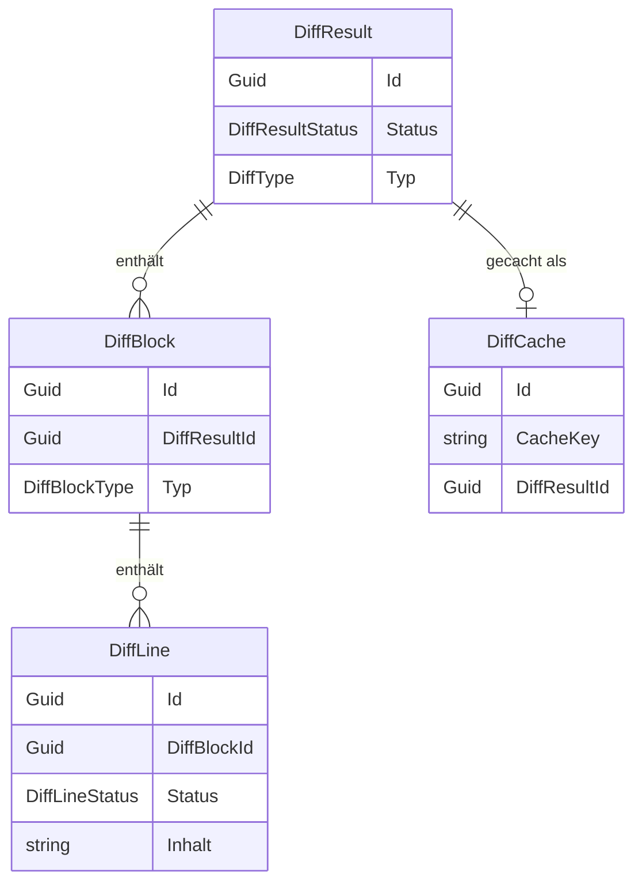

# Diff-Anzeige — Datenmodell

## Entitäten

### `DiffResult`

| Eigenschaft | Typ | Beschreibung |
|-------------|-----|--------------|
| `Id` | `Guid` | Primärschlüssel |
| `AufgabeId` | `Guid?` | FK → Aufgabe (optional) |
| `GitRepositoryId` | `Guid?` | FK → GitRepository (optional) |
| `Status` | `DiffResultStatus` | `Erfolgreich`, `Fehlgeschlagen`, `NochNichtBerechnet` |
| `Typ` | `DiffType` | Art des Diffs (z.B. `Branch`, `Commit`, `Datei`) |
| `ErstellungsDatum` | `DateTimeOffset` | Berechnungszeitpunkt |
| `Blocks` | `List<DiffBlock>` | Änderungsblöcke |

### `DiffBlock`

| Eigenschaft | Typ | Beschreibung |
|-------------|-----|--------------|
| `Id` | `Guid` | Primärschlüssel |
| `DiffResultId` | `Guid` | FK → DiffResult |
| `Typ` | `DiffBlockType` | `Hinzugefuegt`, `Entfernt`, `Kontext` |
| `OldStart` | `int` | Erste Zeile im Original |
| `NewStart` | `int` | Erste Zeile in der neuen Version |
| `Lines` | `List<DiffLine>` | Enthaltene Zeilen |

### `DiffLine`

| Eigenschaft | Typ | Beschreibung |
|-------------|-----|--------------|
| `Id` | `Guid` | Primärschlüssel |
| `DiffBlockId` | `Guid` | FK → DiffBlock |
| `Status` | `DiffLineStatus` | `Hinzugefuegt`, `Entfernt`, `Unveraendert` |
| `OldLineNumber` | `int?` | Zeilennummer im Original |
| `NewLineNumber` | `int?` | Zeilennummer in der neuen Version |
| `Inhalt` | `string` | Zeileninhalt |

### `DiffCache`

| Eigenschaft | Typ | Beschreibung |
|-------------|-----|--------------|
| `Id` | `Guid` | Primärschlüssel |
| `CacheKey` | `string` | Hash/Schlüssel für Cache-Lookup |
| `DiffResultId` | `Guid` | FK → DiffResult |
| `ErstellungsDatum` | `DateTimeOffset` | Cache-Zeitpunkt |

## Beziehungen

