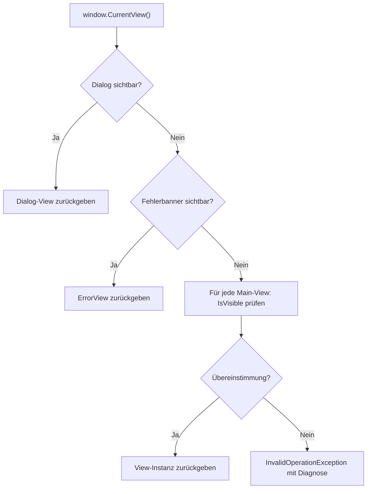
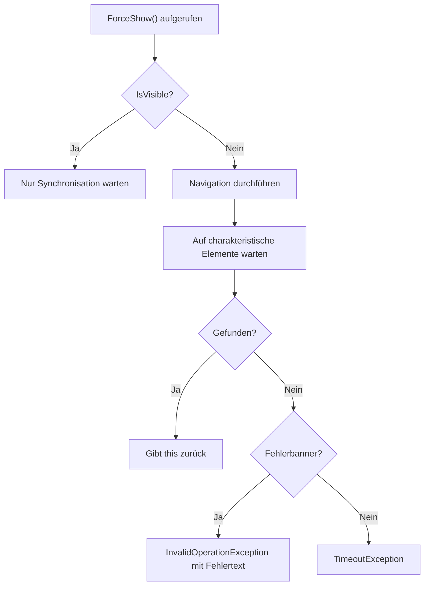
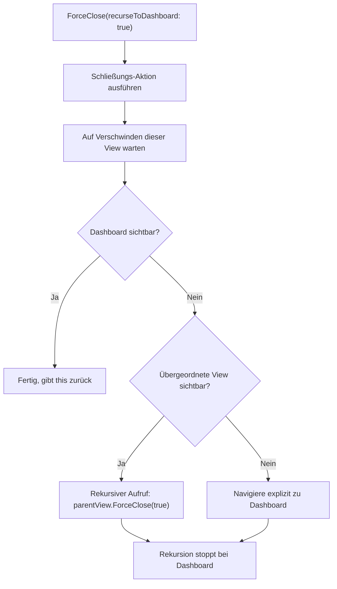

← [Zurück zur Übersicht](index.md)

# E2E-Test-Infrastruktur — Technischer Ablauf

## Übersicht

Das View-Pattern implementiert eine Abstraktionsschicht über FlaUI. Der Programmablauf besteht aus drei Hauptszenarien: View-Erkennung, Navigation und Schließen von Ansichten.

## Ablauf 1: View-Erkennung via `CurrentView()`

### Programmablauf

1. Test ruft `window.CurrentView()` auf
2. `WindowExtensions.CurrentView()` initialisiert Dialog-Factories (Liste von Lambda-Funktionen, die Dialog-View-Instanzen erzeugen)
3. Für jeden Dialog-Typ:
   - Factory erzeugt Dialog-View-Instanz (z. B. `new RepositoryAssignDialogView(window)`)
   - Ruft `IsVisible` auf der Instanz auf
   - Wenn `true`: gibt diese View-Instanz zurück (Dialog gefunden)
4. Falls kein Dialog: Prüft `ErrorView.IsVisible`
   - Wenn Fehlerbanner sichtbar: gibt `ErrorView`-Instanz zurück
5. Falls weder Dialog noch Fehler: Durchsucht Main-View-Kandidaten (Datei-Explorer, To-Dos, Aufgabendetail, Projektdetail, Projektliste, Einstellungen, Autonome Aufgabe)
   - Für jede View-Klasse: Instanz erzeugen, `IsVisible` prüfen
   - Erste übereinstimmende View-Instanz zurückgeben
6. Falls keine Ansicht erkannt: wirft `InvalidOperationException` mit Diagnose

Beteiligte Komponenten:
- `WindowExtensions.CurrentView()` — Erkennungs-Dispatcher
- Alle `*View`-Subklassen — Erkennungsheuristiken in `IsVisible`
- `BaseWindowView.IsVisible` (abstrakt) — Basis-Schnittstelle
- `ElementWaitHelper.WaitForElement()` — Element-Suche in `IsVisible`-Implementierungen

### Fehlerfall: Keine Ansicht erkannt

1. `CurrentView()` durchsucht alle Dialog-Factories und Main-Views
2. Alle geben `IsVisible = false` zurück
3. `CurrentView()` erzeugt Diagnose-String mit:
   - Liste der gesuchten View-Namen
   - Für jede View: erwartete Marker (z. B. "Projekte"-Button, "Neu"-Button)
   - Aktuell sichtbare UI-Elemente (Namen, IDs, Control-Typen)
4. Wirft `InvalidOperationException` mit Diagnose

## Ablauf 2: Navigation zu Ansicht via `ForceShow()`

### Programmablauf (Beispiel: `ProjectListView.ForceShow()`)

1. Test ruft `projectListView.ForceShow()` auf
2. `ForceShow()`-Implementierung:
   - Prüft `IsVisible`
   - Wenn bereits sichtbar: nur Synchronisation (siehe unten), gibt `this` zurück
   - Wenn nicht sichtbar:
     - Analysiert aktuelle Ansicht (z. B. mit `mainWindow.CurrentView()`)
     - Führt Navigation durch (z. B. Klick auf " Projekte"-Button im Menü)
     - Wartet auf charakteristische Elemente der Zielansicht mit `WaitForElement()`
     - Gibt `this` zurück

### Fehlerbehandlung in `ForceShow()`

Wenn Navigation fehlschlägt:
- `WaitForElement()` findet gesuchtes Element nicht innerhalb des Timeouts → wirft `TimeoutException`
- Oder: während `WaitForElement()` erscheint Fehlerbanner → bricht sofort ab mit `InvalidOperationException` inklusive Fehlertext
- Test-Fehlerbehandlung kann auf Exception prüfen

Beteiligte Komponenten:
- Spezialisierte `*View.ForceShow()` — Navigation
- `BaseWindowView.WaitForElement()` — Synchronisation
- `ElementWaitHelper.WaitForElement()` — Polling mit Fehlerbanner-Prüfung

## Ablauf 3: Schließen von Ansicht via `ForceClose()`

### `recurseToDashboard = false` (Einfaches Schließen)

1. Test ruft `view.ForceClose(recurseToDashboard: false)` auf
2. `ForceClose()`-Implementierung:
   - Führt Schließungs-Aktion aus (z. B. Klick auf "Zurück"-Button, Dialog "Abbrechen")
   - Wartet, bis Elemente dieser Ansicht verschwunden sind
   - Gibt `this` zurück
3. Übergeordnete Ansicht wird sichtbar

Beteiligte Komponenten:
- Spezialisierte `*View.ForceClose()` — Schließungs-Logik
- `BaseWindowView.WaitUntilGone()` — Synchronisation

### `recurseToDashboard = true` (Rekursives Schließen)

1. Test ruft `view.ForceClose(recurseToDashboard: true)` auf (z. B. `TaskDetailView`)
2. `TaskDetailView.ForceClose()`:
   - Führt Schließungs-Aktion aus (Klick auf "Zurück"-Button)
   - Wartet, bis `TaskDetailView`-Elemente verschwunden sind
3. Prüft, ob übergeordnete Ansicht sichtbar wird (z. B. `ProjectDetailView`)
4. Wenn ja: ruft rekursiv `projectDetailView.ForceClose(recurseToDashboard: true)` auf
   - Dies schließt wiederum `ProjectDetailView`
   - Prüft auf übergeordnete Ansicht
5. Stoppt Rekursion, wenn `DashboardView.IsVisible = true`
6. Gibt `this` zurück

Beteiligte Komponenten:
- Spezialisierten `*View.ForceClose()` — je nach Ansicht unterschiedliche Rekursions-Bedingungen
- `BaseWindowView.IsVisible` — Prüfung der übergeordneten Ansicht

### Fehlerbehandlung in `ForceClose()`

- `WaitUntilGone()` findet Element nach Timeout immer noch sichtbar → wirft `TimeoutException`
- Während `ForceClose()` erscheint Fehlerbanner → Test kann dies erkennen und reagieren

## Diagramm: View-Erkennung

## Diagramm: Navigation

## Diagramm: Schließen mit recurseToDashboard

## Element-Wartelogik (ElementWaitHelper)

### Polling-Schleife in `WaitForElement()`

1. Schleife mit Timeout (Standard: 20s für `Short`, 15s für `Medium`)
2. In jeder Iteration:
   - Suche nach Ziel-Element (mit `FindFirstDescendant()`)
   - Prüfe `IsOnScreen` (sichtbar, nicht `IsOffscreen`)
   - Wenn gefunden: Element zurückgeben
   - Wenn nicht: Prüfe auf Fehlerbanner
     - Wenn Fehlerbanner sichtbar UND es ist nicht selbst das gesuchte Ziel: sofort `InvalidOperationException` werfen
     - Wenn Fehlerbanner sichtbar UND es ist selbst das gesuchte Ziel: versuche Element erneut zu finden und gib es zurück
   - Warte kurz (z. B. 50ms) und wiederhole
3. Nach Timeout: wirft `TimeoutException`

Diese Fehlerbehandlung "Fail-Fast-on-Banner" beschleunigt Fehlerfälle: statt 20 Sekunden zu warten, bis zur Zielsuche abgebrochen wird, wird sofort erkannt, dass ein Fehler aufgetreten ist.

Beteiligte Komponenten:
- `ElementWaitHelper.WaitForElement()` — Polling-Logik
- `BaseWindowView.WaitForElement()` — lokales Gegenstück für View-Klassen
- `BaseWindowView.IsOnScreen()` — Sichtbarkeitsprüfung (negiert `IsOffscreen`)
