← [Zurück zur Übersicht](index.md)

# E2E-Test-Infrastruktur — Klassenhierarchie

## Klassenübersicht

### BaseWindowView

Abstrakte Basisklasse für alle View-Klassen. Definiert die einheitliche API.

| Eigenschaft / Methode | Typ | Beschreibung |
|----------------------|-----|-------------|
| `Window` | Property | FlaUI-Hauptfenster |
| `IsVisible` | Abstract Property | Ansicht-Erkennung (spezialisiert in Subklassen) |
| `ForceShow()` | Abstract Method | Navigation zu Ansicht |
| `ForceClose(bool)` | Abstract Method | Ansicht schließen |
| `Menu` | Virtual Property | Navigationsmenü-Zugriff |
| `ElementExists(parent, condition)` | Protected Static | Element-Existenz-Prüfung |
| `WaitForElement(parent, condition, timeout)` | Protected Static | Element-Suche mit Polling |
| `WaitUntilGone(parent, condition, timeout)` | Protected Static | Warten bis Element weg |
| `Short` | Protected Static TimeSpan | 20s Timeout |
| `Medium` | Protected Static TimeSpan | 15s Timeout |

### MenuView : BaseWindowView

Spezialisierte View für Navigationsmenü-Interaktionen.

| Methode | Rückgabe | Beschreibung |
|---------|----------|-------------|
| `NavigateToDashboard()` | MenuView | Navigiert zu Dashboard |
| `NavigateToProjects()` | MenuView | Navigiert zu Projektliste |
| `NavigateToSettings()` | MenuView | Navigiert zu Einstellungen |

### DashboardView : BaseWindowView

Dashboard-Ansicht (Einstiegsseite nach App-Start).

| Eigenschaft | Typ | Beschreibung |
|-------------|-----|-------------|
| `IsVisible` | bool | True: Navigationsbuttons sichtbar |
| `ForceShow()` | BaseWindowView | No-Op (immer erreichbar) |
| `ForceClose()` | BaseWindowView | Schließt App (nicht praktisch) |

### ProjectListView : BaseWindowView

Projektlisten-Ansicht.

| Eigenschaft / Methode | Typ | Beschreibung |
|----------------------|-----|-------------|
| `IsVisible` | bool | True: "Neu"-Button und Projekt-Elemente sichtbar |
| `ForceShow()` | BaseWindowView | Klick auf " Projekte"-Button |
| `CreateProject(name)` | void | Neue Projekt-Dialog, Projekt erzeugen |
| `OpenProject(name)` | void | Projekt-Element klicken, zu ProjectDetailView |

### ProjectDetailView : BaseWindowView

Projektdetail-Ansicht mit Aufgabenliste und Eigenschaften.

| Eigenschaft / Methode | Typ | Beschreibung |
|----------------------|-----|-------------|
| `IsVisible` | bool | True: "ProjektName"-Feld und "AufgabeNeu"-Button sichtbar |
| `ForceShow()` | BaseWindowView | Öffnet Projekt aus Projektliste |
| `CreateTask()` | void | Klick auf "AufgabeNeu"-Button |
| `DeleteProject()` | void | Projekt-Löschung mit Bestätigung |

### TaskDetailView : BaseWindowView

Aufgabendetail-Ansicht mit Edit-, CLI-, Diff-, Todos-Panels.

| Eigenschaft / Methode | Typ | Beschreibung |
|----------------------|-----|-------------|
| `IsVisible` | bool | True: "EditTitel"-Feld und "Speichern"-Button sichtbar |
| `ForceShow()` | BaseWindowView | Öffnet Aufgabe aus Projektdetail |
| `GetTaskTitle()` | string | Aktueller Aufgabentitel |
| `SetTaskTitle(title)` | void | Aufgabentitel ändern |
| `SaveTask()` | void | Aufgabe speichern |
| `ForceClose(recurseToDashboard)` | BaseWindowView | Klick "Zurück", optional bis Dashboard |

### SettingsView : BaseWindowView

Einstellungen-Ansicht (Plugins, Arbeitsverzeichnis, Benachrichtigungen, Erscheinungsbild).

| Eigenschaft / Methode | Typ | Beschreibung |
|----------------------|-----|-------------|
| `IsVisible` | bool | True: Einstellungs-Tabs sichtbar |
| `ForceShow()` | BaseWindowView | Klick auf " Einstellungen"-Button |
| `SwitchTab(name)` | void | Tab aktivieren (z. B. "Plugins") |

### FileExplorerView : BaseWindowView

Datei-Explorer-Panel in Aufgabendetail (zeigt lokale Dateistruktur).

| Eigenschaft / Methode | Typ | Beschreibung |
|----------------------|-----|-------------|
| `IsVisible` | bool | True: Datei-Explorer-Elemente sichtbar |
| `ForceShow()` | BaseWindowView | Zeigt Datei-Explorer-Tab an |

### TodoListView : BaseWindowView

To-Do-Listen-Panel in Aufgabendetail (Aufgabengliederung).

| Eigenschaft / Methode | Typ | Beschreibung |
|----------------------|-----|-------------|
| `IsVisible` | bool | True: To-Do-Listenelemente sichtbar |
| `ForceShow()` | BaseWindowView | Zeigt To-Do-Tab an |

### AutonomAufgabeDetailView : BaseWindowView

Autonome Aufgabe Detail-Ansicht (Projektleiter-Agent-Orchestrierung).

| Eigenschaft / Methode | Typ | Beschreibung |
|----------------------|-----|-------------|
| `IsVisible` | bool | True: Autonome-Aufgaben-spezifische Elemente sichtbar |
| `ForceShow()` | BaseWindowView | Navigiert zu Autonomer Aufgabe |

### ErrorView : BaseWindowView

Fehlerbanner-View (zeigt Fehler der Anwendung).

| Eigenschaft / Methode | Typ | Beschreibung |
|----------------------|-----|-------------|
| `IsVisible` | bool | True: "FehlerMeldung"-TextBlock sichtbar |
| `GetErrorMessage()` | string | Fehlertext lesen |

### DialogView : BaseWindowView

Abstrakte Basisklasse für modale Dialoge (eigenes Fenster-Handle).

| Eigenschaft | Typ | Beschreibung |
|-------------|-----|-------------|
| `IsVisible` | bool | True: Dialog-Fenster existiert und ist sichtbar |
| `ForceShow()` | BaseWindowView | Wartet auf Dialog-Fenster |
| `ForceClose()` | BaseWindowView | Klick "Abbrechen" oder "OK", Dialog schließen |

### DialogView-Subklassen

#### RepositoryAssignDialogView : DialogView

Repository-Zuweisungs-Dialog.

| Methode | Rückgabe | Beschreibung |
|---------|----------|-------------|
| `SelectRepository(name)` | void | Repository aus Liste wählen |
| `Confirm()` | void | Dialog mit Bestätigung schließen |

#### PluginSelectionDialogView : DialogView

KI-Plugin-Auswahl-Dialog.

| Methode | Rückgabe | Beschreibung |
|---------|----------|-------------|
| `SelectPlugin(name)` | void | Plugin aus Liste wählen |
| `Confirm()` | void | Dialog mit Bestätigung schließen |

#### IssueSelectionDialogView : DialogView

GitHub-Issue/BitBucket-Ticket-Auswahl-Dialog.

#### IssueCreateDialogView : DialogView

Neuer GitHub-Issue/BitBucket-Ticket-Dialog.

#### AutonomAufgabeInitialisierungsDialogView : DialogView

Dialog zur Initialisierung autonomer Aufgaben.

| Eigenschaften | Beschreibung |
|--------------|------------|
| Projektbranch | Auswahl oder Texteingabe |
| Initialprompt | Texteingabe mit Vorlagensystem |
| Permissions-Quelle | Auswahl (Generieren/Auswählen/Vorhandene) |
| Token-Budget | Zahleneingabe |
| Laufzeitbegrenzung | Zahleneingabe |

#### AutonomAufgabeDetailDialogView : DialogView

Detail-Dialog für laufende autonome Aufgaben.

#### ArbeitsverzeichnisBearbeitenDialogView : DialogView

Dialog zur Einstellung des Arbeitsverzeichnisses.

#### OpenTodosDialogView : DialogView

Read-Only-Dialog mit offenen To-Dos einer Aufgabe.

#### HelpTextDialogView : DialogView

Informationsdialog mit Hilfetext.

#### SolutionSelectionDialogView : DialogView

Dialog für Auswahl zwischen mehreren Visual-Studio-Solutions.

#### UpdateProgressDialogView : DialogView

Fortschritts-Dialog während Programm-Updates.

#### DeleteConfirmationDialogView : DialogView

Lösch-Bestätigungs-Dialog (native Windows MessageBox).

| Methode | Rückgabe | Beschreibung |
|---------|----------|-------------|
| `Confirm()` | void | Bestätigt Löschung |
| `Cancel()` | void | Bricht Löschung ab |

## Klassenhierarchie-Diagramm

```mermaid
graph TD
    A["BaseWindowView<br/>(abstrakt)"]
    A -->|erbt| B["MenuView"]
    A -->|erbt| C["DashboardView"]
    A -->|erbt| D["ProjectListView"]
    A -->|erbt| E["ProjectDetailView"]
    A -->|erbt| F["TaskDetailView"]
    A -->|erbt| G["SettingsView"]
    A -->|erbt| H["FileExplorerView"]
    A -->|erbt| I["TodoListView"]
    A -->|erbt| J["AutonomAufgabeDetailView"]
    A -->|erbt| K["ErrorView"]
    A -->|erbt| L["DialogView<br/>(abstrakt)"]
    
    L -->|erbt| M["RepositoryAssignDialogView"]
    L -->|erbt| N["PluginSelectionDialogView"]
    L -->|erbt| O["IssueSelectionDialogView"]
    L -->|erbt| P["IssueCreateDialogView"]
    L -->|erbt| Q["AutonomAufgabeInitialisierungsDialogView"]
    L -->|erbt| R["AutonomAufgabeDetailDialogView"]
    L -->|erbt| S["ArbeitsverzeichnisBearbeitenDialogView"]
    L -->|erbt| T["OpenTodosDialogView"]
    L -->|erbt| U["HelpTextDialogView"]
    L -->|erbt| V["SolutionSelectionDialogView"]
    L -->|erbt| W["UpdateProgressDialogView"]
    L -->|erbt| X["DeleteConfirmationDialogView"]
```



## Verwendungsbeziehungen

| Klasse | Verwendet | Grund |
|--------|-----------|-------|
| Alle `*View` | `ElementWaitHelper` | Element-Suche, Polling-Logik |
| `BaseWindowView` | FlaUI `Window`, `AutomationElement` | UI-Automation-API |
| `WindowExtensions` | Alle Dialog-Views, alle Main-Views | View-Erkennung |
| Tests | `BaseWindowView` + Subklassen | Ansicht-Manipulation |

## Dateistruktur

```
src/Softwareschmiede.Tests/E2E/Views/
├── BaseWindowView.cs              # Basisklasse
├── MenuView.cs                     # Navigationsmenü
├── DashboardView.cs
├── ProjectListView.cs
├── ProjectDetailView.cs
├── TaskDetailView.cs
├── SettingsView.cs
├── FileExplorerView.cs
├── TodoListView.cs
├── AutonomAufgabeDetailView.cs
├── ErrorView.cs
├── DialogView.cs                   # Dialog-Basisklasse
├── WindowExtensions.cs             # Erweiterungsmethoden
└── Dialogs/
    ├── RepositoryAssignDialogView.cs
    ├── PluginSelectionDialogView.cs
    ├── IssueSelectionDialogView.cs
    ├── IssueCreateDialogView.cs
    ├── AutonomAufgabeInitialisierungsDialogView.cs
    ├── AutonomAufgabeDetailDialogView.cs
    ├── ArbeitsverzeichnisBearbeitenDialogView.cs
    ├── OpenTodosDialogView.cs
    ├── HelpTextDialogView.cs
    ├── SolutionSelectionDialogView.cs
    ├── UpdateProgressDialogView.cs
    └── DeleteConfirmationDialogView.cs
```
