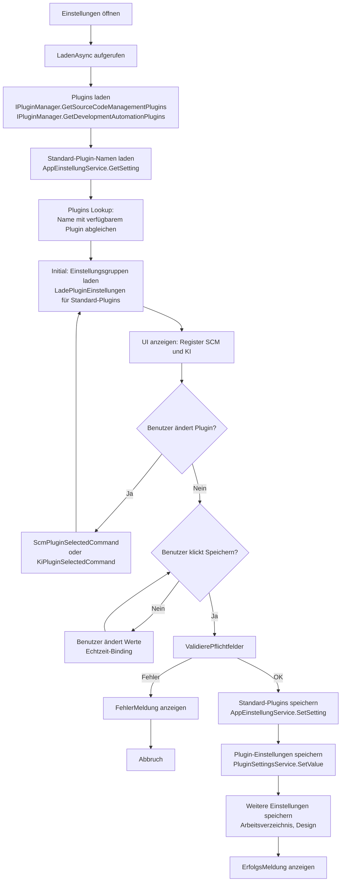

← [Zurück zur Übersicht](index.md)

# Einstellungen — Technischer Ablauf

## Übersicht

Die Einstellungsansicht (`SettingsView`) lädt beim Öffnen alle verfügbaren SCM- und KI-Plugins über `IPluginManager`. Der Anwender wählt ein Plugin aus, woraufhin `SettingsViewModel` die vom Plugin definierten Einstellungsgruppen (`PluginSettingGroup`) abruft und für jedes Feld (`PluginSettingField`) die gespeicherten Werte via `PluginSettingsService.GetValue()` lädt. Die XAML rendert dynamisch die passenden Eingabekomponenten basierend auf `PluginSettingFieldType`. Beim Speichern werden alle Werte und die Standard-Plugin-Namen persistiert.

## Ablauf

### 1. Laden der Einstellungen beim Öffnen

Auslöser: Anwender öffnet die Einstellungsansicht.

1. `SettingsView.xaml.cs` wird initialisiert; sein `DataContext` wird auf `SettingsViewModel` gesetzt
2. Das `Loaded`-Event triggert `SettingsViewModel.LadenCommand`
3. `SettingsViewModel.LadenAsync(CancellationToken)` wird aufgerufen:
   - `AppEinstellungService.GetSettingAsync(AppEinstellungService.DefaultKiPluginKey)` → lädt String-Name des Standard-KI-Plugins
   - `AppEinstellungService.GetSettingAsync(AppEinstellungService.DefaultScmPluginKey)` → lädt String-Name des Standard-SCM-Plugins
   - `DarkModeService.GetAvailableModes()` → liefert verfügbare Design-Modi
   - `IPluginManager.GetSourceCodeManagementPlugins()` → liefert Liste aller `IGitPlugin`-Implementierungen
   - `IPluginManager.GetDevelopmentAutomationPlugins()` → liefert Liste aller `IKiPlugin`-Implementierungen
4. Die geladenen Plugin-Namen werden mit den verfügbaren Plugins abgeglichen:
   - Falls gespeicherter SCM-Plugin-Name existiert: `DefaultScmPlugin` wird auf das gefundene Plugin gesetzt
   - Sonst: `DefaultScmPlugin` wird auf das erste Plugin der Liste gesetzt
   - Analog für KI-Plugin
5. Für beide Standard-Plugins werden die Einstellungsgruppen sofort geladen (siehe Schritt 2)

Beteiligte Komponenten:
- `SettingsViewModel.LadenAsync()` — Orchestrierung des Ladevorgangs
- `AppEinstellungService.GetSettingAsync()` — Laden der gespeicherten Plugin-Namen
- `IPluginManager.GetSourceCodeManagementPlugins()` / `GetDevelopmentAutomationPlugins()` — Plugin-Discover
- `DarkModeService.Current` — aktuelle Design-Einstellung

### 2. Laden der Plugin-Einstellungsgruppen (SCM oder KI)

Auslöser: Plugin-Auswahl wird in ComboBox geändert, oder beim initialen Laden.

1. `SettingsView.xaml` bindet an `ComboBox.SelectionChanged`-Event
2. Code-Behind (`SettingsView.xaml.cs`) ruft den passenden Command auf:
   - Für SCM: `SettingsViewModel.ScmPluginSelectedCommand` mit Parameter `IGitPlugin plugin`
   - Für KI: `SettingsViewModel.KiPluginSelectedCommand` mit Parameter `IKiPlugin plugin`
3. Der Command ruft die private Methode auf:
   - `LoadScmPluginSettings(plugin)` oder `LoadKiPluginSettings(plugin)`
4. Diese Methode führt `LadePluginEinstellungen(plugin)` aus:
   - `plugin.GetSettingGroups()` wird aufgerufen → liefert `IEnumerable<PluginSettingGroup>` mit Gruppen und Feldern
   - Für jede `PluginSettingGroup`:
     - Eine neue `PluginSettingGroupEntry` wird erstellt (Container für die UI)
     - Für jedes `PluginSettingField` in der Gruppe:
       - `PluginSettingsService.GetValue(plugin, field)` wird aufgerufen → gibt den String-Wert oder `null` zurück
       - Eine neue `PluginSettingEntry` wird erstellt mit dem geladenen Wert
       - Für `Softwareschmiede.Codex.CommandLineParameters` wird `PluginSettingEntry` ohne Default-Fallback erstellt; ein fehlender Credential wird dadurch als leerer Anwenderwert angezeigt
5. Die Liste wird in `SelectedScmPluginSettings` oder `SelectedKiPluginSettings` gespeichert
6. Die Binding-Maschine triggert die XAML-Neurendrung

Beteiligte Komponenten:
- `SettingsView.xaml` — `ComboBox` mit `SelectionChanged`-Event
- `SettingsView.xaml.cs` — Event-Handler, der Command aufruft
- `SettingsViewModel.ScmPluginSelectedCommand` / `SettingsViewModel.KiPluginSelectedCommand` — Commands (RelayCommand<IGitPlugin> / RelayCommand<IKiPlugin>)
- `SettingsViewModel.LoadScmPluginSettings()` / `SettingsViewModel.LoadKiPluginSettings()` — private Methoden
- `SettingsViewModel.LadePluginEinstellungen()` — generische Methode
- `IPlugin.GetSettingGroups()` — Plugin-definierte Methode
- `PluginSettingsService.GetValue()` — Abruf aus Credential Store
- `PluginSettingGroupEntry` — Hilfsklasse mit Eigenschaften `GroupName` und `Entries`
- `PluginSettingEntry` — Hilfsklasse mit Eigenschaften `Field` und `Value` / `BoolValue`
- `SettingsViewModel.IsCodexCommandLineParameters()` — Codex-spezifische Erkennung für `CommandLineParameters` ohne Default-Fallback

### 3. Rendering von Plugin-Einstellungen in der XAML

Auslöser: `SelectedScmPluginSettings` oder `SelectedKiPluginSettings` wird aktualisiert.

1. `SettingsView.xaml` bindet an `ItemsControl.ItemsSource="{Binding SelectedScmPluginSettings}"` (bzw. `SelectedKiPluginSettings`)
2. Das `ItemsControl` iteriert über jede `PluginSettingGroupEntry`:
   - Für jede Gruppe wird das ItemTemplate gerendert:
     - `TextBlock` zeigt `GroupName` (z. B. "Authentifizierung")
     - Verschachtelte `ItemsControl` iteriert über `Entries` (die `PluginSettingEntry`-Objekte)
3. Für jede `PluginSettingEntry` wird das ItemTemplate gerendert:
   - `TextBlock` zeigt `Field.Label` (Feldbezeichnung)
   - `ContentControl` mit `ContentTemplateSelector="{StaticResource FieldTemplateSelector}"` wird verwendet:
     - `PluginSettingFieldTemplateSelector` untersucht `entry.Field.FieldType`
     - Die entsprechende DataTemplate wird ausgewählt und das Feld gerendert:
       - **Text** → `TextBox` mit Binding `Text="{Binding Value, UpdateSourceTrigger=PropertyChanged}"`
       - **Secret** → `PasswordBox` mit `PasswordChanged`-Event und Code-Behind-Binding zu `entry.Value`
       - **Url** → `TextBox` (wie Text)
       - **Integer** → `TextBox` (ohne Validierungs-Regel; Validierung erfolgt beim Speichern)
       - **Boolean** → `CheckBox` mit Binding `IsChecked="{Binding BoolValue, UpdateSourceTrigger=PropertyChanged}"`
       - **Enum** → `ComboBox` mit `ItemsSource="{Binding Field.EnumOptions}"` und `SelectedValue="{Binding Value, UpdateSourceTrigger=PropertyChanged}"`
       - **FilePath** → `StackPanel` mit `TextBox` und Browse-Button (`OnDateiAuswaehlenClick`-Handler)
   - `TextBlock` zeigt `Field.Description` (falls vorhanden) mit sekundärer Textfarbe

Beteiligte Komponenten:
- `SettingsView.xaml` — ItemsControl und DataTemplates
- `PluginSettingFieldTemplateSelector` — Klasse in Code-Behind, wählt richtige DataTemplate
- `PluginSettingGroupEntry` — Datenmodell
- `PluginSettingEntry` — Datenmodell
- `PluginSettingField` — Metadaten (Label, Description, FieldType, EnumOptions)
- Verschiedene WPF-Controls — TextBox, PasswordBox, CheckBox, ComboBox, Button

### 4. Speichern der Plugin-Einstellungen und Standard-Plugins

Auslöser: Anwender klickt den Button **Speichern**.

1. `SettingsView.xaml` bindet `SpeichernCommand="{Binding SpeichernCommand}"` an Button
2. `SettingsViewModel.SpeichernCommand` wird ausgelöst → ruft `SpeichernAsync(CancellationToken)` auf:
3. Validierung aller Felder:
   - `ValidierePflichtfelder()` wird aufgerufen:
     - Für jede `PluginSettingEntry` in `SelectedScmPluginSettings` und `SelectedKiPluginSettings`:
       - Falls `Field.IsRequired` und `Value` ist leer → Fehler, Speichern abgebrochen
       - Falls `FieldType == Integer` und `Value` ist keine gültige Ganzzahl → Fehler
       - Falls `FieldType == Enum` und `Value` nicht in `Field.EnumOptions` → Fehler
   - Falls Validierung fehlgeschlagen: `FehlerMeldung` wird gesetzt, Methode kehrt zurück
4. Standard-Plugins speichern:
   - `AppEinstellungService.SetSettingAsync(AppEinstellungService.DefaultKiPluginKey, DefaultKiPlugin, ct)` → speichert String-Name des KI-Plugins
   - `AppEinstellungService.SetSettingAsync(AppEinstellungService.DefaultScmPluginKey, DefaultScmPlugin?.PluginName, ct)` → speichert String-Name des SCM-Plugins
5. Plugin-Einstellungswerte speichern:
   - `SpeicherePluginEinstellungen(_defaultScmPlugin, _selectedScmPluginSettings)` wird aufgerufen:
     - Für jede `PluginSettingEntry` in den Einstellungsgruppen:
       - `PluginSettingsService.SetValue(plugin, entry.Field, entry.Value)` wird aufgerufen
       - Bei Boolean-Feldern: `entry.BoolValue` wird als "true"/"false" String gespeichert (Konvertierung erfolgt in `SetValue`)
       - Bei Codex-`CommandLineParameters`: Auch ein leerer Wert wird gespeichert, damit entfernte Parameter nicht durch spätere Defaults wiederhergestellt werden
   - Analog für KI-Plugins
6. Weitere Einstellungen speichern:
   - `ArbeitsverzeichnisSettingsService.SaveArbeitsverzeichnisAsync()`
   - `DarkModeService.SetModeAsync()` (wendet Design sofort an)
7. Erfolgsmeldung anzeigen:
   - `ErfolgsMeldung = "Einstellungen gespeichert."`

Beteiligte Komponenten:
- `SettingsViewModel.SpeichernAsync()` — Orchestrierung
- `SettingsViewModel.ValidierePflichtfelder()` — Validierung
- `SettingsViewModel.ValidierePflichtfelderFuerSettings()` — Validierung für einzelne Einstellungsgruppen
- `AppEinstellungService.SetSettingAsync()` — Speichert in `AppEinstellung`-Tabelle
- `PluginSettingsService.SetValue()` — Speichert in Credential Store
- `ArbeitsverzeichnisSettingsService.SaveArbeitsverzeichnisAsync()` — Speichert Arbeitsverzeichnis
- `DarkModeService.SetModeAsync()` — Wechselt Theme-Ressourcen
- `PluginSettingEntry` — Datenmodell mit `Value` und `BoolValue`

## Diagramm

## Fehlerbehandlung

### Validierungsfehler beim Speichern

Wenn Validierung fehlgeschlagen:
- `FehlerMeldung` wird mit sprechender Nachricht gesetzt (z. B. "Pflichtfeld 'API-Schlüssel' darf nicht leer sein")
- Die Methode kehrt sofort zurück, `PluginSettingsService.SetValue()` wird nicht aufgerufen
- Der Anwender sieht die rote Fehlermeldung oben im Dialog
- Die Einstellung wird nicht persistiert

### Fehler beim Laden von Plugins

Falls `IPluginManager` fehlschlägt oder keine Plugins zurückliefert:
- `ScmPlugins` oder `KiPlugins` ist leer
- Die Register zeigen leere ComboBoxes oder deaktivierte Eingabefelder
- Beim Laden eines Standard-Plugin-Namens wird `FirstOrDefault()` aufgerufen → liefert `null`
- `DefaultScmPlugin` / `DefaultKiPlugin` bleiben `null`
- Die UI reagiert mit leeren Einstellungspanels (durch XAML Bindings)

### Fehler beim Speichern in `PluginSettingsService`

Falls `SetValue()` wirft eine Exception:
- Die Exception wird von `SpeichernAsync()` gecatcht
- `FehlerMeldung` wird mit der Exception-Message gesetzt
- Die Methode kehrt zurück, weitere Einstellungen werden nicht gespeichert
- Der Anwender wird über das Fehler-Banner informiert
