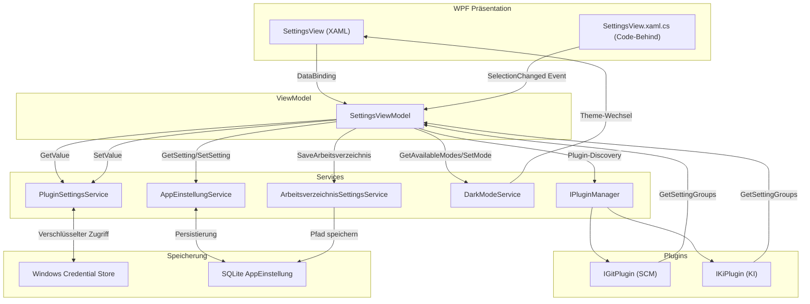

← [Zurück zur Übersicht](index.md)

# Einstellungen — Architektur

## Beteiligte Komponenten

| Komponente | Typ | Rolle |
|------------|-----|-------|
| `SettingsView.xaml` / `.xaml.cs` | WPF UserControl | Präsentationsschicht; rendert Registerkarten, Eingabefelder und Fehlermeldungen |
| `SettingsViewModel` | ViewModel (MVVM) | Geschäftslogik; lädt Plugin-Listen, verwaltet Einstellungswerte, validiert und speichert |
| `IPluginManager` | Service-Interface | Liefert verfügbare SCM- und KI-Plugins zur Laufzeit |
| `PluginSettingsService` | Service | CRUD-Zugriff auf Plugin-Einstellungswerte im Windows Credential Store |
| `AppEinstellungService` | Service | Speichert Anwendungseinstellungen (Standard-Plugins, Design-Modus, etc.) in SQLite |
| `DarkModeService` | Service | Wechselt WPF-Theme zwischen `DarkTheme.xaml` und `LightTheme.xaml` |
| `ArbeitsverzeichnisSettingsService` | Service | Verwaltet das lokale Arbeitsverzeichnis für Repository-Klone |
| `IPlugin` / `IGitPlugin` / `IKiPlugin` | Interfaces | Abstraktion für alle Plugins; jedes Plugin definiert `GetSettingGroups()` |
| `PluginSettingGroup` | ValueObject | Enthält Gruppe von zusammenhängenden Einstellungsfeldern (z. B. "Authentifizierung") |
| `PluginSettingField` | ValueObject | Metadaten eines einzelnen Einstellungsfeldes (Label, Typ, Beschreibung, Validierungsregeln) |
| `PluginSettingGroupEntry` | Hilfsklasse | XAML-Bindungs-gerechtes Wrapper-Objekt für `PluginSettingGroup` |
| `PluginSettingEntry` | Hilfsklasse | XAML-Bindungs-gerechtes Wrapper-Objekt für `PluginSettingField` mit aktuellem Wert |
| `PluginSettingFieldTemplateSelector` | WPF ContentTemplateSelector | Wählt basierend auf `PluginSettingFieldType` die richtige DataTemplate aus |
| `DarkTheme.xaml` / `LightTheme.xaml` | ResourceDictionaries | Theme-Definitionen mit Dark-Mode-Farben und Styles für alle Eingabekomponenten |

## Abhängigkeiten

Die Einstellungsansicht integriert mehrere spezialisierte Services und Plugins:

```
SettingsViewModel
├── AppEinstellungService (Standard-Plugins, Design-Modus)
├── ArbeitsverzeichnisSettingsService (Arbeitsverzeichnis)
├── DarkModeService (Theme-Wechsel)
├── IPluginManager (Plugin-Discovery)
│   ├── GetSourceCodeManagementPlugins() → IGitPlugin[] 
│   └── GetDevelopmentAutomationPlugins() → IKiPlugin[]
├── PluginSettingsService
│   ├── GetValue(plugin, field) → String (Credential Store Lookup)
│   └── SetValue(plugin, field, value) → void (Credential Store Speicherung)
└── ILogger<SettingsViewModel> (Fehlerprotokollierung)
```

**Kommunikationsmuster:**

1. **Plugin-Discovery:** `SettingsViewModel` fragt `IPluginManager` nach allen verfügbaren Plugins ab
2. **Einstellungswert-Abfrage:** `SettingsViewModel` ruft `PluginSettingsService.GetValue()` auf, der wiederum im Windows Credential Store nachschaut
3. **Einstellungswert-Speicherung:** `PluginSettingsViewModel` ruft `PluginSettingsService.SetValue()` auf, der den Wert verschlüsselt speichert
4. **Standard-Plugin-Speicherung:** `AppEinstellungService` speichert Plugin-Namen als String in SQLite `AppEinstellung`-Tabelle
5. **Theme-Wechsel:** `DarkModeService` wechselt WPF-`ResourceDictionary` zwischen zwei Themes und speichert die Wahl in `AppEinstellungService`

## Datenfluss

### Beim Laden der Einstellungsansicht

```
SettingsView geöffnet
    ↓
SettingsViewModel.LadenCommand triggert LadenAsync()
    ↓
Plugins laden: IPluginManager.GetSourceCodeManagementPlugins()
                IPluginManager.GetDevelopmentAutomationPlugins()
    ↓
Standard-Plugin-Namen abrufen: AppEinstellungService.GetSetting(DefaultScmPluginKey)
                                AppEinstellungService.GetSetting(DefaultKiPluginKey)
    ↓
Plugin-Objekt rekonstruieren: Abgleich des Namens mit verfügbaren Plugins
    ↓
Einstellungsgruppen laden: plugin.GetSettingGroups()
    ↓
Für jedes Feld Wert abrufen: PluginSettingsService.GetValue(plugin, field)
    ↓
PluginSettingEntry-Objekte erzeugen mit geladenen Werten
    ↓
SelectedScmPluginSettings / SelectedKiPluginSettings aktualisieren
    ↓
XAML rendert Eingabefelder basierend auf FieldType
```

### Beim Speichern

```
Anwender klickt "Speichern"
    ↓
SpeichernAsync() startet
    ↓
ValidierePflichtfelder() durchführen
    ↓
Wenn Validierung erfolgreich:
    ├─ AppEinstellungService.SetSetting(DefaultScmPluginKey, plugin.PluginName)
    ├─ AppEinstellungService.SetSetting(DefaultKiPluginKey, pluginName)
    ├─ Für jedes Feld: PluginSettingsService.SetValue(plugin, field, value)
    │   └─ Wert wird verschlüsselt im Credential Store gespeichert
    ├─ ArbeitsverzeichnisSettingsService.SaveArbeitsverzeichnis()
    └─ DarkModeService.SetMode() (Theme anwenden)
    ↓
ErfolgsMeldung anzeigen

Wenn Validierung fehlgeschlagen:
    ↓
FehlerMeldung anzeigen
    ↓
Speichern abgebrochen, keine Daten persistiert
```

## Diagramm



## Erweiterbarkeit

Das Design der Einstellungsseite ist plugin-centric und erweiterbar:

1. **Neue Plugins hinzufügen:** Ein neues SCM- oder KI-Plugin muss nur `IGitPlugin` / `IKiPlugin` implementieren und `GetSettingGroups()` definieren. Die UI rendert automatisch die Felder.

2. **Neue Feldtypen:** Wenn ein Plugin einen neuen `PluginSettingFieldType` benötigt (z. B. `PasswordPair` mit zwei Passwörtern), muss nur:
   - Der neue Typ zu `PluginSettingFieldType` Enum hinzugefügt werden
   - Eine neue DataTemplate in `SettingsView.xaml` hinzugefügt werden
   - Der `PluginSettingFieldTemplateSelector` angepasst werden

3. **Validierungsregeln erweitern:** Die Validierungsmethode `ValidierePflichtfelderFuerSettings()` kann um neue Regeln erweitert werden (z. B. reguläre Ausdrücke für Email-Felder).

4. **Theme-Anpassungen:** Alle Eingabekomponenten nutzen `DynamicResource` Bindings auf zentrale Farb-Brushes in `DarkTheme.xaml` / `LightTheme.xaml`. Farbänderungen an einer Stelle wirken sich auf alle Komponenten aus.
