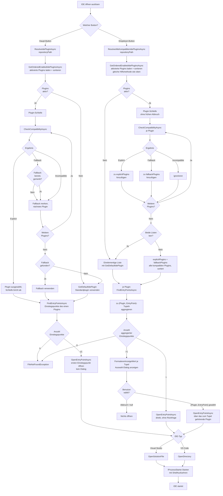

← [Zurück zur Übersicht](index.md)

# Entwicklungsumgebungen — Technischer Ablauf

## Übersicht

Der technische Ablauf beschreibt die Ausführungsschritte, wenn der Benutzer eine IDE öffnen möchte. Der Haupt-Button löst dabei genau ein Plugin über `PluginSelectionService.ResolveIdePluginAsync()` auf (priorisierte Einzelplugin-Auswahl); der Dropdown-Button löst stattdessen über `PluginSelectionService.ResolveAlleKompatiblenIdePluginsAsync()` **alle** aktivierten, kompatiblen Plugins auf und aggregiert deren Einstiegspunkte. Die anschließende IDE-Aktivierung erfolgt in der jeweils gewählten Plugin-Implementierung.

## Ablauf

### 1. IDE-Öffnen auslösen

Der Split-Button „IDE öffnen" in der Aufgabendetailansicht (TaskDetailView) besteht aus zwei Teilen, die unterschiedliche Plugin-Auflösungen verwenden:
1. **Haupt-Button:** Ruft `TaskDetailViewModel.OeffneIdeCommand.OeffneIdeAsync()` auf — löst über `PluginSelectionService.ResolveIdePluginAsync()` genau **ein** priorisiertes IDE-Plugin auf und öffnet direkt dessen ersten Einstiegspunkt (unverändert gegenüber dem Single-Plugin-Verhalten vor der Multi-Plugin-Aggregation)
2. **Dropdown-Button:** Ruft `TaskDetailViewModel.OeffneIdeAuswahlCommand.OeffneIdeAuswahlAsync()` auf — löst über `PluginSelectionService.ResolveAlleKompatiblenIdePluginsAsync()` **alle** aktivierten, zum Repository `Explicit`- oder `Fallback`-kompatiblen IDE-Plugins auf, ermittelt je Plugin dessen Einstiegspunkte und aggregiert sie zu einer gemeinsamen Liste; zeigt einen Auswahl-Dialog, sobald diese aggregierte Liste mehr als einen Eintrag enthält

Beide verwenden `IIdePlugin.FindEntryPointsAsync()`/`OpenEntryPointAsync()` zum Ermitteln bzw. Öffnen der Einstiegspunkte (siehe [Dateisystem-Integration](../dateisystem-integration/ablauf-technisch.md) für die vollständige Ablaufbeschreibung). Der Dialog wird nur beim Dropdown-Button angezeigt und zeigt dann plugin-qualifizierte Anzeigewerte (Format „{PluginName}: {Einstiegspunkt-Bezeichnung}"), da die Liste Einträge aus mehreren Plugins gleichzeitig enthalten kann.

Beteiligte Komponenten:
- `TaskDetailViewModel.OeffneIdeAsync()` — Wird vom Haupt-Button aufgerufen; öffnet direkt ohne Dialog, basierend auf genau einem aufgelösten Plugin
- `TaskDetailViewModel.OeffneIdeAuswahlAsync()` — Wird vom Dropdown-Button aufgerufen; zeigt Dialog bei mehreren aggregierten Einstiegspunkten aus allen kompatiblen Plugins
- `TaskDetailViewModel.ErmittleIdeEntryPointsAsync()` — Single-Plugin-Ermittlung für den Haupt-Button (nutzt `ResolveIdePluginAsync()`)
- `TaskDetailViewModel.ErmittleAggregierteIdeEinstiegspunkteAsync()` — Multi-Plugin-Ermittlung für den Dropdown-Button (nutzt `ResolveAlleKompatiblenIdePluginsAsync()`), auch für die Berechnung von `KannIdeAuswaehlen` genutzt
- `TaskDetailViewModel.FormatiereAnzeigeWert()` — Formatiert einen Einstiegspunkt plugin-qualifiziert für die Dialog-Anzeige
- `TaskDetailViewModel.waehleEntryPointAsync()` — Callback-Methode für den Dialog-Service
- `PluginSelectionService.ResolveIdePluginAsync()` — Löst das eine zuständige, priorisierte IDE-Plugin auf (Haupt-Button)
- `PluginSelectionService.ResolveAlleKompatiblenIdePluginsAsync()` — Löst alle aktivierten, kompatiblen IDE-Plugins auf, sortiert Explicit- vor Fallback-Plugins (jeweils in konfigurierter Reihenfolge) (Dropdown-Button)
- `RibbonSplitButton` — Neue WPF-Komponente für den Split-Button mit Haupt- und Dropdown-Button

### 2. Aktivierte IDE-Plugins laden

Sowohl `ResolveIdePluginAsync()` (Haupt-Button) als auch `ResolveAlleKompatiblenIdePluginsAsync()` (Dropdown-Button) delegieren diesen Schritt an die gemeinsame private Hilfsmethode `PluginSelectionService.GetOrderedEnabledIdePluginsAsync()`, die `PluginActivationService.GetEnabledIdePluginsAsync()` aufruft, um nur Plugins zu erhalten, die der Benutzer aktiviert hat.

Beteiligte Komponenten:
- `PluginSelectionService.GetOrderedEnabledIdePluginsAsync()` — von beiden Auflösungsmethoden gemeinsam genutzte private Hilfsmethode
- `PluginActivationService.GetEnabledIdePluginsAsync()` — Filtert IDE-Plugins nach Aktivierungsstatus
- `AppEinstellungService` — Liest Einstellungen `plugins.enabled.<PluginPrefix>` (Standard: `true`)

### 3. Prioritätsreihenfolge anwenden

Ebenfalls Teil von `GetOrderedEnabledIdePluginsAsync()` und damit für beide Auflösungsmethoden identisch: Falls eine benutzerdefinierte Reihenfolge konfiguriert ist, werden die Plugins entsprechend sortiert.

Beteiligte Komponenten:
- `IdePluginOrderResolver.Apply()` — Sortiert Plugins nach Setting `plugins.ide.order` (komma-getrennte Prefixe)
- `AppEinstellungService.GetSettingAsync("plugins.ide.order")` — Liest die Reihenfolge-Konfiguration

### 4. Kompatibilität prüfen

Ab hier unterscheiden sich die beiden Auflösungsmethoden in der Verarbeitung der Kompatibilitätsergebnisse, obwohl beide für jedes Plugin in der sortierten Reihenfolge `CheckCompatibilityAsync(repositoryPath)` aufrufen:

**Schritt 4.1:** Plugin führt Kompatibilitätsprüfung aus (identisch für beide Methoden)
- `VisualStudioIdePlugin.CheckCompatibilityAsync()`: Sucht nach `.sln`/`.slnx`-Dateien im Repository-Root via `VisualStudioIdePlugin.FindSolutionFiles()`
- `VisualStudioCodeIdePlugin.CheckCompatibilityAsync()`: Gibt immer `Fallback` zurück

**Schritt 4.2a — `ResolveIdePluginAsync()` (Haupt-Button, bricht früh ab):**
- Falls `Explicit`: Dieses Plugin wird sofort zurückgegeben, Schleife endet (Schritt 5)
- Falls `Fallback`: Plugin wird als Fallback-Kandidat gemerkt, Schleife läuft weiter
- Falls `Incompatible`: Schleife läuft weiter zum nächsten Plugin
- Nach der Schleife: gemerkter Fallback-Kandidat wird verwendet, sonst `GetDefaultIdePlugin()`

**Schritt 4.2b — `ResolveAlleKompatiblenIdePluginsAsync()` (Dropdown-Button, sammelt alle Treffer):**
- Falls `Explicit`: Plugin wird der `explicitPlugins`-Liste hinzugefügt, Schleife läuft **weiter** (kein früher Abbruch)
- Falls `Fallback`: Plugin wird der `fallbackPlugins`-Liste hinzugefügt, Schleife läuft weiter
- Falls `Incompatible`: Schleife läuft weiter zum nächsten Plugin
- Nach der Schleife: Rückgabe ist `explicitPlugins` gefolgt von `fallbackPlugins` (jeweils in der sortierten Reihenfolge aus Schritt 3); sind beide Listen leer, wird eine einelementige Liste mit `GetDefaultIdePlugin()` zurückgegeben (Konsistenz mit `ResolveIdePluginAsync()`)

Beteiligte Komponenten:
- `IIdePlugin.CheckCompatibilityAsync()` — Plugin-Schnittstelle für Kompatibilitätsprüfung
- `VisualStudioIdePlugin.FindSolutionFiles()` — Hilfsmethode zur `.sln`/`.slnx`-Suche via `Directory.EnumerateFiles()`
- `PluginSelectionService.ResolveIdePluginAsync()` — gibt genau ein `IIdePlugin` zurück
- `PluginSelectionService.ResolveAlleKompatiblenIdePluginsAsync()` — gibt `IReadOnlyList<IIdePlugin>` zurück (alle kompatiblen Plugins)

### 5. Einstiegspunkte ermitteln und öffnen

**Haupt-Button (`TaskDetailViewModel.ErmittleIdeEntryPointsAsync()`, unverändert gegenüber dem Single-Plugin-Verhalten):**
Das eine über `ResolveIdePluginAsync()` aufgelöste Plugin wird mit `plugin.FindEntryPointsAsync(repositoryPath)` nach verfügbaren Einstiegspunkten gefragt:
- **0 Einstiegspunkte:** `FileNotFoundException` wird geworfen — es gibt nichts zu öffnen.
- **1 oder mehr Einstiegspunkte:** Der erste Einstiegspunkt wird direkt via `plugin.OpenEntryPointAsync()` geöffnet, ohne Dialog (Fallback-Verhalten bei mehreren).

**Dropdown-Button (`TaskDetailViewModel.ErmittleAggregierteIdeEinstiegspunkteAsync()`, neu — Multi-Plugin-Aggregation):**
Alle über `ResolveAlleKompatiblenIdePluginsAsync()` aufgelösten Plugins werden **nacheinander** nach ihren Einstiegspunkten gefragt (`plugin.FindEntryPointsAsync()` je Plugin); Fehler bei einem einzelnen Plugin werden geloggt und übersprungen, statt die gesamte Ermittlung abzubrechen. Die Ergebnisse werden zu einer gemeinsamen Liste von `(Plugin, EntryPoint)`-Tupeln aggregiert (Plugin-Reihenfolge und Einstiegspunkt-Reihenfolge je Plugin bleiben erhalten):
- **0 aggregierte Einstiegspunkte:** `FileNotFoundException` wird geworfen.
- **Genau 1 aggregierter Einstiegspunkt:** wird direkt geöffnet, ohne Dialog.
- **Mehr als 1 aggregierter Einstiegspunkt:** Der Callback (`waehleEntryPointAsync`) wird mit allen `(Plugin, EntryPoint)`-Tupeln aufgerufen; jeder Eintrag wird über `FormatiereAnzeigeWert()` plugin-qualifiziert formatiert (Format „{PluginName}: {Bezeichnung}", oder nur „{PluginName}", falls Bezeichnung == PluginName); zeigt den Dialog an und liefert das gewählte `(Plugin, EntryPoint)`-Tupel oder `null` (Abbruch). Geöffnet wird anschließend über das zum gewählten Tupel gehörende Plugin — nicht zwingend dasselbe, das für den Haupt-Button aufgelöst würde.

**Falls Visual Studio Plugin beteiligt:**
- `VisualStudioIdePlugin.FindEntryPointsAsync()` ermittelt alle `.sln`/`.slnx`-Dateien (via `FindSolutionFiles()`) und liefert je Datei einen `IdeEntryPoint`
- `VisualStudioIdePlugin.OpenEntryPointAsync()` ruft `VisualStudioIdePlugin.OpenSolutionFile()` mit dem Pfad des gewählten Einstiegspunkts auf
- `IProzessStarter.Starten()` wird mit `ShellAusfuehren: true` aufgerufen (Windows Shell übernimmt das Öffnen)

**Falls Visual Studio Code Plugin beteiligt:**
- `VisualStudioCodeIdePlugin.FindEntryPointsAsync()` liefert immer genau einen `IdeEntryPoint` (das Repository-Root, `DisplayName: "Visual Studio Code"`)
- `VisualStudioCodeIdePlugin.OpenEntryPointAsync()` ruft `VisualStudioCodeIdePlugin.OpenDirectory()` mit dem Pfad des Einstiegspunkts auf
- `IVisualStudioCodeLocator.Locate()` prüft, ob `code`-CLI verfügbar ist (via PATH oder Registry)
- `IProzessStarter.Starten()` wird mit Befehl `code` und gequottem Repo-Pfad aufgerufen

Beteiligte Komponenten:
- `IIdePlugin.FindEntryPointsAsync()`, `IIdePlugin.OpenEntryPointAsync()` — Plugin-Schnittstelle für die generische Mehreinstiegspunkt-Ermittlung und das Öffnen eines konkreten Einstiegspunkts
- `IdeEntryPoint` — Value Object (`Path`, optional `DisplayName`), das einen Einstiegspunkt beschreibt
- `TaskDetailViewModel.ErmittleAggregierteIdeEinstiegspunkteAsync()` — aggregiert `(Plugin, EntryPoint)`-Tupel über alle kompatiblen Plugins
- `TaskDetailViewModel.FormatiereAnzeigeWert()` — plugin-qualifizierte Anzeige-Formatierung
- `VisualStudioIdePlugin.OpenSolutionFile()`, `VisualStudioCodeIdePlugin.OpenDirectory()` — Hilfsmethoden
- `IProzessStarter` — Startet externe Prozesse (Visual Studio/VS Code)
- `IVisualStudioCodeLocator` — Ermittelt VS Code Installationspfad

> **Hinweis:** Die frühere, in `IdeOeffnenService` per Typ-Prüfung (`plugin is VisualStudioIdePlugin`) umgesetzte Sonderbehandlung für mehrere Visual-Studio-Solutions entfällt vollständig. Die Verzweigung nach Anzahl der Einstiegspunkte ist für alle `IIdePlugin`-Implementierungen einheitlich — beim Dropdown-Button zusätzlich über die Grenzen einzelner Plugins hinweg aggregiert.

## Ablauf-Diagramm

## Fehlerbehandlung

### Validierungen bei Kompatibilitätsprüfung

- `ArgumentException.ThrowIfNullOrWhiteSpace(repositoryPath)` wird in `CheckCompatibilityAsync()` geprüft (beide Plugin-Implementierungen)
- Falls Repository-Pfad nicht existiert oder ungültig: Visual Studio meldet `Incompatible`, VS Code fährt fort (meldet `Fallback`)

### Fehler beim IDE-Öffnen

**Generisch (`TaskDetailViewModel.OeffneIdeInternAsync`):**
- Haupt-Button: Falls `plugin.FindEntryPointsAsync()` (des einen aufgelösten Plugins) eine leere Liste liefert: `FileNotFoundException` wird geworfen (keine Kandidaten zum Öffnen vorhanden)
- Dropdown-Button: Falls die aggregierte Liste aus `ErmittleAggregierteIdeEinstiegspunkteAsync()` über alle kompatiblen Plugins hinweg leer ist (kein Plugin liefert Einstiegspunkte): `FileNotFoundException` wird geworfen

**Visual Studio:**
- Falls keine `.sln`-Datei gefunden: `FindEntryPointsAsync()` liefert eine leere Liste (löst die generische `FileNotFoundException` in `TaskDetailViewModel.OeffneIdeInternAsync()` aus; sollte nicht passieren, da `Explicit` nur bei Fund gemeldet wird)
- Falls `.sln`-Öffnen fehlschlägt: `IProzessStarter` ist verantwortlich (normalerweise Shell-Fehler)

**Visual Studio Code:**
- Falls `code`-CLI nicht verfunden: `InvalidOperationException` mit Nachricht "Visual Studio Code wurde nicht gefunden." (geworfen aus `OpenEntryPointAsync()`)
- Falls Verzeichnis-Öffnen fehlschlägt: `IProzessStarter` ist verantwortlich
