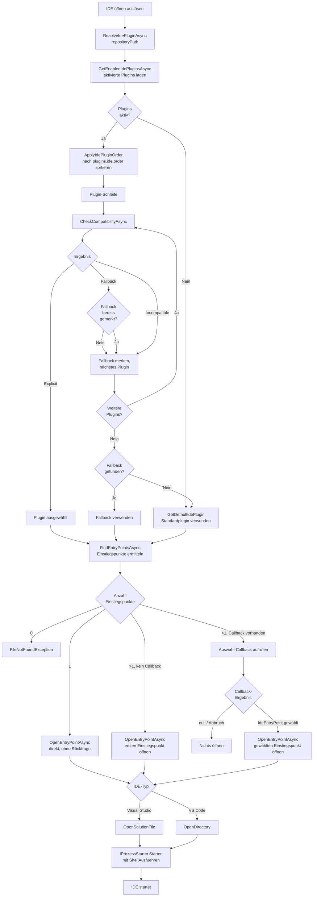

← [Zurück zur Übersicht](index.md)

# Entwicklungsumgebungen — Technischer Ablauf

## Übersicht

Der technische Ablauf beschreibt die Ausführungsschritte, wenn der Benutzer eine IDE öffnen möchte. Die Auswahl des IDE-Plugins erfolgt in `PluginSelectionService.ResolveIdePluginAsync()`, die anschließende IDE-Aktivierung in der gewählten Plugin-Implementierung.

## Ablauf

### 1. IDE-Öffnen auslösen

Der Split-Button „IDE öffnen" in der Aufgabendetailansicht (TaskDetailView) besteht aus zwei Teilen:
1. **Haupt-Button:** Ruft `TaskDetailViewModel.OeffneIdeCommand.OeffneIdeAsync()` auf — öffnet direkt den ersten (priorisierten) Einstiegspunkt
2. **Dropdown-Button:** Ruft `TaskDetailViewModel.OeffneIdeAuswahlCommand.OeffneIdeAuswahlAsync()` auf — zeigt einen Auswahl-Dialog bei mehreren Einstiegspunkten

Beide verwenden direkt `PluginSelectionService.ResolveIdePluginAsync()` zur Plugin-Auflösung und `IIdePlugin.FindEntryPointsAsync()`/`OpenEntryPointAsync()` zum Öffnen der IDE (siehe [Dateisystem-Integration](../dateisystem-integration/ablauf-technisch.md) für die vollständige Ablaufbeschreibung). Der Dialog wird nur beim Dropdown-Button angezeigt.

Beteiligte Komponenten:
- `TaskDetailViewModel.OeffneIdeAsync()` — Wird vom Haupt-Button aufgerufen; öffnet direkt ohne Dialog
- `TaskDetailViewModel.OeffneIdeAuswahlAsync()` — Wird vom Dropdown-Button aufgerufen; zeigt Dialog bei mehreren Einstiegspunkten
- `TaskDetailViewModel.waehleEntryPointAsync()` — Callback-Methode für den Dialog-Service
- `PluginSelectionService.ResolveIdePluginAsync()` — Löst das zuständige IDE-Plugin auf
- `RibbonSplitButton` — Neue WPF-Komponente für den Split-Button mit Haupt- und Dropdown-Button

### 2. Aktivierte IDE-Plugins laden

`PluginSelectionService.ResolveIdePluginAsync()` ruft `PluginActivationService.GetEnabledIdePluginsAsync()` auf, um nur Plugins zu erhalten, die der Benutzer aktiviert hat.

Beteiligte Komponenten:
- `PluginActivationService.GetEnabledIdePluginsAsync()` — Filtert IDE-Plugins nach Aktivierungsstatus
- `AppEinstellungService` — Liest Einstellungen `plugins.enabled.<PluginPrefix>` (Standard: `true`)

### 3. Prioritätsreihenfolge anwenden

Falls eine benutzerdefinierte Reihenfolge konfiguriert ist, werden die Plugins entsprechend sortiert.

Beteiligte Komponenten:
- `IdePluginOrderResolver.Apply()` — Sortiert Plugins nach Setting `plugins.ide.order` (komma-getrennte Prefixe)
- `AppEinstellungService.GetSettingAsync("plugins.ide.order")` — Liest die Reihenfolge-Konfiguration

### 4. Kompatibilität prüfen (sequenziell)

Für jedes Plugin in der sortierten Reihenfolge wird `CheckCompatibilityAsync(repositoryPath)` aufgerufen:

**Schritt 4.1:** Plugin führt Kompatibilitätsprüfung aus
- `VisualStudioIdePlugin.CheckCompatibilityAsync()`: Sucht nach `.sln`/`.slnx`-Dateien im Repository-Root via `VisualStudioIdePlugin.FindSolutionFiles()`
- `VisualStudioCodeIdePlugin.CheckCompatibilityAsync()`: Gibt immer `Fallback` zurück

**Schritt 4.2:** Kompatibilitätsergebnis verarbeiten
- Falls `Explicit`: Dieses Plugin wird sofort ausgewählt (Schritt 5)
- Falls `Fallback`: Plugin wird als Fallback-Kandidat gemerkt, Schleife läuft weiter
- Falls `Incompatible`: Schleife läuft weiter zur nächsten Plugin

Beteiligte Komponenten:
- `IIdePlugin.CheckCompatibilityAsync()` — Plugin-Schnittstelle für Kompatibilitätsprüfung
- `VisualStudioIdePlugin.FindSolutionFiles()` — Hilfsmethode zur `.sln`/`.slnx`-Suche via `Directory.EnumerateFiles()`

### 5. Einstiegspunkte ermitteln und öffnen

Das ausgewählte Plugin wird mit `plugin.FindEntryPointsAsync(repositoryPath)` nach verfügbaren Einstiegspunkten gefragt. Anschließend erfolgt die Verzweigung nach deren Anzahl:

- **0 Einstiegspunkte:** `FileNotFoundException` wird geworfen — es gibt nichts zu öffnen.
- **Genau 1 Einstiegspunkt:** `plugin.OpenEntryPointAsync(entryPoints[0])` wird direkt aufgerufen, ohne Dialog.
- **Mehr als 1 Einstiegspunkt (Haupt-Button):** Der erste Einstiegspunkt wird direkt via `plugin.OpenEntryPointAsync()` geöffnet (Fallback).
- **Mehr als 1 Einstiegspunkt (Dropdown-Button):** Der Callback (`waehleEntryPointAsync`) wird mit allen gefundenen `IdeEntryPoint`-Objekten aufgerufen; zeigt den Dialog an und liefert den gewählten Einstiegspunkt oder `null` (Abbruch).

**Falls Visual Studio Plugin:**
- `VisualStudioIdePlugin.FindEntryPointsAsync()` ermittelt alle `.sln`/`.slnx`-Dateien (via `FindSolutionFiles()`) und liefert je Datei einen `IdeEntryPoint`
- `VisualStudioIdePlugin.OpenEntryPointAsync()` ruft `VisualStudioIdePlugin.OpenSolutionFile()` mit dem Pfad des gewählten Einstiegspunkts auf
- `IProzessStarter.Starten()` wird mit `ShellAusfuehren: true` aufgerufen (Windows Shell übernimmt das Öffnen)

**Falls Visual Studio Code Plugin:**
- `VisualStudioCodeIdePlugin.FindEntryPointsAsync()` liefert immer genau einen `IdeEntryPoint` (das Repository-Root, `DisplayName: "Visual Studio Code"`)
- `VisualStudioCodeIdePlugin.OpenEntryPointAsync()` ruft `VisualStudioCodeIdePlugin.OpenDirectory()` mit dem Pfad des Einstiegspunkts auf
- `IVisualStudioCodeLocator.Locate()` prüft, ob `code`-CLI verfügbar ist (via PATH oder Registry)
- `IProzessStarter.Starten()` wird mit Befehl `code` und gequottem Repo-Pfad aufgerufen

Beteiligte Komponenten:
- `IIdePlugin.FindEntryPointsAsync()`, `IIdePlugin.OpenEntryPointAsync()` — Plugin-Schnittstelle für die generische Mehreinstiegspunkt-Ermittlung und das Öffnen eines konkreten Einstiegspunkts
- `IdeEntryPoint` — Value Object (`Path`, optional `DisplayName`), das einen Einstiegspunkt beschreibt
- `VisualStudioIdePlugin.OpenSolutionFile()`, `VisualStudioCodeIdePlugin.OpenDirectory()` — Hilfsmethoden
- `IProzessStarter` — Startet externe Prozesse (Visual Studio/VS Code)
- `IVisualStudioCodeLocator` — Ermittelt VS Code Installationspfad

> **Hinweis:** Die frühere, in `IdeOeffnenService` per Typ-Prüfung (`plugin is VisualStudioIdePlugin`) umgesetzte Sonderbehandlung für mehrere Visual-Studio-Solutions entfällt vollständig. Die Verzweigung nach Anzahl der Einstiegspunkte ist jetzt für alle `IIdePlugin`-Implementierungen einheitlich.

## Ablauf-Diagramm

## Fehlerbehandlung

### Validierungen bei Kompatibilitätsprüfung

- `ArgumentException.ThrowIfNullOrWhiteSpace(repositoryPath)` wird in `CheckCompatibilityAsync()` geprüft (beide Plugin-Implementierungen)
- Falls Repository-Pfad nicht existiert oder ungültig: Visual Studio meldet `Incompatible`, VS Code fährt fort (meldet `Fallback`)

### Fehler beim IDE-Öffnen

**Generisch (`TaskDetailViewModel.OeffneIdeInternAsync`):**
- Falls `plugin.FindEntryPointsAsync()` eine leere Liste liefert: `FileNotFoundException` wird geworfen (keine Kandidaten zum Öffnen vorhanden)

**Visual Studio:**
- Falls keine `.sln`-Datei gefunden: `FindEntryPointsAsync()` liefert eine leere Liste (löst die generische `FileNotFoundException` in `TaskDetailViewModel.OeffneIdeInternAsync()` aus; sollte nicht passieren, da `Explicit` nur bei Fund gemeldet wird)
- Falls `.sln`-Öffnen fehlschlägt: `IProzessStarter` ist verantwortlich (normalerweise Shell-Fehler)

**Visual Studio Code:**
- Falls `code`-CLI nicht verfunden: `InvalidOperationException` mit Nachricht "Visual Studio Code wurde nicht gefunden." (geworfen aus `OpenEntryPointAsync()`)
- Falls Verzeichnis-Öffnen fehlschlägt: `IProzessStarter` ist verantwortlich
