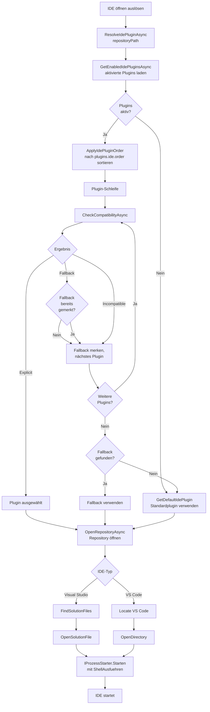

← [Zurück zur Übersicht](index.md)

# Entwicklungsumgebungen — Technischer Ablauf

## Übersicht

Der technische Ablauf beschreibt die Ausführungsschritte, wenn der Benutzer eine IDE öffnen möchte. Die Auswahl des IDE-Plugins erfolgt in `PluginSelectionService.ResolveIdePluginAsync()`, die anschließende IDE-Aktivierung in der gewählten Plugin-Implementierung.

## Ablauf

### 1. IDE-Öffnen auslösen

Ein Aufrufer (z. B. Ribbon-Button, Kontextmenü) ruft `IdeOeffnenService.OpenRepositoryInIdeAsync(repositoryPath)` mit einem Repository-Pfad auf.

Beteiligte Komponenten:
- `IdeOeffnenService.OpenRepositoryInIdeAsync()` — Koordiniert die IDE-Plugin-Auflösung und Ausführung

### 2. Aktivierte IDE-Plugins laden

`PluginSelectionService.ResolveIdePluginAsync()` ruft `PluginActivationService.GetEnabledIdePluginsAsync()` auf, um nur Plugins zu erhalten, die der Benutzer aktiviert hat.

Beteiligte Komponenten:
- `PluginActivationService.GetEnabledIdePluginsAsync()` — Filtert IDE-Plugins nach Aktivierungsstatus
- `AppEinstellungService` — Liest Einstellungen `plugins.enabled.<PluginPrefix>` (Standard: `true`)

### 3. Prioritätsreihenfolge anwenden

Falls eine benutzerdefinierte Reihenfolge konfiguriert ist, werden die Plugins entsprechend sortiert.

Beteiligte Komponenten:
- `IdePluginOrderResolver.Apply()` — Sortiert Plugins nach Setting `plugins.ide.order` (komma-getrennte Prefixe)
- `AppEinstellungService.GetSettingAsync("plugins.ide.order")` — Liest die Reihenfolge-Konfiguration

### 4. Kompatibilität prüfen (sequenziell)

Für jedes Plugin in der sortierten Reihenfolge:

**Schritt 4.1:** Plugin führt `CheckCompatibilityAsync(repositoryPath)` aus
- `VisualStudioIdePlugin.CheckCompatibilityAsync()`: Sucht nach `.sln`/`.slnx`-Dateien im Repository-Root via `VisualStudioIdePlugin.FindSolutionFiles()`
- `VisualStudioCodeIdePlugin.CheckCompatibilityAsync()`: Gibt immer `Fallback` zurück

**Schritt 4.2:** Kompatibilitätsergebnis verarbeiten
- Falls `Explicit`: Dieses Plugin wird sofort ausgewählt und zur IDE-Öffnung verwendet (Schritt 5)
- Falls `Fallback`: Plugin wird als Fallback-Kandidat gemerkt, Schleife läuft weiter
- Falls `Incompatible`: Schleife läuft weiter zur nächsten Plugin

Beteiligte Komponenten:
- `IIdePlugin.CheckCompatibilityAsync()` — Plugin-Schnittstelle für Kompatibilitätsprüfung
- `VisualStudioIdePlugin.FindSolutionFiles()` — Hilfsmethode zur `.sln`/`.slnx`-Suche via `Directory.EnumerateFiles()`

### 5. IDE öffnen

Das ausgewählte Plugin wird mit `plugin.OpenRepositoryAsync(repositoryPath)` aufgerufen.

**Falls Visual Studio Plugin:**
- `VisualStudioIdePlugin.OpenRepositoryAsync()` sucht erste `.sln`/`.slnx`-Datei (via `FindSolutionFiles()`)
- Ruft `VisualStudioIdePlugin.OpenSolutionFile()` mit dem gefundenen Pfad auf
- `IProzessStarter.Starten()` wird mit `ShellAusfuehren: true` aufgerufen (Windows Shell übernimmt das Öffnen)

**Falls Visual Studio Code Plugin:**
- `VisualStudioCodeIdePlugin.OpenRepositoryAsync()` ruft `VisualStudioCodeIdePlugin.OpenDirectory()` auf
- `IVisualStudioCodeLocator.Locate()` prüft, ob `code`-CLI verfügbar ist (via PATH oder Registry)
- `IProzessStarter.Starten()` wird mit Befehl `code` und gequottem Repo-Pfad aufgerufen

Beteiligte Komponenten:
- `IIdePlugin.OpenRepositoryAsync()` — Plugin-Schnittstelle für IDE-Öffnen
- `VisualStudioIdePlugin.OpenSolutionFile()`, `VisualStudioCodeIdePlugin.OpenDirectory()` — Hilfsmethoden
- `IProzessStarter` — Startet externe Prozesse (Visual Studio/VS Code)
- `IVisualStudioCodeLocator` — Ermittelt VS Code Installationspfad

## Ablauf-Diagramm

## Fehlerbehandlung

### Validierungen bei Kompatibilitätsprüfung

- `ArgumentException.ThrowIfNullOrWhiteSpace(repositoryPath)` wird in `CheckCompatibilityAsync()` geprüft (beide Plugin-Implementierungen)
- Falls Repository-Pfad nicht existiert oder ungültig: Visual Studio meldet `Incompatible`, VS Code fährt fort (meldet `Fallback`)

### Fehler beim IDE-Öffnen

**Visual Studio:**
- Falls keine `.sln`-Datei gefunden: `FileNotFoundException` wird geworfen (sollte nicht passieren, da `Explicit` nur bei Fund gemeldet wird)
- Falls `.sln`-Öffnen fehlschlägt: `IProzessStarter` ist verantwortlich (normalerweise Shell-Fehler)

**Visual Studio Code:**
- Falls `code`-CLI nicht verfunden: `InvalidOperationException` mit Nachricht "Visual Studio Code wurde nicht gefunden."
- Falls Verzeichnis-Öffnen fehlschlägt: `IProzessStarter` ist verantwortlich
