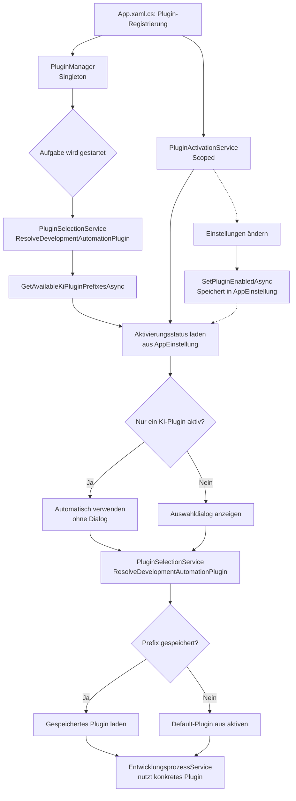

# Plugin-System — Technischer Ablauf

## Übersicht

Plugins werden beim Anwendungsstart durch den `PluginManager` registriert und per DI-Singleton gehalten. Der neue `PluginActivationService` (scoped) verwaltet den persistierten Aktivierungsstatus je Plugin und filtert Plugin-Listen. Die Auswahl des aktiven Plugins für eine konkrete Aufgabe übernimmt der `PluginSelectionService`, der nur aktive Plugins berücksichtigt.

## Ablauf

### 1. Plugin-Registrierung

Beim Anwendungsstart registriert `App.xaml.cs` alle Plugin-Instanzen im DI-Container und übergibt sie dem `PluginManager`. Parallel wird der neue `PluginActivationService` registriert.

Beteiligte Komponenten:
- `PluginManager` (Singleton) — Hält alle Plugins, liefert Defaults
- `PluginActivationService` (scoped) — Verwaltet Aktivierungsstatus
- `IPluginManager.GetDefaultSourceCodeManagementPlugin()` — Gibt das Standard-SCM-Plugin zurück
- `IPluginManager.GetDefaultDevelopmentAutomationPlugin()` — Gibt das Standard-KI-Plugin zurück

### 2. Plugin-Filterung nach Aktivierungsstatus

Der `PluginActivationService` lädt den persistierten Aktivierungsstatus je Plugin und stellt gefilterte Listen zur Verfügung.

Beteiligte Komponenten:
- `PluginActivationService.IsPluginEnabledAsync(pluginPrefix)` — Prüft, ob Plugin aktiviert ist (fehlender Eintrag = aktiviert)
- `PluginActivationService.GetEnabledSourceCodeManagementPluginsAsync()` — Liefert nur aktive SCM-Plugins
- `PluginActivationService.GetEnabledDevelopmentAutomationPluginsAsync()` — Liefert nur aktive KI-Plugins
- `AppEinstellungService.GetSettingAsync(key)` — Liest Aktivierungsstatus aus `AppEinstellung`-Tabelle via Schlüssel `plugins.enabled.<PluginPrefix>`

### 3. Plugin-Auswahl für eine Aufgabe

Beim Starten oder KI-Ausführen einer Aufgabe bestimmt `PluginSelectionService` das konkrete Plugin — nur aus aktiven Plugins.

Beteiligte Komponenten:
- `PluginSelectionService.ResolveSourceCodeManagementPluginAsync` — Prüft gespeicherten Prefix in aktiven SCM-Plugins, fällt auf Default zurück
- `PluginSelectionService.ResolveDevelopmentAutomationPluginAsync` — Wie oben für KI-Plugin; nutzt `GetAvailableKiPluginPrefixesAsync()` die nur aktive Plugins berücksichtigt
- `PluginActivationService.GetEnabledDevelopmentAutomationPluginsAsync()` — Filtert KI-Plugins vor Auswahl
- `PluginSettingsService` — Liest gespeicherte Plugin-Einstellungen aus dem Credential Store

### 4. Einstellungen lesen/schreiben

Beteiligte Komponenten:
- `PluginSettingsService.GetSettingValueAsync(prefix, key)` — Liest Wert aus Windows Credential Store
- `PluginSettingsService.SaveSettingValueAsync(prefix, key, value)` — Speichert Wert verschlüsselt
- `WindowsCredentialStore` — Windows DPAPI / Credential Store Adapter

### 5. Aktivierungsstatus in den Einstellungen ändern

Benutzer öffnet den neuen „Plugins"-Tab in den Einstellungen und ändert Aktivierungsstatus je Plugin.

Beteiligte Komponenten:
- `SettingsViewModel.LadenAsync()` — Lädt via `PluginActivationService.IsPluginEnabledAsync()` den Status je Plugin und erzeugt `PluginActivationEntry`-Instanzen
- `PluginActivationEntry` — Darstellbarer Listeneintrag mit bindbarem `IsEnabled`-Property
- `SettingsView.xaml` — Master-Detail-Oberfläche mit Aktivierungs-CheckBoxen
- `SettingsViewModel.SpeichernAsync()` — Ruft `PluginActivationService.SetPluginEnabledAsync()` auf für geänderte Einträge
- `PluginActivationService.SetPluginEnabledAsync()` — Speichert Status in `AppEinstellung`-Tabelle

### 6. Single-Plugin-Verhalten in UI

Wenn nur ein Plugin einer Kategorie aktiv ist, wird der Selector ausgeblendet.

Beteiligte Komponenten:
- `TaskDetailViewModel.LadeVerfuegbarePluginsAsync()` — Zählt aktive KI-Plugins über `PluginSelectionService.GetAvailableKiPluginPrefixesAsync()`, setzt `ZeigeKiPluginAuswahl = false` bei genau einem Plugin
- `RepositoryAssignViewModel.LadenAsync()` — Lädt aktive SCM-Plugins über `PluginActivationService.GetEnabledSourceCodeManagementPluginsAsync()`, setzt `HasMultipleScmPlugins = false` bei genau einem Plugin
- `TaskDetailView.xaml`, `RepositoryAssignDialog.xaml` — Binden Sichtbarkeit der Selectors an entsprechende Boolean-Properties

### 7. Agentenpaket-Discovery

Ein KI-Plugin liest verfügbare Agenten aus dem Agentenpaket-Verzeichnis.

Beteiligte Komponenten:
- `IKiPlugin.GetAvailableAgentsAsync(agentPackagePath)` — Gibt `IEnumerable<AgentInfo>` zurück
- `CliKiPluginBase.DiscoverAgents(path, relativeAgentDirectory)` — Liest `.md`-Dateien aus dem Agentenverzeichnis
- `ClaudeCliPlugin` liest aus `.claude/commands/`
- `GitHubCopilotPlugin` liest aus `.github/prompts/`
- `CodexPlugin` startet die lokal verfügbare `codex`-CLI und kann optional über `Softwareschmiede.Codex.ExecutablePath` auf eine konkrete Executable zeigen

## Diagramm

