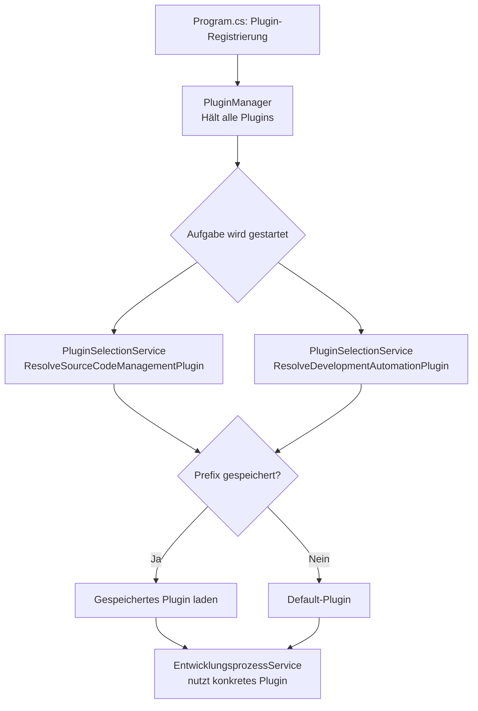

# Plugin-System — Technischer Ablauf

## Übersicht

Plugins werden beim Anwendungsstart durch den `PluginManager` registriert und per DI-Singleton gehalten. Die Auswahl des aktiven Plugins für eine konkrete Aufgabe übernimmt der `PluginSelectionService`.

## Ablauf

### 1. Plugin-Registrierung

Beim Anwendungsstart registriert `Program.cs` alle Plugin-Instanzen im DI-Container und übergibt sie dem `PluginManager`.

Beteiligte Komponenten:
- `PluginManager` — Hält alle Plugins, liefert Defaults
- `IPluginManager.GetDefaultSourceCodeManagementPlugin()` — Gibt das Standard-SCM-Plugin zurück
- `IPluginManager.GetDefaultDevelopmentAutomationPlugin()` — Gibt das Standard-KI-Plugin zurück

### 2. Plugin-Auswahl für eine Aufgabe

Beim Starten oder KI-Ausführen einer Aufgabe bestimmt `PluginSelectionService` das konkrete Plugin.

Beteiligte Komponenten:
- `PluginSelectionService.ResolveSourceCodeManagementPluginAsync` — Prüft gespeicherten Prefix, fällt auf Default zurück
- `PluginSelectionService.ResolveDevelopmentAutomationPluginAsync` — Wie oben für KI-Plugin
- `PluginSettingsService` — Liest gespeicherte Plugin-Einstellungen aus dem Credential Store

### 3. Einstellungen lesen/schreiben

Beteiligte Komponenten:
- `PluginSettingsService.GetSettingValueAsync(prefix, key)` — Liest Wert aus Windows Credential Store
- `PluginSettingsService.SaveSettingValueAsync(prefix, key, value)` — Speichert Wert verschlüsselt
- `WindowsCredentialStore` — Windows DPAPI / Credential Store Adapter

### 4. Agentenpaket-Discovery

Ein KI-Plugin liest verfügbare Agenten aus dem Agentenpaket-Verzeichnis.

Beteiligte Komponenten:
- `IKiPlugin.GetAvailableAgentsAsync(agentPackagePath)` — Gibt `IEnumerable<AgentInfo>` zurück
- `CliKiPluginBase.DiscoverAgents(path, relativeAgentDirectory)` — Liest `.md`-Dateien aus dem Agentenverzeichnis
- `ClaudeCliPlugin` liest aus `.claude/commands/`
- `GitHubCopilotPlugin` liest aus `.github/prompts/`

## Diagramm

