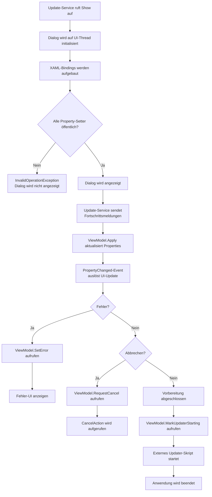

← [Zurück zur Übersicht](index.md)

# Programmupdate — Technischer Ablauf

## Übersicht

Das Programmupdate wird durch einen Update-Service initiiert, der den Fortschritt über ein `UpdateProgressViewModel` an einen WPF-Dialog meldet. Der Dialog zeigt die Fortschrittsinformationen mit Bindings an und erlaubt dem Benutzer, den Prozess abzubrechen.

## Ablauf

### 1. Update-Dialog initialisieren

Der Update-Prozess startet durch Aufruf von `WpfUpdateProgressDialogService.Show(UpdateProgressViewModel)`. Der Service führt den Dialog-Aufbau auf dem UI-Thread aus:

Beteiligte Komponenten:
- `WpfUpdateProgressDialogService.Show()` — Erstellt ein `UpdateProgressDialog`, setzt das ViewModel als `DataContext` und zeigt den Dialog modal an
- `UpdateProgressDialog.xaml` — Die Dialog-Oberfläche mit Bindings auf ViewModel-Properties
- `UpdateProgressViewModel` — Das Presentation Model mit Daten und Methoden für Fortschrittsanzeige

Die Dialog-Initialisierung ist kritisch: Das XAML-Databinding-System liest und validiert alle gebundenen Properties. Falls eine Property einen `private set` hat, schlägt die Binding-Engine mit `InvalidOperationException` fehl.

### 2. Update-Service sendet Fortschrittsmeldungen

Der externe Update-Service ruft während der Vorbereitung `UpdateProgressViewModel.Apply(UpdatePreparationProgress)` auf mit aktuellen Fortschrittsdaten (Phase, Meldung, Prozentsatz). Das ViewModel aktualisiert seine Properties:

Beteiligte Komponenten:
- `UpdateProgressViewModel.Apply(UpdatePreparationProgress)` — Empfängt Fortschrittsdaten und aktualisiert `PhaseText`, `Message`, `Percent`, `IsIndeterminate`
- `ViewModelBase.SetProperty<T>()` — Atomare Property-Änderung mit `PropertyChanged`-Notification
- XAML-Bindings (OneWay) — Aktualisieren Dialog-Elemente nach Property-Änderungen

### 3. Fehlerbehandlung

Tritt während der Vorbereitung ein Fehler auf, wird `UpdateProgressViewModel.SetError(string message)` aufgerufen:

Beteiligte Komponenten:
- `UpdateProgressViewModel.SetError()` — Setzt `HasError = true`, `CanClose = true`, `CanCancel = false`, aktualisiert `Message` mit Fehlermeldung
- Dialog-Buttons werden durch Property-Bindings aktualisiert: Abbrechen-Button wird deaktiviert, Schließen-Button wird aktiviert

### 4. Vorbereitung abgeschlossen

Nach erfolgreicher Vorbereitung wird `UpdateProgressViewModel.MarkUpdaterStarting()` aufgerufen, das `CanCancel = false` setzt und die Meldung auf "Update wird gestartet. Die Anwendung wird beendet." ändert. Anschließend startet der externe Updater und die Anwendung wird beendet.

## Diagramm

## Fehlerbehandlung

### InvalidOperationException bei Binding-Aufbau

**Ursache**: Eine ViewModel-Property hat einen `private set`, der WPF-Databinding-Engine verbietet daher, die Property zu validieren.

**Lösung**: Alle sieben Properties des `UpdateProgressViewModel` müssen öffentliche Setter haben (`set` statt `private set`), damit die Binding-Engine den Setter validieren kann, auch wenn die Bindung als OneWay konfiguriert ist.

### Benutzer bricht Update ab

Der Benutzer klickt auf den "Abbrechen"-Button, der `CancelCommand` auslöst und `RequestCancel()` aufruft. Dies setzt `CanCancel = false`, aktualisiert die Meldung und ruft die `_cancelAction` auf, falls vorhanden. Der Update-Service sollte daraufhin den Prozess ordnungsgemäß beenden.

### Update-Fehler

Tritt ein Fehler im Update-Service auf, wird `SetError(message)` aufgerufen, das den Dialog in einen Fehler-Zustand versetzt: Buttons werden neu konfiguriert, Fehlermeldung wird angezeigt.

## Bindung-Architektur

Die Dialog-Bindings verwenden folgende Strategien:

| Property | Binding-Modus | Beschreibung |
|----------|---------------|------------|
| `ProgressBar.Value` | OneWay | Zeigt `Percent` an, wird vom ViewModel aktualisiert |
| `TextBlock.Text` (Phase, Meldung) | OneWay | Zeigt `PhaseText` / `Message` an |
| `ProgressBar.IsIndeterminate` | OneWay | Zeigt `IsIndeterminate` an |
| `Border.Visibility` (Fehler-Panel) | OneWay | Zeigt Fehler-Panel bei `HasError` an |
| `Button.IsEnabled` (Abbrechen) | OneWay | Deaktiviert Button bei `!CanCancel` |
| `Button.IsEnabled` (Schließen) | OneWay | Aktiviert Button bei `CanClose` |

Alle Bindings sind OneWay (ViewModel → UI), daher wird `SetProperty()` für die zwei-Wege-Kommunikation nicht benötigt. Die WPF-Binding-Engine validiert aber dennoch die Setter aller Properties, unabhängig vom Binding-Modus.
