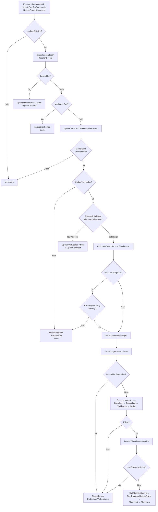

← [Zurück zur Übersicht](index.md)

# Programmupdate — Technischer Ablauf

## Übersicht

Der Update-Ablauf wird vom `MainWindowViewModel` orchestriert. Drei Einstiegspunkte — die einmalige Startautomatik, der manuelle Prüfbefehl (`UpdatePruefenCommand`) und der manuelle Installationsbefehl (`UpdateStartenCommand`) — laufen über dasselbe nicht wartende Gate (`_updateGate`) und lesen die gespeicherten Update-Einstellungen jeweils frisch aus der Datenbank. Der `UpdateService` führt Prüfung, Paketvorbereitung und Updater-Start aus; `GitHubReleaseClient`, `UpdatePackageService` und `UpdateScriptService` übernehmen die konkreten Teilschritte.

## Update-Einstellungen laden und speichern

### Lesen

`AppEinstellungService.GetUpdateSettingsAsync(ct)` liest die beiden Schlüssel `updates.mode` (`UpdateModeKey`) und `updates.includePrereleases` (`IncludePrereleasesKey`) in **einer** gemeinsamen EF-Core-Abfrage (mit `TagWith(UpdateSettingsReadTag)` für gezielte Testinterception) und liefert ein unveränderliches `UpdateSettings`-Record:

- Fehlender oder ungültiger `updates.mode`-Wert → Default `UpdateMode.NurPruefen`
- Fehlender oder ungültiger `updates.includePrereleases`-Wert → Default `false`
- Datenbank-Lesefehler werden **nicht** abgefangen und propagieren an den Aufrufer. Der Aufrufer (`MainWindowViewModel.LeseUpdateSettingsAsync`) bildet daraus `null` und zeigt den Nicht-prüfbar-Hinweis — es erfolgt keine Ersatzfreigabe durch Defaults, Snapshots oder Caches.

Im `MainWindowViewModel` werden die Werte immer in einem frischen DI-Scope gelesen (`_serviceProvider.CreateScope()`), da der `AppEinstellungService` einen scoped `DbContext` nutzt, der Update-Service selbst aber ein Singleton ist.

### Speichern und Wirksamwerden

`SettingsViewModel.SpeichernAsync` validiert das ausgewählte Label (`TryParseUpdateModus`), schreibt beide Werte gemeinsam über `SetUpdateSettingsAsync` in einem `SaveChangesAsync` und löst direkt danach das Event `UpdateSettingsSaved` mit dem gespeicherten Snapshot aus — auch wenn ein späterer Einstellungsschritt fehlschlägt.

Der `MainWindowViewModel` hat das Event beim ersten `NavigateToSettings` auf das gecachte `SettingsViewModel` abonniert. Der Handler `ApplyGespeicherteUpdateSettings`:

- speichert den neuen Snapshot in `_aktuelleUpdateEinstellungen`,
- erhöht bei geänderten Werten die Einstellungs-Generation (`_updateSettingsGeneration`),
- leert `VerfuegbaresUpdate`/`UpdateVerfuegbar`/`UpdateHinweis`,
- cancelt einen laufenden Update-Ablauf über `_updateAblaufCts`,
- meldet `CanExecuteChanged` für beide Update-Commands.

Speichern startet weder eine Prüfung noch eine Installation. Vor dem ersten erfolgreichen Lesen der Einstellungen (`_aktuelleUpdateEinstellungen is null`) sind beide Commands gesperrt.

## Einmalige Startautomatik

1. `App.StartupAsync` führt die DB-Migration und Startinitialisierung aus, erzeugt das `MainWindow`, weist es **vor** `Show()` explizit `Application.MainWindow` zu (Dialog-Owner) und zeigt es an.
2. Der `MainWindow`-Konstruktor registriert den `ContentRendered`-Handler. Beim ersten Rendern meldet sich der Handler ab (`ContentRendered -= OnContentRendered`) und ruft `MainWindowViewModel.InitializeUpdatesAfterWindowReadyAsync()` via `SafeFireAndForget` auf.
3. `InitializeUpdatesAfterWindowReadyAsync` setzt das Einmalkennzeichen `_startInitialisierungErfolgt` per `Interlocked.Exchange` **vor** dem ersten `await`; weitere Aufrufe sind wirkungslos. Anschließend wird das `_updateGate` nicht wartend erworben.
4. Je nach gelesenem Modus:
   - `UpdateMode.Aus` → kein Releaseabruf.
   - `UpdateMode.NurPruefen` → einmal `CheckForUpdateAsync`; bei `UpdateVerfuegbar` wird das Angebot angezeigt, sonst nichts.
   - `UpdateMode.BeiProgrammstartPruefenUndAusfuehren` → einmal `CheckForUpdateAsync`; bei `UpdateVerfuegbar` geht es direkt in den gemeinsamen Installationspfad `InstalliereUpdateAsync`.
5. Kein Update, ein nicht prüfbarer Zustand, Sicherheitsablehnung, Abbruch und Fehler beenden den Startversuch ohne Wiederholung. Die Startautomatik installiert ausschließlich mit dem unmittelbar zuvor ermittelten Fund und nur solange die Einstellungs-Generation unverändert ist.

## Update-Prüfung und Release-Auswahl

### `UpdateService.CheckForUpdateAsync`

Serialisiert über ein eigenes `SemaphoreSlim` (`_checkGate`):

1. `ApplicationVersionProvider.GetInstalledVersionAsync` liest `version.json` aus dem Programmverzeichnis. Fehlende/ungültige lokale Version → `NichtPruefbar` ohne Releaseabruf.
2. `IUpdateReleaseClient.GetLatestReleaseAsync(options, ct)` liefert ein `UpdateReleaseLookupResult` (`Erfolg` + `Release`). `!Erfolg` → `NichtPruefbar`; `Release == null` → `KeinUpdate`.
3. Defensiver Ausschluss: Ein als Prerelease klassifiziertes Ergebnis (`UpdateInfo.IsPrerelease`) bei `options.IncludePrereleases == false` ist eine Vertragsverletzung → `NichtPruefbar`.
4. `UpdateVersionComparer.IsNewer(installed.Version, latest.Version)` entscheidet zwischen `UpdateVerfuegbar` und `KeinUpdate`.
5. `OperationCanceledException` propagiert; andere Exceptions werden geloggt und zu `NichtPruefbar`.

### `GitHubReleaseClient.GetLatestReleaseAsync` (paginierte Suche)

- Start-URL: `GET https://api.github.com/repos/{RepositoryOwner}/{RepositoryName}/releases?per_page=100` (Werte aus `UpdateOptions`).
- Folgeseiten werden über den `Link`-Antwortheader mit `rel="next"` verfolgt, bis keine Folgeseite mehr gemeldet wird. Folge-URLs müssen HTTPS sein, auf `api.github.com` zeigen und zum selben Repository-Releases-Pfad gehören (`IsAllowedFollowUpUri`); bereits besuchte URLs werden als Fehler gewertet.
- Ein gemeinsames `CheckTimeout` (Standard 15 s) begrenzt alle Seiten zusammen.
- Pro Release-Eintrag (`TryCreateCandidate`):
  - `draft == true`, fehlender/ungültiger Tag (`UpdateVersionComparer.TryParse`) oder fehlendes `release.zip`-Asset (`UpdateOptions.AssetName`, absolute HTTPS-Download-URL) → Eintrag wird übersprungen; ein einzelner unbrauchbarer Eintrag verhindert andere Kandidaten nicht.
  - Prerelease-Klassifikation: GitHub-Flag `prerelease` **oder** SemVer-Prerelease-Suffix (`SemanticUpdateVersion.IsPrerelease`). Bei `IncludePrereleases == false` werden beide ausgeschlossen.
  - Gewinner ist die höchste zulässige `SemanticUpdateVersion` über **alle** Seiten — unabhängig von Reihenfolge oder Veröffentlichungsdatum; bei Gleichstand bleibt die erste Fundstelle.
- Ergebnis: Kein zulässiger Kandidat → `KeinTreffer`. HTTP-, JSON-, Timeout- oder Pagination-Fehler auf **irgendeiner** Seite → `Fehlgeschlagen` (keine Teiltreffer). Caller-Cancellation propagiert als `OperationCanceledException`.
- Das gelieferte `UpdateInfo` trägt die normalisierte Version (`UpdateVersionComparer.Normalize`), den Original-Tag, Asset-Name, Download-URL, `PublishedAt` und `IsPrerelease`.

### SemVer-Vergleich (`SemanticUpdateVersion`, `UpdateVersionComparer`)

`UpdateVersionComparer.TryParse` toleriert führende Leerzeichen und ein führendes `v`/`V`; der Rest muss eine vollständige SemVer-Version `X.Y.Z[-prerelease][+metadaten]` sein. `Normalize` liefert die kanonische Form ohne `v`. Die Präzedenz folgt SemVer 2.0: erst Kernversion, dann Prerelease-Identifier (numerisch < nichtnumerisch, ordinal/case-sensitiv, kürzere identische Folge < Verlängerung, stabil > eigene Prereleases). Build-Metadaten beeinflussen Rangfolge und Gleichheit nicht. Details siehe [Business Rules](business-rules.md).

## Gemeinsamer Installationspfad

Manueller Start (`UpdateStartenAsync`), Startautomatik und der Kern `InstalliereUpdateAsync` teilen denselben Ablauf:

1. **Gate:** `_updateGate.WaitAsync(0)` — weitere Eintritte während eines laufenden Vorgangs werden verworfen. Zusätzlich prüfen die Methodenrümpfe Modus/Status auch bei umgangenem `CanExecute`.
2. **Einstellungen lesen:** `LeseUpdateSettingsAsync` in frischem Scope. `null` (Lesefehler) → `UpdateEinstellungenLesefehlerAnzeigen` (Angebot entfernt, `UpdateHinweis` = „Die Update-Einstellungen konnten nicht gelesen werden. Eine Update-Prüfung ist nicht möglich."), kein Releaseabruf.
3. **Modus `Aus`** → `UpdateAngebotEntfernen`, Abbruch vor `CheckForUpdateAsync`, CLI-Sicherheit und Vorbereitung.
4. **Prüfung:** Der manuelle Installationsstart prüft **erneut** mit den aktuellen Optionen — ein älteres Angebot wird nicht als Installationsargument verwendet. Nur `UpdateCheckStatus.UpdateVerfuegbar` mit nicht-leerem `Update` geht weiter.
5. **Sicherheitsprüfung:** `ICliUpdateSafetyService.CheckAsync` liefert riskante Aufgaben (`AufgabeLaufAktivitaet.IstAktiv` über `AktiveRunId`/`LastHeartbeatUtc`). Bei `RequiresConfirmation` zeigt `IDialogService.BestaetigenDialog` die Warnung „Update starten?" — Ablehnung beendet den Vorgang. Die Startautomatik umgeht diese Entscheidung nicht.
6. **Fortschrittsdialog:** `IUpdateProgressDialogService.Show(progressViewModel)` öffnet den modalen `UpdateProgressDialog` mit dem Hauptfenster als Owner.
7. **Aktualitätsnachweis vor der Vorbereitung:** Einstellungen werden erneut gelesen; Lesefehler oder Abweichung vom Snapshot (`vorVorbereitung != snapshot`) bzw. geänderte Generation beenden den Versuch — im Dialog als Fehler sichtbar, ohne Assetabruf.
8. **Vorbereitung:** `UpdateService.PrepareUpdateAsync` → `UpdatePackageService.PreparePackageAsync` führt Download (`{AssetName}.download` → umbenannt), Entpacken nach `updates/extracted/{Version}`, Validierung (`Softwareschmiede.exe` + `version.json` im Paket-Root) und Skripterzeugung (`UpdateScriptService.CreateScriptAsync` → `updates/update.ps1`) aus. Fortschritt über `IProgress<UpdatePreparationProgress>`. Fehler räumen die angelegten Dateien/Verzeichnisse wieder auf.
9. **Letzter Aktualitätsnachweis:** erneutes Lesen unmittelbar vor dem Updater-Start; Lesefehler oder geänderte Werte verhindern `MarkUpdaterStarting`, `StartPreparedUpdateAsync` und damit Prozessstart und Shutdown — auch wenn Paket und Skript bereits vorliegen.
10. **Start:** `progressViewModel.MarkUpdaterStarting()`, dann `UpdateService.StartPreparedUpdateAsync` → `UpdateScriptService.StartScriptAsync` startet PowerShell mit `update.ps1` (Parameter `AppPid`, `TargetDirectory`, `ExtractedDirectory`, `ExecutablePath`, `LogPath`; optional elevated via `Verb = "runas"`, wenn das Programmverzeichnis nicht beschreibbar ist). Erst nach erfolgreichem Skriptstart ruft der `UpdateService` `IApplicationShutdownService.Shutdown()` — es gibt keinen zweiten Shutdown im ViewModel. Der synchrone Prozessstart ist die Übergabegrenze: Danach werden gespeicherte Änderungen nicht mehr berücksichtigt.
11. **Abschluss:** Gate, `UpdateCheckLaeuft`/`UpdateWirdVorbereitet` und `_updateAblaufCts` werden im `finally` immer freigegeben; Fehler landen im Dialog (`SetError`) bzw. `UpdateHinweis`.

## Update-Fortschrittsdialog

Der `UpdateProgressDialog` (Titel „Update vorbereiten") bindet `UpdateProgressViewModel`-Properties:

| UI-Element | Binding | Beschreibung |
|------------|---------|--------------|
| `TextBlock` (Phase) | `PhaseText` | „Download" / „Entpacken" / „Update-Vorbereitung" / „Vorbereitung" |
| `TextBlock` (Meldung) | `Message` | Fortschritts- oder Fehlermeldung |
| `ProgressBar.Value` / `IsIndeterminate` | `Percent` / `IsIndeterminate` | Prozentwert beim Download, sonst unbestimmt |
| `Button` „Abbrechen" | `CancelCommand` + `CanCancel` | Löst `RequestCancel()` → `_cancelAction` (canceln des verknüpften `CancellationTokenSource`) aus |

`UpdateProgressViewModel.Apply(UpdatePreparationProgress)` übernimmt Meldungen; nachträglich eintreffende Reports werden verworfen, sobald ein Terminalzustand (`HasError` oder `!CanCancel`) erreicht ist. `SetError(message)` zeigt den Fehler, deaktiviert Abbrechen und erlaubt das Schließen (`CanClose`). `MarkUpdaterStarting()` meldet „Update wird gestartet. Die Anwendung wird beendet." Alle Properties haben öffentliche Setter, da die WPF-Binding-Engine Setter auch bei OneWay-Bindings validiert.

## Diagramm

```mermaid
flowchart TD
    A["Einstieg: Startautomatik /<br/>UpdatePruefenCommand /<br/>UpdateStartenCommand"] --> B{"_updateGate frei?"}
    B -- Nein --> Z["Verworfen"]
    B -- Ja --> C["Einstellungen lesen<br/>(frischer Scope)"]
    C --> D{"Lesefehler?"}
    D -- Ja --> E["UpdateHinweis: nicht lesbar<br/>Angebot entfernt"]
    D -- Nein --> F{"Modus == Aus?"}
    F -- Ja --> G["Angebot entfernen<br/>Ende"]
    F -- Nein --> H["UpdateService.CheckForUpdateAsync"]
    H --> I{"Generation<br/>unverändert?"}
    I -- Nein --> Z
    I -- Ja --> J{"UpdateVerfuegbar?"}
    J -- Nein --> K["Hinweis/Angebot aktualisieren<br/>Ende"]
    J -- Ja --> L{"Automatik bei Start<br/>oder manueller Start?"}
    L -- "Nur Angebot" --> M["UpdateVerfuegbar = true<br/>⇧ Update sichtbar"]
    L -- "Installieren" --> N["CliUpdateSafetyService.CheckAsync"]
    N --> O{"Riskante Aufgaben?"}
    O -- Ja --> P{"BestaetigenDialog<br/>bestätigt?"}
    P -- Nein --> K
    O -- Nein --> Q["Fortschrittsdialog zeigen"]
    P -- Ja --> Q
    Q --> R["Einstellungen erneut lesen"]
    R --> S{"Lesefehler / geändert?"}
    S -- Ja --> T["Dialog-Fehler<br/>Ende ohne Vorbereitung"]
    S -- Nein --> U["PrepareUpdateAsync:<br/>Download → Entpacken → Validierung → Skript"]
    U --> V{"Erfolg?"}
    V -- Nein --> T
    V -- Ja --> W["Letzter Einstellungsabgleich"]
    W --> X{"Lesefehler / geändert?"}
    X -- Ja --> T
    X -- Nein --> Y["MarkUpdaterStarting →<br/>StartPreparedUpdateAsync →<br/>Skriptstart → Shutdown"]
```

## Fehlerbehandlung

| Situation | Verhalten |
|-----------|-----------|
| `version.json` fehlt/ungültig | `NichtPruefbar`, kein Releaseabruf, Hinweis „Lokale Version ist nicht prüfbar." |
| HTTP-/JSON-/Timeout-/Pagination-Fehler | `UpdateReleaseLookupResult.Fehlgeschlagen` → `NichtPruefbar`, Hinweis „GitHub-Release ist nicht prüfbar." |
| Kein zulässiger Release-Kandidat | `KeinUpdate`, Hinweis „Kein Update verfügbar. …" |
| Update-Einstellungen nicht lesbar | Angebot invalidiert, `UpdateHinweis`/Dialog-Fehler, kein Releaseabruf, kein Updater-Start |
| Einstellungen während des Vorgangs geändert | Generationssprung/Snapshot-Abweichung → Abbruch, Hinweis „Die Update-Einstellungen wurden geändert. Der Update-Vorgang wurde abgebrochen." |
| Benutzer-Abbruch | `OperationCanceledException` → „Update-Vorbereitung wurde abgebrochen." |
| Vorbereitungs-/Startfehler | `SetError` im Dialog + `UpdateHinweis` „Update konnte nicht vorbereitet werden."; kein Shutdown |
| InvalidOperationException beim Binding-Aufbau | Alle Properties des `UpdateProgressViewModel` haben öffentliche Setter — siehe Binding-Tabelle oben |

Beim Schließen des Hauptfensters wird ein laufender Vorgang über `Dispose` → `CancelLaufendenUpdateAblauf` gecancelt.
