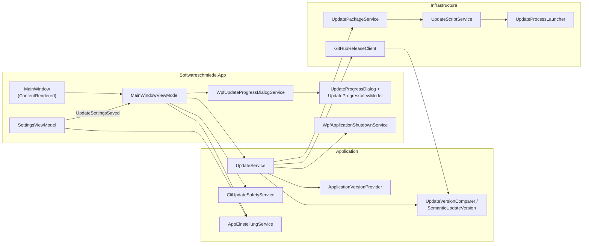

← [Zurück zur Übersicht](index.md)

# Programmupdate — Architektur

## Schichtenüberblick

Das Feature verteilt sich auf drei Ebenen: die WPF-Oberfläche (`Softwareschmiede.App`), die Anwendungslogik mit den Update-Verträgen (`Softwareschmiede/Application`) und die konkreten Infrastruktur-Implementierungen (`Softwareschmiede/Infrastructure`).

## Komponenten

### Oberfläche (`Softwareschmiede.App`)

| Komponente | Rolle |
|------------|-------|
| `MainWindow` | Registriert den einmaligen `ContentRendered`-Handler und stößt `InitializeUpdatesAfterWindowReadyAsync` an. |
| `MainWindowViewModel` | Orchestriert alle Update-Versuche: `_updateGate` (nicht wartend), `_updateSettingsGeneration` (Aktualität), `_updateAblaufCts` (Abbruch), Commands `UpdatePruefenCommand`/`UpdateStartenCommand`, Zustands-Properties (`UpdateVerfuegbar`, `VerfuegbaresUpdate`, `UpdateCheckLaeuft`, `UpdateWirdVorbereitet`, `UpdateHinweis`). |
| `MainWindowUpdateDienste` | Record-Bündel der Update-Kollaborateure für den `MainWindowViewModel`-Konstruktor (`IUpdateService`, `ICliUpdateSafetyService`, `IUpdateProgressDialogService`, `IUpdateVersuchProtokoll`). |
| `SettingsViewModel` | Bietet `UpdateModusOptionen` (Labels `Aus`/`Nur Pruefen`/`Bei Programmstart pruefen und ausfuehren`), `SelectedUpdateMode`, `IncludePrereleases` und das Event `UpdateSettingsSaved` mit gespeichertem `UpdateSettings`-Snapshot. |
| `SettingsView.xaml` | Abschnitt „Updates" im Register „Allgemein": ComboBox (`AutomationProperties.Name="Update-Modus"`) und CheckBox „Prerelease-Versionen laden". |
| `UpdateProgressViewModel` / `UpdateProgressDialog` | Fortschrittsdialog der Vorbereitung (Phasen, Prozent, Abbrechen, Fehler-/Abschlusszustände). |
| `WpfUpdateProgressDialogService` | `IUpdateProgressDialogService`-Implementierung; öffnet den Dialog modal mit Hauptfenster-Owner. |
| `WpfApplicationShutdownService` | `IApplicationShutdownService`-Implementierung; geordnetes Beenden nach Updater-Start. |

### Anwendungslogik (`Softwareschmiede/Application/Services/Updates`)

| Komponente | Rolle |
|------------|-------|
| `UpdateService` (`IUpdateService`) | Orchestriert `CheckForUpdateAsync(UpdateCheckOptions)`, `PrepareUpdateAsync` (Delegat an `IUpdatePackageService`) und `StartPreparedUpdateAsync` (Skriptstart → Shutdown). Serialisiert Prüfungen über `_checkGate`. |
| `ApplicationVersionProvider` (`IApplicationVersionProvider`) | Liest und normalisiert die installierte Version aus `version.json`; `null` = nicht prüfbar. |
| `CliUpdateSafetyService` (`ICliUpdateSafetyService`) | Bewertet aktive Aufgaben via `AufgabeLaufAktivitaet.IstAktiv`; liefert `CliUpdateSafetyResult`. |
| `UpdateVersionComparer` | Statische Fassade: `TryParse`, `Normalize`, `IsNewer` auf Basis von `SemanticUpdateVersion`. |
| `SemanticUpdateVersion` | SemVer-2.0-Value-Object: `Major`/`Minor`/`Patch`, `PrereleaseIdentifiers`, `BuildMetadata`, `IsPrerelease`, `IComparable`/`IEquatable`. |
| `UpdateModels.cs` | `UpdateMode`, `UpdateSettings`, `UpdateCheckOptions`, `UpdateInfo`, `UpdateReleaseLookupResult`, `UpdateCheckResult`/`UpdateCheckStatus`, `UpdatePreparationProgress`/`Phase`, `UpdatePreparationResult`, `CliUpdateSafetyResult`, `InstalledVersionInfo`. |
| `UpdateOptions` | Konfiguration: `RepositoryOwner`, `RepositoryName`, `AssetName` (`release.zip`), `UpdateDirectoryName` (`updates`), `CheckTimeout` (15 s), `ExecutableName` (`Softwareschmiede.exe`). |
| `AppEinstellungService` | `GetUpdateSettingsAsync`/`SetUpdateSettingsAsync` (Schlüssel `updates.mode`, `updates.includePrereleases`; Abfragetag `UpdateSettings.Read`). |

### Infrastruktur (`Softwareschmiede/Infrastructure/Services/Updates`)

| Komponente | Rolle |
|------------|-------|
| `GitHubReleaseClient` (`IUpdateReleaseClient`) | Paginierte Release-Suche über die GitHub-REST-API, Kandidatenfilter (Draft/Tag/Asset/Prerelease), SemVer-Maximum, `UpdateReleaseLookupResult`. |
| `UpdatePackageService` (`IUpdatePackageService`) | Download (`*.download` → `release.zip`), Entpacken nach `updates/extracted/{Version}`, Paketvalidierung (Executable + `version.json`), Schreibrechte-Probe (`RequiresElevation`), Pfadsicherung gegen Verzeichnisaustritt (`EnsureInsideBase`). |
| `UpdateScriptService` (`IUpdateScriptService`) | Schreibt `updates/update.ps1` (wartet auf App-Exit, kopiert Dateien, startet App neu, Logdatei) und startet es via `IUpdateProcessLauncher`. |
| `UpdateProcessLauncher` (`IUpdateProcessLauncher`) | `ProcessStartInfo`-Kapselung; `Verb = "runas"` bei `RequiresElevation`. |

## Dependency Injection

Registrierung in `App.xaml.cs`:

- **Singletons:** `IUpdateService` → `UpdateService`, `IUpdateReleaseClient` → `GitHubReleaseClient`, `IUpdatePackageService` → `UpdatePackageService`, `IUpdateScriptService` → `UpdateScriptService`, `IUpdateProcessLauncher` → `UpdateProcessLauncher`, `IUpdateProgressDialogService` → `WpfUpdateProgressDialogService`, `IApplicationShutdownService` → `WpfApplicationShutdownService`, `IOptions<UpdateOptions>`.
- **Scoped:** `ICliUpdateSafetyService` → `CliUpdateSafetyService` (nutzt den scoped `AufgabeService`/`DbContext`); `AppEinstellungService` wird pro Lesevorgang in einem frischen Scope aufgelöst.
- **Transient:** `MainWindowUpdateDienste` bündelt die optionalen Update-Dienste für das `MainWindowViewModel`.

Die Optionsverträge `UpdateSettings` und `UpdateCheckOptions` sind unveränderliche Records — der Singleton-`UpdateService` erhält nur Optionsparameter, nie eine scoped Service-Referenz.

## Persistenz

Beide Einstellungen liegen in der bestehenden Key-Value-Tabelle `AppEinstellungen` — keine Schemaänderung:

| Schlüssel | Inhalt | Default |
|-----------|--------|---------|
| `updates.mode` | `UpdateMode`-Wert als Zahl (0/1/2) | `NurPruefen` |
| `updates.includePrereleases` | `True`/`False` | `false` |

## Testarchitektur (E2E)

Für E2E-Tests existiert eine kontrollierte Update-Umgebung unter `Softwareschmiede.App/Services/Testing/`, die sich nur bei gesetzter Szenario-Konfiguration aktiviert (`UpdateE2ETestConfiguration.LadeAusUmgebung`):

- `UpdateFixtureHttpMessageHandler` — ersetzt den HTTP-Transport (Release-JSON-Seiten, ZIP-Streams, Fehler, Freigaben).
- `RecordingUpdateProcessLauncher` / `RecordingApplicationShutdownService` — protokollieren Skriptstart/Shutdown ohne echte Prozess-/Systemgrenzen.
- `FixtureCliUpdateSafetyService` — kontrollierte riskante Aufgaben für echte Bestätigungsdialoge.
- `UpdateSettingsReadFailureInterceptor` — EF-Core-`DbCommandInterceptor`, der nur die getaggte `UpdateSettings.Read`-Abfrage gezielt fehlschlagen lässt.
- `ProtokollierenderUpdateService` + `IUpdateVersuchProtokoll`/`UpdateE2EProtokoll` — strukturiertes Aufrufprotokoll der Update-Versuche.

Transport-, Prozess-, Shutdown- und Sicherheitsgrenzen sind damit gesteuert; Release-Auswahl, Paket-/Skript-Pipeline und ViewModel-Ablauf bleiben echt.
