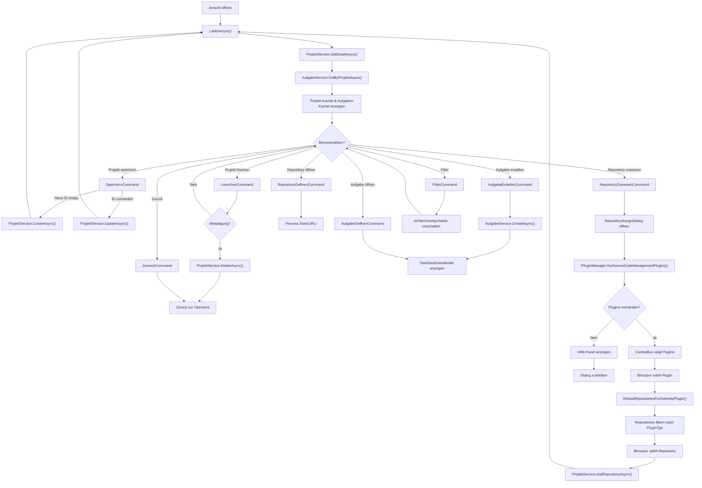

← [Zurück zur Übersicht](index.md)

# Projekte — Technischer Ablauf

## Übersicht

Die Projektdetailansicht ist das zentrale UI-Element für die Projektverwaltung. Sie wird durch `ProjectDetailViewModel` gesteuert und zeigt über WPF-MVVM-Binding ein Ribbon-Menü, zwei Kacheln (Projekt und Aufgaben) sowie ein Filter-Overlay. Der Ablauf folgt dem MVVM-Muster: Benutzerinteraktion → ViewModel-Command → Service-Aufruf → Datenbankoperation.

## Ablauf

### 1. Projektdetailansicht öffnen

**Auslöser:** Benutzer klickt auf ein Projekt im Dashboard oder öffnet ein neues Projekt über „Neu".

Beteiligte Komponenten:
- `ProjectListViewModel.BearbeitenCommand` — löst Navigation aus
- `NavigationViewModel` — wechselt zur Detailansicht
- `ProjectDetailView.xaml` — wird angezeigt
- `ProjectDetailViewModel` — wird instantiiert

**Flow:**
1. `ProjectListViewModel.BearbeitenCommand` wird ausgelöst mit Projekt-ID
2. `NavigationViewModel` empfängt Navigation und setzt `CurrentViewModel` auf `ProjectDetailViewModel`
3. `ProjectDetailView.xaml` wird geladen und mit `ProjectDetailViewModel` gebunden
4. Setter `ProjectDetailViewModel.ProjektId` wird gesetzt
5. Setter ruft `LadenAsync` auf → siehe Schritt „Projekt laden"

### 2. Projekt laden

**Auslöser:** `ProjektId` wird gesetzt (z.B. beim Öffnen der Ansicht oder bei Neuladen).

Beteiligte Komponenten:
- `ProjectDetailViewModel.LadenAsync` — Ladelogik
- `ProjektService.GetDetailAsync` — lädt Projektdaten
- `AufgabeService.GetByProjektAsync` — lädt Aufgaben
- `ProjectDetailView.xaml` — zeigt Daten an

**Flow:**
1. `IsLoading` wird auf `true` gesetzt → UI zeigt Ladesymbol
2. `ProjektService.GetDetailAsync(_projektId, ct)` wird aufgerufen
3. `Projekt` wird gesetzt (Property triggert UI-Update)
4. `ProjektName` und `ProjektBeschreibung` werden aus Projekt kopiert (für Bearbeitung)
5. `AufgabeService.GetByProjektAsync(_projektId, ct)` wird aufgerufen
6. `Aufgaben`-Collection wird geleert und mit neuen Aufgaben gefüllt (ObservableCollection triggert UI-Update)
7. `SelectedRepository` wird auf erstes Repository gesetzt (falls vorhanden)
8. `IsLoading` wird auf `false` gesetzt → UI zeigt Inhalte

**Fehlerbehandlung:**
- Bei `OperationCanceledException`: Exception wird weitergeleitet (CancellationToken wurde abgebrochen)
- Bei `Exception`: `FehlerMeldung` wird gesetzt, `IsLoading` auf `false`

### 3. Projekt speichern (Anlage oder Bearbeitung)

**Auslöser:** Benutzer klickt „Speichern"-Button in Ribbon-Menü (Gruppe „Projekt").

Beteiligte Komponenten:
- `ProjectDetailViewModel.SpeichernCommand` — Command wird ausgelöst
- `ProjectDetailViewModel.ProjektSpeichernAsync` — Speicherlogik
- `ProjektService.CreateAsync` oder `UpdateAsync` — Datenbankoperation
- `ProjectDetailView.xaml` — zeigt Bearbeitungsfelder

**Flow (Anlage, `_projektId == Guid.Empty`):**
1. `ProjektName.Trim()` wird validiert (nicht leer)
2. `ProjektService.CreateAsync(ProjektName, ProjektBeschreibung, ct)` wird aufgerufen
3. Neues Projekt wird in DB angelegt mit Status „Neu"
4. `_projektId` wird auf neue Projekt-ID gesetzt
5. `ProjektListeAktualisierenCallback?.Invoke()` wird aufgerufen → ProjectListViewModel lädt Projektliste neu

**Flow (Bearbeitung, `_projektId != Guid.Empty`):**
1. `ProjektName.Trim()` wird validiert (nicht leer)
2. `ProjektService.UpdateAsync(_projektId, ProjektName, ProjektBeschreibung, ct)` wird aufgerufen
3. Projekt wird in DB aktualisiert
4. `LadenAsync` wird aufgerufen → Projekt wird neu geladen und UI aktualisiert

**Fehlerbehandlung:**
- Bei `OperationCanceledException`: Exception wird weitergeleitet
- Bei `Exception`: `FehlerMeldung` wird gesetzt, Speicheroperation bricht ab

### 4. Projekt löschen

**Auslöser:** Benutzer klickt „Löschen"-Button in Ribbon-Menü (Gruppe „Projekt").

Beteiligte Komponenten:
- `ProjectDetailViewModel.LoeschenCommand` — Command wird ausgelöst
- `ProjectDetailViewModel.ProjektLoeschenAsync` — Löschlogik
- `ProjectDetailViewModel.LoeschenBestaetigenFunc` — Bestätigungsdialog (MessageBox)
- `ProjektService.DeleteAsync` — Datenbankoperation
- `ProjectListViewModel` — wird durch Callback benachrichtigt

**Flow:**
1. `LoeschenBestaetigenFunc()` wird aufgerufen → `MessageBox.Show(...)` wird angezeigt
   - Benutzer klickt „Yes": `true` wird zurückgegeben
   - Benutzer klickt „No": `false` wird zurückgegeben, Flow bricht ab
2. `ProjektService.DeleteAsync(_projektId, ct)` wird aufgerufen
3. Projekt wird aus DB gelöscht (Cascade: alle zugeordneten Aufgaben werden auch gelöscht)
4. `ProjektListeAktualisierenCallback?.Invoke()` wird aufgerufen → ProjectListViewModel lädt Projektliste neu
5. `ZurueckAction?.Invoke()` wird aufgerufen → Navigation zur Projektübersicht

**Fehlerbehandlung:**
- Bei `OperationCanceledException`: Exception wird weitergeleitet
- Bei `Exception`: `FehlerMeldung` wird gesetzt, Löschoperation bricht ab

### 5. Repository zuweisen

**Auslöser:** Benutzer klickt „Zuweisen"-Button in Ribbon-Menü (Gruppe „Repository").

Beteiligte Komponenten:
- `ProjectDetailViewModel.RepositoryZuweisenCommand` — Command wird ausgelöst
- `ProjectDetailViewModel.RepositoryZuweisenAsync` — Dialog-Logik
- `RepositoryAssignViewModel` — Dialog-ViewModel mit Plugin-Management
- `RepositoryAssignDialog.xaml` — Dialog-Window mit ComboBox und Hilfe-Panel
- `IPluginManager` — lädt verfügbare SCM-Plugins
- `ProjektService.AddRepositoryAsync` — Datenbankoperation
- `ProjektService.GetAllRepositoriesAsync` — lädt verfügbare Repositories

**Flow (Dialog-Öffnung und Plugin-Laden):**
1. `RepositoryAssignViewModel` wird instantiiert mit `IPluginManager` injiziert
2. `RepositoryAssignViewModel.LadenAsync` wird aufgerufen
   - `IPluginManager.GetSourceCodeManagementPlugins()` wird aufgerufen
   - Verfügbare SCM-Plugins werden in `AvailableScmPlugins`-Collection geladen
   - `HasScmPlugins = (AvailableScmPlugins.Count > 0)` wird gesetzt
3. `RepositoryAssignDialog` (Window) wird erstellt und mit ViewModel gebunden
4. Dialog wird modal angezeigt mit `ShowDialog()`
5. **Szenario A — Plugins vorhanden** (`HasScmPlugins == true`):
   - ComboBox zeigt verfügbare Plugins (Namen via `DisplayMemberPath="PluginName"`)
   - ListBox ist initially leer (wartet auf Plugin-Auswahl)
   - Hilfe-Panel ist ausgeblendet
6. **Szenario B — Keine Plugins** (`HasScmPlugins == false`):
   - ComboBox ist ausgeblendet
   - ListBox ist ausgeblendet
   - Hilfe-Panel wird angezeigt mit Text „Keine SCM-Plugins installiert…"
   - Dialog-Eingaben sind deaktiviert; Benutzer kann nur abbrechen

**Flow (Plugin-Auswahl und Repository-Filterung):**
1. Benutzer wählt Plugin aus ComboBox aus → `SelectedScmPlugin` wird gesetzt
2. PropertyChanged-Handler triggert `ReloadRepositoriesForSelectedPlugin()` (Fire-and-Forget)
3. `ReloadRepositoriesForSelectedPlugin()` wird asynchron ausgeführt:
   - `IsLoading = true` wird gesetzt
   - `ProjektService.GetAllRepositoriesAsync(ct)` wird aufgerufen (lädt alle Repositories)
   - Repositories werden gefiltert: `.Where(r => r.PluginTyp == SelectedScmPlugin.PluginType.ToString())`
   - Gefilterte Repositories werden sortiert: `.OrderBy(r => r.RepositoryName)`
   - `VerfuegbareRepositories` wird mit gefilterten Repositories gefüllt
   - `SelectedRepository` wird auf `null` zurückgesetzt
   - `IsLoading = false` wird gesetzt
4. ListBox wird mit gefilterten Repositories aktualisiert (ObservableCollection triggert UI-Update)
5. Benutzer wählt ein Repository aus (`SelectedRepository` wird gesetzt)

**Flow (Bestätigung und Speicherung):**
1. Benutzer klickt „Zuweisen"-Button oder „Abbrechen"
2. Dialog schließt sich:
   - Bei „Zuweisen": `ShowDialog()` gibt `true` zurück
   - Bei „Abbrechen": `ShowDialog()` gibt `null` oder `false` zurück
3. Bei erfolgreichem „Zuweisen":
   - `ProjektService.AddRepositoryAsync(_projektId, repo.PluginTyp, repo.RepositoryUrl, repo.RepositoryName, ct)` wird aufgerufen
   - Repository wird dem Projekt zugeordnet
   - `LadenAsync` wird aufgerufen → Projekt wird neu geladen mit neuen Repositories
4. Bei „Abbrechen": Dialog schließt sich, nichts wird geändert

**Fehlerbehandlung:**
- Bei `OperationCanceledException`: Exception wird weitergeleitet
- Bei Exception in `ReloadRepositoriesForSelectedPlugin()`: `Logger.LogError()` wird aufgerufen, `VerfuegbareRepositories` wird geleert, UI bleibt responsive
- Bei Exception in `LadenAsync()` (Plugin-Laden): `Logger.LogError()` wird aufgerufen, `AvailableScmPlugins` bleibt leer, `HasScmPlugins = false`

### 6. Repository öffnen

**Auslöser:** Benutzer klickt „Öffnen"-Button in Ribbon-Menü (Gruppe „Repository").

Beteiligte Komponenten:
- `ProjectDetailViewModel.RepositoryOeffnenCommand` — Command wird ausgelöst
- `ProjectDetailViewModel.RepositoryOeffnenAsync` — Browser-Start-Logik
- `System.Diagnostics.Process.Start` — Windows Shell-Befehl
- `SelectedRepository.RepositoryUrl` — URL aus Repository-Konfiguration

**Flow:**
1. `SelectedRepository` wird überprüft (nicht null)
2. `SelectedRepository.RepositoryUrl` wird gelesen
3. `Process.Start(new ProcessStartInfo { FileName = url, UseShellExecute = true })` wird aufgerufen
4. Windows Shell öffnet die URL im Standard-Webbrowser

**Fehlerbehandlung:**
- Bei ungültigem URL-Format: nichts wird geöffnet
- Bei `OperationCanceledException`: Exception wird weitergeleitet
- Bei `Exception`: `FehlerMeldung` wird gesetzt

### 7. Aufgabe erstellen

**Auslöser:** Benutzer klickt „Neu"-Button in Ribbon-Menü (Gruppe „Aufgaben").

Beteiligte Komponenten:
- `ProjectDetailViewModel.AufgabeErstellenCommand` — Command wird ausgelöst
- `ProjectDetailViewModel.AufgabeErstellenAsync` — Aufgaben-Erstellungslogik
- `AufgabeService.CreateAsync` — Datenbankoperation
- `TaskDetailViewModel` — wird instantiiert für die Detailansicht
- `ProjectDetailView.xaml` — zeigt neue Aufgabe in Kachel an

**Flow:**
1. `AufgabeService.CreateAsync(_projektId, "Neue Aufgabe", "", null, ct)` wird aufgerufen
2. Neue Aufgabe wird in DB angelegt mit Status „Neu" und leerem Titel
3. Neue `Aufgabe` wird in `Aufgaben`-Collection hinzugefügt (ObservableCollection triggert UI-Update)
4. `TaskDetailViewModel` wird instantiiert
5. `TaskDetailViewModel.AufgabeId` wird auf neue Aufgaben-ID gesetzt
6. `SelectedTaskViewModel` wird gesetzt (UI zeigt Aufgabendetail-Ansicht neben Kacheln)

**Fehlerbehandlung:**
- Bei `OperationCanceledException`: Exception wird weitergeleitet
- Bei `Exception`: `FehlerMeldung` wird gesetzt, Aufgabenerstellung bricht ab

### 8. Filter-Overlay öffnen/schließen

**Auslöser:** Benutzer klickt „Filter"-Button in Ribbon-Menü (Gruppe „Aufgaben").

Beteiligte Komponenten:
- `ProjectDetailViewModel.FilterCommand` — Command wird ausgelöst
- `ProjectDetailViewModel.IsFilterOverlayVisible` — Sichtbarkeitsflag
- `ProjectDetailView.xaml` — zeigt/verbirgt Overlay-Panel durch Binding

**Flow:**
1. `FilterCommand` wird ausgelöst (RelayCommand, keine async-Operation)
2. `IsFilterOverlayVisible` wird umgeschaltet (Toggle: `!IsFilterOverlayVisible`)
3. UI aktualisiert sich sofort durch Binding (Visibility Converter: `BoolToVisibilityConverter`)
4. Overlay-Panel wird angezeigt oder ausgeblendet

### 9. Aufgabenfilter setzen

**Auslöser:** Benutzer klickt Radio-Button im Filter-Overlay-Panel.

Beteiligte Komponenten:
- `ProjectDetailViewModel.AufgabenFilter` — Enum-Property
- `ProjectDetailView.xaml` — enthält Radio-Buttons mit EnumToBoolConverter
- Aufgaben-Kachel — wird durch Filter gefiltert (wenn implementiert)

**Flow:**
1. Radio-Button wird gekickt (z.B. „Alle", „Aktiv", „Archiviert")
2. `AufgabenFilter`-Property wird gesetzt auf entsprechenden Enum-Wert (`AufgabenFilterTyp.Alle`, `AufgabenFilterTyp.Aktiv`, `AufgabenFilterTyp.Archiviert`)
3. UI aktualisiert sich (wenn Filter-Logik in XAML oder ViewModel implementiert ist)

> **Hinweis:** Der aktuelle Code lädt alle Aufgaben und speichert nur den Filter-Wert. Die Filterung der UI-Liste ist manuell zu implementieren (z.B. über `CollectionViewSource` oder in-code Filtering).

### 10. Aufgabe in Detailansicht öffnen

**Auslöser:** Benutzer doppelklickt auf Aufgabe in der Aufgaben-Kachel.

Beteiligte Komponenten:
- `ProjectDetailView.xaml.cs.AufgabeDoubleClick` — Event-Handler
- `ProjectDetailViewModel.AufgabeOeffnenCommand` — Command wird ausgelöst mit Aufgaben-ID
- `TaskDetailViewModel` — wird instantiiert
- `SelectedTaskViewModel` — wird gesetzt

**Flow:**
1. `AufgabeDoubleClick` Event wird ausgelöst (Event-Setter in ListBoxItem-Style)
2. Event-Handler extrahiert `aufgabe.Id` aus DataContext
3. `AufgabeOeffnenCommand.Execute(aufgabe.Id)` wird aufgerufen
4. `TaskDetailViewModel` wird instantiiert
5. `TaskDetailViewModel.AufgabeId` wird auf aufgaben-ID gesetzt
6. `SelectedTaskViewModel` wird gesetzt (UI zeigt Aufgabendetail-Ansicht)

### 11. Projektübersicht laden (mit Repository-Suggestions)

**Auslöser:** Benutzer öffnet die Projektübersichtsseite (`ProjectListView`).

Beteiligte Komponenten:
- `ProjectListView.xaml` — UI mit Projektkacheln und Suggestions-Panel
- `ProjectListViewModel.LadenCommand` — wird via `Loaded`-Event ausgelöst
- `ProjectListViewModel.LadenAsync` — Ladelogik
- `ProjektService.GetAllAsync` — lädt alle Projekte
- `ProjektService.GetUnassignedRepositoriesAsync` — lädt unzugeordnete Repositories
- `UnassignedRepositories`-Collection — hält Suggestions für UI
- `UnassignedRepositoriesConverter` — formatiert Datumsangaben

**Flow:**
1. `ProjectListView` wird geladen; `Loaded`-Event wird ausgelöst
2. `LadenCommand` wird ausgelöst (RelayCommand)
3. `LadenAsync()` wird asynchron ausgeführt:
   - `IsLoading = true` wird gesetzt → UI zeigt Ladesymbol
   - `FehlerMeldung = null` wird gesetzt (alte Fehlermeldung löschen)
   - `projektTask = ProjektService.GetAllAsync(ct)` wird gestartet
   - `suggestionsTask = LadenRepositorienSuggestionsAsync(ct)` wird gestartet (parallel)
   - `Task.WhenAll(projektTask, suggestionsTask)` wartet auf beide Tasks
4. Nach Abschluss:
   - `Projekte`-Collection wird geleert
   - Projekte aus `projektTask.Result` werden einzeln in Collection hinzugefügt (ObservableCollection triggert UI-Update)
   - `IsLoading = false` wird gesetzt → UI zeigt Inhalte

**Flow (UnassignedRepositories laden):**
1. `LadenRepositorienSuggestionsAsync()` wird parallel ausgeführt:
   - `IsLoadingRepositories = true` wird gesetzt → Loading-Indikator wird angezeigt
   - `ProjektService.GetUnassignedRepositoriesAsync(ct)` wird aufgerufen
2. In `ProjektService.GetUnassignedRepositoriesAsync()`:
   - Hash-Set aller zugeordneten Repository-URLs wird erstellt: `assignedUrls = SELECT RepositoryUrl FROM GitRepositories`
   - Für jedes SCM-Plugin in `IPluginManager.GetSourceCodeManagementPlugins()`:
     - Try: `plugin.GetAvailableRepositoriesAsync(ct)` wird aufgerufen
     - Alle Repositories werden zu `allRepositories`-Liste hinzugefügt
     - Catch: Plugin-Fehler wird geloggt, andere Plugins werden fortgesetzt
   - Repositories werden gefiltert: `.Where(r => !assignedUrls.Contains(r.Url))`
   - Repositories werden sortiert:
     - Primär: `OrderByDescending(r => r.UpdatedAt)` (neueste zuerst)
     - Sekundär: `ThenBy(r => r.Name, StringComparer.OrdinalIgnoreCase)` (alphabetisch)
   - Gefilterte und sortierte Liste wird zurückgegeben
3. Zurück in `LadenRepositorienSuggestionsAsync()`:
   - `UnassignedRepositories`-Collection wird geleert
   - Repositories aus Ergebnis werden einzeln in Collection hinzugefügt (ObservableCollection triggert UI-Update)
   - `IsLoadingRepositories = false` wird gesetzt → Loading-Indikator wird verborgen

**Fehlerbehandlung:**
- Bei `OperationCanceledException`: Exception wird weitergeleitet
- Bei Exception in `LadenRepositorienSuggestionsAsync()`: Fehler wird geloggt, `UnassignedRepositories` bleibt leer

### 12. Projekt aus unzugeordnetem Repository erstellen (Doppelklick)

**Auslöser:** Benutzer doppelklickt auf Repository im Suggestions-Panel.

Beteiligte Komponenten:
- `ProjectListView.xaml` — ItemsControl mit MouseDoubleClick-Binding
- `ProjectListViewModel.RepositoryDoubleclickCommand` — AsyncRelayCommand<AvailableRepository>
- `ProjectListViewModel.ProjektAusRepositoryErstellen` — Projektierstellungslogik
- `ProjektService.CreateAsync` — erstellt Projekt
- `ProjektService.AddRepositoryAsync` — ordnet Repository zu
- `IPluginManager` — findet Plugin für Repository
- `ProjectListViewModel.LadenAsync` — wird aufgerufen zum Neuladen

**Flow:**
1. Benutzer doppelklickt auf Repository-Eintrag
2. `MouseDoubleClick`-Event wird ausgelöst
3. `RepositoryDoubleclickCommand.Execute(avail ablerepo)` wird aufgerufen
4. `ProjektAusRepositoryErstellen(avail ablerepo)` wird asynchron ausgeführt:
   - `FindPluginPrefixForRepositoryAsync(repo.Url, ct)` wird aufgerufen:
     - Für jedes SCM-Plugin in `IPluginManager.GetSourceCodeManagementPlugins()`:
       - Try: `plugin.GetAvailableRepositoriesAsync(ct)` wird aufgerufen
       - Liste wird durchsucht: `.Any(r => r.Url == repo.Url)`
       - Wenn gefunden: `plugin.PluginPrefix` wird zurückgegeben
       - Catch: Plugin-Fehler wird geloggt, nächstes Plugin
     - Falls kein Plugin gefunden: leerer String wird zurückgegeben
   - `ProjektService.CreateAsync(repo.Name, null, ct)` wird aufgerufen → neues Projekt wird erstellt
   - `ProjektService.AddRepositoryAsync(projekt.Id, pluginPrefix, repo.Url, repo.Name, ct)` wird aufgerufen → Repository wird zugeordnet
   - `NeuesProjektHinzufuegen()` wird aufgerufen:
     - `LadenAsync()` wird erneut ausgeführt (Projekte und Suggestions werden neugeladen)
     - Neues Projekt erscheint in Projektkacheln
     - Repository verschwindet aus Suggestions-Panel (weil es jetzt zugeordnet ist)

**Fehlerbehandlung:**
- Bei `OperationCanceledException`: Exception wird weitergeleitet
- Bei Exception: `FehlerMeldung` wird gesetzt, Fehler wird geloggt

### 13. Zurücknavigieren von Projektdetail (mit Suggestions-Update)

**Auslöser:** Benutzer klickt „Zurück"-Button in `ProjectDetailViewModel` oder wählt neues Projekt.

Beteiligte Komponenten:
- `ProjectDetailViewModel.ZurueckCommand` — wird ausgelöst
- `ProjectDetailViewModel.NavigateBackToProjectCallback` — wird aufgerufen
- `ProjectListViewModel.KehreZuProjectZurueck` — wird aufgerufen
- `ProjectListViewModel.LadenRepositorienSuggestionsAsync` — lädt Suggestions neu

**Flow:**
1. `ProjectDetailViewModel.ZurueckCommand` wird ausgelöst
2. `NavigateBackToProjectCallback?.Invoke()` wird aufgerufen
3. In `ProjectListViewModel.KehreZuProjectZurueck()`:
   - `DetailViewModel = _currentProjectDetailViewModel` wird gesetzt → Detailansicht wird wieder angezeigt
   - `LadenRepositorienSuggestionsAsync(CancellationToken.None)` wird aufgerufen → Suggestions werden aktualisiert (asynchron im Hintergrund)
4. Repository-Liste wird neu geladen (wie in Schritt 11, Flow-Punkt 2)
   - Repositories, die gerade zugeordnet wurden, verschwinden aus Panel
   - Neue oder aktualisierte Repositories erscheinen

**Fehlerbehandlung:**
- Bei Exception in `LadenRepositorienSuggestionsAsync()`: Fehler wird geloggt, `UnassignedRepositories` wird nicht aktualisiert (alte Liste bleibt sichtbar)

## Diagramm

## Fehlerbehandlung

**Allgemein:**
- Alle async Operationen sind mit `try-catch` umgeben
- `OperationCanceledException` wird weitergeleitet (normale Cancellation)
- Andere `Exception` werden geloggt und in `FehlerMeldung` angezeigt

**Validierung:**
- `SpeichernCommand`: deaktiviert wenn `ProjektName` leer ist
- `RepositoryOeffnenCommand`: deaktiviert wenn `SelectedRepository` null ist
- `LoeschenCommand`: nur aktiv wenn `ProjektId != Guid.Empty`

**UI-Zustand:**
- `IsLoading` wird während Datenbankoperationen gesetzt
- Fehlermeldung wird mit `FehlerMeldung`-Property angezeigt
