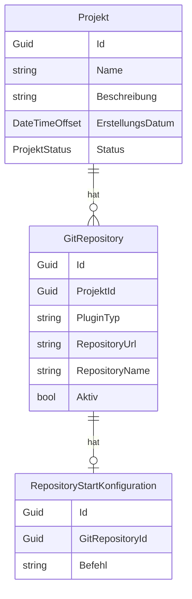

# Projekte — Datenmodell

## Entitäten

### `Projekt`

| Eigenschaft | Typ | Beschreibung |
|-------------|-----|--------------|
| `Id` | `Guid` | Primärschlüssel |
| `Name` | `string` | Anzeigename |
| `Beschreibung` | `string?` | Optionale Beschreibung |
| `ErstellungsDatum` | `DateTimeOffset` | Anlagezeitpunkt |
| `Status` | `ProjektStatus` | `Aktiv` oder `Archiviert` |
| `Repositories` | `List<GitRepository>` | Zugeordnete Repositories |
| `Aufgaben` | `List<Aufgabe>` | Zugeordnete Aufgaben |

### `GitRepository`

| Eigenschaft | Typ | Beschreibung |
|-------------|-----|--------------|
| `Id` | `Guid` | Primärschlüssel |
| `ProjektId` | `Guid` | FK → Projekt |
| `PluginTyp` | `string` | Plugin-Prefix, z.B. `GitHub` |
| `RepositoryUrl` | `string` | Klonbare URL |
| `RepositoryName` | `string` | Anzeigename |
| `Aktiv` | `bool` | Ob das Repository aktiv verwendet wird |
| `StartKonfiguration` | `RepositoryStartKonfiguration?` | Optionales Startskript |

### `RepositoryStartKonfiguration`

| Eigenschaft | Typ | Beschreibung |
|-------------|-----|--------------|
| `Id` | `Guid` | Primärschlüssel |
| `GitRepositoryId` | `Guid` | FK → GitRepository |
| `Befehl` | `string` | Ausführbarer Befehl (z.B. `npm install`) |

## Beziehungen

