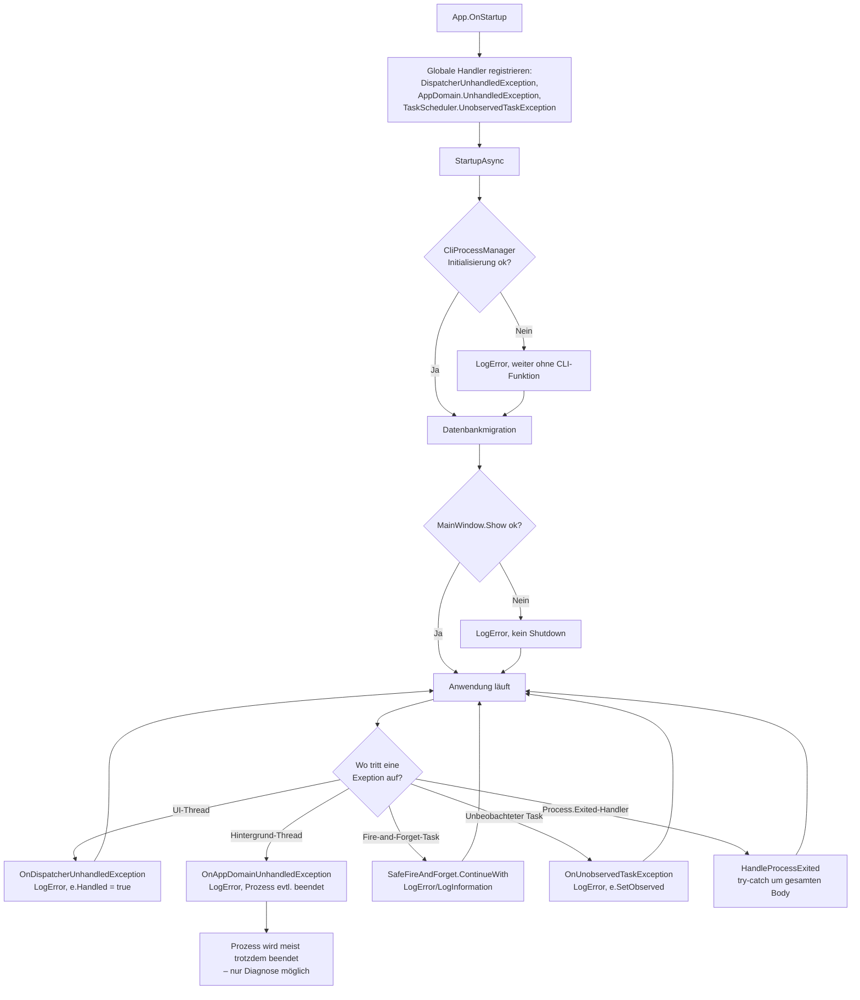

← [Zurück zur Übersicht](index.md)

# Stabilität & Fehlerbehandlung — Technischer Ablauf

## Übersicht

Der Ablauf beschreibt, wie Fehler an den unterschiedlichen Ausfallstellen der Anwendung erkannt, protokolliert und — soweit möglich — folgenlos für den weiteren Betrieb behandelt werden: beim Anwendungsstart, bei Fire-and-Forget-Aufrufen, beim periodischen Heartbeat, beim Beenden eines CLI-Prozesses und beim Aufbau bzw. Betrieb der ConPTY-Streams.

## Ablauf

### 1. Registrierung der globalen Exception-Handler beim Start

Beteiligte Komponenten:
- `App.OnStartup(StartupEventArgs)` — registriert alle drei Handler, bevor `StartupAsync` aufgerufen wird
- `Application.DispatcherUnhandledException` — Ereignis für unbehandelte Exceptions im WPF-UI-Thread
- `AppDomain.CurrentDomain.UnhandledException` — Ereignis für unbehandelte Exceptions auf allen anderen Threads
- `TaskScheduler.UnobservedTaskException` — Ereignis für Task-Exceptions, die nie abgefragt wurden

Ablauf:
1. `App.OnStartup` initialisiert zuerst den Serilog-Logger (`Log.Logger`).
2. Direkt danach werden die drei Handler registriert:
   - `DispatcherUnhandledException += OnDispatcherUnhandledException;`
   - `AppDomain.CurrentDomain.UnhandledException += OnAppDomainUnhandledException;`
   - `TaskScheduler.UnobservedTaskException += OnUnobservedTaskException;`
3. Erst danach wird `await StartupAsync(e)` aufgerufen (Host-Aufbau, DI, Datenbankmigration, `MainWindow.Show()`).
4. `StartupAsync` selbst ist zusätzlich in ein try-catch eingebettet: Schlägt der Start insgesamt fehl, wird `Log.Logger.Fatal(...)` protokolliert, dem Anwender eine `MessageBox` mit der Fehlermeldung angezeigt und die Anwendung kontrolliert mit `Shutdown(1)` beendet.
5. Innerhalb von `StartupAsync` sind zwei Teilschritte zusätzlich einzeln try-catch-geschützt, damit ein Fehler dort **nicht** zum Shutdown der gesamten Anwendung führt:
   - `_host.Services.GetRequiredService<CliProcessManager>()` — bei Fehler läuft die Anwendung ohne CLI-Funktionalität weiter.
   - `mainWindow.Show()` — bei Fehler wird nur geloggt, kein Shutdown.

### 2. Verhalten der drei globalen Handler

- `OnDispatcherUnhandledException(sender, e)`: Loggt `e.Exception` als `LogError("Unbehandelte Exception im UI-Thread.")` und setzt anschließend `e.Handled = true` — die Anwendung läuft weiter.
- `OnAppDomainUnhandledException(sender, e)`: Loggt `e.ExceptionObject as Exception` als `LogError("Unbehandelte Exception außerhalb des UI-Threads.")`. Da `AppDomain.UnhandledException` den Prozessabbruch nicht verhindern kann, dient dieser Handler nur der letzten Diagnose vor dem Absturz.
- `OnUnobservedTaskException(sender, e)`: Loggt `e.Exception` als `LogError("Unbeobachtete Task-Exception.")` und ruft `e.SetObserved()` auf, damit der Finalizer-Thread die Exception nicht erneut wirft.

### 3. Fire-and-Forget-Aufruf mit `SafeFireAndForget`

Beteiligte Komponenten:
- `AsyncTaskExtensions.SafeFireAndForget(this Task task, ILogger logger, string operationName)`

Ablauf:
1. Eine Codestelle löst einen asynchronen Aufruf aus, dessen Ergebnis nicht abgewartet werden soll (z. B. `CliProcessManager.StartHeartbeat`, `KiAusfuehrungsService.SendCommandDelayedAsync`/`PersistFehlgeschlagenAsync`, die `CurrentView`-/`ProjektId`-/`AufgabeId`-Setter der ViewModels, `ProjectDetailView.IssueDoubleClick`). `PseudoConsoleSession.ReadLoopAsync` bildet eine Ausnahme: Sie fängt alle Exceptions bereits intern ab und läuft als eigenständiger, ab Konstruktion gestarteter Hintergrund-Task (`_readLoopTask`), unabhängig vom UI-Lebenszyklus.
2. Statt `_ = task;` wird `task.SafeFireAndForget(_logger, "Bezeichnung")` aufgerufen.
3. `SafeFireAndForget` registriert `task.ContinueWith(...)` auf `TaskScheduler.Default` (läuft also nicht zwingend auf dem UI-Thread):
   - Ist der Task fehlgeschlagen (`t.IsFaulted`): `logger.LogError(t.Exception, "Unerwarteter Fehler in {OperationName}", operationName)`.
   - Ist der Task abgebrochen (`t.IsCanceled`): `logger.LogInformation("Operation {OperationName} wurde abgebrochen", operationName)`.
   - Bei Erfolg: keine Aktion.
4. Die aufrufende Methode kehrt sofort zurück; die Exception wird niemals zum Aufrufer propagiert.

### 4. Heartbeat-Update mit Concurrency-Schutz pro Aufgabe

Beteiligte Komponenten:
- `CliProcessManager.StartHeartbeat(Guid aufgabeId)` / `StopHeartbeat(Guid aufgabeId)`
- `CliProcessManager._updateSemaphores` — `ConcurrentDictionary<Guid, SemaphoreSlim>`, ein Semaphore je Aufgabe statt eines einzigen klassenweiten Semaphores
- `CliProcessManager.AktualisierungAsync(Guid aufgabeId)`

Ablauf:
1. `StartHeartbeat(aufgabeId)` legt zunächst `_updateSemaphores[aufgabeId] = new SemaphoreSlim(1, 1)` an und startet danach einen `Timer` mit 30-Sekunden-Intervall.
2. Jeder Timer-Tick ruft `AktualisierungAsync(aufgabeId).SafeFireAndForget(_logger, "CliProcessManager.AktualisierungAsync")` auf.
3. `AktualisierungAsync`:
   - Ermittelt das zur Aufgabe gehörende Semaphore; ist es nicht mehr vorhanden (Heartbeat zwischenzeitlich gestoppt), kehrt die Methode sofort zurück.
   - `await semaphore.WaitAsync()` serialisiert überlappende Ticks **derselben** Aufgabe. Heartbeats anderer Aufgaben sind davon unberührt, da jede Aufgabe ihr eigenes Semaphore besitzt.
   - Im try-Block: Prüft, ob der Prozess noch läuft (`KiAusfuehrungsService.IsRunning`); wenn nicht, wird der Heartbeat gestoppt. Sonst wird `LastHeartbeat` aktualisiert und der Datenbank-Heartbeat über `AufgabeService.UpdateHeartbeatAsync` geschrieben.
   - Bei Exception: `LogWarning`, kein Rethrow — der nächste Tick versucht es erneut.
   - Im finally-Block: `semaphore.Release()`, abgesichert gegen `ObjectDisposedException` (falls das Semaphore innerhalb desselben Aufrufs durch `StopHeartbeat` bereits disposed wurde).
4. `StopHeartbeat(aufgabeId)` entfernt sowohl den Timer als auch das Semaphore aus den jeweiligen Dictionaries und disposed beide.

### 5. Geschützter `Process.Exited`-Handler (klassischer und ConPTY-Start)

Beteiligte Komponenten:
- `KiAusfuehrungsService.HandleProcessExited(Guid aufgabeId, Process process, CliProcessHandle handle, string logKontext, Action? vorAufraeumen)` — gemeinsame Implementierung für beide Start-Varianten
- `KiAusfuehrungsService.StartCliAsync` — registriert `process.Exited += (_, _) => HandleProcessExited(aufgabeId, process, handle, "Standard");`
- `KiAusfuehrungsService.StartWithPseudoConsoleAsync` — registriert `process.Exited += (_, _) => HandleProcessExited(aufgabeId, process, handle, "ConPTY", () => handle.PseudoConsoleSession?.Dispose());`

Ablauf:
1. Der native Prozess beendet sich; Windows löst `process.Exited` aus.
2. `HandleProcessExited` wird ausgeführt — der **gesamte** Methodenkörper liegt in einem try-catch.
3. `_handles.TryRemove(aufgabeId, out _)` entfernt das Handle atomar; gibt `TryRemove` `false` zurück (Handle bereits anderweitig entfernt), kehrt die Methode sofort zurück — jede Aktion wird so nur genau einmal ausgeführt.
4. Das optionale `vorAufraeumen`-Callback wird ausgeführt (beim ConPTY-Pfad: `PseudoConsoleSession.Dispose()`, was bei parallelem Dispose eine `ObjectDisposedException` werfen kann).
5. Exit-Code wird ermittelt (`TryGetExitCode`), das Ereignis wird geloggt, `RaiseRunningCountChanged()` wird aufgerufen.
6. Je nach Zustand wird der Status bestimmt: `Gestoppt` (absichtlich beendet oder ExitCode 0), `Fehler` (ExitCode ≠ 0 und nicht absichtlich beendet). Bei `Fehler` wird zusätzlich `PersistFehlgeschlagenAsync(...).SafeFireAndForget(...)` aufgerufen.
7. `CliProcessStatusChanged?.Invoke(aufgabeId, status)` benachrichtigt alle Abonnenten (u. a. `CliProcessManager.OnCliProcessStatusChanged`, `TaskDetailViewModel.OnCliProcessStatusChanged`).
8. Tritt in einem der obigen Schritte eine Exception auf, wird sie im äußeren catch-Block als `LogError` protokolliert; der Handler beendet sich normal, ohne die Exception weiterzuwerfen.

Da `CliProcessStatusChanged` ein Multicast-Delegate mit mehreren Abonnenten ist, sind zusätzlich die einzelnen Abonnenten selbst geschützt: `CliProcessManager.OnCliProcessStatusChanged` und `TaskDetailViewModel.OnCliProcessStatusChanged` kapseln ihren jeweiligen Verarbeitungscode in try-catch, damit ein Fehler bei einem Abonnenten die Benachrichtigung der übrigen Abonnenten nicht verhindert.

### 6. Ressourcenfreigabe beim Aufbau der ConPTY-Session

Beteiligte Komponenten:
- `KiAusfuehrungsService.StartPseudoConsoleProcess(Guid aufgabeId, string localRepoPath, string pluginCommand)` — startet `cmd.exe` über die ConPTY-API
- `KiAusfuehrungsService.CreatePseudoConsoleSession(Guid aufgabeId, PseudoConsole pseudoConsole, Process process)` — erstellt die Ein-/Ausgabe-`FileStream`s und die `PseudoConsoleSession`

Ablauf (`CreatePseudoConsoleSession`):
1. `inputStream` und `outputStream` werden zunächst `null` initialisiert.
2. Im try-Block werden beide `FileStream`-Instanzen aus den ConPTY-Pipe-Handles erstellt und anschließend die `PseudoConsoleSession` daraus zusammengesetzt.
3. Schlägt einer der Schritte fehl (Exception zwischen Erstellung der Streams und erfolgreichem Zusammenbau der Session), werden im catch-Block `inputStream?.Dispose()` und `outputStream?.Dispose()` aufgerufen, die Exception wird als `LogError` protokolliert und erneut geworfen (`throw;`), damit der Aufrufer (`StartPseudoConsoleProcess`) den Fehlerfall behandeln kann.

`StartPseudoConsoleProcess` selbst räumt bei einem fehlgeschlagenen Prozessstart ebenfalls auf: Schlägt `PseudoConsoleProcessStarter.Start` fehl, wird `pseudoConsole.Dispose()` aufgerufen; schlägt die Ermittlung des `Process`-Objekts über `Process.GetProcessById` fehl, werden sowohl das native Prozess-Handle (`PseudoConsoleNativeMethods.CloseHandle`) als auch die PseudoConsole geschlossen, bevor die Exception weitergegeben wird.

### 7. Überwachter Terminal-Lesevorgang (parallele CLI-Ausführungen)

Dieser Schritt betrifft `PseudoConsoleSession` und ist im Detail in der [Terminal-Integration-Dokumentation](../terminal/ablauf-technisch.md) beschrieben. Zusammengefasst:

- Die Leseschleife (`ReadLoopAsync`) läuft in `PseudoConsoleSession` selbst, gestartet im Konstruktor und in `_readLoopTask` gespeichert — unabhängig davon, ob ein `TerminalControl` gebunden ist. Dadurch laufen mehrere CLI-Prozesse parallel weiter, auch wenn ihre Aufgabenseite nicht angezeigt wird (Issue-86).
- `ReadLoopAsync` fängt neben `OperationCanceledException` zusätzlich generische `Exception`en ab, protokolliert sie (`LogError`/`LogWarning`) und beendet die Leseschleife geordnet, statt die Exception unbehandelt zu lassen.
- `PseudoConsoleSession.Dispose()` beendet die Leseschleife nach folgendem Verfahren:
  1. `_readCts.Cancel()` wird aufgerufen, um den CancellationToken zu setzen
  2. `OutputStream.Dispose()` wird aufgerufen — dies ist **kritisch**, da ein blockierter nativer Read (in `ReadLoopAsync`) sonst nur auf den CancellationToken warten würde. Durch das Schließen des Streams endet der Read sofort mit einem I/O-Fehler.
  3. `_readLoopTask.Wait(5 Sekunden)` wartet mit Timeout auf Beendigung der ReadLoop
  4. Danach werden `InputStream`, `_runtimeStatusTimer`, `PseudoConsole` und `Process` disposed
  5. Dies stellt sicher, dass keine verwaisten Leseschleifen zurückbleiben und alle Ressourcen korrekt freigegeben werden.
- `TerminalControl` ist reiner Renderer: Es abonniert `PseudoConsoleSession.BufferChanged` und ruft bei jedem Ereignis `Dispatcher.InvokeAsync(InvalidateVisual)` auf, besitzt aber keine eigene Leseschleife mehr.

## Diagramm

## Fehlerbehandlung

| Situation | Verhalten |
|-----------|-----------|
| Unbehandelte Exception im UI-Thread | `DispatcherUnhandledException`-Handler loggt und setzt `e.Handled = true`; Anwendung läuft weiter. |
| Unbehandelte Exception auf Hintergrund-Thread | `AppDomain.UnhandledException`-Handler loggt; Prozessende meist nicht verhinderbar. |
| Unbeobachtete Task-Exception | `UnobservedTaskException`-Handler loggt und ruft `SetObserved()` auf. |
| Fire-and-Forget-Task wirft Exception | `SafeFireAndForget` loggt als `LogError`, keine Propagierung. |
| Fire-and-Forget-Task wird abgebrochen | `SafeFireAndForget` loggt als `LogInformation`. |
| `GetRequiredService<CliProcessManager>()` schlägt beim Start fehl | Geloggt; Anwendung startet ohne CLI-Funktionalität. |
| `mainWindow.Show()` schlägt fehl | Geloggt; kein Shutdown der Anwendung. |
| Fehler in `Process.Exited`-Handler (z. B. `ObjectDisposedException` bei `PseudoConsoleSession.Dispose`) | `HandleProcessExited` fängt sie ab, loggt, Handler beendet normal. |
| Fehler bei einem Abonnenten von `CliProcessStatusChanged` | Try-catch im jeweiligen Abonnenten (`CliProcessManager`, `TaskDetailViewModel`) verhindert Abbruch der Multicast-Kette. |
| Fehler beim Erstellen der ConPTY-Streams | `CreatePseudoConsoleSession` disposed bereits erstellte Streams, loggt und wirft weiter. |
| Überlappende Heartbeat-Ticks derselben Aufgabe | Pro-Aufgabe-`SemaphoreSlim` serialisiert; andere Aufgaben bleiben unbeeinflusst. |
