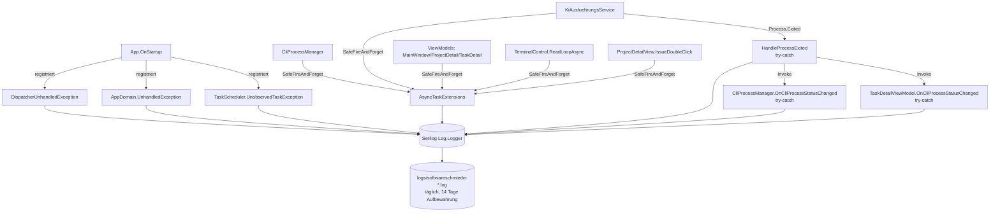

# Stabilität & Fehlerbehandlung — Architektur

## Beteiligte Komponenten

| Komponente | Typ | Lage | Rolle |
|------------|-----|------|-------|
| `App` | WPF-`Application` | `Softwareschmiede.App` | Registriert die drei globalen Exception-Handler in `OnStartup`; kapselt `StartupAsync` und dessen kritische Teilschritte in try-catch |
| `AsyncTaskExtensions` | Statische Utility-Klasse | `Softwareschmiede.Application.Services` | Stellt `SafeFireAndForget(Task, ILogger, string)` bereit — zentrale Fehlerbehandlung für alle Fire-and-Forget-Aufrufe |
| `KiAusfuehrungsService` | Singleton-Service | `Softwareschmiede.Application.Services` | Verwaltet CLI-Prozesse; `HandleProcessExited` bündelt die geschützte Exited-Handler-Logik für klassischen und ConPTY-Start; `CreatePseudoConsoleSession`/`StartPseudoConsoleProcess` kapseln die native Ressourcen-Erstellung inkl. Cleanup |
| `CliProcessManager` | Singleton-Service | `Softwareschmiede.Application.Services` | Heartbeat-Timer pro Aufgabe mit eigenem `SemaphoreSlim`; `OnCliProcessStatusChanged` als geschützter Event-Abonnent |
| `TerminalControl` | WPF `FrameworkElement` | `Softwareschmiede.App.Controls` | Überwachter `ReadLoopAsync`-Task (`_readLoopTask`) mit generischem Exception-Handling |
| `ProjectDetailView` | WPF Code-behind | `Softwareschmiede.App.Views` | `IssueDoubleClick` als geschützter UI-Event-Handler mit `SafeFireAndForget` |
| `MainWindowViewModel`, `ProjectDetailViewModel`, `TaskDetailViewModel` | ViewModels | `Softwareschmiede.App.ViewModels` | Fire-and-Forget-Ladevorgänge in Property-Settern (`CurrentView`, `ProjektId`, `AufgabeId`) über `SafeFireAndForget` abgesichert |
| Serilog (`Log.Logger`) | Logging-Infrastruktur | `App.xaml.cs` | Zentrale Senke für alle Fehlerprotokolle (Konsole + tägliche Rolling-Datei, 14 Tage Aufbewahrung) |

## Abhängigkeiten

Alle beschriebenen Komponenten protokollieren synchron über den bestehenden Serilog-Logger bzw. den per DI injizierten `ILogger<T>` (der intern an Serilog via `UseSerilog()` gebunden ist). Es werden keine neuen externen Abhängigkeiten eingeführt — die Fehlerbehandlung ist rein additiv auf bestehender Logging- und DI-Infrastruktur aufgebaut.

```
App.OnStartup
  ├─ registriert DispatcherUnhandledException, AppDomain.UnhandledException,
  │  TaskScheduler.UnobservedTaskException  → Log.Logger
  └─ StartupAsync
       ├─ try/catch: GetRequiredService<CliProcessManager>()  → Log.Logger
       └─ try/catch: mainWindow.Show()                        → Log.Logger

CliProcessManager / KiAusfuehrungsService / ViewModels / TerminalControl / ProjectDetailView
  └─ Fire-and-Forget-Aufruf.SafeFireAndForget(_logger, "Bezeichnung")
       └─ ContinueWith (TaskScheduler.Default) → ILogger<T> → Serilog

KiAusfuehrungsService.StartCliAsync / StartWithPseudoConsoleAsync
  └─ process.Exited += (_,_) => HandleProcessExited(...)
       ├─ try/catch um gesamten Handler-Body → ILogger<KiAusfuehrungsService>
       └─ CliProcessStatusChanged?.Invoke(...)
            ├─ CliProcessManager.OnCliProcessStatusChanged (try-catch)
            └─ TaskDetailViewModel.OnCliProcessStatusChanged (try-catch)
```

## Datenfluss

Fehler entstehen an vier Arten von Quellen — UI-Thread-Exceptions, Hintergrund-Thread-Exceptions, Fire-and-Forget-Task-Exceptions und Exceptions in Event-Handlern (`Process.Exited`, `CliProcessStatusChanged`-Abonnenten). Jede Quelle wird an ihrer jeweiligen Ausfallstelle abgefangen (nicht zentral in einer einzigen Klasse) und direkt dort protokolliert. Es gibt keinen zentralen Fehler-Aggregator; die Serilog-Protokolldatei ist die einzige gemeinsame Senke, in der sich alle Fehlerarten anhand ihrer Log-Nachricht unterscheiden lassen (siehe [Fehlerbehebung](troubleshooting.md)).

## Diagramm



## Skalierung und Zuverlässigkeit

- **Heartbeat-Concurrency:** `CliProcessManager` verwendet ein `SemaphoreSlim` **pro Aufgabe** (`ConcurrentDictionary<Guid, SemaphoreSlim>`) statt eines einzigen klassenweiten Semaphores. Dadurch serialisieren sich nur überlappende Timer-Ticks derselben Aufgabe; Heartbeat-Updates mehrerer parallel laufender Aufgaben blockieren sich nicht gegenseitig, auch bei vielen gleichzeitig aktiven CLI-Prozessen.
- **Logging-Overhead:** Jede abgefangene Exception erzeugt einen Log-Eintrag. Bei sehr häufigen, sich wiederholenden Fehlern (z. B. dauerhaft fehlschlagende Heartbeat-Updates alle 30 Sekunden) kann die Logdatei entsprechend wachsen; die bestehende Rolling-File-Konfiguration (täglich, 14 Tage Aufbewahrung) begrenzt den Plattenplatzverbrauch.
- **`ContinueWith` auf `TaskScheduler.Default`:** `SafeFireAndForget` plant seinen Logging-Callback auf dem Default-ThreadPool-Scheduler, nicht auf dem UI-Thread-Scheduler. Das vermeidet zusätzliche Last auf dem UI-Thread und mögliche Deadlocks, wenn viele Fire-and-Forget-Tasks gleichzeitig abgeschlossen werden.
- **Kein zentraler Fehler-Aggregator:** Da jede Ausfallstelle unabhängig geloggt wird, gibt es keinen Single Point of Failure in der Fehlerbehandlung selbst — fällt ein Handler theoretisch aus, sind die übrigen davon unabhängig.
