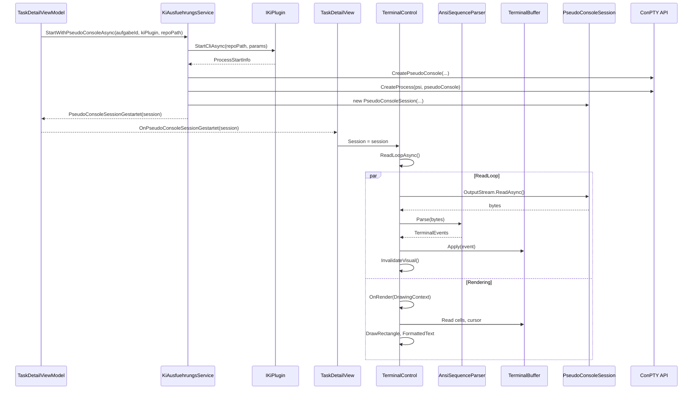

← [Zurück zur Übersicht](index.md)

# Terminal-Integration — Technischer Ablauf

## Übersicht

Das Terminal-System startet KI-CLI-Prozesse über die Windows Pseudo Console (ConPTY) API, liest den Output aus einer Pipe, parst ANSI-Escape-Sequenzen zu strukturierten Events, verwaltet den Terminal-Zustand in einem 2D-Buffer und rendert diesen per WPF-Control.

## Ablauf

### 1. Prozessstart mit ConPTY

Beteiligte Komponenten:
- `TaskDetailViewModel.StartCliAndUpdateStateAsync` — ruft `KiAusfuehrungsService.StartWithPseudoConsoleAsync` auf
- `KiAusfuehrungsService.StartWithPseudoConsoleAsync` — erzeugt Pseudo Console, startet Prozess, erstellt `PseudoConsoleSession`
- `IKiPlugin.StartCliAsync` — liefert `ProcessStartInfo` mit Executable-Pfad, Argumente, Arbeitsverzeichnis
- `PseudoConsole.Create` — erstellt HPCON-Handle und Pipes via `CreatePseudoConsole` API
- `PseudoConsoleProcessStarter.Start` — startet Win32-Prozess mit `STARTUPINFOEX` und `PROC_THREAD_ATTRIBUTE_PSEUDOCONSOLE`
- `PseudoConsoleSession` — koordiniert `PseudoConsole`, `Process`, Input-Stream, Output-Stream
- `CliProcessHandle.PseudoConsoleSession` — Referenz zur Session für späteren Zugriff

**Detailschritte:**

1. `StartWithPseudoConsoleAsync` ruft `kiPlugin.StartCliAsync(localRepoPath, parameters)` auf → `ProcessStartInfo`
2. `PseudoConsole.Create(cols, rows)` erstellt Input- und Output-Pipes via `CreatePipe`
3. `CreatePseudoConsole(inputReadHandle, outputWriteHandle, size, ...)` erstellt HPCON
4. `PseudoConsoleProcessStarter.Start(psi, pseudoConsole)` startet Prozess mit ConPTY via `CreateProcess`
5. `PseudoConsoleSession` wird erzeugt mit Pipe-Streams und `PseudoConsole`
6. `CliProcessHandle` wird mit `PseudoConsoleSession`-Referenz erstellt
7. Event `CliProcessStatusChanged(Gestartet)` wird gefeuert
8. Event `PseudoConsoleSessionGestartet(session)` wird an `TaskDetailViewModel` propagiert

### 2. Terminal-Rendering-Loop

Beteiligte Komponenten:
- `TaskDetailView.xaml.cs` — empfängt `OnPseudoConsoleSessionGestartet(session)`
- `TerminalControl.Session` — DependencyProperty, triggert `OnSessionChanged`
- `TerminalControl.ReadLoopAsync` — liest bytes aus `session.OutputStream`
- `AnsiSequenceParser.Parse` — zerlegt Bytes in `TerminalEvent`-Instanzen
- `TerminalBuffer.Apply` — wendet Events auf Grid an (Schreiben, Cursor-Bewegung, Farben, Erase)
- `TerminalControl.OnRender` — rendert `TerminalBuffer`-Inhalt per `DrawingContext`

**Detailschritte:**

1. `TaskDetailView` setzt `TerminalConsole.Session = session`
2. `TerminalControl.OnSessionChanged` initialisiert `TerminalBuffer(cols, rows)` mit aktuellen Pixel-Dimensionen
3. Task `ReadLoopAsync` wird gestartet; Schleife:
   - `await session.OutputStream.ReadAsync(buffer)` liest bytes
   - `foreach (var evt in _parser.Parse(bytes))` zerlegt bytes
   - `_buffer.Apply(evt)` aktualisiert Zustand
   - `Dispatcher.InvokeAsync(InvalidateVisual)` triggert Redraw
4. `TerminalControl.OnRender(DrawingContext dc)`:
   - Misst Zellenbreite/-höhe aus Schriftgröße (Consolas 13pt)
   - Iteriert über sichtbare Zeilen in `_buffer`
   - Zeichnet Hintergrund-Rechtecke für jede Zelle
   - Zeichnet Vordergrund-Text (`FormattedText`) mit Font-Attributen
   - Rendert Cursor-Rechteck bei `CursorRow`/`CursorCol`

### 3. Tastatureingabe

Beteiligte Komponenten:
- `TerminalControl.PreviewKeyDown` / `TextInput` — WPF-Key-Events
- `KeyToVt100Encoder.Encode` — konvertiert Key zu VT100-Sequenz
- `PseudoConsoleSession.InputStream` — Pipe zum Schreiben

**Detailschritte:**

1. `TerminalControl` fängt `PreviewKeyDown` und `TextInput` ab
2. `KeyToVt100Encoder.Encode(keyEventArgs)` liefert `byte[]`:
   - Normale Tasten: ASCII (z. B. 'A' = 0x41)
   - Pfeiltasten: `\x1b[A` (Up), `\x1b[B` (Down), etc.
   - Funktionstasten: `\x1b[11~` (F1), `\x1b[12~` (F2), etc.
   - Ctrl+C: `\x03`, Ctrl+Z: `\x1a`
   - Enter: `\r`
3. Bytes werden asynchron in `session.InputStream` geschrieben

### 4. ConPTY-Resize

Beteiligte Komponenten:
- `TerminalControl.SizeChanged` — Layout-Änderungen
- `TerminalControl.CalculateCols/Rows` — konvertiert Pixel zu Gitter-Dimensionen
- `PseudoConsoleSession.ResizeAsync` — delegiert an `PseudoConsole.Resize`
- `PseudoConsole.Resize` — ruft `ResizePseudoConsole` API auf
- `TerminalBuffer.Resize` — passt Grid an, erhält Scrollback

**Detailschritte:**

1. `SizeChanged` wird ausgelöst bei Layout-Änderung
2. `newCols = availableWidth / _cellWidth`, `newRows = availableHeight / _cellHeight`
3. `await session.ResizeAsync(newCols, newRows)`
4. `PseudoConsole.Resize(cols, rows)` ruft `ResizePseudoConsole(hpcon, size)` auf
5. `TerminalBuffer.Resize(newCols, newRows)` passt Grid an (erhält sichtbare Zeilen, trunciert wenn nötig)

### 5. Prozessende

Beteiligte Komponenten:
- `Process.Exited` — Win32-Event
- `KiAusfuehrungsService` — Handler entfernt Handle aus `_handles`
- `PseudoConsoleSession.Dispose` — schließt Pipes und ConPTY
- `TaskDetailViewModel.OnCliProcessStatusChanged` — setzt `IsCliRunning = false`

**Detailschritte:**

1. Prozess endet → `process.Exited` wird ausgelöst
2. `KiAusfuehrungsService.Exited`-Handler wird aufgerufen
3. `CliProcessStatusChanged(aufgabeId, Gestoppt|Fehler)` wird gefeuert
4. `PseudoConsoleSession` schließt Output-Pipe
5. `ReadLoopAsync` liest EOF auf Output-Pipe → Schleife endet
6. `InvalidateVisual` zeigt finalen Buffer-Zustand
7. `TaskDetailViewModel.OnCliProcessStatusChanged` setzt `IsCliRunning = false`
8. Bei Cleanup: `CliProcessHandle.Dispose` ruft `PseudoConsoleSession.Dispose` auf → Pipes und HPCON geschlossen

## Diagramm

## Fehlerbehandlung

| Situation | Verhalten |
|-----------|-----------|
| `CreatePseudoConsole` schlägt fehl | `InvalidOperationException` propagiert; UI zeigt Fehlermeldung im Fehler-Banner |
| Unvollständige ANSI-Sequenz über Paket-Grenzen | `AnsiSequenceParser` speichert Zustand; nächstes Paket setzt Verarbeitung fort |
| `ResizePseudoConsole` schlägt fehl | Rückgabewert `false`; Buffer wird trotzdem angepasst, ConPTY-Größe stimmt nicht mit Buffer überein (seltener Fall) |
| `ReadLoopAsync` bei Prozessende | EOF wird gelesen; Schleife terminiert ordnungsgemäß; View zeigt finalen Zustand |
