# CLI-Terminal — Technischer Ablauf

## Übersicht

Die Kommunikation zwischen `CliTerminal.razor` und dem Node.js-Backend erfolgt über ein einfaches Text-basiertes WebSocket-Protokoll. Das Backend öffnet eine PTY-Shell über `node-pty` und leitet alle Ein-/Ausgaben durch.

## Ablauf

### 1. Backend starten (manuell vor App-Start)

Das Skript `src/Softwareschmiede/terminal-backend/server.js` muss mit Node.js gestartet werden.

Beteiligte Komponenten:
- `terminal-backend/server.js` — WebSocket-Server auf Port 3001
- `node-pty` — PTY-Emulation unter Windows/Linux/macOS
- `ws` — WebSocket-Bibliothek

### 2. Komponente rendern

Beteiligte Komponenten:
- `CliTerminal.razor` — Blazor-Komponente mit `XtermBlazor`
- Parameter `CliName` — `"claude"` oder `"copilot"`
- Parameter `WorkingDirectory` — Absoluter Pfad zum Aufgaben-Klonverzeichnis

### 3. Verbindung herstellen (`OnFirstRender`)

```
[CliTerminal] --> WebSocket Connect --> ws://localhost:3001
[CliTerminal] --> Send: "SET_CWD:<WorkingDirectory>"
[Backend]     --> pty.spawn("powershell.exe", ["-NoExit"], { cwd: WorkingDirectory })
[CliTerminal] --> Send: "START_CLI:<CliName>"
[Backend]     --> ptyProcess.write("claude\r")  // oder "copilot\r"
```

### 4. Empfangsschleife (`ReceiveLoop`)

Läuft als `Task.Run` im Hintergrund:
- Empfängt `WebSocketMessage` vom Backend.
- Ruft `_terminal.Write(text)` auf — Ausgabe erscheint im xterm-Terminal.

### 5. Benutzereingabe (`OnData`)

Jede Tastatureingabe im xterm-Terminal:
- `OnData`-Callback wird aufgerufen mit dem rohen Zeichenstrom.
- `_ws.SendAsync(bytes)` leitet die Eingabe an das Backend weiter.
- Das Backend ruft `ptyProcess.write(msg)` auf.

### 6. Verbindung trennen

Bei WebSocket-Close (`socket.on("close")`) tötet das Backend den PTY-Prozess (`ptyProcess.kill()`).

## Diagramm

```mermaid
sequenceDiagram
    participant U as Anwender
    participant T as CliTerminal.razor
    participant WS as WebSocket (ws://localhost:3001)
    participant B as terminal-backend/server.js
    participant P as node-pty (PowerShell)

    T->>WS: Connect
    T->>WS: SET_CWD:/pfad/zum/repo
    WS->>B: SET_CWD:/pfad/zum/repo
    B->>P: pty.spawn("powershell.exe", cwd=/pfad)
    T->>WS: START_CLI:claude
    WS->>B: START_CLI:claude
    B->>P: write("claude\r")
    P-->>B: PTY-Ausgabe
    B-->>WS: Ausgabe weiterleiten
    WS-->>T: WebSocket-Nachricht
    T->>T: _terminal.Write(text)

    U->>T: Tastatureingabe
    T->>WS: SendAsync(bytes)
    WS->>B: Eingabe
    B->>P: ptyProcess.write(msg)
```


