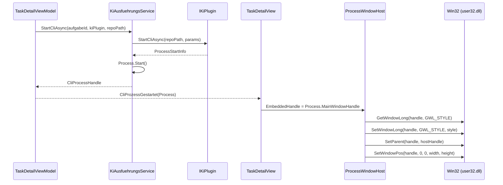

← [Zurück zur Übersicht](index.md)

# CLI-Fenster-Einbettung — Technischer Ablauf

## Übersicht

`ProcessWindowHost` ist ein von `HwndHost` abgeleitetes WPF-Control. Es erstellt ein natives Win32-Hostfenster und bettet ein externes Prozessfenster via `SetParent` ein. `KiAusfuehrungsService` verwaltet den CLI-Prozess; `TaskDetailViewModel` koordiniert den Übergang von Prozessstart zu Einbettung.

## Ablauf

### 1. CLI-Prozess starten

Beteiligte Komponenten:
- `TaskDetailViewModel.CliStartenAsync` — ruft `KiAusfuehrungsService.StartCliAsync` auf
- `KiAusfuehrungsService.StartCliAsync` — ruft `IKiPlugin.StartCliAsync` auf, erhält `ProcessStartInfo`, startet `Process`
- `IKiPlugin.StartCliAsync` — Plugin-Implementierung liefert Executable-Pfad, Argumente und Arbeitsverzeichnis
- `CliProcessHandle` — kapselt `Process` und `LastHeartbeat`

### 2. Handle bekannt geben

Beteiligte Komponenten:
- `TaskDetailViewModel.CliProzessGestartet` — Event mit `Process`-Objekt
- `TaskDetailView.xaml.cs` — abonniert Event, liest `Process.MainWindowHandle`
- `ProcessWindowHost.EmbeddedHandle` — DependencyProperty; Setter löst Einbettung aus

### 3. Fenster einbetten (`EmbedWindow`)

```
ProcessWindowHost.EmbedWindow(handle):
  1. GetWindowLong(handle, GWL_STYLE)          ← Stil lesen
  2. style |= WS_CHILD                          ← Kind-Fenster-Flag setzen
  3. style &= ~(WS_CAPTION | WS_THICKFRAME)     ← Titelleiste/Rahmen entfernen
  4. SetWindowLong(handle, GWL_STYLE, style)
  5. SetParent(handle, _hostHandle)             ← Einbetten
  6. SetWindowPos(handle, ...)                  ← Größe anpassen
```

Beteiligte Komponenten:
- `ProcessWindowHost.NativeMethods.SetParent` — Win32 P/Invoke
- `ProcessWindowHost.NativeMethods.SetWindowLong` — Fensterstil anpassen
- `ProcessWindowHost.NativeMethods.SetWindowPos` — Position und Größe

### 4. Größenanpassung

- `ProcessWindowHost.OnRenderSizeChanged` — aufgerufen bei Layout-Änderungen
- `ResizeEmbeddedWindow` — `SetWindowPos` mit aktuellen `ActualWidth` / `ActualHeight`

### 5. CLI-Prozess beendet sich

- `Process.Exited`-Event → `KiAusfuehrungsService.CliProcessStatusChanged` (Gestoppt)
- `TaskDetailViewModel.OnCliProcessStatusChanged` → `IsCliRunning = false`, `EmbeddedWindowHandle = IntPtr.Zero`
- `ProcessWindowHost.EmbedWindow(IntPtr.Zero)` — Host-Fenster bleibt, eingebettetes Fenster ist weg

### 6. Control zerstören (`DestroyWindowCore`)

- `SetParent(_embeddedHandle, IntPtr.Zero)` — Einbettung trennen
- `DestroyWindow(_hostHandle)` — Host-Fenster freigeben

## Diagramm



## Fehlerbehandlung

| Situation | Verhalten |
|-----------|-----------|
| `Process.MainWindowHandle` ist `IntPtr.Zero` | `EmbedWindow` kehrt sofort zurück; Handle wird gesetzt sobald verfügbar |
| `SetParent` schlägt fehl | Win32-Fehler; CLI-Fenster bleibt eigenständig; kein Absturz |
| `DestroyWindowCore` bei noch laufendem Prozess | `SetParent(handle, IntPtr.Zero)` trennt Einbettung; Prozess läuft weiter |
