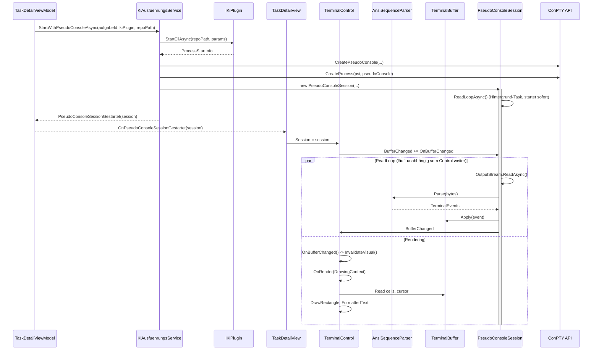

← [Zurück zur Übersicht](index.md)

# Terminal-Integration — Technischer Ablauf

## Übersicht

Das Terminal-System startet KI-CLI-Prozesse über die Windows Pseudo Console (ConPTY) API, liest den Output aus einer Pipe, parst ANSI-Escape-Sequenzen zu strukturierten Events, verwaltet den Terminal-Zustand in einem 2D-Buffer und rendert diesen per WPF-Control.

## Ablauf

### 1. Prozessstart mit ConPTY

Beteiligte Komponenten:
- `TaskDetailViewModel.StartCliAndUpdateStateAsync` — ruft `KiAusfuehrungsService.StartWithPseudoConsoleAsync` auf
- `KiAusfuehrungsService.StartWithPseudoConsoleAsync` — erzeugt Pseudo Console, startet Prozess, erstellt `PseudoConsoleSession`
- `IKiPlugin.StartCliAsync` — liefert `ProcessStartInfo` mit Executable-Pfad, Argumente, Arbeitsverzeichnis
- `PseudoConsole.Create` — erstellt HPCON-Handle und Pipes via `CreatePseudoConsole` API
- `PseudoConsoleProcessStarter.Start` — startet Win32-Prozess mit `STARTUPINFOEX` und `PROC_THREAD_ATTRIBUTE_PSEUDOCONSOLE`
- `PseudoConsoleSession` — koordiniert `PseudoConsole`, `Process`, Input-Stream, Output-Stream
- `CliProcessHandle.PseudoConsoleSession` — Referenz zur Session für späteren Zugriff

**Detailschritte:**

1. `StartWithPseudoConsoleAsync` ruft `kiPlugin.StartCliAsync(localRepoPath, parameters)` auf → `ProcessStartInfo`
2. `PseudoConsole.Create(cols, rows)` erstellt Input- und Output-Pipes via `CreatePipe`
3. `CreatePseudoConsole(inputReadHandle, outputWriteHandle, size, ...)` erstellt HPCON
4. `PseudoConsoleProcessStarter.Start(psi, pseudoConsole)` startet Prozess mit ConPTY via `CreateProcess`
5. `PseudoConsoleSession` wird erzeugt mit Pipe-Streams und `PseudoConsole`
6. `CliProcessHandle` wird mit `PseudoConsoleSession`-Referenz erstellt
7. Event `CliProcessStatusChanged(Gestartet)` wird gefeuert
8. Event `PseudoConsoleSessionGestartet(session)` wird an `TaskDetailViewModel` propagiert

### 2. Terminal-Rendering-Loop mit Buffer-Snapshot (Leseschleife läuft in der Session, nicht im Control)

Seit der Behebung von Issue-86 (parallele CLI-Ausführungen) läuft die Leseschleife nicht mehr im
`TerminalControl`, sondern in `PseudoConsoleSession` selbst — ab Konstruktion der Session bis zu ihrem
`Dispose()`, unabhängig davon, ob überhaupt ein `TerminalControl` gebunden ist. Dadurch laufen mehrere
CLI-Prozesse parallel weiter und puffern ihre Ausgabe, auch wenn die zugehörige Aufgabenseite gerade nicht
angezeigt wird. `TerminalControl` ist ein reiner Renderer: Es abonniert `PseudoConsoleSession.BufferChanged`
und zeichnet bei jedem Ereignis den aktuellen Bufferinhalt neu.

**Stabilisierung durch Snapshot:** Um Race Conditions zwischen paralleler Ausgabe und Rendering zu vermeiden, erstellt `TerminalControl.OnRender()` einen konsistenten Snapshot des Buffer-Zustands über `TerminalBuffer.GetSnapshot()`, die unter einem einzigen Lock Grid, Cursor und Größe kopiert. Dies verhindert, dass Render-Operationen durch gleichzeitige Buffer-Updates gestört werden.

Beteiligte Komponenten:
- `TaskDetailView.xaml.cs` — empfängt `OnPseudoConsoleSessionGestartet(session)`
- `TerminalControl.Session` — DependencyProperty, triggert `OnSessionChanged`
- `PseudoConsoleSession.ReadLoopAsync` — liest bytes aus `OutputStream`, läuft ab Konstruktion der Session
- `AnsiSequenceParser.Parse` — zerlegt Bytes in `TerminalEvent`-Instanzen
- `TerminalBuffer.Apply` — wendet Events auf Grid an (Schreiben, Cursor-Bewegung, Farben, Erase), synchronisiert via `lock`
- `TerminalBuffer.GetSnapshot()` — erstellt konsistenten Snapshot unter Lock für sichere Render-Operationen
- `PseudoConsoleSession.BufferChanged` — Event, das nach jeder verarbeiteten Ausgabe gefeuert wird
- `TerminalControl.OnBufferChanged` / `TerminalControl.OnRender` — rendert über Snapshot-Daten per `DrawingContext`

**Detailschritte:**

1. `PseudoConsoleSession`-Konstruktor legt den `Buffer` an und startet `ReadLoopAsync()` als Hintergrund-Task (`_readLoopTask`), unabhängig vom UI-Lebenszyklus.
2. `TaskDetailView` setzt `TerminalConsole.Session = session`.
3. `TerminalControl.OnSessionChanged`:
   - Deregistriert den `BufferChanged`-Handler der zuvor gebundenen Session (falls vorhanden).
   - Übernimmt `session.Buffer` als eigene `_buffer`-Referenz und passt dessen Größe an die aktuellen Pixel-Dimensionen an.
   - Registriert `OnBufferChanged` auf `session.BufferChanged`.
   - Ruft `InvalidateVisual()` für die initiale Darstellung des bereits vorhandenen Bufferinhalts auf.
4. In `PseudoConsoleSession.ReadLoopAsync` (läuft unabhängig weiter, auch ohne gebundenes Control):
   - `await OutputStream.ReadAsync(buffer)` liest bytes
   - `foreach (var evt in _parser.Parse(bytes))` zerlegt bytes
   - `Buffer.Apply(evt)` aktualisiert Zustand
   - `BufferChanged?.Invoke(this, EventArgs.Empty)` benachrichtigt ein ggf. gebundenes `TerminalControl`
5. `TerminalControl.OnBufferChanged` ruft `Dispatcher.InvokeAsync(InvalidateVisual)` auf.
6. `TerminalControl.OnRender(DrawingContext dc)`:
   - Misst Zellenbreite/-höhe aus Schriftgröße (Consolas 13pt)
   - **Neu:** Ruft `buffer.GetSnapshot()` auf, um einen konsistenten Snapshot unter Lock zu erhalten
   - Iteriert über sichtbare Zeilen im Snapshot-Grid
   - Zeichnet Hintergrund-Rechtecke für jede Zelle
   - Zeichnet Vordergrund-Text (`FormattedText`) mit Font-Attributen
   - Rendert Cursor-Rechteck bei Snapshot-CursorRow/CursorCol

### 3. Tastatureingabe

Beteiligte Komponenten:
- `TerminalControl.PreviewKeyDown` / `TextInput` — WPF-Key-Events
- `KeyToVt100Encoder.Encode` — konvertiert Key zu VT100-Sequenz
- `PseudoConsoleSession.InputStream` — Pipe zum Schreiben

**Detailschritte:**

1. `TerminalControl` fängt `PreviewKeyDown` und `TextInput` ab
2. `KeyToVt100Encoder.Encode(keyEventArgs)` liefert `byte[]`:
   - Normale Tasten: ASCII (z. B. 'A' = 0x41)
   - Pfeiltasten: `\x1b[A` (Up), `\x1b[B` (Down), etc.
   - Funktionstasten: `\x1b[11~` (F1), `\x1b[12~` (F2), etc.
   - Ctrl+C: `\x03`, Ctrl+Z: `\x1a`
   - Enter: `\r`
3. Bytes werden asynchron in `session.InputStream` geschrieben

### 4. Clipboard-Paste-Eingabe (Ctrl+V)

Beteiligte Komponenten:
- `TerminalControl.OnPreviewKeyDown` — fängt Tastaturereignisse ab
- `KeyToVt100Encoder.EncodeClipboardText` — normalisiert und kodiert Clipboard-Text
- `System.Windows.Clipboard` — WPF-API zum Zwischenablage-Zugriff
- `PseudoConsoleSession.InputStream` — Pipe zum Schreiben

**Detailschritte:**

1. Benutzer drückt `Ctrl+V` auf fokussiertem `TerminalControl`
2. `TerminalControl.OnPreviewKeyDown` prüft: `e.Key == Key.V && (Keyboard.Modifiers & ModifierKeys.Control) != 0`
3. Wenn erfüllt: `e.Handled = true`, `ReadClipboardAndInsertAsync()` wird aufgerufen
4. In `ReadClipboardAndInsertAsync()`:
   - `GetClipboardText()` liest `System.Windows.Clipboard.GetText()` (mit Fehlerbehandlung: Return `string.Empty` bei Fehler)
   - Falls Text nicht leer: `KeyToVt100Encoder.EncodeClipboardText(text)` normalisiert und kodiert den Text
     - Zeilenumbrüche: `\n` → `\r`, `\r\n` → `\r`, `\r` → `\r` (Windows-CLI-Standard)
     - Ergebnis: UTF-8-kodierte Bytes
   - Bytes werden asynchron via `await Session.InputStream.WriteAsync(bytes)` geschrieben
   - `Session.MarkInputActivity()` wird aufgerufen, um Runtime-Status zu aktualisieren
   - Bei Exception: Error wird geloggt (`_logger.LogWarning`), Tastatureingabe läuft weiter

### 5. ConPTY-Resize

Beteiligte Komponenten:
- `TerminalControl.SizeChanged` — Layout-Änderungen
- `TerminalControl.CalculateCols/Rows` — konvertiert Pixel zu Gitter-Dimensionen
- `PseudoConsoleSession.ResizeAsync` — delegiert an `PseudoConsole.Resize`
- `PseudoConsole.Resize` — ruft `ResizePseudoConsole` API auf
- `TerminalBuffer.Resize` — passt Grid an, erhält Scrollback

**Detailschritte:**

1. `SizeChanged` wird ausgelöst bei Layout-Änderung
2. `newCols = availableWidth / _cellWidth`, `newRows = availableHeight / _cellHeight`
3. `await session.ResizeAsync(newCols, newRows)`
4. `PseudoConsole.Resize(cols, rows)` ruft `ResizePseudoConsole(hpcon, size)` auf
5. `TerminalBuffer.Resize(newCols, newRows)` passt Grid an (erhält sichtbare Zeilen, trunciert wenn nötig)

### 6. Prozessende

Beteiligte Komponenten:
- `Process.Exited` — Win32-Event
- `KiAusfuehrungsService` — Handler entfernt Handle aus `_handles`
- `PseudoConsoleSession.Dispose` — schließt Pipes und ConPTY
- `TaskDetailViewModel.OnCliProcessStatusChanged` — setzt `IsCliRunning = false`

**Detailschritte:**

1. Prozess endet → `process.Exited` wird ausgelöst
2. `KiAusfuehrungsService.HandleProcessExited`-Handler wird aufgerufen
3. `CliProcessStatusChanged(aufgabeId, Gestoppt|Fehler)` wird gefeuert
4. `TaskDetailViewModel.OnCliProcessStatusChanged` setzt `IsCliRunning = false`; `TaskDetailView` setzt `TerminalControl.Session = null`, wodurch der `BufferChanged`-Handler deregistriert wird
5. `PseudoConsoleSession.Dispose()` bricht die Leseschleife ab (`_readCts.Cancel()`), wartet mit Timeout auf `_readLoopTask` und schließt danach Input-/Output-Pipe und die PseudoConsole
6. `ReadLoopAsync` beendet sich (durch Abbruch oder EOF auf der Output-Pipe) — läuft bis dahin unabhängig davon weiter, ob ein `TerminalControl` gebunden war

## Diagramm

## Fehlerbehandlung

| Situation | Verhalten |
|-----------|-----------|
| `CreatePseudoConsole` schlägt fehl | `InvalidOperationException` propagiert; UI zeigt Fehlermeldung im Fehler-Banner |
| Unvollständige ANSI-Sequenz über Paket-Grenzen | `AnsiSequenceParser` speichert Zustand; nächstes Paket setzt Verarbeitung fort |
| `ResizePseudoConsole` schlägt fehl | Rückgabewert `false`; Buffer wird trotzdem angepasst, ConPTY-Größe stimmt nicht mit Buffer überein (seltener Fall) |
| `ReadLoopAsync` bei Prozessende | EOF wird gelesen; Schleife terminiert ordnungsgemäß; Buffer bleibt im letzten Zustand erhalten |
| Unerwartete Exception in `ReadLoopAsync` | Generisches `catch (Exception)` protokolliert den Fehler und beendet die Schleife geordnet, statt sie unbehandelt zu lassen |
| `TerminalControl` nicht gebunden, während Prozess Ausgabe produziert | `ReadLoopAsync` liest und puffert die Ausgabe trotzdem weiter im `Buffer` der Session; `BufferChanged` wird gefeuert, hat aber keinen Abonnenten — kein Datenverlust, sobald wieder ein Control bindet |
