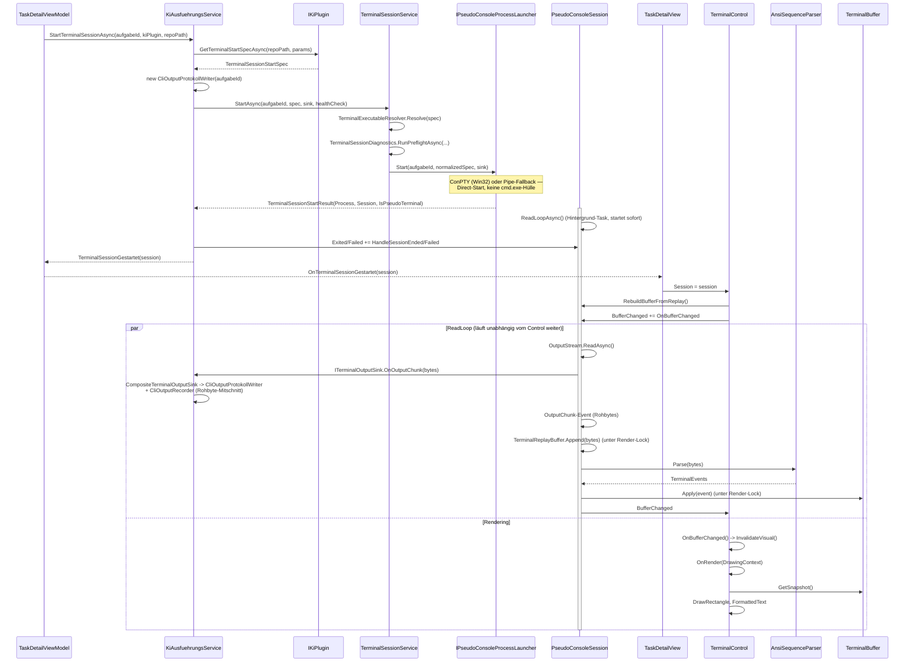

← [Zurück zur Übersicht](index.md)

# Terminal-Integration — Technischer Ablauf

## Übersicht

Das Terminal-System startet KI-CLI-Prozesse über die Windows Pseudo Console (ConPTY) API, liest den Output aus einer Pipe, parst ANSI-Escape-Sequenzen zu strukturierten Events, verwaltet den Terminal-Zustand in einem 2D-Buffer und rendert diesen per WPF-Control.

## Ablauf

### 1. Session-Start über die zentrale Factory (Direct-Start ohne `cmd.exe`-Hülle)

Beteiligte Komponenten:
- `TaskDetailViewModel.StartCliAndUpdateStateAsync` — ruft `EntwicklungsprozessService.ProzessStartenUndCliStartenAsync`/`CliNeustartenAsync` auf, die `KiAusfuehrungsService.StartTerminalSessionAsync` aufrufen
- `KiAusfuehrungsService.StartTerminalSessionAsync` — serialisiert den Start (`_startLock`), löst das Arbeitsverzeichnis auf, holt die Spec, erzeugt den Protokoll-Writer und delegiert an die Factory
- `IKiPlugin.GetTerminalStartSpecAsync` — liefert die `TerminalSessionStartSpec` (Executable, Argumente, Arbeitsverzeichnis, Umgebungsvariablen, `TerminalCapabilities`, `PluginName`); bei `CliKiPluginBase`-Plugins mappt `BuildTerminalStartSpec` die `ProcessStartInfo` aus `BuildProcessStartInfo`
- `TerminalExecutableResolver` — löst `spec.FileName` mit `where`-/PATHEXT-Semantik zu einer `CreateProcess`-fähigen Spec auf
- `TerminalSessionDiagnostics` — Preflight-Einzelchecks (ConPTY-Verfügbarkeit, Executable, CLI-Health, Encoding, Terminalgröße, Pluginparameter) → `TerminalPreflightResult`
- `ITerminalSessionFactory`/`TerminalSessionService` — zentrale Session-Erzeugung; wählt das Backend (PTY oder diagnostizierter Pipe-Fallback)
- `IPseudoConsoleProcessLauncher` (`Win32PseudoConsoleProcessLauncher`/`SimulatedPseudoConsoleProcessLauncher`) — startet die normalisierte Spec direkt und erzeugt die `PseudoConsoleSession`
- `PseudoConsole.Create` / `PseudoConsoleProcessStarter.Start` — HPCON-Handle plus Win32-Prozessstart mit `STARTUPINFOEX` und `PROC_THREAD_ATTRIBUTE_PSEUDOCONSOLE` (nur PTY-Backend)
- `CliOutputProtokollWriter` — optionale Output-Senke für automatische Aufgabenprotokollierung
- `CliProcessHandle.Session` — Referenz zur `ITerminalSession` für späteren Zugriff

**Detailschritte:**

1. `StartTerminalSessionAsync` ruft `kiPlugin.GetTerminalStartSpecAsync(localRepoPath, parameters)` auf → `TerminalSessionStartSpec`.
2. `KiAusfuehrungsService` erzeugt einen `CliOutputProtokollWriter` für die `aufgabeId`.
3. `ITerminalSessionFactory.StartAsync(aufgabeId, spec, outputWriter, kiPlugin.CheckHealthAsync, ct)` in `TerminalSessionService`:
   a. `TerminalExecutableResolver.Resolve(spec)` normalisiert `spec.FileName` — Suchreihenfolge `WorkingDirectory` → `PATH` (aus den Spec-Umgebungsvariablen, sonst Prozess-Env); Kandidaten literaler Name bzw. Name + PATHEXT (Spec-Env → Prozess-Env → Default `.COM;.EXE;.BAT;.CMD`). Ergebnis `TerminalExecutableResolution` mit Status: `.exe`/endungsloses PE-Image → `Direct` (absoluter Pfad), `.cmd`/`.bat` → `CmdWrapped` (`FileName = "cmd.exe"`, `Arguments = "/d /s /c \"<pfad>\" <original-args>"`), sonstiger Treffer → `NotExecutable`, kein Treffer → `NotFound`.
   b. `TerminalSessionDiagnostics.RunPreflightAsync(spec, resolution, healthCheck, forcePtyUnavailable, ct)` prüft und protokolliert: ConPTY-Verfügbarkeit (OS-Build ≥ 10.0.17763; per `AppEinstellungen`-Schlüssel `Terminal.ForcePtyUnavailable` als Test-Hook erzwingbar), Executable (aus dem Auflösungsergebnis), CLI-Health über den `healthCheck`-Delegate (nur bei erfolgreicher Auflösung aufgerufen; `false`/Exception → `Ok=false`-Eintrag, **nicht fatal**), Encoding (UTF-8), Terminalgröße (`DefaultCols`/`DefaultRows` aus `TerminalSessionOptions`), Pluginparameter.
   c. `NotFound`/`NotExecutable` sowie `RequiresPty && !PtyVerfuegbar` → `[Terminal-Diagnose]`-Markerzeile + `InvalidOperationException` (kein stiller Pipe-Fallback — eine nicht auflösbare Executable startet auch auf dem Pipe-Backend nicht).
   d. Backend-Wahl in fester Reihenfolge: (1) die Fehlerfälle aus c), (2) E2E-Modus (`SOFTWARESCHMIEDE_TEST_DB_PATH` gesetzt) → Pipe (`SimulatedPseudoConsoleProcessLauncher`), (3) `SupportsPty` nicht gesetzt → Pipe + Diagnose, (4) `PtyVerfuegbar` → `Win32PseudoConsoleProcessLauncher`, sonst → Pipe + Diagnose.
   e. Der gewählte Launcher startet die **normalisierte** Spec direkt: `Win32PseudoConsoleProcessLauncher` über `PseudoConsole.Create(DefaultCols, DefaultRows)` + `PseudoConsoleProcessStarter.Start` (ConPTY); `SimulatedPseudoConsoleProcessLauncher` über `Process.Start` mit Stdin/Stdout/Stderr-Redirects (Pipe). Keine `cmd.exe`-Hülle und keine verzögert injizierte Befehlszeile mehr — es sei denn, der Resolver hat ein `.cmd`/`.bat`-Ziel zu `cmd.exe /d /s /c` normalisiert.
4. `CliProcessHandle` wird mit `Session` (`ITerminalSession`) und `OutputSink` erstellt und in `_handles` eingetragen (vor der Event-Verdrahtung, damit ein früh ausgelöstes `Exited` das Handle vorfindet).
5. `session.Exited`/`session.Failed` werden auf `HandleSessionEndedAsync`/`HandleSessionFailedAsync` verdrahtet; ein bereits vor der Verdrahtung beendeter Prozess wird über den `HasExited`-Check bereinigt.
6. Event `CliProcessStatusChanged(Gestartet)` wird gefeuert.
7. Event `TerminalSessionGestartet(session)` wird an `TaskDetailViewModel` propagiert.

Bei jedem Nicht-PTY-Backend sowie bei jedem Preflight-Fehlschlag wird zusätzlich zum Log-Eintrag eine `[Terminal-Diagnose]`-Markerzeile (UTF-8, `\r\n`-terminiert) über `outputSink.OnOutputChunk` in das `CliOutput`-Protokoll geschrieben — nur dorthin, nicht in `TerminalReplayBuffer`/Terminal-Anzeige. Läuft die Session auf dem Pipe-Backend (`IsPseudoTerminal == false`), zeigt die Statuszeile der Aufgabenansicht zusätzlich den Suffix „ (eingeschränkter Modus – kein Pseudo-Terminal)" — der Fallback gilt damit nie stillschweigend als gleichwertiger interaktiver Modus.

### 1.5. Automatische CLI-Ausgabe-Protokollierung

Beteiligte Komponenten:
- `PseudoConsoleSession.ReadLoopAsync` — liest Output-Bytes aus der ConPTY-Pipe
- `ITerminalOutputSink` — optionale Schnittstelle für rohe Terminal-Output-Chunks
- `CliOutputProtokollWriter` — kopiert Chunks, segmentiert Zeilen und schreibt im Hintergrund
- `CliOutputLineAccumulator` — dekodiert UTF-8 zustandsbehaftet und trennt auf `\n`, `\r\n` und einzelne `\r`
- `ProtokollService.AddCliOutputAsync` — speichert eine Zeile als `ProtokollTyp.CliOutput`

**Detailschritte:**

1. `StartTerminalSessionAsync` erstellt pro Session-Start einen `CliOutputProtokollWriter`.
2. Der Writer wird über `ITerminalSessionFactory.StartAsync(..., outputSink, ...)` → `IPseudoConsoleProcessLauncher.Start(..., outputSink)` an die `PseudoConsoleSession` übergeben.
3. `ReadLoopAsync` liest einen Byte-Chunk aus `OutputStream`.
4. Nach `MarkOutputActivity()` ruft die Session `outputSink.OnOutputChunk(...)` auf (bei aktivem Mitschnitt eine `CompositeTerminalOutputSink` aus Protokoll-Writer + `CliOutputRecorder` — siehe „1.6. Rohbyte-Mitschnitt"); danach wird das `OutputChunk`-Event mit den Rohbytes gefeuert. Erst danach legt die Session den Chunk unter dem Render-Lock im `TerminalReplayBuffer` ab und wendet ihn auf den Buffer an.
5. Der Writer kopiert die Daten in die eigene Verarbeitung. `CliOutputLineAccumulator` hält UTF-8-Decoderzustand über Chunk-Grenzen und liefert abgeschlossene Zeilen.
6. Abgeschlossene Zeilen werden in eine bounded Queue mit Backpressure geschrieben. Ein Hintergrund-Worker liest sequenziell und ruft für jede Zeile `ProtokollService.AddCliOutputAsync(aufgabeId, line)` in einem Async-Scope auf.
7. Beim Ende der Leseschleife ruft `PseudoConsoleSession` `outputSink.Complete()` auf; beim Prozess-Cleanup ruft `KiAusfuehrungsService` zusätzlich `CompleteAsync(...)` mit Timeout auf.
8. Persistenzfehler werden geloggt. Sie beenden weder Prozess noch Terminal-Rendering.

**Hinweis:** Der drainbare Abschluss wartet auf bereits angenommene Queue-Einträge. Die Queue-Phase eines aktiven `OnOutputChunk(...)` ist mit dem Abschluss synchronisiert: `CompleteAsync(...)` schliesst den Channel erst, nachdem bereits dekodierte Zeilen aus einem laufenden Chunk vollständig gequeut wurden.

### 1.6. Rohbyte-Mitschnitt der Terminal-Ausgabe (CLI-Aufzeichnung)

Zusätzlich zur zeilenbasierten Protokollierung wird jede Terminal-Session als byte-exakter Mitschnitt mit Zeitstempel pro Chunk aufgezeichnet — Basis für den `.clireplay`-Export und das Konsolentestfenster.

Beteiligte Komponenten:
- `KiAusfuehrungsService.StartTerminalSessionAsync` — erzeugt Recorder und Composite-Senke beim Session-Start
- `CliOutputRecorder` (`ITerminalOutputSink`) — zeichnet `OnOutputChunk`-Bytes unverändert mit Offset-Zeitstempel (`TimeProvider.GetUtcNow() - StartUtc`) auf; budgetbegrenzt über `TerminalSessionOptions.AufzeichnungByteBudget` (Default 8 MB)
- `CompositeTerminalOutputSink` (`ITerminalOutputSink` + `ITerminalDiagnoseSink`) — fächert `OnOutputChunk` auf Protokoll-Writer und Recorder auf; `Complete`/`CompleteAsync` schließen beide innere Senken
- `ITerminalDiagnoseSink` — Routing-Kanal für `[Terminal-Diagnose]`-Markerzeilen; `TerminalSessionService.WriteDiagnosis` ruft `OnDiagnoseChunk` auf, wenn die Senke das Interface implementiert (Fallback `OnOutputChunk`). Die Composite reicht Marker nur an innere Diagnose-Senken weiter (`CliOutputProtokollWriter`); der `CliOutputRecorder` implementiert das Interface bewusst nicht — Artefakt-Zeilen bleiben aus dem byte-exakten Mitschnitt ausgeschlossen
- `KiAusfuehrungsService._aufzeichnungen` (`ConcurrentDictionary<Guid, CliOutputRecorder>`) + `RegistriereAufzeichnung` — Registry der Mitschnitte, auf die letzten `MaxAufzeichnungenAnzahl = 8` Aufgaben begrenzt (LRU über `_aufzeichnungsReihenfolge`; Neustart derselben Aufgabe zählt als jüngster Eintrag)
- `KiAusfuehrungsService.GetCliAufzeichnung(aufgabeId)` — liefert einen `CliOutputAufzeichnung`-Snapshot, auch nach dem Session-Ende (der Recorder-Eintrag überlebt das `CliProcessHandle`)

**Detailschritte:**

1. `StartTerminalSessionAsync` erzeugt bei `AufzeichnungByteBudget > 0` neben dem `CliOutputProtokollWriter` einen `CliOutputRecorder` (Parameter: `aufgabeId`, `spec.PluginName`, `DefaultCols`/`DefaultRows`, Budget, `TimeProvider`) und verpackt beide in `CompositeTerminalOutputSink`. Bei `AufzeichnungByteBudget <= 0` wird der Protokoll-Writer direkt übergeben — keine einelementige Composite.
2. Die ermittelte Senke wird als `outputSink` an `ITerminalSessionFactory.StartAsync` durchgereicht; `CliProcessHandle.OutputSink` zeigt auf dieselbe Senke (damit drainet `DisposeSessionResourcesAsync` bei aktivem Recorder beide innere Senken).
3. `PseudoConsoleSession.ReadLoopAsync` ruft pro Chunk `outputSink.OnOutputChunk` → die Composite ruft nacheinander `CliOutputProtokollWriter.OnOutputChunk` (Zeilenprotokoll) und `CliOutputRecorder.OnOutputChunk` (Bytes kopieren + Offset).
4. Bei Budget-Überschreitung stoppt der Recorder die Aufnahme und setzt `IstVollstaendig = false`; das intakte Präfix bleibt erhalten (ein Replay ab Position 0 braucht den Anfang für den Parser-Zustand — ein Ringpuffer-Verwerfen wie im `TerminalReplayBuffer` wäre hier falsch).
5. Am Ende der Leseschleife bzw. beim Cleanup setzt `Complete`/`CompleteAsync` das `EndeUtc` der Aufzeichnung (idempotent).
6. Schlägt `StartAsync` fehl, drainet der `catch`-Block die tatsächlich übergebene Senke; der Recorder wird verworfen (kein Registry-Eintrag).
7. Nach erfolgreichem Start registriert `RegistriereAufzeichnung` den Recorder; `GetCliAufzeichnung` liefert jederzeit Snapshots.

### 2. Zeilenvorschub-Normalisierung in der Textverarbeitung

Beteiligte Komponenten:
- `TerminalBuffer.ApplyText(string text)` — Zeichen-für-Zeichen-Verarbeitung von Text-Events
- `TerminalBuffer.NewLine()` — kombinierte Zeilenvorschub und Spalte-0-Setzung

**Detailschritte:**

1. `TextWrittenEvent` enthält rohen Text mit möglichen Sonderzeichen (`\r`, `\n`, `\x08`, druckbare Zeichen)
2. `TerminalBuffer.ApplyText()` verarbeitet jedes Zeichen:
   - `\r` (Carriage Return) → `_cursorCol = 0` (Spalte 0, kein Zeilenvorschub)
   - `\n` (Line Feed) → `NewLine()` aufrufen, was `AdvanceLine()` + `_cursorCol = 0` ausführt
   - `\r\n` (CRLF) → zwei aufeinanderfolgende Zeichen: zuerst `\r` (nur Spalte 0), dann `\n` (Vorschub + Spalte 0) = genau ein Zeilenvorschub
   - `\x08` (Backspace) → `_cursorCol--` (minimal 0)
   - Druckbare Zeichen → bei Spaltenüberlauf `NewLine()` aufrufen, dann Zeichen in Grid schreiben, `_cursorCol++`

3. **Resultat:** Unix-LF (`\n`), Windows-CRLF (`\r\n`) und Mac-CR (`\r`) werden semantisch korrekt behandelt — kein Treppeneffekt.

### 3. Screen-Clear mit vollständiger Bereinigung

Beteiligte Komponenten:
- `TerminalBuffer.ApplyClearScreen(int mode)` — Mode-spezifische Clear-Operationen
- `TerminalBuffer.ClearAllCells()` — private Hilfsmethode für vollständige Bereinigung

**Detailschritte:**

1. Parser erzeugt `ScreenClearedEvent` mit Mode (0=Cursor bis Ende, 1=Anfang bis Cursor, 2=ganzer Bildschirm)
2. `TerminalBuffer.Apply(ScreenClearedEvent)` → `ApplyClearScreen(mode)`
3. **Mode 0 und 1:** Teilweise Löschen wie bisher (zeilenweise Clearup/Cleardown von aktueller Cursor-Position)
4. **Mode 2 (Ganzer Bildschirm):** Aufrufen von `ClearAllCells()`:
   - Gesamtes Grid wird mit `TerminalCell.Default` gefüllt (alle Zellen leer/weiß auf schwarz)
   - **Wichtig:** `_scrollback`-Ringpuffer wird geleert (`_scrollback.Clear()`)
   - Cursor wird auf (0, 0) gesetzt
5. **Resultat:** Sauberer, komplett leerer Bildschirm ohne alte Zeilen im Scrollback (auch nicht sichtbar in Zukunft)

### 4. Terminal-Resize mit Erhalt aktueller Zeilen

Beteiligte Komponenten:
- `TerminalControl.OnRenderSizeChanged(SizeChangedInfo)` — misst neue Pixel-Dimensionen
- `TerminalBuffer.Resize(int cols, int rows)` — passt Grid-Größe an
- `PseudoConsoleSession.Resize(int cols, int rows)` — aktualisiert echte Terminal-Größe

**Detailschritte:**

1. Fenster wird vergrößert/verkleinert → `OnRenderSizeChanged` wird ausgelöst
2. Neue Spalten/Zeilen berechnet: `newCols = ActualWidth / _cellWidth`, `newRows = ActualHeight / _cellHeight`
3. `TerminalBuffer.Resize(newCols, newRows)`:
   - Neues, leeres Grid anlegen (gefüllt mit `TerminalCell.Default`)
   - **Falls Zeilenzahl vergrößert/gleich (`rows >= _rows`):** Kopie ab Zeile 0 (top-aligned), Rest leer
   - **Falls Zeilenzahl verkleinert (`rows < _rows`):**
     - Berechne Versatz: `offset = _rows - rows` (Anzahl herausgeschobener Zeilen)
     - Verschiebe obere `offset` Zeilen in `_scrollback` (unter Beachtung von `MaxScrollbackLines`)
     - Kopiere untere `rows` Zeilen des alten Grids in das neue Grid (bottom-aligned)
     - Spalten: immer rechts abschneiden, kein Reflow auf nächste Zeile
   - Cursor-Zeile: um `offset` reduzieren, dann auf `[0, rows-1]` klemmen
   - Cursor-Spalte: auf `[0, cols-1]` klemmen
4. `PseudoConsoleSession.Resize(newCols, newRows)` → API `ResizePseudoConsole` aktualisiert echtes Terminal
5. `TerminalControl.InvalidateVisual()` → erzwingt Neuzeichnung
6. **Resultat:** Nach Verkleinerung sieht Benutzer den aktuellen Prompt/Cursor am unteren Rand, nicht veraltete alte Zeilen oben

### 5. Terminal-Rendering-Loop mit Buffer-Snapshot und Scrollback-Anzeige (Leseschleife läuft in der Session, nicht im Control)

Seit der Behebung von Issue-86 (parallele CLI-Ausführungen) läuft die Leseschleife nicht mehr im
`TerminalControl`, sondern in `PseudoConsoleSession` selbst — ab Konstruktion der Session bis zu ihrem
`Dispose()`, unabhängig davon, ob überhaupt ein `TerminalControl` gebunden ist. Dadurch laufen mehrere
CLI-Prozesse parallel weiter und puffern ihre Ausgabe, auch wenn die zugehörige Aufgabenseite gerade nicht
angezeigt wird. `TerminalControl` ist ein reiner Renderer: Es abonniert `PseudoConsoleSession.BufferChanged`
und zeichnet bei jedem Ereignis den aktuellen Bufferinhalt neu.

**Stabilisierung durch Snapshot:** Um Race Conditions zwischen paralleler Ausgabe und Rendering zu vermeiden, erstellt `TerminalControl.OnRender()` einen konsistenten Snapshot des Buffer-Zustands über `TerminalBuffer.GetSnapshot()`, die unter einem einzigen Lock Grid, Scrollback-Zeilen, Cursor und Größe kopiert. Dies verhindert, dass Render-Operationen durch gleichzeitige Buffer-Updates gestört werden.

**Scrollback-Anzeige:** `TerminalControl` ist in der Aufgabendetailansicht in einen vertikalen `ScrollViewer` eingebettet und implementiert `IScrollInfo`. Die Scroll-Einheiten sind Terminalzeilen: Mausrad, Scrollbar, Line-Scroll und Page Up/Page Down verschieben den sichtbaren Ausschnitt über den logischen Verlauf aus Scrollback-Zeilen plus aktuellem Grid. Der Scrollback ist auf `TerminalBuffer.MaxScrollbackLines` begrenzt, aktuell 1000 Zeilen.

**Auto-Follow:** Solange der vertikale Offset am Ende des Verlaufs steht, setzt das Control den Offset bei neuer Ausgabe wieder auf das neue Ende. Wird manuell nach oben gescrollt, bleibt der Offset stabil und wird nur geklemmt, wenn alte Scrollback-Zeilen wegen der 1000-Zeilen-Grenze aus dem Ringpuffer fallen. Klicks in die Terminalfläche fokussieren weiterhin `TerminalControl`; Klicks auf die Scrollbar werden nicht als Terminalfokus-Eingriff behandelt.

Beteiligte Komponenten:
- `TaskDetailView.xaml.cs` — empfängt `OnTerminalSessionGestartet(session)`
- `TerminalControl.Session` — DependencyProperty, triggert `OnSessionChanged`
- `PseudoConsoleSession.ReadLoopAsync` — liest bytes aus `OutputStream`, läuft ab Konstruktion der Session
- `AnsiSequenceParser.Parse` — zerlegt Bytes in `TerminalEvent`-Instanzen
- `TerminalBuffer.Apply` — wendet Events auf Grid an (Schreiben, Cursor-Bewegung, Farben, Erase), synchronisiert via `lock`
- `TerminalBuffer.GetSnapshot()` — erstellt konsistenten Snapshot unter Lock für sichere Render- und Scroll-Operationen
- `PseudoConsoleSession.BufferChanged` — Event, das nach jeder verarbeiteten Ausgabe gefeuert wird
- `TerminalControl.OnBufferChanged` / `TerminalControl.OnRender` — aktualisiert Scroll-Informationen und rendert über Snapshot-Daten per `DrawingContext`
- `TerminalControl.IScrollInfo` — meldet `ExtentHeight`, `ViewportHeight` und `VerticalOffset` an den umgebenden `ScrollViewer`

**Detailschritte:**

1. `PseudoConsoleSession`-Konstruktor legt den `Buffer` an und startet `ReadLoopAsync()` als Hintergrund-Task (`_readLoopTask`), unabhängig vom UI-Lebenszyklus.
2. `TaskDetailView` setzt `TerminalConsole.Session = session`.
3. `TerminalControl.OnSessionChanged`:
   - Deregistriert den `BufferChanged`-Handler der zuvor gebundenen Session (falls vorhanden).
   - Ruft `session.RebuildBufferFromReplay()` auf — die Session setzt `Buffer` zurück (`TerminalBuffer.Reset`) und parst die gespeicherten `TerminalReplayBuffer`-Chunks synchron mit einem frischen `AnsiSequenceParser` unter dem Render-Lock; so erhält das Control denselben deterministischen Endzustand ohne doppelte Ausgaben.
   - Übernimmt `session.Buffer` als eigene `_buffer`-Referenz und passt dessen Größe an die aktuellen Pixel-Dimensionen an.
   - Registriert `OnBufferChanged` auf `session.BufferChanged`.
   - Setzt den Scrollzustand auf Follow-End, damit vorhandene Ausgabe der neuen Session am aktuellen Ende sichtbar ist.
   - Ruft `InvalidateVisual()` für die initiale Darstellung des bereits vorhandenen Bufferinhalts auf.
4. In `PseudoConsoleSession.ReadLoopAsync` (läuft unabhängig weiter, auch ohne gebundenes Control):
   - `await OutputStream.ReadAsync(buffer)` liest bytes
   - `MarkOutputActivity()` aktualisiert den Laufzeitstatus
   - `_outputSink?.OnOutputChunk(...)` meldet den rohen Chunk an die Aufgabenprotokollierung (bzw. bei aktivem Mitschnitt an die `CompositeTerminalOutputSink`)
   - `OutputChunk`-Event feuert mit dem unveränderten Roh-Chunk (`TerminalOutputChunkEventArgs`)
   - `_replayBuffer.Append(bytes)` legt den Roh-Chunk im begrenzten `TerminalReplayBuffer` ab (Byte-Budget `TerminalSessionOptions.ReplayBufferByteBudget`, Default 512 KiB) — **unter dem Render-Lock**, damit ein gleichzeitiger `RebuildBufferFromReplay`-Neuaufbau den Chunk nicht sehen kann, bevor er angewendet wurde (sonst Doppelausgabe)
   - `foreach (var evt in _parser.Parse(bytes))` zerlegt bytes (chunk-übergreifendes UTF-8-Decoding über einen persistenten `Decoder`)
   - `Buffer.Apply(evt)` aktualisiert Zustand — unter dem Render-Lock `_renderLock`, damit sich Live-Chunks und `RebuildBufferFromReplay` nicht überlagern
   - `BufferChanged?.Invoke(this, EventArgs.Empty)` benachrichtigt ein ggf. gebundenes `TerminalControl`
5. `TerminalControl.OnBufferChanged` ruft `Dispatcher.InvokeAsync(InvalidateVisual)` auf.
6. `TerminalControl.OnRender(DrawingContext dc)`:
   - Misst Zellenbreite/-höhe aus Schriftgröße (Consolas 13pt)
   - Ruft `buffer.GetSnapshot()` auf, um einen konsistenten Snapshot unter Lock zu erhalten
   - Berechnet den sichtbaren Startindex aus `VerticalOffset`, `ScrollbackCount`, `TotalRows` und der aktuellen Viewport-Zeilenanzahl
   - Iteriert über die sichtbaren Zeilen aus Scrollback und aktuellem Snapshot-Grid
   - Zeichnet Hintergrund-Rechtecke für jede Zelle
   - Zeichnet Vordergrund-Text (`FormattedText`) mit Font-Attributen
   - Rendert das Cursor-Rechteck nur, wenn die logische Cursor-Zeile im sichtbaren Ausschnitt liegt

### 5.5. Alternate Screen und Scroll-Regionen

Vollbild-TUIs nutzen den Alternate Screen (CSI `?1049h`/`?1049l`, sowie `?1047`/`?1048` mit Save/Restore-Cursor-Anteil). Der Parser erzeugt dafür `AlternateScreenChangedEvent`; `TerminalBuffer` hält ein separates Alt-Grid ohne Scrollback und meldet über `IsAlternateScreenActive`, ob es aktiv ist.

- Bei aktivem Alt-Screen liefert `GetSnapshot()` nur das Alt-Grid (kein Scrollback-Präfix).
- `TerminalControl` meldet in `IScrollInfo` dann `ExtentHeight == ViewportHeight` (kein scrollbarer Verlauf), klemmt den vertikalen Offset auf 0 und macht `SetVerticalOffset`/`LineUp`/`LineDown`/`PageUp`/`PageDown`/Mausrad zu No-Ops — eine Vollbild-TUI ist nicht scrollbar.
- Scroll-Regionen (CSI `r`, DECSTBM) begrenzen das Scrollen auf den gesetzten Zeilenbereich; Insert/Delete Line (CSI `L`/`M`), Insert/Delete/Erase Chars (CSI `@`/`P`/`X`), Scroll Up/Down (CSI `S`/`T`), Save/Restore Cursor (ESC `7`/`8`, CSI `s`/`u`) und RIS (ESC `c` → `TerminalResetEvent`) werden ebenfalls als eigene `TerminalEvent`-Records verarbeitet.

Beteiligte Komponenten:
- `AnsiSequenceParser.ProcessCsiQuestionCommand` / `ProcessCsiCommand` — neue Sequenzen
- `TerminalBuffer.Apply` — `AlternateScreenChangedEvent`, `ScrollRegionChangedEvent`, `LinesInsertedEvent`/`LinesDeletedEvent`, `CharsInsertedEvent`/`CharsDeletedEvent`/`CharsErasedEvent`, `ScreenScrolledEvent`, `CursorSavedEvent`, `TerminalResetEvent`
- `TerminalBuffer.IsAlternateScreenActive` — Alt-Screen-Zustand
- `TerminalControl.UpdateScrollInfo`/`IScrollInfo` — Scrollback-Sperre im Alt-Screen

### 6. Tastatureingabe

Beteiligte Komponenten:
- `TerminalControl.PreviewKeyDown` / `TextInput` — WPF-Key-Events
- `KeyToVt100Encoder.Encode` — konvertiert Key zu VT100-Sequenz
- `PseudoConsoleSession.InputStream` — Pipe zum Schreiben

**Detailschritte:**

1. `TerminalControl` fängt `PreviewKeyDown` und `TextInput` ab
2. `KeyToVt100Encoder.Encode(keyEventArgs)` liefert `byte[]`:
   - Normale Tasten: ASCII (z. B. 'A' = 0x41)
   - Pfeiltasten: `\x1b[A` (Up), `\x1b[B` (Down), etc.
   - Funktionstasten: `\x1b[11~` (F1), `\x1b[12~` (F2), etc.
   - Ctrl+C: `\x03`, Ctrl+Z: `\x1a`
   - Enter: `\r`
3. Bytes werden asynchron in `session.InputStream` geschrieben

### 7. Clipboard-Paste-Eingabe (Ctrl+V)

Beteiligte Komponenten:
- `TerminalControl.OnPreviewKeyDown` — fängt Tastaturereignisse ab
- `KeyToVt100Encoder.EncodeClipboardText` — normalisiert und kodiert Clipboard-Text
- `System.Windows.Clipboard` — WPF-API zum Zwischenablage-Zugriff
- `PseudoConsoleSession.InputStream` — Pipe zum Schreiben

**Detailschritte:**

1. Benutzer drückt `Ctrl+V` auf fokussiertem `TerminalControl`
2. `TerminalControl.OnPreviewKeyDown` prüft: `e.Key == Key.V && (Keyboard.Modifiers & ModifierKeys.Control) != 0`
3. Wenn erfüllt: `e.Handled = true`, `ReadClipboardAndInsertAsync()` wird aufgerufen
4. In `ReadClipboardAndInsertAsync()`:
   - `GetClipboardText()` liest `System.Windows.Clipboard.GetText()` (mit Fehlerbehandlung: Return `string.Empty` bei Fehler)
   - Falls Text nicht leer: `KeyToVt100Encoder.EncodeClipboardText(text)` normalisiert und kodiert den Text
     - Zeilenumbrüche: `\n` → `\r`, `\r\n` → `\r`, `\r` → `\r` (Windows-CLI-Standard)
     - Ergebnis: UTF-8-kodierte Bytes
   - Bytes werden asynchron via `await Session.InputStream.WriteAsync(bytes)` geschrieben
   - `Session.MarkInputActivity()` wird aufgerufen, um Runtime-Status zu aktualisieren
   - Bei Exception: Error wird geloggt (`_logger.LogWarning`), Tastatureingabe läuft weiter

### 8. ConPTY-Resize

Beteiligte Komponenten:
- `TerminalControl.SizeChanged` — Layout-Änderungen
- `TerminalControl.CalculateCols/Rows` — konvertiert Pixel zu Gitter-Dimensionen
- `ITerminalSession.Resize` — dedupliziert identische Dimensionen und serialisiert über `_resizeLock` (kein doppelter/paralleler PTY-Call); ungültige Werte (`<= 0`) werden ignoriert
- `PseudoConsole.Resize` — ruft `ResizePseudoConsole` API auf (beim Pipe-Backend `NullPseudoConsoleHandle` → No-Op)
- `TerminalBuffer.Resize` — passt Grid an (alt-screen-aware), erhält Scrollback

**Detailschritte:**

1. `SizeChanged` wird ausgelöst bei Layout-Änderung
2. `newCols = availableWidth / _cellWidth`, `newRows = availableHeight / _cellHeight`
3. `session.Resize(newCols, newRows)`
4. `PseudoConsole.Resize(cols, rows)` ruft `ResizePseudoConsole(hpcon, size)` auf
5. `TerminalBuffer.Resize(newCols, newRows)` passt Grid an (erhält sichtbare Zeilen, trunciert wenn nötig)

### 9. Prozessende

Beteiligte Komponenten:
- `ITerminalSession.Exited` / `ITerminalSession.Failed` — Session-Events (statt `Process.Exited` auf Service-Ebene)
- `PseudoConsoleSession` — erkennt Prozessende (`Process.Exited` bzw. Ende des Output-Streams) und ermittelt den Exit-Code PID-wiederverwendungs-sicher über `GetExitCodeProcess` auf dem nativen Prozess-Handle (ConPTY) bzw. `Process.ExitCode` (Pipe)
- `KiAusfuehrungsService.HandleSessionEndedAsync`/`HandleSessionFailedAsync` → `HandleExitedCoreAsync` — entfernt Handle atomar aus `_handles`, mappt den Status, räumt auf
- `PseudoConsoleSession.Dispose` — schließt Pipes, ConPTY und das native Prozess-Handle
- `TaskDetailViewModel.OnCliProcessStatusChanged` — setzt `IsCliRunning = false`

**Detailschritte:**

1. Prozess endet → die Session löst `Exited` genau einmal aus (`TerminalSessionExitedEventArgs.ExitCode`); ein Ende des Output-Streams bei noch laufendem Prozess (`STILL_ACTIVE`) löst kein `Exited` aus.
2. `KiAusfuehrungsService.HandleSessionEndedAsync` → `HandleExitedCoreAsync` wird aufgerufen: atomares `_handles.TryRemove`, Status-Mapping (`AbsichtlichGestoppt`/`ExitCode != 0` → `Gestoppt`/`Fehler`), `PersistAusfuehrungBeendetAsync`.
3. `CliProcessStatusChanged(aufgabeId, Gestoppt|Fehler)` wird gefeuert.
4. `TaskDetailViewModel.OnCliProcessStatusChanged` setzt `IsCliRunning = false`; `TaskDetailView` setzt `TerminalControl.Session = null`, wodurch der `BufferChanged`-Handler deregistriert wird.
5. `DisposeSessionResourcesAsync` versucht einen kurzen `DrainOutputAsync` der Session, disposed danach die `ITerminalSession` (die dabei auch das native Prozess-Handle schließt) und ruft `OutputSink.CompleteAsync(...)` mit Timeout auf.
6. `ReadLoopAsync` beendet sich (durch Abbruch oder EOF auf der Output-Pipe) — läuft bis dahin unabhängig davon weiter, ob ein `TerminalControl` gebunden war.
7. Ein fataler Laufzeitfehler der Session (z. B. Leseschleifen-Exception, defekte Pipe) löst `Failed` (`TerminalSessionFailedEventArgs` mit `Error` + `Phase`) aus → `HandleSessionFailedAsync` behandelt ihn wie einen Exit ohne Code → Status `Fehler`.

### 10. Export der Aufzeichnung als `.clireplay`

Ausgelöst durch den Button **Aufzeichnung exportieren** (`AutomationName="CliReplayExport"`) in der CLI-Ribbon-Gruppe der `TaskDetailView` — parallel zum bestehenden `.raw`-Export.

Beteiligte Komponenten:
- `TaskDetailViewModel.ExportCliReplayCommand` / `ExportCliReplayAsync` — orchestriert Vorab-Prüfung, Dialog, Endungsvalidierung und Export (Fehler → `FehlerMeldung`)
- `ICliReplayExportService` / `CliReplayExportService` (`Softwareschmiede.App.Services`) — `ExportCliReplayAsync` holt die Aufzeichnung über `KiAusfuehrungsService.GetCliAufzeichnung` und schreibt sie über `CliReplayAufzeichnungStore.SpeichernAsync`; `HatAufzeichnung` dient der Vorab-Prüfung vor dem Speicherdialog
- `CliReplayAufzeichnungStore` — serialisiert `CliOutputAufzeichnung` im `.clireplay`-Binärformat: Header (Magic `SWCLRPLY`, Version `Int32` = 1, `AufgabeId`, `StartUtc`/`EndeUtc` als UTC-Ticks, `Cols`, `Rows`, `IstVollstaendig`, `PluginName` längenpräfixiert UTF-8), danach Records `[Int64 OffsetTicks][Int32 Length][Bytes]` bis EOF
- `IDialogService.ShowSaveFileDialogAsync` — Speicherdialog mit Filter `CLI-Replay-Dateien (*.clireplay)|*.clireplay` und Default-Name `cli-replay-{aufgabeId:N}.clireplay`

**Detailschritte:**

1. Vorab-Prüfung über `HatAufzeichnung(aufgabeId)`: ohne Mitschnitt endet der Ablauf mit der `FehlerMeldung` „Für diese Aufgabe liegt noch keine Aufzeichnung vor — sie wird während einer CLI-Ausführung automatisch mitgeschnitten." — der Speicherdialog wird nicht umsonst geöffnet.
2. Speicherdialog; Abbruch → kein Export, kein Fehler.
3. Endungsprüfung: endet der Zielpfad nicht auf `.clireplay`, erscheint „Export-Zielpfad muss auf .clireplay enden."
4. `ExportCliReplayAsync` serialisiert Header + Chunk-Records gepuffert und schreibt die Datei async; Schreibfehler werden geloggt und als `FehlerMeldung` angezeigt.

### 11. Konsolentestfenster: Laden und zeitgesteuerte Wiedergabe

Das Konsolentestfenster (`KonsolenTestDialog`, `Title="Konsolentest"`) ist ein **nicht-modales** Diagnosefenster (`WpfDialogService.ShowKonsolenTestDialogAsync` → `dialog.Show()`, `Owner = MainWindow`) — es bleibt parallel zur Live-Ansicht nutzbar. Einstieg: `SettingsViewModel.KonsolenTestOeffnenCommand` (Einstellungen → Allgemein → Diagnose → „Konsolentestfenster öffnen"), das das `KonsolenTestViewModel` per `IServiceProvider.GetRequiredService` auflöst.

Beteiligte Komponenten:
- `KonsolenTestViewModel` — Dialog-Logik: `AufzeichnungOeffnenCommand`, `WiedergabeStartenCommand`, `WiedergabeNeustartenCommand`, `WiedergabePausierenCommand` (Toggle), `SchrittVorCommand`, `SchrittZurueckCommand`, `SchliessenCommand`; Properties `Session`, `QuellEintraege`, `AktuellerQuellEintrag`, `StatusText`, `PositionsText`, `ZeitrafferSchwelleText`, `FehlerMeldung`, `UnvollstaendigHinweis`; `CloseRequested`-Event
- `IDialogService.ShowOpenFileDialogAsync` — Öffnen-Dialog (Filter `*.clireplay`)
- `CliReplayAufzeichnungStore.LadeAsync` — Deserialisierung mit Magic-/Versions- und Header-Validierung (`Cols`/`Rows` > 0, konsistente Record-Längen) → `InvalidDataException` bei Formatfehlern → `FehlerMeldung`
- `TerminalReplaySession` (`ITerminalSession`) — spielt die Aufzeichnung durch `AnsiSequenceParser` → `TerminalBuffer` ab; Abspiel-Member `WiedergabeStarten`, `Pausieren`, `Fortsetzen`, `SchrittVor`, `SchrittZurueck`, `IstPausiert`, `ZeitrafferSchwelle`, `AktuellerChunkIndex`
- `CliChunkQuelltextFormatter` + `CliChunkAnzeigeEintrag` — Quell-Ansicht: ESC → `␛`, CR → `\r`, LF → `\n`, TAB → `\t`, übrige Steuerbytes → `\xNN`
- `TerminalControl` (`AutomationName="ReplayTerminal"`) — echtes Render-Control, `Session`-Bindung; ruft beim Binden `RebuildBufferFromReplay` und resized den Buffer auf die Fenstergröße
- `ListView` (`AutomationName="QuellChunkListe"`) — `SelectedItem` ↔ `AktuellerQuellEintrag`, `ScrollIntoView` im Code-behind

**Detailschritte:**

1. „Aufzeichnung öffnen…" → `ShowOpenFileDialogAsync` → `LadeAsync` → bei Formatfehler `FehlerMeldung` („Die Aufzeichnung konnte nicht geladen werden: …").
2. Das ViewModel erzeugt eine `TerminalReplaySession` aus der geladenen `CliOutputAufzeichnung` (Buffer-Initialgröße aus den Header-Werten `Cols`/`Rows`), setzt `Session` → `TerminalControl.OnSessionChanged` ruft `RebuildBufferFromReplay()` (leerer Buffer — noch nichts abgespielt) und resized. Bei `IstVollstaendig = false` wird das `UnvollstaendigHinweis`-Band eingeblendet („Aufzeichnung unvollständig — das Speicher-Limit wurde erreicht; die Wiedergabe endet vor dem tatsächlichen Ende der Session.").
3. Die Quell-Liste wird mit `CliChunkAnzeigeEintrag`-Zeilen befüllt („#"-Nummer 1-basiert — deckungsgleich mit der Positionszählung „Chunk n/y", Offset, Bytes, Quelltext); die Formatierung großer Aufzeichnungen läuft abseits des UI-Threads.
4. `WiedergabeStarten` startet den Wiedergabe-Task der Session: pro Chunk wartet die Schleife `min(realePause, ZeitrafferSchwelle)` (`Task.Delay(delay, _timeProvider, ct)`), respektiert das asynchrone Pause-Gate, feuert `OutputChunk`, wendet unter `_renderLock` `_parser.Parse(chunk)` + `Buffer.Apply` an und feuert `BufferChanged` — dieselbe Reihenfolge wie `PseudoConsoleSession.ReadLoopAsync`.
5. Das ViewModel subscribed `BufferChanged`, aktualisiert über den Dispatcher `PositionsText` („Chunk x/y") und `AktuellerQuellEintrag` (Liste selektiert + scrollt synchron).
6. `ZeitrafferSchwelleText` (Sekunden, Dezimalzahl ≥ 0) bindet validierend auf `session.ZeitrafferSchwelle` und wirkt live auf alle folgenden Pausen; ungültige Eingabe → `FehlerMeldung`, die letzte gültige Schwelle bleibt aktiv.
7. `WiedergabePausierenCommand` toggelt `Pausieren`/`Fortsetzen` — das Gate ist ein `TaskCompletionSource` mit `RunContinuationsAsynchronously` (kein synchrones Wait: `Task.Delay`-Fortsetzungen können zeitprovider-bedingt synchron auf fremden Threads laufen, ein blockierendes Wait würde dort deadlocked parken); ein kurzer Render-Lock in `Pausieren` dient als Fence für in-flight Chunks.
8. `WiedergabeNeustarten` entsorgt die laufende Session und erzeugt eine frische über derselben geladenen Aufzeichnung (Rebind über `Session` → `RebuildBufferFromReplay`) und startet sie sofort — aktiv während laufender Wiedergabe **und** im reinen Schrittmodus (`AktuellerChunkIndex > 0` ohne laufende Schleife) als direkter Rückweg zu Position 0. Nach regulärem Ende erzeugt `WiedergabeStarten` im ViewModel ebenfalls eine frische Session — allerdings nur solange das Ende noch gilt (`_wiedergabeBeendet`): Nach einem `SchrittZurueck` vom Ende wird `_wiedergabeBeendet` zurückgesetzt und `WiedergabeStarten` re-armiert stattdessen dieselbe Session (`_wiedergabeLoopAktiv`-CAS), die dann an der Schrittposition weiterläuft.
9. Nach dem letzten Chunk setzt die Session `RuntimeStatus = Inaktiv` (`RuntimeStatusChanged`) und feuert `Exited` (`ExitCode = null`) → Statusanzeige „Wiedergabe beendet." — `Exited` ist ein Flanken-Ereignis („Ende wurde erreicht", kein Positions-Snapshot) und kann über die Session-Lebensdauer mehrfach feuern (z. B. beendet → `SchrittZurueck` → neuer Durchlauf). Fenster schließen → `Dispose` (Cancellation des Wiedergabe-Tasks, `ViewModel.Dispose` über den `Closed`-Handler).

### 11.5. Einzelschritt-Wiedergabe (Schritt vor / Schritt zurück)

Die `TerminalReplaySession` bietet neben der zeitgesteuerten Schleife Einzelschritte: `SchrittVor()` wendet genau einen Chunk zeitstempel-unabhängig an (kein `Task.Delay`, keine `ZeitrafferSchwelle`-Wirkung), `SchrittZurueck()` stellt den Zustand vor dem zuletzt angewendeten Chunk über einen deterministischen Präfix-Rebuild wieder her.

**Vereinheitlichte Positionsführung:** `_abgespielteChunks.Count` ist die einzige mutierende Positionsquelle — ausschließlich unter `_renderLock`; `_aktuellerChunkIndex` spiegelt denselben Wert für lock-freie Leser (`Volatile`). `WiedergabeLoopAsync` iteriert daher nicht mehr über einen lokalen Schleifenindex, sondern liest pro Iteration unter `_renderLock` die Position `i = _abgespielteChunks.Count` (atomar mit dem Beenden-Flag) und leitet das Delay daraus ab (`chunks[i].Offset - chunks[i-1].Offset`). Vor dem Anwenden wird die Position erneut geprüft: Hat ein Einzelschritt sie seit Iterationsbeginn verändert, wird nichts angewendet und die Iteration neu begonnen — ein `Fortsetzen` nach `SchrittZurueck` wartet die aufgezeichnete Pause des zurückgenommenen Chunks regulär erneut ab.

**`SchrittVor()` → `bool`:** Guards (`_disposed` → `false`; Position ≥ `Chunks.Count` → `false` = No-Op am Ende). Unter `_renderLock` läuft die Chunk-Anwendung über den gemeinsamen Helper `WendeChunkAnUnterLock(position)` in derselben Reihenfolge wie die Schleife: `OutputChunk` (Rohbytes) → `_abgespielteChunks.Add` → `_parser.Parse`/`Buffer.Apply` → `_aktuellerChunkIndex`-Write. Nach dem Lock feuert `BufferChanged`. Wurde der letzte Chunk angewendet, setzt die Methode zusätzlich das Terminations-Flag `_schleifeBeendenAngefordert`, feuert `RaiseExited(nurAmEnde: true)` und ruft `Fortsetzen()` — eine evtl. pausiert parkende `WiedergabeLoopAsync` wacht dadurch auf und terminiert am gesetzten Flag deterministisch (auch wenn ein `SchrittZurueck` die Position zwischen Gate-Öffnung und Positions-Lesen wieder senkt), statt bis zum `Dispose` geparkt zu bleiben oder eine zeitgesteuerte „Geister-Wiedergabe" zu starten.

**`SchrittZurueck()` → `bool`:** Guards (`_disposed` → `false`; Position 0 → `false` = No-Op). Unter `_renderLock`: `_abgespielteChunks` um den letzten Eintrag kürzen, `_aktuellerChunkIndex` zurücksetzen, `_exitedSignaled` auf 0 (das Ende wurde verlassen — ein späterer Durchlauf darf wieder `Exited` feuern; `_schleifeBeendenAngefordert` bleibt bewusst gesetzt, das Fortsetzen ist Aufgabe eines neuen Durchlaufs), dann `BaueBufferUndParserAusPraefixNeuAuf()`: `Buffer.Reset()` + `_parser.Reset()` (`AnsiSequenceParser.Reset` — `_parser` bleibt `readonly`) + Re-Parse aller verbleibenden Chunks mit `Buffer.Apply` je Event. Buffer **und** Parser stehen danach exakt auf dem Präfix-Zustand. `OutputChunk` feuert nicht (kein neuer Chunk wird angewendet), nach dem Lock nur `BufferChanged`.

**`RaiseExited(bool nurAmEnde)`:** Mit `nurAmEnde: true` werden Positions-Prüfung (Position noch am Ende) und Signal-Flag atomar unter `_renderLock` geprüft/gesetzt (Serialisierung gegen `SchrittZurueck` und den Flag-Reset in `WiedergabeStarten`); das `Exited`-Event selbst feuert bewusst erst nach Lock-Freigabe (kein Deadlock gegenüber Handlern, die synchron auf den UI-Thread marshaln). `Schleifen-finally` ruft `RaiseExited(nurAmEnde: !fehler)` und setzt `_wiedergabeLoopAktiv` auf 0 — `WiedergabeStarten` ist damit re-armierbar.

**ViewModel-Seite:** `SchrittVorCommand`/`SchrittZurueckCommand` (`RelayCommand`) sind aktiv bei `_replaySession is not null && (!IstWiedergabeAktiv || IstPausiert)` plus Positionsgrenze (`AktuellerChunkIndex < QuellEintraege.Count` bzw. `> 0`). Da `RelayCommand.Execute` `CanExecute` nicht auswertet, ziehen die Handler den Wiedergabe-Zustandsteil der Sperre intern nach; `OnReplayBufferChanged` ist der einzige Synchronisationspfad für `PositionsText`/`AktuellerQuellEintrag` (Selektion `null` bei Index 0) und löst zusätzlich `RelayCommand.Refresh()` aus (Positionsgrenzen ändern CanExecute ohne Zustandswechsel), ebenso der `IstPausiert`-Setter. Die Handler setzen eigene `StatusText`-Meldungen — `„Einzelschritt — Chunk n/y angewendet."` (nicht am Ende: dort steht bereits „Wiedergabe beendet." aus dem synchron über `_dispatcherInvoke` gelaufenen `Exited`-Handler) und `„Schritt zurück — Chunk n/y zurückgenommen."`; `SchrittZurueck` löscht zudem `_wiedergabeBeendet`. In der `QuellChunkListe` ist `CliChunkAnzeigeEintrag.Index` 1-basiert — die selektierte Zeile „#n" markiert den zuletzt angewendeten Chunk passend zu „Chunk n/y".

**UI:** Zwei Buttons `AutomationProperties.Name="SchrittZurueck"`/`"SchrittVor"` („Schritt zurück"/„Schritt vor") zwischen „Pausieren/Fortsetzen" und der Zeitraffer-Eingabe; die Werkzeugleiste ist von `StackPanel` auf `WrapPanel` umgestellt, damit PositionsText und „Schließen" bei schmaler Fensterbreite nicht abgeschnitten werden.

### 12. Behobene Streaming-/Parser-Defekte

Mit dem Konsolentestfenster nachgestellte Defekte wurden in den Bestandsklassen behoben:

1. **Rebuild-Race in `PseudoConsoleSession.ReadLoopAsync`:** `_replayBuffer.Append(...)` liegt jetzt **innerhalb** des `_renderLock` direkt vor Parse/Apply. Zuvor konnte ein gleichzeitig laufender `RebuildBufferFromReplay`-Neuaufbau einen bereits gepufferten, aber noch nicht angewendeten Chunk sehen und ihn ein zweites Mal anwenden → doppelte Ausgabe beim UI-Reattach.
2. **ESC mitten in Steuersequenzen (`AnsiSequenceParser`):** Trifft ein `ESC` in den States `Csi`/`CsiQuestion` ein, wird die unvollständige Sequenz jetzt abgebrochen (Parameter-Puffer geleert, State → `Escape`) — zuvor lief das ESC in den Parameter-Puffer, das folgende `[` wurde als Final-Byte interpretiert und der Rest der echten Sequenz als Text ausgegeben. Innerhalb von String-Sequenzen (OSC u. a.) wechselt der Parser bei `ESC` jetzt in den `Escape`-State, ohne das Folge-Byte vorwegzunehmen — an einer Chunk-Grenze wird das `\` des Terminators `ESC \` im nächsten Chunk korrekt verworfen statt als Text ausgegeben.
3. **DCS/SOS/PM/APC-String-Sequenzen:** `ESC P` (DCS), `ESC X` (SOS), `ESC ^` (PM) und `ESC _` (APC) werden wie OSC bis BEL oder `ESC \` übersprungen — ihre Payloads wurden zuvor irrtümlich als Klartext ausgegeben.
4. **Pause-Deadlock in `TerminalReplaySession`:** Das Pause-Gate ist asynchron (`TaskCompletionSource` + `WaitAsync`), weil `Task.Delay`-Fortsetzungen über den injizierten `TimeProvider` synchron auf fremden Threads laufen können — ein synchrones Wait hätte den fremden Thread geparkt. `RunContinuationsAsynchronously` verhindert zusätzlich, dass `Fortsetzen()` Schleifen-Fortsetzungen inline ausführt.

## Diagramm

```mermaid
sequenceDiagram
    participant VM as TaskDetailViewModel
    participant SVC as KiAusfuehrungsService
    participant PLUGIN as IKiPlugin
    participant FACTORY as TerminalSessionService
    participant LAUNCHER as IPseudoConsoleProcessLauncher
    participant SESSION as PseudoConsoleSession
    participant VIEW as TaskDetailView
    participant CTRL as TerminalControl
    participant PARSER as AnsiSequenceParser
    participant BUF as TerminalBuffer

    VM->>SVC: StartTerminalSessionAsync(aufgabeId, kiPlugin, repoPath)
    SVC->>PLUGIN: GetTerminalStartSpecAsync(repoPath, params)
    PLUGIN-->>SVC: TerminalSessionStartSpec
    SVC->>SVC: new CliOutputProtokollWriter(aufgabeId)
    SVC->>FACTORY: StartAsync(aufgabeId, spec, sink, healthCheck)
    FACTORY->>FACTORY: TerminalExecutableResolver.Resolve(spec)
    FACTORY->>FACTORY: TerminalSessionDiagnostics.RunPreflightAsync(...)
    FACTORY->>LAUNCHER: Start(aufgabeId, normalizedSpec, sink)
    Note over LAUNCHER: ConPTY (Win32) oder Pipe-Fallback —<br/>Direct-Start, keine cmd.exe-Hülle
    LAUNCHER-->>SVC: TerminalSessionStartResult(Process, Session, IsPseudoTerminal)
    activate SESSION
    SESSION->>SESSION: ReadLoopAsync() (Hintergrund-Task, startet sofort)
    SVC->>SESSION: Exited/Failed += HandleSessionEnded/Failed
    SVC-->>VM: TerminalSessionGestartet(session)
    VM-->>VIEW: OnTerminalSessionGestartet(session)
    VIEW->>CTRL: Session = session
    CTRL->>SESSION: RebuildBufferFromReplay()
    CTRL->>SESSION: BufferChanged += OnBufferChanged
    par ReadLoop (läuft unabhängig vom Control weiter)
        SESSION->>SESSION: OutputStream.ReadAsync()
        SESSION->>SVC: ITerminalOutputSink.OnOutputChunk(bytes)
        SVC->>SVC: CompositeTerminalOutputSink -> CliOutputProtokollWriter<br/>+ CliOutputRecorder (Rohbyte-Mitschnitt)
        SESSION->>SESSION: OutputChunk-Event (Rohbytes)
        SESSION->>SESSION: TerminalReplayBuffer.Append(bytes) (unter Render-Lock)
        SESSION->>PARSER: Parse(bytes)
        PARSER-->>SESSION: TerminalEvents
        SESSION->>BUF: Apply(event) (unter Render-Lock)
        SESSION->>CTRL: BufferChanged
    and Rendering
        CTRL->>CTRL: OnBufferChanged() -> InvalidateVisual()
        CTRL->>CTRL: OnRender(DrawingContext)
        CTRL->>BUF: GetSnapshot()
        CTRL->>CTRL: DrawRectangle, FormattedText
    end
    deactivate SESSION
```

## Fehlerbehandlung

| Situation | Verhalten |
|-----------|-----------|
| `CreatePseudoConsole` schlägt fehl | `InvalidOperationException` propagiert; UI zeigt Fehlermeldung im Fehler-Banner |
| Executable nicht im `WorkingDirectory`/`PATH` gefunden (`NotFound`) oder gefunden, aber nicht `CreateProcess`-fähig (`NotExecutable`, z. B. `.ps1`) | `[Terminal-Diagnose]`-Markerzeile im `CliOutput`-Protokoll, dann `InvalidOperationException` → Fehler-Banner; kein Pipe-Fallback |
| `RequiresPty`-Plugin, aber keine PTY verfügbar | `[Terminal-Diagnose]`-Markerzeile + `InvalidOperationException` — kein stiller Pipe-Fallback |
| PTY nicht verfügbar oder `SupportsPty` nicht deklariert | Pipe-Backend (`SimulatedPseudoConsoleProcessLauncher`) mit `[Terminal-Diagnose]`-Marker; Statuszeile zeigt „ (eingeschränkter Modus – kein Pseudo-Terminal)" |
| Plugin-Health-Check (`CheckHealthAsync`) schlägt fehl/wirft | Nicht-fataler Preflight-Eintrag `CLI-Health` (`Ok=false`); der Start läuft weiter, die Startfähigkeit sichert der Executable-Check |
| Unvollständige ANSI-Sequenz über Paket-Grenzen | `AnsiSequenceParser` speichert Zustand; nächstes Paket setzt Verarbeitung fort (chunk-übergreifendes UTF-8 über persistenten `Decoder`) |
| `ResizePseudoConsole` schlägt fehl | Rückgabewert `false`; Buffer wird trotzdem angepasst, ConPTY-Größe stimmt nicht mit Buffer überein (seltener Fall) |
| `ReadLoopAsync` bei Prozessende | EOF wird gelesen; Schleife terminiert ordnungsgemäß; `Exited` wird mit Exit-Code ausgelöst; Buffer bleibt im letzten Zustand erhalten |
| Unerwartete Exception in `ReadLoopAsync` | `catch (Exception)` protokolliert (`LogError`) und feuert `Failed`; `KiAusfuehrungsService` behandelt den Fall wie einen Exit ohne Code → Status `Fehler` |
| `TerminalControl` nicht gebunden, während Prozess Ausgabe produziert | `ReadLoopAsync` liest und puffert die Ausgabe weiter in `Buffer` + `TerminalReplayBuffer`; `BufferChanged` hat dann keinen Abonnenten — kein Datenverlust; beim Rebinden baut `RebuildBufferFromReplay` den Buffer aus den Roh-Chunks neu auf |
| Persistenz eines CLI-Ausgabeprotokolls schlägt fehl | `CliOutputProtokollWriter` loggt den Fehler; die Terminal-Leseschleife und das Rendering werden nicht abgebrochen |
| CLI-Ausgabe erzeugt schneller Zeilen als die DB persistiert | Die bounded Queue des Writers erzeugt Backpressure; Warnungen zeigen an, dass Persistenz hinterherläuft |
|| Aufzeichnungs-Budget (`Terminal:AufzeichnungByteBudget`) überschritten | `CliOutputRecorder` stoppt die Aufnahme, setzt `IstVollstaendig = false` und behält das intakte Präfix; der Session-Betrieb läuft unverändert weiter |
|| `.clireplay`-Export ohne vorhandenen Mitschnitt | `CliReplayExportService.HatAufzeichnung` meldet `false` → `FehlerMeldung` „Für diese Aufgabe liegt noch keine Aufzeichnung vor …" (Vorab-Prüfung vor dem Speicherdialog) |
|| `.clireplay`-Datei beschädigt/fremdes Format | `CliReplayAufzeichnungStore.LadeAsync` wirft `InvalidDataException` (Magic, Version, Header-Geometrie `Cols`/`Rows > 0`, Record-Längen) → `FehlerMeldung` im Konsolentestfenster |
|| Ungültige `ZeitrafferSchwelle`-Eingabe im Konsolentestfenster | `ZeitrafferSchwelleText`-Validierung → `FehlerMeldung`; die zuletzt gültige Schwelle bleibt wirksam |
|| Fehler in der Wiedergabe-Schleife von `TerminalReplaySession` | `catch (Exception)` → `LogWarning`, Wiedergabe endet (`RaiseExited(nurAmEnde: false)` signalisiert das Ende trotz Fehler einmalig); bei Abbruch (`Dispose`/Cancellation) wird kein `Exited` gefeuert |
|| `SchrittVor`/`SchrittZurueck` an Positionsgrenze (Ende bzw. Position 0) oder nach `Dispose` | Rückgabewert `false` — No-Op ohne Events; UI-seitig sind die Buttons in diesen Zuständen zusätzlich per CanExecute deaktiviert |
