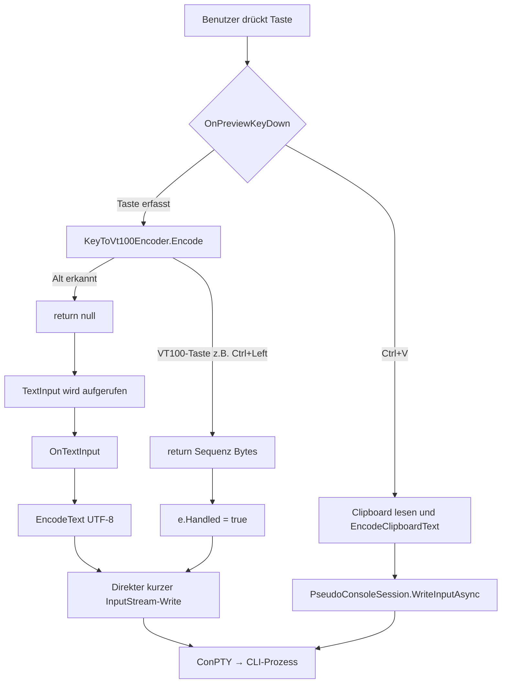

← [Zurück zur Übersicht](index.md)

# Terminal-Eingabeverarbeitung

Die Terminal-Komponente verarbeitet Tastaturereignisse, Zwischenablage-Inhalte und Standard-VT100-Sequenzen für die Kommunikation mit CLI-Prozessen. Dieses Dokument behandelt die Eingabeverarbeitung speziell für Alt Gr-Sonderzeichen, wortweise Cursor-Navigation und robustes Copy & Paste in Pseudokonsolen-Sitzungen.

## Beschreibung

### Zweck

Ermöglichung der Eingabe von Sonderzeichen über Alt Gr (z. B. "@", "{", "}", "|", "~", "`" auf deutschem Tastaturlayout), wortweiser Cursor-Navigation mit Ctrl+Pfeiltasten und vollständiger Übertragung langer mehrzeiliger Clipboard-Inhalte in CLI-Prozessen.

### Funktionsweise

Wenn der Benutzer eine Taste drückt, wird das Ereignis vom Windows Presentation Foundation (WPF)-Control erfasst und durchläuft folgende Schritte:

1. **Vorverarbeitung:** `OnPreviewKeyDown` prüft, ob die Taste eine Sonderbehandlung benötigt.
2. **VT100-Kodierung:** `KeyToVt100Encoder.Encode()` konvertiert das Ereignis in eine VT100-Byte-Sequenz oder gibt `null` zurück.
3. **Text-Eingabe:** Für Tasten, die normale Zeichen erzeugen (inklusive Alt Gr-Sonderzeichen), wird das `TextInput`-Event genutzt, um UTF-8-kodierten Text zu erfassen.
4. **Eingabeschreiben:** Kodierte Bytes werden in den Input-Stream der `PseudoConsoleSession` geschrieben, die sie an den laufenden CLI-Prozess weiterleitet.

### Alt Gr-Sonderzeichen

Alt Gr ist eine Tastenkomination, die auf vielen europäischen Tastaturlayouts (deutsch, französisch, spanisch, etc.) verfügbar ist. Sie ermöglicht die Eingabe zusätzlicher Zeichen:

**Deutsches Tastaturlayout (Beispiele):**
- Alt Gr + 5 → `{`
- Alt Gr + 6 → `}`
- Alt Gr + Apostrophe → `~`
- Alt Gr + +/= → ``
- Alt Gr + < → `|`
- Alt Gr + Q → `@`

Wenn der Benutzer Alt Gr drückt, erkundet `KeyToVt100Encoder` das Alt-Modifier-Flag und gibt `null` zurück. Dies signalisiert dem Terminal-Control, dass die Tastenkombination keine spezielle VT100-Kodierung benötigt. Die WPF-Laufzeit verarbeitet die Komposition dann über das `TextInput`-Event, wo das resultierende Zeichen (z. B. `{`) als normaler Text erfasst wird.

### Wortweise Cursor-Navigation

Mit **Ctrl+Links** und **Ctrl+Rechts** kann der Cursor im CLI um ein ganzes Wort nach links oder rechts bewegt werden, statt um ein einzelnes Zeichen. Dies ist Standard in vielen CLI-Tools (bash, vim, nano, etc.).

`KeyToVt100Encoder` generiert die entsprechenden VT100-Sequenzen:
- **Ctrl+Left:** `\x1b[1;5D` (CSI-Sequenz für Ctrl+Left)
- **Ctrl+Right:** `\x1b[1;5C` (CSI-Sequenz für Ctrl+Right)

Diese Sequenzen sind in den meisten POSIX-Shells und modernen CLI-Tools standardisiert und werden automatisch als wortweise Navigation interpretiert.

### Robustes Copy & Paste

Mit **Ctrl+V** fügt das Terminal den aktuellen Text aus der Windows-Zwischenablage in die aktive CLI-Sitzung ein. Der Text wird vor dem asynchronen Schreiben als stabile Momentaufnahme gelesen; gleichzeitig wird die Zielsession festgehalten, damit ein laufender Paste-Vorgang nicht versehentlich in eine inzwischen angezeigte andere Sitzung schreibt.

Mehrzeilige Clipboard-Inhalte werden über `KeyToVt100Encoder.EncodeClipboardText()` normalisiert. Alle Zeilenumbruchsvarianten (`\n`, `\r\n`, `\r`) werden als Carriage Return (`\r`) an die Pseudokonsole weitergegeben. Zeichen wie Backticks, Pfade, Klammern, generische Typnamen, Umlaute und weitere Sonderzeichen bleiben als UTF-8 erhalten.

Lange Eingaben werden über die gemeinsame `PseudoConsoleSession.WriteInputAsync`-Schreiblogik übertragen. Diese serialisiert längere Eingaben pro Session, schreibt große Bytefolgen kontrolliert in Chunks, wartet jeden Chunk ab und führt am Ende einen Flush aus. Dadurch bleiben Reihenfolge und Vollständigkeit erhalten, auch wenn Paste, Promptversand oder Startbefehle zeitlich nah beieinander liegen. Normale kurze Tastatureingaben bleiben auf ihrem direkten Schreibpfad.

## Technischer Ablauf

### Alt Gr-Sonderzeichen (deutsches Tastaturlayout "Alt Gr + 5" = "{")

**Schritt 1: Tastaturereignis erfassen**

Das WPF-Framework ruft `OnPreviewKeyDown` auf, bevor die Taste durch normale Event-Behandlung verarbeitet wird.

```csharp
// e.Key = Key.OemPeriod oder eine andere Taste (abhängig vom Rasterlayout)
// e.KeyboardDevice.Modifiers = ModifierKeys.Alt (Alt Gr wird als Rechts-Alt erkannt)
```

**Schritt 2: VT100-Kodierung prüfen**

Die Methode `KeyToVt100Encoder.Encode()` extrahiert die Modifierer und prüft zunächst auf Alt:

```csharp
var alt = (e.KeyboardDevice.Modifiers & ModifierKeys.Alt) != 0;

if (alt)
    return null;  // Early Return: Überlasse Komposition dem TextInput-Event
```

**Schritt 3: TextInput-Event der WPF-Laufzeit**

Nachdem `OnPreviewKeyDown` das Event nicht als behandelt markiert, ruft WPF die Kompositions-Engine auf. Diese erzeugt basierend auf dem Tastaturlayout das resultierende Zeichen `{` und feuert `OnTextInput` mit dem komponierten Text auf.

**Schritt 4: Text als UTF-8 kodieren**

```csharp
if (!string.IsNullOrEmpty(e.Text))
{
    byte[] encoded = KeyToVt100Encoder.EncodeText(e.Text);  // "{" → [123] (UTF-8)
    await WriteToInputStreamAsync(encoded);
}
```

**Schritt 5: In Input-Stream schreiben**

Die kodierten Bytes werden in den Input-Stream der `PseudoConsoleSession` geschrieben, die sie an den laufenden CLI-Prozess weiterleitet.

### Ctrl+Left-Navigation (Cursor wortweise nach links)

**Schritt 1: Tastaturereignis erfassen**

```csharp
// e.Key = Key.Left
// e.KeyboardDevice.Modifiers = ModifierKeys.Control
```

**Schritt 2: VT100-Kodierung durchführen**

```csharp
var ctrl = (e.KeyboardDevice.Modifiers & ModifierKeys.Control) != 0;
var alt = (e.KeyboardDevice.Modifiers & ModifierKeys.Alt) != 0;

if (alt)
    return null;  // Alt überlässt Komposition TextInput

if (ctrl && e.Key == Key.Left)
    return Encoding.ASCII.GetBytes("\x1b[1;5D");  // VT100-Sequenz für Ctrl+Left
```

**Schritt 3: Event als behandelt markieren und schreiben**

```csharp
byte[]? encoded = KeyToVt100Encoder.Encode(e);

if (encoded != null)
{
    await WriteToInputStreamAsync(encoded);
    e.Handled = true;  // Event ist verarbeitet, TextInput wird nicht aufgerufen
}
```

**Schritt 4: In Input-Stream schreiben**

Die VT100-Sequenz `\x1b[1;5D]` wird in den Input-Stream geschrieben.

**Schritt 5: CLI-Prozess interpretiert Sequenz**

bash oder anderes POSIX-Shell empfängt die Sequenz `\x1b[1;5D` und interpretiert sie als "move cursor left by one word". Der Cursor springt zum Anfang des vorherigen Wortes.

### Ctrl+V-Paste eines langen mehrzeiligen Texts

**Schritt 1: Zielsession festhalten**

Beim Paste-Start übernimmt das `TerminalControl` die aktuell gebundene `PseudoConsoleSession` in eine lokale Variable. Diese Session bleibt das Ziel des Paste-Vorgangs, auch wenn die UI währenddessen zu einer anderen Aufgabe wechselt.

**Schritt 2: Clipboard-Text lesen und kodieren**

```csharp
var text = Clipboard.GetText();
byte[] encoded = KeyToVt100Encoder.EncodeClipboardText(text);
```

Der Encoder erhält den vollständigen Clipboard-Text und normalisiert Zeilenumbrüche auf `\r`.

**Schritt 3: Über gemeinsame Session-Schreiblogik übertragen**

```csharp
await session.WriteInputAsync(encoded);
```

`WriteInputAsync` serialisiert den Schreibvorgang pro Session. Bei langen Bytefolgen schreibt die Methode mehrere Chunks nacheinander und wartet jeden `WriteAsync`-Aufruf ab, bevor der nächste Chunk beginnt. Nach erfolgreichem Schreiben wird der Input-Stream geflusht.

**Schritt 4: CLI-Prozess empfängt vollständige Eingabe**

Der CLI-Prozess erhält die zusammenhängende Eingabe mit erhaltener Zeilenstruktur und unveränderten Sonderzeichen. Das gilt für Claude CLI ebenso wie für andere Plugins, die dieselbe `PseudoConsoleSession` nutzen.

## Diagramm: Tastaturereignis-Verarbeitung



## Beteiligte Klassen

| Klasse | Datei | Rolle |
|--------|-------|-------|
| `KeyToVt100Encoder` | `src/Softwareschmiede.App/Controls/KeyToVt100Encoder.cs` | Utility-Klasse für VT100-Kodierung aller Tastaturereignisse |
| `TerminalControl` | `src/Softwareschmiede.App/Controls/TerminalControl.cs` | WPF-UserControl, das Tastaturereignisse und Clipboard-Paste an den Encoder delegiert |
| `PseudoConsoleSession` | `src/Softwareschmiede/Infrastructure/Terminal/PseudoConsoleSession.cs` | Verwaltet Input/Output-Streams der ConPTY und serialisiert längere Input-Writes |

## Einschränkungen

- **Tastaturlayout-abhängigkeit:** Alt Gr-Unterstützung funktioniert nur auf Tastaturlayouts, die Alt Gr implementieren (deutsch, französisch, spanisch, etc.).
- **Terminal-abhängige Interpretation:** Die Wortweise-Navigation funktioniert nur in CLI-Tools, die diese VT100-Sequenzen interpretieren.
- **Keine Unterstützung für Shift+Ctrl+Pfeiltaste:** Diese Kombination wird nicht speziell unterstützt.
- **Clipboard-Quelle:** Paste nutzt die Windows-Zwischenablage über WPF. Nicht-textuelle Clipboard-Inhalte werden nicht eingefügt.
