# Architektur-Review: Softwareschmiede

> **Dokument-Typ:** Architektur-Review  
> **Projekt:** Softwareschmiede  
> **Speicherort:** `docs/improvements/architecture-review.md`  
> **Status:** ✅ Abgeschlossen  
> **Version:** 1.0.0  
> **Datum:** 2025  

---

## Verwandte Dokumente

- [Architektur-Blueprint](../architecture/architecture-blueprint.md)
- [Entity-Relationship-Modell](../architecture/entity-relationship-model.md)
- [Anforderungsanalyse](../requirements/requirements-analysis.md)

---

## Inhaltsverzeichnis

1. [Zusammenfassung (Executive Summary)](#1-zusammenfassung-executive-summary)
2. [Bewertung der Systemarchitektur](#2-bewertung-der-systemarchitektur)
3. [Bewertung der Plugin-Isolation](#3-bewertung-der-plugin-isolation)
4. [Bewertung der CLI-Prozesssteuerung](#4-bewertung-der-cli-prozesssteuerung)
5. [Bewertung der Streaming-Architektur](#5-bewertung-der-streaming-architektur)
6. [Bewertung des Datenbankdesigns](#6-bewertung-des-datenbankdesigns)
7. [Bewertung der Sicherheit](#7-bewertung-der-sicherheit)
8. [Bewertung der UI/UX-Architektur](#8-bewertung-der-uiux-architektur)
9. [Schwachstellen & Risiken](#9-schwachstellen--risiken)
10. [Verbesserungsvorschläge](#10-verbesserungsvorschläge)
11. [Offene Punkte](#11-offene-punkte)
12. [Fazit](#12-fazit)

---

## 1. Zusammenfassung (Executive Summary)

### Gesamtbewertung

**Softwareschmiede** weist eine solide, für den Einsatzzweck gut geeignete Architektur auf. Das gewählte Schichtenmodell, das Plugin-System und die Technologieentscheidungen sind im Großen und Ganzen durchdacht und angemessen. Die Anwendung ist für ihren spezifischen Kontext – Einzelnutzer, lokaler Windows-Betrieb, KI-gestützter Entwicklungsworkflow – gut konzipiert.

| Bereich | Bewertung | Kommentar |
|---|---|---|
| Systemarchitektur | ✅ Gut | Klares Schichtenmodell, gute Separation of Concerns |
| Plugin-Isolation | ✅ Gut | Interfaces klar definiert; DI-Ansatz sauber |
| CLI-Prozesssteuerung | ⚠️ Bedingt | Konzept solide; kritische Implementierungsrisiken vorhanden |
| Streaming-Architektur | ⚠️ Bedingt | Grundansatz korrekt; Race Conditions und Reconnect ungelöst |
| Datenbankdesign | ✅ Gut | Für Einsatzkontext angemessen; kleinere Lücken |
| Sicherheit | ✅ Gut | DPAPI-Ansatz korrekt; Token-Übergabe an CLI kritisch |
| UI/UX-Architektur | ✅ Gut | Klare Informationsarchitektur; ViewModel-Pattern vorgesehen |
| Erweiterbarkeit | ✅ Gut | Plugin-System für zukünftige Provider vorbereitet |

### Kritische Punkte (sofortiger Handlungsbedarf)

1. **CLI-Deadlock-Risiko** – `RunAsync` liest stdout/stderr möglicherweise sequenziell, was bei großem Output zu Deadlocks führt (→ Abschnitt 4)
2. **Token-Übergabe als CLI-Argument** – Tokens müssen zwingend als Umgebungsvariablen und **nicht** als Argument übergeben werden (→ Abschnitt 7)
3. **SignalR-Reconnect bei laufendem Streaming** – Verbindungsabbruch während KI-Streaming führt zu unsauberem Zustand (→ Abschnitt 5)
4. **Prozess-Cleanup bei Anwendungsabsturz** – Gestartete `gh copilot`-Prozesse können als Waisen zurückbleiben (→ Abschnitt 4)
5. **Fehlender Abbruchmechanismus in der UI** – Der Nutzer hat keine Möglichkeit, eine laufende KI-Session zu unterbrechen (→ Abschnitt 8)

---

## 2. Bewertung der Systemarchitektur

### 2.1 Schichtenmodell

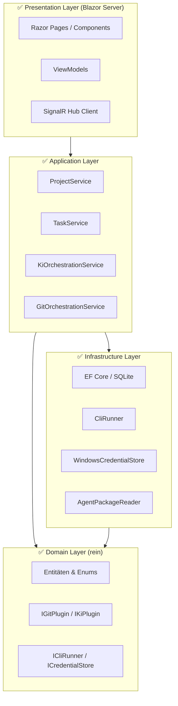

**Stärken:**

- Das 4-Schichten-Modell (Presentation → Application → Domain ← Infrastructure) folgt dem Dependency Inversion Principle konsequent.
- Der Domain-Layer ist rein: keine externen Abhängigkeiten, vollständig unit-testbar.
- Die Trennung zwischen `IGitPlugin`/`IKiPlugin` (Domain) und den konkreten Implementierungen (Infrastructure) ist architektonisch sauber.
- ViewModels als Vermittler zwischen Razor-Seiten und Application-Services sind vorgesehen – dies fördert Testbarkeit.

**Schwachstellen:**

- **Application → Infrastructure direkt:** Im Blueprint greifen Application Services direkt auf `Infrastructure`-Klassen zu (z. B. `EF Core DbContext`). Eine Repository-Abstraktion (z. B. `IProjectRepository`) würde die Kopplung weiter reduzieren und die Testbarkeit deutlich verbessern.
- **KiOrchestrationService trägt zu viel Verantwortung:** Der Service koordiniert Plugin-Aufruf, Protokollschreiben, SignalR-Broadcasting und Statusübergänge. Hier besteht das Risiko eines "God Object".
- **Fehlende explizite Fehler-Schicht:** Es ist nicht definiert, wie Fehler aus der Infrastructure nach oben propagiert werden und in welcher Schicht sie in UI-freundliche Meldungen übersetzt werden.

### 2.2 Separation of Concerns

| Concern | Zuständige Schicht | Bewertung |
|---|---|---|
| UI-Rendering | Presentation | ✅ klar abgegrenzt |
| Anwendungslogik | Application | ⚠️ teilweise zu viel in einem Service |
| Fachregeln | Domain | ✅ sauber isoliert |
| Datenzugriff | Infrastructure | ✅ via EF Core |
| CLI-Ausführung | Infrastructure | ✅ via ICliRunner |
| Fehlerübersetzung | unklar | ❌ nicht definiert |
| Protokollierung (Logging) | unklar | ❌ kein technisches Logging-Konzept definiert |

---

## 3. Bewertung der Plugin-Isolation

### 3.1 Interface-Design

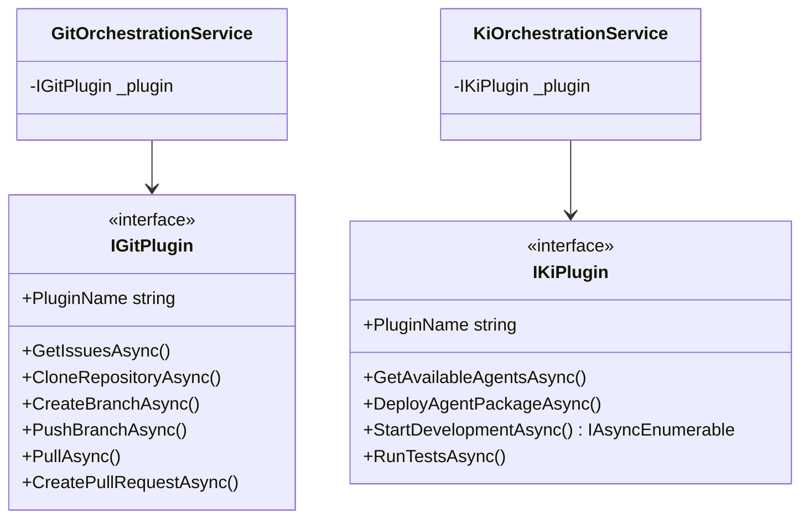

**Stärken:**

- Die Interfaces sind gut definiert: alle Operationen sind asynchron, alle Signaturen übergeben `CancellationToken`.
- `StartDevelopmentAsync` als `IAsyncEnumerable<string>` ist der richtige Ansatz für Streaming.
- Die DI-Registrierung über Interfaces gewährleistet einfachen Austausch.
- `PluginName` als Property ermöglicht Identifikation ohne Typprüfung.

**Schwachstellen:**

**Plugin-Registrierung als `AddScoped<IGitPlugin, GitHubPlugin>()`:**
- Bei der aktuellen Registrierung kann immer nur ein Plugin eines Typs aktiv sein. Wenn ein Nutzer mehrere Repositories mit unterschiedlichen Providern (z. B. GitHub und Gitea) verwalten möchte, ist dies nicht möglich.
- **Empfehlung:** Plugin-Factory oder Named-Services-Ansatz (`IEnumerable<IGitPlugin>` + Auswahl nach `PluginTyp`).

**Fehlerbehandlung in Plugins:**
- Wirft ein Plugin eine unkategorisierte Exception, fängt der `KiOrchestrationService` diese ungefiltert. Es fehlen Plugin-spezifische Ausnahmetypen (z. B. `PluginException`, `AuthenticationException`).
- **Empfehlung:** Basisklasse `PluginException` mit Untertypen; Application-Layer mappt auf Domänen-Fehlertypen.

**Kein Health-Check / Verfügbarkeitsprüfung:**
- Das Interface enthält keine Methode zur Prüfung, ob das Plugin verfügbar ist (z. B. `gh` CLI installiert, Token gültig).
- **Empfehlung:** `Task<PluginHealthResult> CheckHealthAsync(CancellationToken ct)` zum Interface hinzufügen.

**Fehlende Metadaten:**
- Plugins deklarieren nicht, welche Features sie unterstützen (z. B. ob ein Git-Plugin Pull Requests kann). Bei zukünftigen Plugins ohne PR-Unterstützung würde dies zu Laufzeitfehlern führen.
- **Empfehlung:** `PluginCapabilities`-Flags-Enum zum Interface hinzufügen.

### 3.2 Plugin-Fehlerszenarien

| Szenario | Aktueller Stand | Risiko |
|---|---|---|
| `gh` CLI nicht installiert | Exception beim ersten Aufruf | ⚠️ Mittel |
| Token abgelaufen | CLI-Fehler → Exception → unklar, was in UI passiert | 🔴 Hoch |
| Netzwerk nicht erreichbar | Timeout nach konfigurierbarer Zeit | ⚠️ Mittel |
| Plugin-Prozess hängt sich auf | Timeout via CancellationToken | ✅ Abgedeckt |
| Mehrere gleichzeitige Plugin-Aufrufe | Keine Synchronisierung beschrieben | ⚠️ Mittel |

---

## 4. Bewertung der CLI-Prozesssteuerung

### 4.1 Prozessstart und RunAsync

**Kritisches Risiko – Deadlock bei sequentiellem Lesen von stdout/stderr:**

Wenn `RunAsync` stdout und stderr sequenziell und vollständig liest (erst stdout, dann stderr), kann ein Deadlock entstehen: Der Prozess schreibt so viel in stderr, dass der Puffer voll läuft und blockiert, während die Anwendung noch wartet, dass stdout endet.

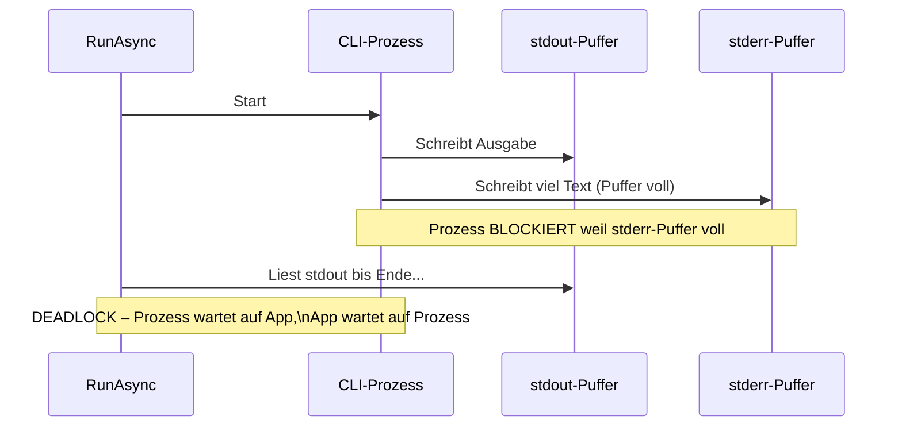

**Empfehlung:** stdout und stderr parallel und asynchron lesen – z. B. mit `Task.WhenAll` auf beide `ReadToEndAsync`-Aufrufe oder via separater `OutputDataReceived`/`ErrorDataReceived`-Events.

**Weitere Risiken in `RunAsync`:**

| Risiko | Beschreibung | Bewertung |
|---|---|---|
| Prozess-Timeout | `WaitForExitAsync(ct)` mit CancellationToken ist korrekt, aber kill-Verhalten nach Cancel unklar | ⚠️ Mittel |
| Zombie-Prozesse | Nach `process.Kill()` werden Child-Prozesse (z. B. von `gh`) möglicherweise nicht beendet | 🔴 Hoch |
| Exit-Code ignoriert | Wenn Exit-Code nicht immer > 0 bei Fehler: falsche Fehlererkennung | ⚠️ Mittel |
| Encoding | `StandardOutputEncoding`/`StandardErrorEncoding` sollte explizit auf UTF-8 gesetzt werden | ⚠️ Mittel |

### 4.2 StreamAsync und Channel-Ansatz

**Stärken:**
- `System.Threading.Channels.Channel<string>` als Puffer zwischen Event-Callback und `IAsyncEnumerable` ist der richtige Ansatz.
- `CancellationToken` → `process.Kill()` ist korrekt vorgesehen.

**Schwachstellen:**

**Channel-Completion bei stderr-Fehler:**
- Wenn der Prozess mit Fehler endet, muss der Channel korrekt mit einer Exception abgeschlossen werden (`Writer.Complete(exception)`), damit der Consumer den Fehler erhält und nicht ewig wartet.

**stderr-Puffer und Streaming:**
- Die Architektur sieht vor, stderr parallel zu puffern und am Ende auszuwerten. Wenn stderr sehr groß wird (z. B. crash dumps), kann dies den Speicher belasten.
- **Empfehlung:** stderr auf eine maximale Puffergröße begrenzen.

**Prozess-Cleanup bei Anwendungsabsturz:**
- Stürzt die Blazor-Anwendung ab, bleiben gestartete `gh copilot`-Prozesse als verwaiste Prozesse zurück.
- **Empfehlung:** Eine Prozess-Registry implementieren, die alle gestarteten Prozesse verfolgt, und beim Anwendungsstart eventuell noch laufende Prozesse identifiziert und beendet.

**Child-Prozess-Terminierung:**
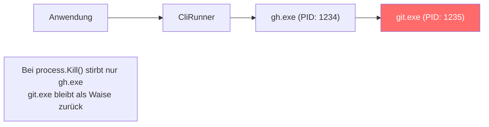
**Empfehlung:** `Job Objects` (Windows) oder `Process.Kill(entireProcessTree: true)` (.NET 5+) verwenden.

### 4.3 Prozess-Lebenszyklus

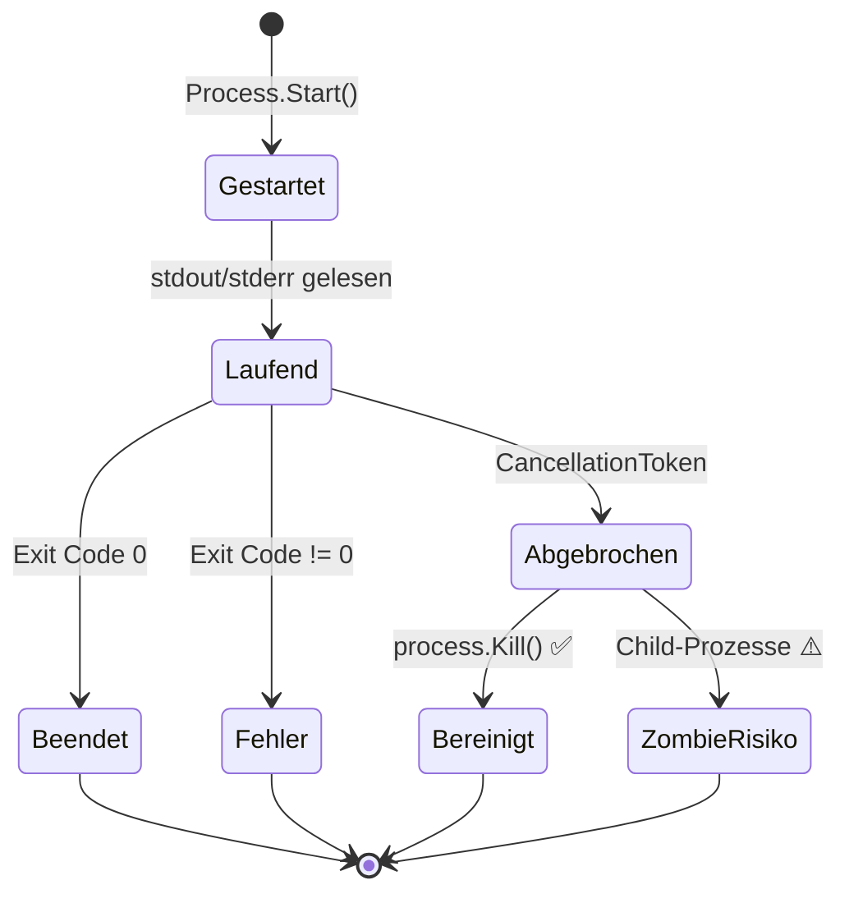

---

## 5. Bewertung der Streaming-Architektur

### 5.1 Ende-zu-Ende Streaming

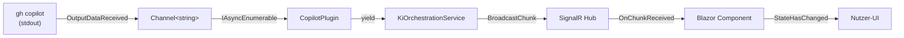

**Stärken:**
- Das Durchreichen als `IAsyncEnumerable<string>` durch alle Schichten ist clean und backpressure-freundlich.
- SignalR als Transport ist für Blazor Server die native und richtige Wahl.
- Das Konzept vermeidet Polling vollständig.

**Schwachstellen:**

### 5.2 Race Conditions

**Race Condition 1: Doppeltes Streaming**

Wenn der Nutzer den Prompt-Button doppelt drückt oder die Seite neu lädt, könnten zwei parallele KI-Prozesse gestartet werden, die beide in denselben `Protokolleintrag` schreiben.

**Empfehlung:** Status-Guard im `KiOrchestrationService`: Nur wenn `Aufgabe.Status != KiAktiv` darf ein neuer Prozess gestartet werden; Button in UI während `KiAktiv` deaktivieren.

**Race Condition 2: Protokolleintrag vor Stream-Ende**

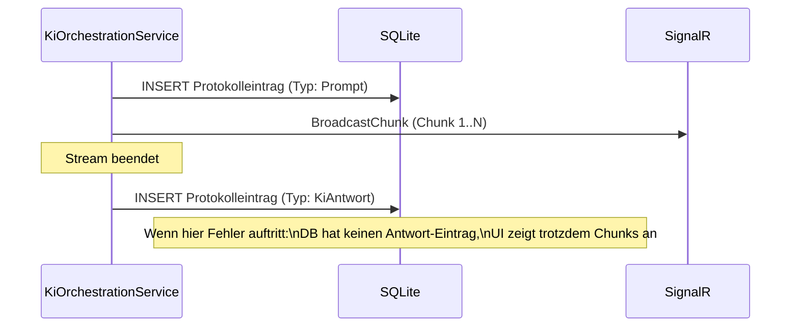

**Empfehlung:** Vollständige KI-Antwort im Speicher akkumulieren und erst nach erfolgreichem Stream-Ende als Protokolleintrag speichern. Alternativ: Streaming-Protokolleinträge als "In-Progress" markieren und erst am Ende finalisieren.

### 5.3 Verbindungsabbruch während Streaming

**Nicht adressiertes Szenario:**
- SignalR-Verbindung bricht während des KI-Streamings ab (z. B. Browser-Tab geschlossen, Netzwerk kurz weg).
- Der KI-Prozess läuft weiter, aber der Client empfängt keine Chunks mehr.
- Bei Reconnect sieht der Client den Aufgaben-Status `KiAktiv`, aber kein laufendes Streaming.

**Empfehlung:**
1. Beim SignalR-Reconnect den aktuellen Streaming-Zustand abfragen (z. B. "letzten Chunk" abrufen).
2. Alternativ: Chunks temporär in einem In-Memory-Store (oder der DB) zwischenspeichern und bei Reconnect nachliefern.
3. Mindestens: Dem Nutzer nach Reconnect einen klaren Hinweis geben, dass eine KI-Session läuft.

### 5.4 Skalierungsbetrachtung

Da es sich um eine Einzelnutzer-Anwendung handelt, sind echte Skalierungsprobleme nicht relevant. Dennoch ist zu beachten:

- **Große KI-Ausgaben:** Bei sehr langen Streaming-Sessions (> 10.000 Zeilen) kann die akkumulierte Ausgabe im Protokoll-Viewer performance-relevant werden. Ein virtualisiertes Rendering ist zu empfehlen.
- **Viele parallele Protokolleinträge:** `Protokolleintraege` wächst unbegrenzt. Eine Archivierungsstrategie ist langfristig sinnvoll.

---

## 6. Bewertung des Datenbankdesigns

### 6.1 ERM-Bewertung

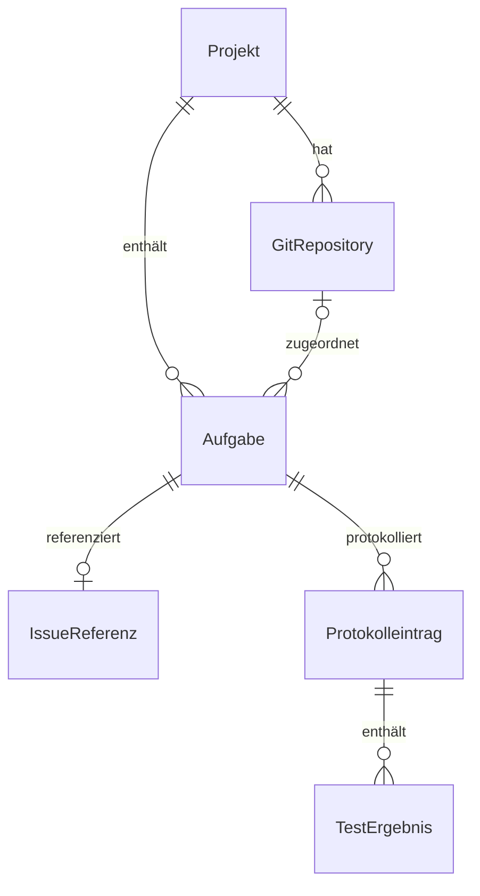

**Stärken:**
- Die Normalisierung ist korrekt: keine redundanten Felder zwischen Entitäten.
- `IssueReferenz` als eigene Entität (statt eingebetteter Felder in `Aufgabe`) ist sauber und ermöglicht zukünftige Erweiterungen.
- Die Verwendung von `Guid` als Primärschlüssel ist für lokal generierte IDs korrekt.
- `AsNoTracking()` für Leseabfragen und explizite Transaktionen für Statusübergänge sind gut durchdacht.

**Schwachstellen:**

**Labels als JSON-String (`string Labels`):**
- Das Speichern von Labels als JSON-Array in einer `string`-Spalte ist pragmatisch, aber schränkt Abfragemöglichkeiten ein (kein "Alle Aufgaben mit Label X"-Query möglich).
- **Für aktuellen Scope:** Akzeptabel, da Labels nur zur Anzeige genutzt werden.
- **Langfristig:** EF Core 7+ `JSON Columns` oder eine separate `Label`-Tabelle erwägen.

**`PluginTyp` als String:**
- In `GitRepository` und `PluginKonfiguration` wird `PluginTyp` als freier String gespeichert (z. B. `"GitHub"`). Dies kann zu Inkonsistenzen führen wenn Tippfehler auftreten.
- **Empfehlung:** Enum-Typ oder Konstanten-Klasse für Plugin-Typen definieren.

**Fehlender Soft-Delete:**
- Beim Löschen eines Projekts werden alle verknüpften Daten (Aufgaben, Protokolle) unwiederbringlich gelöscht. Bei einem versehentlichen Löschen gibt es keine Wiederherstellungsmöglichkeit.
- **Empfehlung:** `IsDeleted`-Flag und Soft-Delete-Filter im DbContext erwägen.

**`ProtokollTyp` Inkonsistenz:**
- Im Blueprint ist `GitAktion` als Protokoll-Typ definiert, im ERM fehlt dieser Typ. Die ERM-Enumeration lautet `Prompt | Antwort | StatusUebergang | TestErgebnis`, das Blueprint definiert zusätzlich `GitAktion`.
- **Empfehlung:** Konsistenz zwischen Blueprint und ERM herstellen.

### 6.2 Performance und Concurrency

| Szenario | Risiko | Bewertung |
|---|---|---|
| Gleichzeitiger Schreibzugriff | SQLite unterstützt nur einen Writer gleichzeitig; bei Blazor Server-Rendering können mehrere Requests parallel laufen | ⚠️ Mittel |
| N+1-Problem bei Dashboard | Dashboard lädt alle aktiven Aufgaben – ohne explizites `Include()` könnten Projekte per Lazy Loading nachgeladen werden | ⚠️ Mittel |
| Protokoll wächst unbegrenzt | Pro Aufgabe können hunderte Einträge entstehen; kein Archivierungskonzept | ⚠️ Mittel |
| WAL-Mode für SQLite | WAL (Write-Ahead Logging) ist für bessere Concurrency empfohlen, aber nicht explizit erwähnt | ⚠️ Mittel |

**Empfehlung für SQLite WAL:**
```csharp
// In Program.cs / DbContext-Konfiguration
options.UseSqlite("Data Source=...", o =>
    o.CommandTimeout(30))
    .UseQueryTrackingBehavior(QueryTrackingBehavior.NoTracking);

// Nach Migration:
await db.Database.ExecuteSqlRawAsync("PRAGMA journal_mode=WAL;");
```

### 6.3 Indizes-Vollständigkeit

| Definierter Index | Bewertung |
|---|---|
| `Aufgaben.ProjektId` | ✅ Korrekt – für Aufgabenlisten |
| `Protokolleintraege.AufgabeId` | ✅ Korrekt – für Protokoll-Abruf |
| `Protokolleintraege.Zeitstempel` | ✅ Korrekt – für Sortierung |
| `Projekte.Status` | ✅ Korrekt – für Dashboard-Filter |
| `GitRepositories.ProjektId` | ❌ Fehlt – für Repository-Verknüpfungen |
| `Aufgaben.Status` | ❌ Fehlt – für Status-Filter im Dashboard |
| `IssueReferenzen.AufgabeId` | ❌ Fehlt – für IssueReferenz-Lookup (UNIQUE impliziert Index, aber explizit dokumentieren) |

---

## 7. Bewertung der Sicherheit

### 7.1 Windows Credential Store (DPAPI)

**Stärken:**
- Windows Credential Store mit DPAPI ist für eine lokale Windows-Anwendung die richtige Wahl.
- Tokens werden nicht in DB oder Konfigurationsdateien gespeichert.
- Klare Namenskonvention für Credential-Targets (`Softwareschmiede/GitHub/PAT`).
- `ICredentialStore`-Interface ermöglicht Mock in Tests und eventuelle Portierung.

### 7.2 Token-Übergabe an CLI-Prozesse

**Kritisches Sicherheitsrisiko:**

Der Blueprint beschreibt, dass Tokens als Umgebungsvariablen übergeben werden:
> "Token werden als Umgebungsvariablen an CLI-Prozesse übergeben (nicht über Kommandozeilenargumente)"

Dies ist die richtige Entscheidung. **Die Implementierung muss sicherstellen**, dass dies tatsächlich so umgesetzt wird:

```csharp
// RICHTIG: Token als Umgebungsvariable
var psi = new ProcessStartInfo("gh");
psi.EnvironmentVariables["GH_TOKEN"] = token; // ✅ Nicht in Prozessliste sichtbar

// FALSCH: Token als Argument
var psi = new ProcessStartInfo("gh", $"--token {token}"); // ❌ In Prozessliste sichtbar
```

**Empfehlung:** Im `ICliRunner.RunAsync`/`StreamAsync` einen Parameter für Umgebungsvariablen hinzufügen, um die Token-Übergabe zu standardisieren.

### 7.3 Weitere Sicherheitsrisiken

| Risiko | Beschreibung | Bewertung |
|---|---|---|
| **Pfad-Traversal** | `LokalerKlonPfad` und `AgentenpaketName` werden vom Nutzer beeinflusst; bei unsicherer Verwendung möglicherweise Pfad-Traversal-Angriff | ⚠️ Mittel (Einzelnutzer, lokal – geringes reales Risiko) |
| **Command-Injection** | Wenn Aufgaben-Titel oder Branchnamen direkt in CLI-Argumente eingebaut werden | 🔴 Hoch |
| **DB-Datei ungeschützt** | `softwareschmiede.db` in `%APPDATA%` ist nicht verschlüsselt; sensible Protokolle sind im Klartext | ⚠️ Mittel |
| **Protokoll-Inhalte** | KI-Antworten im Protokoll können sensible Code-Inhalte enthalten | ⚠️ Mittel (niedrige Priorität für Einzelnutzer) |
| **Keine HTTPS erzwungen** | Blazor Server lauscht lokal; bei Konfigurationsfehlern könnte die App über das lokale Netzwerk erreichbar sein | ⚠️ Mittel |

**Command-Injection-Risiko – besonders kritisch:**
```csharp
// GEFÄHRLICH wenn branchName aus User-Input stammt:
var args = $"checkout -b {branchName}"; // Wenn branchName = "main; rm -rf /"
// SICHER: Argumente als Array übergeben (ProcessStartInfo.ArgumentList)
psi.ArgumentList.Add("checkout");
psi.ArgumentList.Add("-b");
psi.ArgumentList.Add(branchName); // ✅ Kein Shell-Parsing
```

**Empfehlung:** `ProcessStartInfo.ArgumentList` statt `Arguments`-String verwenden; alle User-Inputs validieren (Branch-Name-Format, Pfade).

### 7.4 Sicherheitsempfehlungen-Zusammenfassung

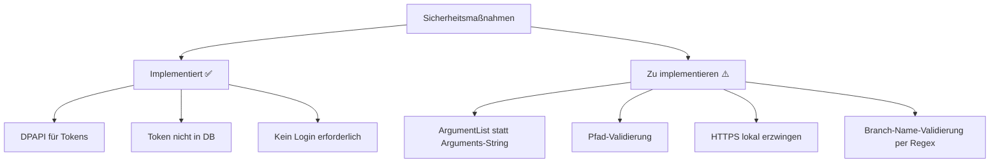

---

## 8. Bewertung der UI/UX-Architektur

### 8.1 Informationsarchitektur

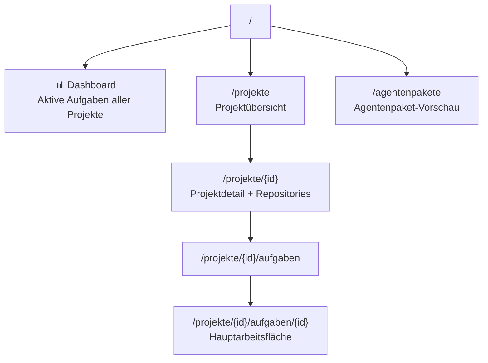

**Stärken:**
- Klare Hierarchie: Projekt → Aufgabe → Protokoll ist intuitiv.
- Das Dashboard als Startseite mit Übersicht aktiver Aufgaben ist ergonomisch sinnvoll.
- Die Aktionsleiste mit Icon-Buttons ist ein konsistentes Interaktionsmuster.
- ViewModel-Pattern schützt Razor-Seiten vor Logikschleicherei.
- Responsive Design mit Mobile-Breakpoints ist vorgesehen.

**Schwachstellen:**

**Fehlender Abbruch-Button für KI-Session:**
- Die `AufgabeDetail`-Seite zeigt keinen expliziten "KI-Session abbrechen"-Button. Dies ist für den Nutzer kritisch, wenn die KI-Ausgabe in eine falsche Richtung geht oder hängt.
- **Empfehlung:** Während `KiAktiv`: Abbruch-Button hervorheben; Prompt-Eingabe und andere Git-Aktionen deaktivieren.

**Keine Fortschrittsanzeige für git-Operationen:**
- Operationen wie `CloneRepositoryAsync` können mehrere Minuten dauern. Ohne Feedback denkt der Nutzer, die Anwendung sei eingefroren.
- **Empfehlung:** Für lang laufende Git-Operationen ebenfalls Streaming-Ausgabe anzeigen oder zumindest einen Spinner mit Status-Text.

**Protokoll-Viewer-Performance:**
- Bei vielen hundert Protokolleinträgen kann der DOM-Aufbau in Blazor langsam werden.
- **Empfehlung:** Blazor `Virtualize`-Komponente für den Protokoll-Viewer verwenden.

**Keine Breadcrumb-Navigation:**
- Bei tiefer Navigation (Projekt → Aufgabe → Protokoll) fehlt dem Nutzer ein Zurück-Mechanismus ohne Browser-Back.
- **Empfehlung:** Breadcrumb-Leiste über der Aktionsleiste.

### 8.2 Interaktionsdesign

| Interaktion | Status | Bewertung |
|---|---|---|
| Aufgabe aus Issue anlegen | Definiert | ✅ |
| KI-Session starten | Definiert | ✅ |
| KI-Session abbrechen | Nicht definiert | ❌ Fehlt |
| Git-Commit mit Nachricht | Nicht definiert | ❌ Fehlt |
| Fehler-Feedback bei CLI-Fehler | Nicht definiert | ❌ Fehlt |
| Bestätigungsdialoge (Löschen) | Teilweise erwähnt | ⚠️ |
| Reset-Optionen (soft/mixed/hard) | Erwähnt | ⚠️ Zu komplex für Einzelnutzer? |

### 8.3 i18n-Vorbereitung

Die Verwendung von `.resx`-Ressourcendateien ist vorgesehen – dies ist eine gute Entscheidung, die nachträgliche Mehrsprachigkeit ermöglicht, ohne Code zu ändern. ✅

---

## 9. Schwachstellen & Risiken

### 9.1 Priorisierte Risiko-Liste

#### 🔴 Kritisch

| ID | Schwachstelle | Betroffener Bereich | Auswirkung |
|---|---|---|---|
| R-01 | **Deadlock in `RunAsync`** bei großem stderr-Output | CLI-Prozesssteuerung | Anwendung hängt sich auf; Aufgabe bleibt in `KiAktiv` stecken |
| R-02 | **Token als CLI-Argument** (wenn nicht korrekt umgesetzt) | Sicherheit | API-Token in Prozessliste sichtbar; Token-Diebstahl möglich |
| R-03 | **Command-Injection** über Branch-Name/Pfade | Sicherheit | Ausführung beliebiger Befehle |
| R-04 | **Zombie-Prozesse** bei `process.Kill()` ohne Child-Termination | CLI-Prozesssteuerung | Ressourcen-Leak; unerwartetes Verhalten |

#### 🟠 Hoch

| ID | Schwachstelle | Betroffener Bereich | Auswirkung |
|---|---|---|---|
| R-05 | **SignalR-Reconnect** während laufendem Streaming | Streaming-Architektur | Nutzer sieht keine Ausgabe; KI-Status unklar |
| R-06 | **Channel nicht bei Fehler abgeschlossen** | CLI-Prozesssteuerung | Consumer hängt ewig; kein Fehler-Feedback |
| R-07 | **Kein Plugin-Health-Check** beim Start | Plugin-System | Fehler erst beim ersten Aufruf sichtbar |
| R-08 | **KiOrchestrationService als God Object** | Systemarchitektur | Hohe Kopplung; schwer testbar; Änderungsrisiko |
| R-09 | **Doppel-Click Schutz fehlt** für KI-Start | Streaming-Architektur | Zwei parallele KI-Prozesse für eine Aufgabe |

#### 🟡 Mittel

| ID | Schwachstelle | Betroffener Bereich | Auswirkung |
|---|---|---|---|
| R-10 | **Fehlende Repository-Abstraktion** (kein IRepository) | Systemarchitektur | Application-Services direkt an EF Core gekoppelt |
| R-11 | **SQLite ohne WAL-Mode** | Datenbankdesign | Concurrency-Probleme bei parallelen Blazor-Requests |
| R-12 | **N+1-Risiko** im Dashboard | Datenbankdesign | Performance-Probleme bei vielen Projekten |
| R-13 | **Fehlende Indizes** (`GitRepositories.ProjektId`, `Aufgaben.Status`) | Datenbankdesign | Langsame Abfragen |
| R-14 | **PluginTyp als freier String** | Datenbankdesign | Inkonsistenz bei Tippfehlern |
| R-15 | **Keine Breadcrumb-Navigation** | UI/UX | Schlechte Orientierung bei tiefer Navigation |
| R-16 | **Kein Abbruch-Button** für KI-Session in UI | UI/UX | Nutzer kann hängende KI nicht abbrechen |
| R-17 | **`ProtokollTyp` Inkonsistenz** Blueprint vs. ERM | Systemarchitektur | `GitAktion` fehlt im ERM |
| R-18 | **Kein Soft-Delete** | Datenbankdesign | Versehentlich gelöschte Projekte sind weg |

#### 🟢 Niedrig

| ID | Schwachstelle | Betroffener Bereich | Auswirkung |
|---|---|---|---|
| R-19 | **Labels als JSON-String** | Datenbankdesign | Keine DB-seitigen Label-Abfragen möglich |
| R-20 | **Protokoll wächst unbegrenzt** | Datenbankdesign | Langfristig: Speicher-/Performance-Probleme |
| R-21 | **Fehlende Fortschrittsanzeige** für Git-Operationen | UI/UX | Nutzer denkt, Anwendung ist eingefroren |
| R-22 | **Kein technisches Logging-Konzept** | Systemarchitektur | Debugging ohne Logs schwierig |
| R-23 | **stderr-Puffer ohne Größenbeschränkung** | CLI-Prozesssteuerung | Memory-Leak bei crashenden Prozessen |
| R-24 | **Einzelnes Plugin pro Typ** über DI | Plugin-System | Kein Multi-Provider-Support möglich |
| R-25 | **Protokoll-Viewer ohne Virtualisierung** | UI/UX | Performance bei vielen Einträgen |

---

## 10. Verbesserungsvorschläge

### 10.1 Sofortmaßnahmen (vor der ersten Implementierung)

#### V-01: Deadlock-Prävention in `RunAsync` (kritisch, R-01)

```csharp
// KORREKT: Paralleles Lesen von stdout und stderr
public async Task<CliResult> RunAsync(string command, string args, 
    string workingDir, CancellationToken ct)
{
    using var process = new Process { StartInfo = CreatePsi(command, args, workingDir) };
    process.Start();
    
    // BEIDE parallel lesen – verhindert Deadlock
    var stdoutTask = process.StandardOutput.ReadToEndAsync(ct);
    var stderrTask = process.StandardError.ReadToEndAsync(ct);
    
    await process.WaitForExitAsync(ct);
    
    var stdout = await stdoutTask;
    var stderr = await stderrTask;
    
    return new CliResult(process.ExitCode, stdout, stderr);
}
```

#### V-02: Child-Prozess-Terminierung (kritisch, R-04)

```csharp
// .NET 5+ unterstützt das Beenden aller Child-Prozesse
process.Kill(entireProcessTree: true);
```

#### V-03: ArgumentList statt Arguments-String (kritisch, R-03)

```csharp
// Argumente als Liste übergeben – kein Shell-Parsing, kein Injection-Risiko
var psi = new ProcessStartInfo("gh");
psi.ArgumentList.Add("issue");
psi.ArgumentList.Add("list");
psi.ArgumentList.Add("--repo");
psi.ArgumentList.Add(repositoryName); // Sicher, auch mit Sonderzeichen
```

#### V-04: Branch-Name-Validierung (kritisch, R-03)

```csharp
// Domain-Validierung für Branch-Namen
public static class BranchNameValidator
{
    private static readonly Regex ValidBranchName = 
        new(@"^[a-zA-Z0-9/_\-\.]+$", RegexOptions.Compiled);
    
    public static bool IsValid(string name) => 
        ValidBranchName.IsMatch(name) && 
        !name.Contains("..") && 
        name.Length <= 250;
}
```

### 10.2 Kurzfristige Verbesserungen (erste Iteration)

#### V-05: Plugin-Health-Check (hoch, R-07)

```csharp
public interface IGitPlugin
{
    // ... bestehende Methoden
    Task<PluginHealthResult> CheckHealthAsync(CancellationToken ct);
}

public record PluginHealthResult(bool IsHealthy, string? ErrorMessage);
```

Beim Anwendungsstart alle registrierten Plugins prüfen und dem Nutzer im Dashboard warnen.

#### V-06: Guard gegen doppelten KI-Start (hoch, R-09)

Im `KiOrchestrationService`:
```csharp
public async Task StartDevelopmentAsync(...)
{
    var aufgabe = await _taskService.GetByIdAsync(aufgabeId, ct);
    
    if (aufgabe.Status == AufgabeStatus.KiAktiv)
        throw new InvalidOperationException("KI-Session läuft bereits für diese Aufgabe.");
    
    // Status atomar setzen
    await _taskService.SetStatusAsync(aufgabeId, AufgabeStatus.KiAktiv, ct);
    // ... dann KI starten
}
```

#### V-07: SQLite WAL-Mode aktivieren (mittel, R-11)

```csharp
// In Program.cs nach Migration:
using var scope = app.Services.CreateScope();
var db = scope.ServiceProvider.GetRequiredService<SoftwareschmiededDbContext>();
await db.Database.MigrateAsync();
await db.Database.ExecuteSqlRawAsync("PRAGMA journal_mode=WAL;");
await db.Database.ExecuteSqlRawAsync("PRAGMA synchronous=NORMAL;");
```

#### V-08: Fehlende Indizes ergänzen (mittel, R-13)

```csharp
// In SoftwareschmiededDbContext.OnModelCreating():
modelBuilder.Entity<GitRepository>()
    .HasIndex(r => r.ProjektId);

modelBuilder.Entity<Aufgabe>()
    .HasIndex(a => a.Status);

modelBuilder.Entity<IssueReferenz>()
    .HasIndex(i => i.AufgabeId)
    .IsUnique(); // Bereits als UNIQUE, aber explizit dokumentieren
```

#### V-09: ProtokollTyp-Konsistenz herstellen (mittel, R-17)

ERM und Blueprint angleichen: `GitAktion` als Protokolltyp im ERM ergänzen.

### 10.3 Mittelfristige Verbesserungen (nächste Iteration)

#### V-10: Repository-Abstraktion einführen (mittel, R-10)

```csharp
// Domain/Interfaces
public interface IProjectRepository
{
    Task<Projekt?> GetByIdAsync(Guid id, CancellationToken ct);
    Task<IReadOnlyList<Projekt>> GetAllActiveAsync(CancellationToken ct);
    Task AddAsync(Projekt projekt, CancellationToken ct);
    Task UpdateAsync(Projekt projekt, CancellationToken ct);
    Task DeleteAsync(Guid id, CancellationToken ct);
}

// Infrastructure implementiert das Interface
public class EfProjectRepository : IProjectRepository { ... }
```

#### V-11: Plugin-Factory für Multi-Provider (niedrig, R-24)

```csharp
// Statt einer einzelnen Registrierung:
builder.Services.AddScoped<IGitPlugin, GitHubPlugin>();

// Plugin-Factory für mehrere Provider:
builder.Services.AddScoped<IGitPlugin, GitHubPlugin>();
builder.Services.AddScoped<IGitPlugin, GitLabPlugin>(); // zukünftig

// Im Service:
public class GitOrchestrationService
{
    private readonly IEnumerable<IGitPlugin> _plugins;
    
    private IGitPlugin GetPlugin(string pluginTyp) =>
        _plugins.FirstOrDefault(p => p.PluginName == pluginTyp)
        ?? throw new PluginNotFoundException(pluginTyp);
}
```

#### V-12: Protokoll-Viewer virtualisieren (niedrig, R-25)

```razor
<Virtualize Items="@protokollEintraege" Context="eintrag">
    <ProtokollEintragComponent Eintrag="@eintrag" />
</Virtualize>
```

#### V-13: SignalR-Reconnect-Handling (hoch, R-05)

```csharp
// Im Blazor-Component:
protected override async Task OnAfterRenderAsync(bool firstRender)
{
    if (firstRender)
    {
        HubConnection.Reconnected += async (connectionId) =>
        {
            // Status neu laden und prüfen ob KI noch aktiv
            await RefreshAufgabeStatusAsync();
        };
    }
}
```

#### V-14: Soft-Delete einführen (niedrig, R-18)

```csharp
// In allen relevanten Entitäten:
public bool IsDeleted { get; set; } = false;
public DateTimeOffset? GelöschtAm { get; set; }

// In DbContext:
modelBuilder.Entity<Projekt>()
    .HasQueryFilter(p => !p.IsDeleted);
```

#### V-15: Technisches Logging (niedrig, R-22)

```csharp
// In Program.cs:
builder.Logging.AddConsole();
builder.Logging.AddDebug();

// In Services:
public class KiOrchestrationService
{
    private readonly ILogger<KiOrchestrationService> _logger;
    
    public async Task StartDevelopmentAsync(...)
    {
        _logger.LogInformation("KI-Session gestartet für Aufgabe {AufgabeId}", aufgabeId);
        // ...
        _logger.LogError(ex, "KI-Session fehlgeschlagen für Aufgabe {AufgabeId}", aufgabeId);
    }
}
```

---

## 11. Offene Punkte

Die folgenden Fragen und Entscheidungen sind im Rahmen dieses Reviews aufgetaucht und sollten vor bzw. während der Implementierung explizit entschieden werden:

| # | Offener Punkt | Kategorie | Empfehlung |
|---|---|---|---|
| O-01 | **Multi-Plugin-Support:** Soll ein Nutzer gleichzeitig GitHub UND z. B. Gitea als Git-Provider nutzen können? → Beeinflusst Plugin-Registrierung fundamental | Plugin-System | Klarstellen; wenn ja: Plugin-Factory jetzt einplanen |
| O-02 | **Klon-Verwaltung:** Wer ist verantwortlich für das Aufräumen lokaler Klon-Verzeichnisse nach Aufgaben-Abschluss? Automatisch oder manuell? | Aufgaben-Lebenszyklus | Policy definieren (z. B. nach 30 Tagen löschen) |
| O-03 | **`ProjektStatus.Geloescht` im Blueprint, aber nicht im ERM:** Blueprint-Enum enthält `Geloescht`, ERM nicht. Soft- oder Hard-Delete? | Datenbankdesign | Angleichen; Soft-Delete empfohlen |
| O-04 | **Mehrere Repositories pro Aufgabe:** `Aufgabe.GitRepositoryId` ist optional und hat max. 1 Repository. Ist dies ausreichend, wenn ein Projekt mehrere Repositories hat? | Domänenmodell | Use Case klären |
| O-05 | **Agentenpaket-Deployment:** `DeployAgentPackageAsync` kopiert Dateien in den Repo-Klon. Soll dies vor jedem KI-Start automatisch passieren oder manuell ausgelöst werden? | KI-Workflow | Workflow definieren |
| O-06 | **Commit-Schritt:** Die Architektur erwähnt Commit als UI-Aktion, aber kein `CommitAsync` in `IGitPlugin`. Ist Commit eine eigene Plugin-Methode oder über `git` CLI direkt? | Plugin-Interface | `CommitAsync` in `IGitPlugin` aufnehmen |
| O-07 | **Maximale Streaming-Dauer:** Wie lange darf eine KI-Session maximal laufen, bevor ein automatisches Timeout greift? | Konfiguration | Konfigurierbaren Timeout festlegen (z. B. 30 Minuten) |
| O-08 | **Protokoll-Archivierung:** Ab wann werden alte Protokolleinträge archiviert oder gelöscht? | Datenbankdesign | Langfristige Strategie definieren |
| O-09 | **HTTPS lokal:** Soll die Anwendung HTTPS (selbstsigniertes Zertifikat) erzwingen, um versehentlichen LAN-Zugriff zu verhindern? | Sicherheit | HTTPS + Localhost-Binding empfehlen |
| O-10 | **`CommitAsync` fehlt in `IGitPlugin`** | Plugin-Interface | Methode ergänzen oder Workaround definieren |

---

## 12. Fazit

### Gesamtbewertung

Die Architektur der **Softwareschmiede** ist für ihren Einsatzzweck gut konzipiert und zeigt ein hohes Maß an Durchdachtheit. Das Schichtenmodell ist klar, das Plugin-System ist flexibel und die Technologieentscheidungen sind angemessen und begründet. Besonders positiv hervorzuheben sind:

- ✅ Konsequentes Interface-basiertes Design für maximale Testbarkeit und Austauschbarkeit
- ✅ Sicheres Token-Management über Windows DPAPI
- ✅ Durchdachtes Streaming-Konzept mit `IAsyncEnumerable` und Channel-Puffer
- ✅ Klar definierter Aufgaben-Lebenszyklus mit Statusmaschine
- ✅ Sinnvolle Technologieauswahl für einen lokalen Einzelnutzer-Betrieb

Die identifizierten Risiken sind überwiegend beherrschbar. **Vier Punkte erfordern zwingend Aufmerksamkeit vor der Implementierung:**

1. 🔴 **Deadlock-Prävention** bei parallelem stdout/stderr-Lesen
2. 🔴 **Command-Injection-Schutz** durch `ArgumentList` statt `Arguments`-String
3. 🔴 **Child-Prozess-Terminierung** mit `Kill(entireProcessTree: true)`
4. 🔴 **Token-Übergabe** ausschließlich als Umgebungsvariablen sicherstellen

### Empfehlung

> **Die Architektur ist grundsätzlich freigabefähig** unter der Bedingung, dass die vier kritischen Punkte vor Implementierungsbeginn adressiert werden. Die mittel- und langfristigen Verbesserungsvorschläge können iterativ in nachfolgenden Entwicklungsphasen eingebaut werden.

### Nächste Schritte

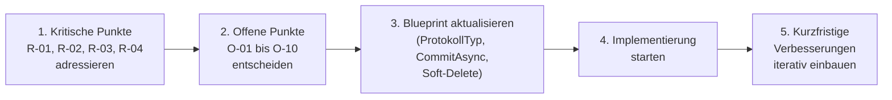

| Schritt | Maßnahme | Priorität | Aufwand |
|---|---|---|---|
| 1 | Kritische Fixes umsetzen (V-01 bis V-04) | 🔴 Kritisch | Klein |
| 2 | Offene Punkte O-01 bis O-10 entscheiden | 🟠 Hoch | Klein (Entscheidung) |
| 3 | Blueprint und ERM konsistent machen (V-09) | 🟡 Mittel | Klein |
| 4 | Plugin-Health-Check einbauen (V-05) | 🟠 Hoch | Mittel |
| 5 | SQLite WAL-Mode + fehlende Indizes (V-07, V-08) | 🟡 Mittel | Klein |
| 6 | Repository-Abstraktion prüfen (V-10) | 🟡 Mittel | Groß |
| 7 | Protokoll-Viewer virtualisieren (V-12) | 🟢 Niedrig | Klein |

---

*Review erstellt auf Basis: [Architektur-Blueprint v1.0](../architecture/architecture-blueprint.md), [Entity-Relationship-Modell v1.0](../architecture/entity-relationship-model.md), [Anforderungsanalyse v1.0](../requirements/requirements-analysis.md)*
