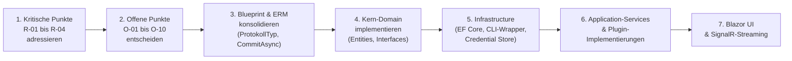

# Planungsübersicht – Softwareschmiede

> **Dokument-Typ:** Planungsübersicht (Orchestrator-Ergebnis)
> **Projekt:** Softwareschmiede
> **Erstellt:** 2025
> **Status:** ✅ Planungsphase abgeschlossen

---

## 1. Projektbeschreibung

**Softwareschmiede** ist eine webbasierte Einzelnutzer-Anwendung (Blazor Server, InteractiveServer-Modus), die den gesamten Workflow der KI-gestützten Softwareentwicklung auf einem lokalen Windows-Rechner verwaltet. Sie verbindet Projektmanagement, Git-Integration, Aufgabenverwaltung und KI-Steuerung in einer einheitlichen deutschen Benutzeroberfläche.

**Kernfunktionen:**
- Verwaltung mehrerer Softwareprojekte und deren Git-Repositories
- Strukturierte Aufgabenverwaltung (Issue-basiert oder freie Anforderungseingabe)
- KI-gestützter Entwicklungsprozess mit Echtzeit-Protokollierung
- Erweiterbares Plugin-System für Git-Provider und KI-Systeme
- Verwaltung von Agentenpaketen für KI-gestützte Entwicklung

---

## 2. Erstellte Planungsdokumente

| Dokument | Beschreibung | Link |
|----------|--------------|------|
| **Anforderungsanalyse** | Vollständige strukturierte Anforderungsanalyse mit FR/NFR-Tabellen, Use Cases und Akzeptanzkriterien | [requirements/requirements-analysis.md](requirements/requirements-analysis.md) |
| **Architektur-Blueprint** | Systemarchitektur, Technologieentscheidungen, UI/UX-Konzept, Qualitätsziele und Mermaid-Diagramme | [architecture/architecture-blueprint.md](architecture/architecture-blueprint.md) |
| **Entity-Relationship-Modell** | ERM-Diagramm, Entitätenübersicht, Beziehungen, Kardinalitäten und Modellierungsentscheidungen | [architecture/entity-relationship-model.md](architecture/entity-relationship-model.md) |
| **Architektur-Review** | Strukturiertes Review mit Schwachstellen, Risiken und priorisierten Verbesserungsvorschlägen | [improvements/architecture-review.md](improvements/architecture-review.md) |

---

## 3. Wichtigste Architekturentscheidungen

| Entscheidung | Begründung |
|--------------|------------|
| **Blazor Server (InteractiveServer)** | Echtzeitfähigkeit (SignalR), C#-Kompetenz, kein JavaScript-Framework erforderlich, lokal optimiert |
| **SQLite via EF Core** | Eingebettete DB ohne Server-Overhead, ideal für Einzelnutzer-Betrieb; Migrations für Schemaevolution |
| **Windows Credential Store (DPAPI)** | Sichere Token-Speicherung ohne Klartext in DB oder Code; betriebssystemintegriert |
| **`gh` CLI für GitHub-Plugin** | Keine direkte REST-API-Implementierung nötig; CLI abstrahiert Authentifizierung und Protokoll |
| **`copilot` CLI für KI-Plugin** | Direktzugang zu GitHub Copilot ohne proprietäre API-Integration |
| **Channel-basiertes CLI-Streaming** | Deadlock-sichere parallele stdout/stderr-Verarbeitung; `IAsyncEnumerable` für Echtzeit-UI |
| **Plugin-System via Interfaces** | `IGitPlugin` und `IKiPlugin` – austauschbar ohne Kernänderungen; vorbereitet für GitLab, Azure DevOps u.a. |
| **Festes Agentenpaket-Verzeichnis** | `<Programmverzeichnis>/agent-packages/` – kein Download, rein manuell, keine Konfiguration nötig |
| **Branch-Namenskonvention** | `task/<aufgaben-id>-<kurzname>` – eindeutig, nachvollziehbar, automatisch generiert |
| **4-Schichten-Architektur** | Presentation → Application → Domain → Infrastructure; Dependency Inversion für Testbarkeit |

---

## 4. Datenbankmodell – Überblick

Die 7 zentralen Entitäten:

```
Projekt (1) ──── (N) GitRepository
Projekt (1) ──── (N) Aufgabe
GitRepository (0..1) ──── (N) Aufgabe
Aufgabe (1) ──── (0..1) IssueReferenz
Aufgabe (1) ──── (N) Protokolleintrag
Protokolleintrag (1) ──── (N) TestErgebnis
PluginKonfiguration (unabhängig – speichert nur Credential-Key, kein Token)
```

---

## 5. Offene Punkte aus dem Architektur-Review

Die folgenden Punkte müssen **vor oder während der Implementierung** entschieden werden:

| # | Offener Punkt | Priorität |
|---|---------------|-----------|
| O-01 | **Multi-Plugin-Support:** Gleichzeitig mehrere Git-Provider (GitHub + GitLab)? → Plugin-Factory einplanen | 🟠 Hoch |
| O-02 | **Klon-Verwaltung:** Automatisches Aufräumen lokaler Verzeichnisse nach Aufgabenabschluss? | 🟠 Hoch |
| O-03 | **Soft-Delete vs. Hard-Delete:** `ProjektStatus.Geloescht` im Blueprint, aber nicht im ERM – angleichen | 🟡 Mittel |
| O-04 | **Mehrere Repositories pro Aufgabe:** Aktuell max. 1 – ausreichend? | 🟡 Mittel |
| O-05 | **Agentenpaket-Deployment:** Automatisch vor jedem KI-Start oder manuell auslösen? | 🟠 Hoch |
| O-06 | **`CommitAsync` in `IGitPlugin`:** Fehlt im Interface – ergänzen oder CLI-Direktaufruf? | 🟠 Hoch |
| O-07 | **Maximale Streaming-Dauer:** Konfigurierbares Timeout für KI-Session (Empfehlung: 30 Min.) | 🟡 Mittel |
| O-08 | **Protokoll-Archivierung:** Wann werden alte Einträge archiviert/gelöscht? | 🟢 Niedrig |
| O-09 | **HTTPS lokal erzwingen:** Selbstsigniertes Zertifikat für lokalen Betrieb? | 🟡 Mittel |
| O-10 | **`ProtokollTyp` Inkonsistenz:** Blueprint enthält `GitAktion`, ERM nicht – angleichen | 🟡 Mittel |

---

## 6. Kritische Punkte (vor Implementierungsstart adressieren)

> Diese vier Punkte müssen **zwingend** vor dem ersten Code beachtet werden:

| # | Problem | Lösung |
|---|---------|--------|
| **R-01** | **CLI-Deadlock-Risiko** – sequentielles Lesen von stdout/stderr | `Task.WhenAll(ReadToEndAsync(stdout), ReadToEndAsync(stderr))` |
| **R-02** | **Token als CLI-Argument** sichtbar in Prozessliste | Token ausschließlich als Umgebungsvariable (`GH_TOKEN`) übergeben |
| **R-03** | **Command-Injection** über Branch-Namen/Pfade | `ProcessStartInfo.ArgumentList` statt Arguments-String verwenden |
| **R-04** | **Zombie-Prozesse** bei Anwendungsabsturz | `process.Kill(entireProcessTree: true)` (.NET 5+) |

---

## 7. Empfohlene Implementierungsreihenfolge



---

*Erstellt durch den planning-orchestrator auf Basis der vollständig geklärten Anforderungen in `docs/requirements.md`.*

