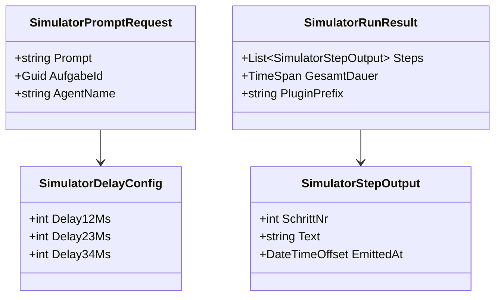

# Anforderungsanalyse – KI-Plugin-Simulator (4 feste Antworten + Wartezeiten)

**Primärquelle:** `606a91d3-d33c-4eba-8a3d-dbdf559c8c6b.copilot-task.md`  
**Lifecycle-Start:** `3a75d83d-dbce-486b-b4c5-1bc18469086b.copilot-task.md` („dann beginne auch bitte mit der umsetzung“)

## 1. Überblick und Projektkontext

### 1.1 Projektbeschreibung
Im bestehenden .NET-Plugin-System (`PluginManager`, `IKiPlugin`, `CliKiPluginBase`) wird ein zusätzliches KI-Plugin als **Simulator** umgesetzt. Das Plugin akzeptiert beliebige Prompts, liefert aber immer dieselbe 4-Schritt-Antwort mit konfigurierbaren Wartezeiten zwischen den Schritten.

### 1.2 Geschäftsziele
- Reproduzierbare Test- und Demo-Läufe ohne externe KI-CLI/API.
- Verlässliches Streaming-Verhalten für UI- und Protokolltests.
- Erweiterung des KI-Plugin-Portfolios neben **GitHub Copilot** und **Claude CLI**.

### 1.3 Stakeholder
- **Entwicklungsteam:** benötigt lokales, stabiles Testplugin.
- **QA:** benötigt deterministische Antworten inkl. Timing.
- **PO/Fachseite:** benötigt klare, implementierungsreife Spezifikation für den gestarteten Entwicklungszyklus.

### 1.4 Abgrenzung
- Bestehende Plugin-Architektur bleibt unverändert.
- Kein Ersatz für echte LLM-Plugins; ausschließlich simulatives Verhalten.

---

## 2. Funktionale Anforderungen

| Kennung | Beschreibung | Kategorie | Priorität | Status |
|---------|--------------|-----------|-----------|--------|
| **FR-1** | **Simulator-Plugin registrieren:** Neues Development-Automation-Plugin als .NET-Klassenbibliothek unter `plugins/` mit eindeutiger Plugin-ID und Discovery durch `PluginManager`. → [Plugin-Blueprint](../architecture/plugin-klassenbibliotheken-github-und-copilot-architecture-blueprint.md) · [KI-Plugin-Auswahl](../architecture/standardplugin-ki-plugin-auswahl-architecture-blueprint.md) | KI-Integration | MUST HAVE | 🔄 In Arbeit |
| **FR-1.1** | **Vertragstreue Implementierung:** Plugin implementiert vorhandenes KI-Vertragsmodell (`IKiPlugin`, `PluginType.DevelopmentAutomation`) ohne neue Host-Schnittstelle. | KI-Integration | MUST HAVE | 🔄 In Arbeit |
| **FR-2** | **Deterministische 4-Schritt-Ausgabe:** Jeder Prompt führt zu exakt 4 Ausgaben in fixer Reihenfolge. → [Requirements Plugin-System](plugin-klassenbibliotheken-github-und-copilot.md) | Kern-Feature | MUST HAVE | 🔄 In Arbeit |
| **FR-2.1** | **Schritt 1 Text:** **Antwort 1**: „Ich kümmere mich darum, die Anforderung zu verstehen.“ | Kern-Feature | MUST HAVE | 🔄 In Arbeit |
| **FR-2.2** | **Schritt 2 Text:** **Antwort 2**: „Ich habe die Anforderung verstanden. ich mache mir nun einen Plan.“ | Kern-Feature | MUST HAVE | 🔄 In Arbeit |
| **FR-2.3** | **Schritt 3 Text:** **Antwort 3**: „Der Plan ist fertig. Ich begebe mich nun an die Umsetzung.“ | Kern-Feature | MUST HAVE | 🔄 In Arbeit |
| **FR-2.4** | **Schritt 4 Text:** **Antwort 4**: „Fertig. Hier ist das Ergebnis:“ + hinterlegter Lorem-Ipsum-Block (unverändert, vollständig). | Kern-Feature | MUST HAVE | 🔄 In Arbeit |
| **FR-3** | **Wartezeiten zwischen Ausgaben:** Zwischen Schritt 1→2, 2→3 und 3→4 wird je eine Wartezeit angewendet; Standardwert 2000 ms, konfigurierbar als Plugin-Einstellung. | Datenverwaltung | MUST HAVE | 🔄 In Arbeit |
| **FR-3.1** | **Delay-Grenzen:** Zulässiger Bereich 0–10000 ms je Intervall; ungültige Werte fallen deterministisch auf 2000 ms zurück. | Robustheit | HIGH | 📋 Geplant |
| **FR-4** | **Streaming-Verhalten:** `StartDevelopmentAsync(...)` streamt Schritttexte per `IAsyncEnumerable<string>` direkt nach Ablauf des jeweiligen Delays (kein Puffer bis Laufende). | KI-Integration | MUST HAVE | 🔄 In Arbeit |
| **FR-5** | **Prompt-Akzeptanz:** Jeder Prompt (inkl. leerem Text) wird technisch angenommen; Inhalt beeinflusst die 4 Antworten nicht. | Kern-Feature | MUST HAVE | 📋 Geplant |
| **FR-6** | **Betriebsfähigkeit ohne externe CLI:** `CheckHealthAsync` und `RunTestsAsync` liefern valide Simulator-Ergebnisse ohne `copilot`/`claude`-Abhängigkeit. | Zuverlässigkeit | HIGH | 📋 Geplant |

---

## 3. Nicht-funktionale Anforderungen

| Kennung | Beschreibung | Kategorie | Priorität | Status |
|---------|--------------|-----------|-----------|--------|
| **NFR-1** | **Performance:** Overhead ohne Delays < 200 ms je Lauf; Timing-Abweichung je Delay max. ±150 ms im lokalen Standardbetrieb. | Performance | MUST HAVE | 📋 Geplant |
| **NFR-2** | **Zuverlässigkeit:** 100 aufeinanderfolgende Läufe liefern 100/100 erfolgreich abgeschlossene 4-Schritt-Sequenzen (keine ungefangene Exception). | Zuverlässigkeit | MUST HAVE | 📋 Geplant |
| **NFR-3** | **Wartbarkeit:** Separate Plugin-Bibliothek im bestehenden Layout; keine Anpassung der Discovery-Logik in `PluginManager`. → [Plugin-Blueprint](../architecture/plugin-klassenbibliotheken-github-und-copilot-architecture-blueprint.md) | Wartbarkeit | MUST HAVE | 🔄 In Arbeit |
| **NFR-4** | **Testbarkeit:** Unit-Tests decken Reihenfolge, feste Texte und Delay-Verhalten mit mind. 85 % Linienabdeckung im Simulator-Plugin ab. | Wartbarkeit | HIGH | 📋 Geplant |
| **NFR-5** | **Kompatibilität:** Funktion auf Windows/Linux/macOS im vorhandenen .NET-Zielframework; keine OS-spezifischen APIs. | Skalierbarkeit | HIGH | 📋 Geplant |
| **NFR-6** | **Nachvollziehbarkeit:** Pro Lauf ist in UI/Protokoll sichtbar, dass Simulator statt Copilot/Claude verwendet wurde. → [KI-Plugin-Auswahl](../architecture/standardplugin-ki-plugin-auswahl-architecture-blueprint.md) | UX / Accessibility | HIGH | 📋 Geplant |

---

## 4. Akzeptanzkriterien

### User Story US-1 – Simulator ausführen
**Als** Entwickler  
**möchte ich** ein zusätzliches KI-Plugin ohne externe Abhängigkeit starten  
**damit** ich reproduzierbar testen kann.

- **AC-1.1:** Plugin wird von `PluginManager.GetDevelopmentAutomationPlugins()` gefunden.
- **AC-1.2:** Plugin-Metadaten (Name/Prefix/Type) sind eindeutig und kollidieren nicht mit Copilot/Claude.
- **AC-1.3:** Bei Laufstart erscheinen exakt vier Ausgaben in definierter Reihenfolge.

### User Story US-2 – Timing simulieren
**Als** QA  
**möchte ich** Wartezeiten zwischen den Antworten messen  
**damit** ich Streaming- und UI-Verhalten validieren kann.

- **AC-2.1:** Standardkonfiguration erzeugt drei Delays à 2000 ms (Gesamtdauer mindestens 6000 ms ± Toleranz).
- **AC-2.2:** Konfigurierte Delays (z. B. 100/200/300 ms) werden in derselben Reihenfolge angewendet.
- **AC-2.3:** Ungültiger Delay-Wert (z. B. -1, 50000) wird auf 2000 ms gesetzt und als Warnung protokolliert.

### User Story US-3 – Entwicklungszyklus gestartet
**Als** Product Owner  
**möchte ich** den Startsignal-Prompt im Artefakt nachvollziehen  
**damit** Planungs- und Umsetzungsphase sauber verbunden sind.

- **AC-3.1:** Dokumentstatus ist **🔄 In Arbeit**.
- **AC-3.2:** „Nächste Schritte“ enthalten konkrete Implementierungsarbeiten für Iteration 1.

---

## 5. Annahmen und Abhängigkeiten

| Typ | Eintrag | Auswirkung |
|-----|---------|------------|
| Annahme | Der zweite Prompt („beginne mit der Umsetzung“) markiert den Start des Entwicklungszyklus. | Anforderungen werden auf „In Arbeit“ gesetzt. |
| Annahme | Das bestehende Plugin-API bleibt stabil (`IKiPlugin`, `PluginType`, Discovery). | Keine Host-Refaktorierung erforderlich. |
| Abhängigkeit | Build/Publish stellt neue Plugin-DLL in `<AppBase>/plugins` bereit. | Ohne DLL keine Discovery im Host. |
| Abhängigkeit | Vorhandener Auswahlfluss für KI-Plugins bleibt aktiv. | Simulator muss in bestehender Plugin-Auswahl erscheinen. |
| Risiko | Vorgegebene Texte inkl. Schreibweise („ich“ klein) müssen exakt bleiben. | Tests müssen exakten Stringvergleich nutzen. |

---

## 6. Scope und Out-of-Scope

### In-Scope ✅
- Neues KI-Simulator-Plugin als zusätzliche .NET-Pluginbibliothek.
- Vier feste Antworten inkl. finalem Lorem-Ipsum-Block.
- Drei konfigurierbare Wartezeiten zwischen den Schritten.
- Streaming über bestehende `StartDevelopmentAsync`-Signatur.
- Unit-Tests für Reihenfolge, Texttreue und Delay-Fallback.

### Out-of-Scope ❌
- Neue Plugin-Kategorie oder Umbau der Plugin-Discovery.
- Szenario-Editor, Multi-Szenario-Verwaltung oder freie Textbearbeitung im UI.
- Externe KI-Provider, Token-Handling, Netzwerkaufrufe.
- Datenbankschema-Erweiterungen nur für dieses Feature.

---

## 7. Domänenmodell und Glossar

### 7.1 Domänenmodell (fachlich)

### 7.2 Glossar
- **KI-Simulator-Plugin:** Deterministisches Development-Automation-Plugin ohne externe KI.
- **Delay12/23/34:** Wartezeit zwischen den vier festen Antwortschritten.
- **Streaming-Ausgabe:** Zeitnahe Ausgabe jedes Schritts per `IAsyncEnumerable<string>`.
- **PluginPrefix:** Stabile technische Plugin-ID für Auswahl und Nachvollziehbarkeit.

---

## 8. Nutzungsfälle (Use Cases)

### UC-1 Standardlauf
1. Nutzer wählt Simulator-Plugin in der bestehenden KI-Plugin-Auswahl.
2. Nutzer sendet Prompt.
3. System streamt Antwort 1.
4. System wartet Delay12 und streamt Antwort 2.
5. System wartet Delay23 und streamt Antwort 3.
6. System wartet Delay34 und streamt Antwort 4 inkl. Lorem Ipsum.

### UC-2 Lauf mit benutzerdefinierten Delays
1. Delays werden auf 100/100/100 ms gesetzt.
2. Ausgaben erscheinen in gleicher Textreihenfolge, aber schneller.
3. Gesamtdauer liegt nahe 300 ms + Overhead.

### UC-3 Ungültige Delay-Konfiguration
1. Delaywert < 0 oder > 10000 wird eingelesen.
2. Plugin ersetzt Wert mit 2000 ms.
3. Lauf bleibt erfolgreich, Warnung wird protokolliert.

---

## 9. Nächste Schritte

1. **Plugin-Projekt anlegen:** `plugins/Softwareschmiede.Plugin.KiSimulator` (DevelopmentAutomation).
2. **Implementierung:** Feste 4 Antworttexte + Delay-Steuerung + Streaming.
3. **Integration:** Plugin in Build/Publish-Kette aufnehmen (DLL nach `<AppBase>/plugins`).
4. **Tests:** Unit-Tests für Discovery, Reihenfolge, exakte Texte und Delay-Fallback.
5. **UI/Protokoll-Validierung:** Sichtbarkeit in Plugin-Auswahl und Laufprotokoll prüfen.

---

## 10. Approval & Versionierung

| Feld | Wert |
|------|------|
| Dokument | `docs/requirements/AI-Plugin-Simulator-Requirements.md` |
| Status | 🔄 In Arbeit |
| Aktuelle Version | 1.1.0 |
| Letzte Änderung | 2026-05-14 |
| Genehmigung PO | Ausstehend |
| Genehmigung Dev Lead | Ausstehend |

### Versionshistorie
| Version | Datum | Änderung | Autor |
|---------|-------|----------|-------|
| 1.0.0 | Unbekannt | Erste Fassung erstellt | n/a |
| 1.1.0 | 2026-05-14 | Vollständige Überarbeitung auf Ist-Architektur, Entwicklungsstart markiert, FR/NFR/AC implementierungsreif präzisiert | Copilot |
