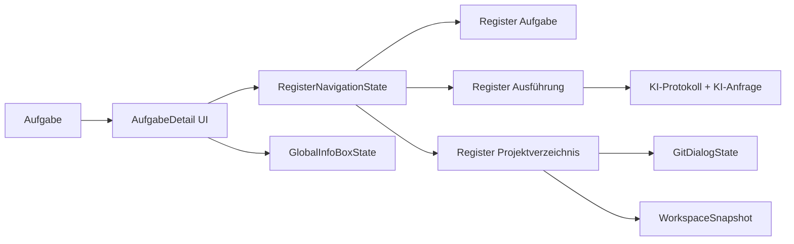

# Anforderungsanalyse – AufgabeDetail UI Register-Navigation

> **Dokument-Typ:** Requirements Analysis  
> **Status:** 🔄 In Arbeit  
> **Version:** 1.2.0  
> **Feature-Fokus:** Register-Navigation, Git-Dialog-Sichtbarkeit, Abschluss der begonnenen Umsetzung

---

## 1. Überblick und Projektkontext

### Projektbeschreibung
Die Seite `AufgabeDetail` wird in drei fachlich getrennte Register gegliedert:
1. **Aufgabe**
2. **Ausführung**
3. **Projektverzeichnis**

Ziel ist eine klare Navigation, stabile Sichtbarkeit globaler Kennzahlen und verlässlich nutzbare Git-Dialoge im richtigen Kontext.

### Problemstellung
Die ursprüngliche Umsetzung der Register-Navigation wurde begonnen, aber nicht vollständig bis zur fachlichen Abnahme abgeschlossen. Kernproblem aus der Aufgabenquelle war die fehlende Sichtbarkeit der Git-Dialoge trotz klickbarer Aktionen.

### Geschäftsziele
- End-to-End-Bedienbarkeit von Commit/Push/Pull/Pull Request sicherstellen
- Informationsarchitektur von AufgabeDetail konsistent und wartbar machen
- Legacy-UI-Zustände entfernen, die Registerlogik stören können
- Qualität nachweisbar über klare Akzeptanzkriterien und Test-Gates absichern

### Stakeholder
- Product Owner / Fachseite Aufgabenworkflow
- Entwickler:innen (Blazor UI, Services, Tests)
- QA / Abnahme
- Endnutzer:innen der AufgabeDetail-Seite

### Abgrenzung
Fokus liegt auf UI-Struktur, Sichtbarkeitslogik, Bedienbarkeit und Testbarkeit von `AufgabeDetail`.  
Keine Erweiterung von Git-Backend-Verträgen und keine Datenbankmigration.

### Repo-Konventionen und Ist-Stand
- Blazor-Seite mit Code-Behind (`AufgabeDetail.razor` + `AufgabeDetail.razor.cs`)
- Registerzustand über `_activeRegister`; Query-Parameter `register`/`view` werden ausgewertet
- Git-Dialogflags werden beim Verlassen von „Projektverzeichnis“ geschlossen (`CloseProjectDirectoryDialogs`)
- Relevante bestehende Tests: `AufgabeDetail*Tests.cs` in `src/Softwareschmiede.Tests/Components/Pages/Aufgaben/`

---

## 2. Funktionale Anforderungen

| Kennung | Beschreibung | Kategorie | Priorität | Status |
|---------|--------------|-----------|-----------|--------|
| **FR-1** | **Drei-Register-Navigation:** AufgabeDetail bietet genau die Register Aufgabe, Ausführung und Projektverzeichnis mit klarer Umschaltung. → [Architektur-Blueprint](../architecture/aufgabe-detail-ui-register-navigation-architecture-blueprint.md) · [Planungsübersicht](../planning-overview-aufgabe-detail-ui-register-navigation.md) | Kern-Feature | MUST HAVE | 🔄 In Arbeit |
| **FR-1.1** | **Exklusive Registersichtbarkeit:** Zu jedem Zeitpunkt ist genau ein Registerinhalt sichtbar; parallele Darstellung mehrerer Register ist ausgeschlossen. | Kern-Feature | MUST HAVE | 🔄 In Arbeit |
| **FR-2** | **Aufgabe-Register mit Kennzahlen:** Enthält Anforderungsbeschreibung, Anlagezeitpunkt, letzte Ausführung und mindestens zwei zusätzliche Kennzahlen (verbindlich: Status, Ausführungsdauer, letzter Ausführungsstatus). → [Architektur-Review](../improvements/aufgabe-detail-ui-register-navigation-architecture-review.md) · [Architektur-Blueprint](../architecture/aufgabe-detail-ui-register-navigation-architecture-blueprint.md) | Reporting & Analyse | MUST HAVE | 🔄 In Arbeit |
| **FR-2.1** | **Aktionsset Aufgabe:** Aktionen „Startskript ausführen“, „Abschließen“, „Abbrechen“ sind sichtbar und nutzbar. | Kern-Feature | MUST HAVE | 🔄 In Arbeit |
| **FR-3** | **Ausführung-Register-Inhalte:** Zeigt KI-Anfragedialogbox und KI-Ausführungsprotokoll inkl. Streaming-/Historiepfad. → [Architektur-Blueprint](../architecture/aufgabe-detail-ui-register-navigation-architecture-blueprint.md) · [ERM](../architecture/aufgabe-detail-ui-register-navigation-entity-relationship-model.md) | KI-Integration | MUST HAVE | 🔄 In Arbeit |
| **FR-3.1** | **Aktionsset Ausführung:** Aktionen „Startskript ausführen“, „Abschließen“, „Abbrechen“ sind sichtbar und nutzbar. | KI-Integration | MUST HAVE | 🔄 In Arbeit |
| **FR-4** | **Projektverzeichnis-Register-Inhalte:** Zeigt Repository-Explorer inkl. Lade-/Leer-/Fehlerzuständen. → [Architektur-Blueprint](../architecture/aufgabe-detail-ui-register-navigation-architecture-blueprint.md) · [ERM](../architecture/aufgabe-detail-ui-register-navigation-entity-relationship-model.md) | Datenverwaltung | MUST HAVE | 🔄 In Arbeit |
| **FR-4.1** | **Aktionsset Projektverzeichnis:** Startskript, Commit, Push, Pull, Pull Request, Aktualisieren, Abschließen, Abbrechen sind vorhanden. | Kern-Feature | MUST HAVE | 🔄 In Arbeit |
| **FR-4.2** | **Git-Dialog-Sichtbarkeit:** Commit/Push/Pull/PR öffnen den jeweils passenden Dialog sichtbar und interaktiv im Kontext „Projektverzeichnis“; außerhalb des Registers sind sie geschlossen. → [Architektur-Review](../improvements/aufgabe-detail-ui-register-navigation-architecture-review.md) · [Planungsübersicht](../planning-overview-aufgabe-detail-ui-register-navigation.md) | Kern-Feature | MUST HAVE | 🔄 In Arbeit |
| **FR-5** | **Globale Infoboxen:** Kennzahlen „Commits“ und „Geänderte Dateien“ sind registerübergreifend dauerhaft sichtbar. → [Architektur-Blueprint](../architecture/aufgabe-detail-ui-register-navigation-architecture-blueprint.md) · [ERM](../architecture/aufgabe-detail-ui-register-navigation-entity-relationship-model.md) | Reporting & Analyse | MUST HAVE | 🔄 In Arbeit |
| **FR-6** | **Legacy-Ansicht entfernen:** Die bisherige „Ansicht“-Box sowie zugehörige Legacy-State-Pfade sind vollständig entfernt. → [Architektur-Review](../improvements/aufgabe-detail-ui-register-navigation-architecture-review.md) · [Planungsübersicht](../planning-overview-aufgabe-detail-ui-register-navigation.md) | Wartbarkeit | MUST HAVE | 🔄 In Arbeit |

---

## 3. Nicht-funktionale Anforderungen

| Kennung | Beschreibung | Kategorie | Priorität | Status |
|---------|--------------|-----------|-----------|--------|
| **NFR-1** | **Deterministische Sichtbarkeit:** In 100 % der Registerwechsel wird genau ein Registerinhalt angezeigt; Dialog-Lifecycle bei Registerwechsel ist deterministisch. → [Architektur-Blueprint](../architecture/aufgabe-detail-ui-register-navigation-architecture-blueprint.md) · [Architektur-Review](../improvements/aufgabe-detail-ui-register-navigation-architecture-review.md) | Zuverlässigkeit | MUST HAVE | 🔄 In Arbeit |
| **NFR-2** | **Registerwechsel-Latenz:** Sichtbarer Wechsel erfolgt im Regelfall < 200 ms auf definierter Zielumgebung; Messmethode und Messpunkte sind dokumentiert. → [Architektur-Review](../improvements/aufgabe-detail-ui-register-navigation-architecture-review.md) | Performance | HIGH | 📋 Geplant |
| **NFR-3** | **Regressionssicherheit:** Bestehende Kernaktionen (Startskript/Abschließen/Abbrechen/Git) bleiben nach Refactoring funktional erhalten. → [Architektur-Blueprint](../architecture/aufgabe-detail-ui-register-navigation-architecture-blueprint.md) · [Planungsübersicht](../planning-overview-aufgabe-detail-ui-register-navigation.md) | Zuverlässigkeit | MUST HAVE | 🔄 In Arbeit |
| **NFR-4** | **Testbarkeit & Nachweisbarkeit:** bUnit-Komponententests decken Exklusivität, Dialogsichtbarkeit, globale Infoboxen, Legacy-Entfernung, Query-Init und Empty-/Error-States ab. → [Architektur-Review](../improvements/aufgabe-detail-ui-register-navigation-architecture-review.md) | Wartbarkeit | MUST HAVE | 🔄 In Arbeit |
| **NFR-5** | **Accessibility-Basis + Tastaturfluss:** Register folgen semantischem Tab-Pattern (`tablist`, `tab`, `aria-selected`) und sind per Tastatur bedienbar. → [Architektur-Blueprint](../architecture/aufgabe-detail-ui-register-navigation-architecture-blueprint.md) · [Architektur-Review](../improvements/aufgabe-detail-ui-register-navigation-architecture-review.md) | UX / Accessibility | HIGH | 🔄 In Arbeit |
| **NFR-6** | **Keine Schemaänderung:** Umsetzung verursacht keine Datenbankmigration und keine persistenten Modelländerungen. → [ERM](../architecture/aufgabe-detail-ui-register-navigation-entity-relationship-model.md) | Wartbarkeit | MUST HAVE | ✅ Umgesetzt |

---

## 4. Akzeptanzkriterien

### User Story 1 – Zwischen Registern navigieren
**Als** Nutzer:in  
**möchte ich** gezielt zwischen Aufgabe, Ausführung und Projektverzeichnis wechseln  
**damit** ich immer nur den relevanten Kontext sehe.

- AC-1.1: Genau drei Registerbuttons (Aufgabe, Ausführung, Projektverzeichnis) sind sichtbar.
- AC-1.2: Nach jedem Registerwechsel ist exakt ein Registerinhalt sichtbar.
- AC-1.3: Bei ungültigem Query-Parameter wird auf „Aufgabe“ zurückgefallen.
- AC-1.4: Die frühere „Ansicht“-Box ist nicht mehr vorhanden.

### User Story 2 – Aufgabe- und Ausführungskontext bedienen
**Als** Nutzer:in  
**möchte ich** in Aufgabe und Ausführung alle benötigten Inhalte und Aktionen vorfinden  
**damit** ich die Aufgabe ohne Medienbruch steuern kann.

- AC-2.1: Register Aufgabe zeigt Anforderungsbeschreibung, Anlagezeitpunkt, letzte Ausführung, Status, Ausführungsdauer, letzten Ausführungsstatus.
- AC-2.2: Register Aufgabe enthält Startskript/Abschließen/Abbrechen.
- AC-2.3: Register Ausführung zeigt KI-Anfragebereich und Protokoll (inkl. leerem Zustand).
- AC-2.4: Register Ausführung enthält Startskript/Abschließen/Abbrechen.

### User Story 3 – Git-Operationen im Projektverzeichnis ausführen
**Als** Nutzer:in  
**möchte ich** Git-Aktionen im Projektverzeichnis zuverlässig ausführen  
**damit** Commit/Sync/PR ohne unsichtbare Dialoge möglich sind.

- AC-3.1: Register Projektverzeichnis zeigt Explorer inkl. Loading-/Error-/Empty-States.
- AC-3.2: Aktionsset enthält Startskript, Commit, Push, Pull, Pull Request, Aktualisieren, Abschließen, Abbrechen.
- AC-3.3: Klick auf Commit/Push/Pull/PR öffnet jeweils den korrekten Dialog sichtbar und interaktiv.
- AC-3.4: Beim Verlassen des Registers Projektverzeichnis werden Git-Dialoge deterministisch geschlossen.
- AC-3.5: Globale Infoboxen „Commits“ und „Geänderte Dateien“ bleiben in allen Registern sichtbar.

### User Story 4 – Qualitätsnachweis vor Abnahme
**Als** QA/Tech Lead  
**möchte ich** messbare Qualitätsnachweise  
**damit** die begonnene Umsetzung reproduzierbar abgenommen werden kann.

- AC-4.1: bUnit-Tests für G1–G8 aus Architektur-Review sind grün.
- AC-4.2: Latenznachweis für NFR-2 ist dokumentiert.
- AC-4.3: Accessibility-Checks für Tab-Semantik und Tastaturnavigation sind dokumentiert.

---

## 5. Annahmen und Abhängigkeiten

| Typ | Eintrag | Auswirkung bei Verletzung | Gegenmaßnahme |
|-----|---------|----------------------------|---------------|
| Annahme | Bestehende Services (`AufgabeService`, `KiAusfuehrungsService`, `GitOrchestrationService`, `IGitWorkspaceBrowserService`) liefern kompatible Zustände. | Register zeigen inkonsistente Daten oder Aktionen schlagen fehl. | Defensive UI-States, Fehlermeldungen, gezielte Regressionstests. |
| Annahme | Repository-/Workspace-Kontext ist für Projektverzeichnis verfügbar oder explizit als leer/fehlerhaft markierbar. | Explorer/Git-Dialoge sind nicht verlässlich nutzbar. | Verbindliche Empty-/Error-States + Refresh-CTA. |
| Abhängigkeit | Umsetzung in `AufgabeDetail.razor` und `AufgabeDetail.razor.cs` bleibt konsistent zu Blueprint/Review. | Architekturfindings werden erneut aufgerissen. | Regelmäßiger Abgleich mit Blueprint/Review bei Änderungen. |
| Abhängigkeit | Testsuite in `src/Softwareschmiede.Tests/Components/Pages/Aufgaben/` wird mitgeführt. | Fachliche Abnahme nicht belastbar. | Test-Gates als DoD-Kriterium erzwingen. |
| Risiko | Teilweise implementierte Navigation erzeugt Randfallfehler (Query-Init, Dialog-Reopening, Fokusverlust). | Nicht-deterministisches UI-Verhalten in Produktion. | Szenariobasierte bUnit-Tests inkl. Query- und Lifecycle-Fällen. |
| Risiko | NFR-2/NFR-5 bleiben ohne Nachweis. | Qualitätsziele formal nicht erfüllt trotz funktionaler Umsetzung. | Mess- und A11y-Protokoll verbindlich vor Release. |

### Offene Fragen
| ID | Frage | Benötigt von | Zieltermin |
|----|-------|--------------|------------|
| OF-1 | Welche Zielhardware/Browser-Kombination ist verbindlich für NFR-2 (< 200 ms)? | Tech Lead + QA | vor Fachabnahme |
| OF-2 | Welche Tastatur-Interaktionen werden verpflichtend geprüft (Pfeiltasten, Home/Ende, Fokus-Loop)? | UX/QA | vor Release Gate G7 |
| OF-3 | Soll der Registerzustand bei Reload deep-link-fähig für alle drei Register dauerhaft URL-basiert persistiert werden? | Product Owner | vor Abschluss Sprint |

---

## 6. Scope und Out-of-Scope

### In-Scope ✅
- Drei Register inkl. exklusiver Sichtbarkeitslogik
- Registerspezifische Aktionsleisten gemäß FR-2.1 / FR-3.1 / FR-4.1
- Git-Dialog-Lifecycle im Projektverzeichnis
- Registerübergreifende Infoboxen für Commits/Geänderte Dateien
- Entfernung Legacy-Ansicht
- Test- und Qualitätsnachweise für definierte Gates

### Out-of-Scope ❌
- Neue Git-Backend-Funktionalitäten oder Provider-Wechsel
- Änderungen an Aufgaben-Domänenlogik außerhalb `AufgabeDetail`
- Datenbankschema-Refactoring/Migrationen
- Vollständiges UI-Redesign anderer Seiten

---

## 7. Domänenmodell und Glossar

### Schlüsselentitäten und Beziehungen

### Glossar
| Begriff | Definition |
|--------|------------|
| AufgabeDetail | Detailansicht einer Aufgabe mit Navigation über drei Register. |
| Active Register | Laufzeitzustand, der genau einen sichtbaren Registerinhalt steuert. |
| GitDialogState | Sichtbarkeitszustände für Commit/Push/Pull/PR im Projektverzeichnis. |
| GlobalInfoBoxState | Registerübergreifend sichtbare Kennzahlen (Commits/Geänderte Dateien). |
| WorkspaceSnapshot | Snapshot der Projektstruktur und Git-bezogener Kennzahlen. |

---

## 8. Nutzungsfälle (Use Cases)

### UC-1: Registerwechsel mit deterministischer Sichtbarkeit
- **Akteur:** Nutzer:in  
- **Vorbedingung:** AufgabeDetail ist geladen  
- **Ablauf:** Registerbutton klicken → `ActiveRegister` wird gesetzt → genau ein Registerinhalt wird gerendert  
- **Alternativfluss:** Ungültiger Query-Parameter → Fallback auf Register „Aufgabe“  
- **Ergebnis:** Exklusive Sichtbarkeit eingehalten

### UC-2: Git-Dialog im Projektverzeichnis öffnen
- **Akteur:** Nutzer:in  
- **Vorbedingung:** Register Projektverzeichnis aktiv, Aktionen erlaubt  
- **Ablauf:** Klick auf Commit/Push/Pull/PR → entsprechendes Dialogflag wird gesetzt → Dialog wird sichtbar  
- **Alternativfluss:** Registerwechsel weg von Projektverzeichnis → alle Git-Dialogflags werden geschlossen  
- **Ergebnis:** Dialog erscheint nur im korrekten Kontext

### UC-3: Aufgabe im Register Aufgabe steuern
- **Akteur:** Nutzer:in  
- **Vorbedingung:** Register Aufgabe aktiv  
- **Ablauf:** Startskript/Abschließen/Abbrechen ausführen  
- **Ergebnis:** Aktion wird über bestehende Services verarbeitet, UI-Status aktualisiert sich

### UC-4: KI-Ausführung im Register Ausführung bedienen
- **Akteur:** Nutzer:in  
- **Vorbedingung:** Register Ausführung aktiv  
- **Ablauf:** Prompt senden, Protokoll und ggf. Streaming verfolgen  
- **Ergebnis:** Ausführungskontext bleibt vollständig innerhalb eines Registers nutzbar

---

## 9. Nächste Schritte

1. Offene Fragen OF-1 bis OF-3 fachlich/technisch entscheiden.
2. Test-Gates G1–G8 aus dem Architektur-Review vollständig gegen aktuellen Code nachweisen.
3. NFR-2 Messmethode dokumentieren und reproduzierbar ausführen.
4. Accessibility-Prüfumfang (G7) finalisieren und dokumentieren.
5. Nach erfolgreichem Nachweis Status relevanter FR/NFR auf `✅ Umgesetzt` anheben.

---

## 10. Approval & Versionierung

### Verknüpfte Detaildokumente
- Architektur-Blueprint: [../architecture/aufgabe-detail-ui-register-navigation-architecture-blueprint.md](../architecture/aufgabe-detail-ui-register-navigation-architecture-blueprint.md)
- ERM: [../architecture/aufgabe-detail-ui-register-navigation-entity-relationship-model.md](../architecture/aufgabe-detail-ui-register-navigation-entity-relationship-model.md)
- Architektur-Review: [../improvements/aufgabe-detail-ui-register-navigation-architecture-review.md](../improvements/aufgabe-detail-ui-register-navigation-architecture-review.md)
- Planungsübersicht: [../planning-overview-aufgabe-detail-ui-register-navigation.md](../planning-overview-aufgabe-detail-ui-register-navigation.md)

### Freigabe
- **Product Owner:** ausstehend
- **Tech Lead:** ausstehend
- **QA:** ausstehend

### Versionshistorie
| Version | Datum | Autor | Änderung |
|---------|-------|-------|----------|
| 1.0.0 | 2026-05-24 | documentation-orchestrator | Erstfassung Requirements Analysis |
| 1.1.0 | 2026-05-25 | Copilot | Struktur auf Standard-Template erweitert, FR/NFR tabellarisch vereinheitlicht, Scope/AC/Annahmen-Risiken präzisiert |
| 1.2.0 | 2026-05-25 | Copilot | Vollständige strukturierte Überarbeitung auf Basis Aufgabenquelle und Planungsartefakten; offene Fragen ergänzt; FR/NFR-Status auf begonnenen, aber nicht final abgenommenen Umsetzungsstand harmonisiert |
