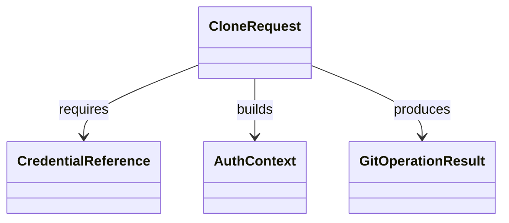

# Anforderungsanalyse – GitHub Clone Authentication Bugfix

> **Dokument-Typ:** Requirements Analysis
> **Status:** 📋 Geplant
> **Version:** 1.0.0
> **Thema:** Fehler beim Aufgabenstart: `git clone ... could not read Username ... terminal prompts disabled`

---

## 1. Überblick und Projektkontext
Beim Starten einer Aufgabe schlägt das Klonen privater GitHub-Repositories fehl, weil die Authentifizierung vor `git clone` nicht wirksam vorbereitet ist. Ziel ist ein nicht-interaktiver, deterministischer Clone-Prozess mit klarer Fehlerkommunikation.

**Stakeholder:** Anwender, Entwicklung, Support

---

## 2. Funktionale Anforderungen
| Kennung | Beschreibung | Kategorie | Priorität | Status |
|---|---|---|---|---|
| **FR-1** | **Pre-Clone-Authentifizierung:** Vor `git clone` muss eine gültige Authentifizierung bereitgestellt werden, ohne Terminal-Prompts. → [Architektur-Blueprint](../architecture/github-clone-authentication-architecture-blueprint.md) · [ERM](../architecture/github-clone-authentication-entity-relationship-model.md) | Git-Integration | MUST HAVE | 📋 Geplant |
| **FR-1.1** | **Token-Vorabprüfung:** Fehlender Token führt zu kontrolliertem Abbruch mit Handlungsanweisung statt blindem Clone-Versuch. | Git-Integration | MUST HAVE | 📋 Geplant |
| **FR-1.2** | **Auth-Fehlerklassifikation:** `terminal prompts disabled` und verwandte Meldungen werden als Auth-Fehler kategorisiert und nutzerverständlich ausgegeben. → [Architektur-Review](../improvements/github-clone-authentication-architecture-review.md) | Fehlerbehandlung | HIGH | 📋 Geplant |
| **FR-2** | **Regression-Schutz:** Unit-Tests in `GitHubPluginTests` decken Erfolg, fehlenden/ungültigen Token und Fehler-Mapping ab. | Qualität | MUST HAVE | 📋 Geplant |

---

## 3. Nicht-funktionale Anforderungen
| Kennung | Beschreibung | Kategorie | Priorität | Status |
|---|---|---|---|---|
| **NFR-1** | **Secretsicherheit:** Kein Klartext-Token in Logs, Exceptions oder UI-Ausgaben. | Sicherheit | MUST HAVE | 📋 Geplant |
| **NFR-2** | **Determinismus:** Clone muss in Headless-Kontexten mit `GIT_TERMINAL_PROMPT=0` reproduzierbar funktionieren. | Zuverlässigkeit | MUST HAVE | 📋 Geplant |
| **NFR-3** | **Diagnostik:** Fehlerursachen sind supportfähig und eindeutig klassifiziert. | Wartbarkeit | HIGH | 📋 Geplant |
| **NFR-4** | **Keine Nebenregression:** Bestehende Push/Pull-Flows dürfen nicht beeinträchtigt werden. | Stabilität | HIGH | 📋 Geplant |

---

## 4. Akzeptanzkriterien
### User Story US-1 – Erfolgreicher Clone mit gültigem Token
- AC-1: Bei gültigem Token erfolgt `git clone` ohne Prompt-Fehler.
- AC-2: Zielverzeichnis enthält ein nutzbares Repository.
- AC-3: Token erscheint nicht in Logs/Exceptions.

### User Story US-2 – Fehlender Token
- AC-4: Prozess bricht vor Clone kontrolliert ab.
- AC-5: Fehlermeldung enthält konkreten Hinweis zur Token-Konfiguration.

### User Story US-3 – Ungültiger Token
- AC-6: Fehler wird als Authentifizierungsproblem klassifiziert.
- AC-7: Meldung ist nutzerverständlich und ohne Secret-Leak.

---

## 5. Annahmen und Abhängigkeiten
| Typ | Eintrag | Auswirkung |
|---|---|---|
| Annahme | GitHub-Token wird über `ICredentialStore` bereitgestellt. | Ohne Token kein erfolgreicher Clone |
| Abhängigkeit | `GitHubPlugin.cs` implementiert Clone und Fehler-Mapping. | Anpassung erfolgt in diesem Plugin |
| Abhängigkeit | `GitHubPluginTests.cs` wird erweitert. | Ohne Tests erhöhtes Regressionsrisiko |

---

## 6. Scope und Out-of-Scope
**In-Scope ✅**
- Clone-Authentifizierung für GitHub HTTPS im Aufgabenstart
- Fehlerklassifikation und Benutzerhinweise
- Unit-Test-Erweiterungen für Clone-Auth

**Out-of-Scope ❌**
- SSH-Onboarding und SSH-Key-Management
- Neue Git-Provider
- UI-Refactoring außerhalb Fehlermeldungspfad

---

## 7. Domänenmodell und Glossar

**Glossar:**
- **AuthContext:** Nicht-interaktiver Authentifizierungszustand vor Clone
- **CredentialReference:** Referenz auf Token-Key, nie Token im Klartext
- **GitOperationResult:** Sanitisiertes Ergebnis inklusive Fehlerkategorie

---

## 8. Nutzungsfälle (Use Cases)
- **UC-1:** Aufgabe starten mit gültigem Token → Clone erfolgreich.
- **UC-2:** Aufgabe starten ohne Token → Frühzeitiger Abbruch mit Hinweis.
- **UC-3:** Aufgabe starten mit ungültigem Token → Klassifizierter Auth-Fehler und Korrekturhinweis.

---

## 9. Nächste Schritte
1. Pre-Clone-Auth-Strategie technisch fixieren (siehe Blueprint).
2. Fehlerdomäne für Auth-Fälle granularisieren (siehe Review).
3. Tests in `GitHubPluginTests` um Auth-Szenarien erweitern.
4. End-to-End-Validierung im Aufgabenstart durchführen.

---

## 10. Approval & Versionierung
| Version | Datum | Autor | Änderung |
|---|---|---|---|
| 1.0.0 | 2026-05-10 | planning-orchestrator | Initiale Anforderungsanalyse für Clone-Authentifizierungs-Bugfix |

**Freigabe:** Ausstehend (Product Owner)
