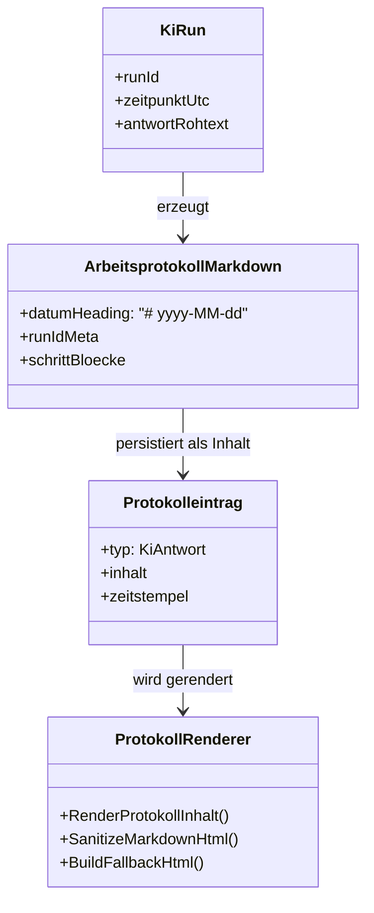

# Anforderungsanalyse – KI-Arbeitsprotokoll als Markdown

> **Dokument-Typ:** Requirements Analysis  
> **Status:** 📋 Geplant  
> **Version:** 1.0.0  
> **Thema:** Strukturierte Ausgabe des KI-Arbeitsprotokolls mit Markdown-Rendering in der Webansicht

---

## 1. Überblick und Projektkontext

### 1.1 Projektbeschreibung
Bei der Ausführung einer KI-Aufgabe wird das Arbeitsprotokoll aktuell als einfacher Textblock ausgegeben. Dieses Feature führt ein strukturiertes Markdown-Format ein, sodass Datum, Schritte und weitere Inhalte in der UI klar lesbar und semantisch korrekt dargestellt werden.

### 1.2 Geschäftsziele
| # | Ziel | Messbare Erfolgsgröße |
|---|---|---|
| Z-1 | Höhere Lesbarkeit von KI-Protokollen | 100 % neuer KI-Protokolle enthalten Datum als Markdown-H1 und getrennte Schrittblöcke |
| Z-2 | Einheitliches Anzeigeverhalten im Web | Überschriften (`#`, `##`) und Standard-Markdown-Elemente werden in der Protokollansicht sichtbar gerendert |
| Z-3 | Sichere Darstellung trotz Rich-Text | Unsichere HTML-Schemata/Event-Handler werden weiterhin sanitisiert |

### 1.3 Stakeholder
| Rolle | Beschreibung | Interesse |
|---|---|---|
| Anwender | Nutzt die Aufgaben-Detailansicht und liest KI-Protokolle | Bessere Struktur und Verständlichkeit |
| Entwicklungsteam | Pflegt Protokollerzeugung und UI-Rendering | Klare Formatregeln und robuste Render-Pipeline |
| Product Owner | Bewertet Nutzwert und Qualität | Nachvollziehbare, konsistente KI-Arbeitsdokumentation |

### 1.4 Abgrenzung
- Fokus auf KI-Arbeitsprotokolle im Aufgabenfluss (`KiStartenAsync` / Folge-Prompt).
- Fokus auf die Darstellung im bestehenden Protokollbereich der Aufgabendetailseite.
- Keine Einführung neuer API-Endpunkte oder neuer Protokollspeicher.

---

## 2. Funktionale Anforderungen

| Kennung | Beschreibung | Kategorie | Priorität | Status |
|---------|--------------|-----------|-----------|--------|
| **FR-1** | **Markdown-Arbeitsprotokoll erzeugen:** KI-Antworten werden als strukturiertes Markdown gespeichert; Datum, Metadaten und Schritte sind getrennt und maschinen-/menschenlesbar. → [Architektur-Blueprint](../architecture/ki-arbeitsprotokoll-markdown-architecture-blueprint.md) · [ERM](../architecture/ki-arbeitsprotokoll-markdown-entity-relationship-model.md) · [Architecture-Review](../improvements/ki-arbeitsprotokoll-markdown-architecture-review.md) | Kern-Feature | MUST HAVE | 📋 Geplant |
| **FR-1.1** | **Datumszeile als H1:** Die erste Datumszeile wird exakt als Markdown-Überschrift im Format `# {Datum}` (z. B. `# 2026-05-11`) ausgegeben. | Kern-Feature | MUST HAVE | 📋 Geplant |
| **FR-1.2** | **Schritttrennung:** Inhalt wird in getrennte Abschnitte `## Schritt n` überführt; mindestens ein Schritt wird auch bei leerer Antwort erzeugt. | Datenverwaltung | MUST HAVE | 📋 Geplant |
| **FR-2** | **Markdown-Rendering in der Webausgabe:** Protokollinhalte werden in `AufgabeDetail` als Markdown gerendert, sodass Überschriften und weitere Markdown-Formatierung wirksam angezeigt werden. → [Architektur-Blueprint](../architecture/ki-arbeitsprotokoll-markdown-architecture-blueprint.md) · [Architecture-Review](../improvements/ki-arbeitsprotokoll-markdown-architecture-review.md) | UX / Accessibility | MUST HAVE | 📋 Geplant |
| **FR-2.1** | **Render-Pipeline mit Sanitizing:** Das Rendering nutzt eine definierte Markdown-Pipeline und anschließende Sanitizing-Logik vor der DOM-Ausgabe. | Sicherheit | MUST HAVE | 📋 Geplant |
| **FR-2.2** | **Fallback-Ausgabe:** Bei Render-/Sanitizing-Fehlern wird ein sicheres `<pre>`-Fallback mit HTML-Encoding ausgegeben. | Zuverlässigkeit | HIGH | 📋 Geplant |
| **FR-3** | **Technische Konsistenz im Aufgabenfluss:** Formatierung und Darstellung sind durchgängig zwischen Erzeugung (`EntwicklungsprozessService`) und Anzeige (`AufgabeDetail`) konsistent. → [ERM](../architecture/ki-arbeitsprotokoll-markdown-entity-relationship-model.md) · [Architecture-Review](../improvements/ki-arbeitsprotokoll-markdown-architecture-review.md) | Wartbarkeit | HIGH | 📋 Geplant |
| **FR-4** | **Flow-konforme Umsetzung:** Das Verhalten entspricht dem dokumentierten Ablauf für Persistierung, Rendering und Fallback. → [Rendering-Flow](../flows/ki-arbeitsprotokoll-rendering-flow.md) | Reporting & Analyse | MEDIUM | 📋 Geplant |

---

## 3. Nicht-funktionale Anforderungen

| Kennung | Beschreibung | Kategorie | Priorität | Status |
|---------|--------------|-----------|-----------|--------|
| **NFR-1** | **Rendering-Performance:** Die Umwandlung eines Protokolleintrags bis 10 KB von Markdown nach sanitisiertem HTML erfolgt im Median in < 200 ms pro Render-Vorgang. → [Architektur-Blueprint](../architecture/ki-arbeitsprotokoll-markdown-architecture-blueprint.md) | Performance | HIGH | 📋 Geplant |
| **NFR-2** | **Sichere HTML-Ausgabe:** Unsichere URI-Schemata (`javascript:`, `data:`, `vbscript:`) und `on*`-Eventattribute werden in 100 % der geprüften Fälle neutralisiert/entfernt. → [Architecture-Review](../improvements/ki-arbeitsprotokoll-markdown-architecture-review.md) | Sicherheit | MUST HAVE | 📋 Geplant |
| **NFR-3** | **Robustheit bei Fehlern:** Bei Ausnahmen in Rendering/Sanitizing bleibt die Protokollanzeige verfügbar (Fallback statt Abbruch) in 100 % der Fehlerfälle. | Zuverlässigkeit | MUST HAVE | 📋 Geplant |
| **NFR-4** | **Lesbarkeitskonsistenz:** Datums-H1 und `Schritt`-Struktur sind in allen neuen KI-Protokollen einheitlich vorhanden (100 % Konformität in Stichproben-/Testläufen). | UX / Accessibility | HIGH | 📋 Geplant |
| **NFR-5** | **Testbarkeit:** Kernregeln für Markdown-Erzeugung und Rendering sind durch automatisierte Tests abgedeckt (mindestens Format-, Sanitizing- und Fallback-Szenarien). | Wartbarkeit | HIGH | 📋 Geplant |

---

## 4. Akzeptanzkriterien

### User Story US-1 – Datum als Markdown-Überschrift
**Als** Anwender  
**möchte ich**, dass das Protokolldatum als klare Überschrift angezeigt wird,  
**damit** ich Einträge schneller zeitlich einordnen kann.

- AC-1.1: Neue KI-Protokolle beginnen mit einer Datumszeile im Format `# yyyy-MM-dd`.
- AC-1.2: In der UI wird diese Datumszeile als `<h1>` gerendert.

### User Story US-2 – Schrittweise Protokollierung
**Als** Anwender  
**möchte ich**, dass KI-Ausgaben in getrennten Schritten erscheinen,  
**damit** ich den Arbeitsfortschritt nachvollziehen kann.

- AC-2.1: Jede nicht-leere Antwortzeile wird als eigener `## Schritt n`-Block ausgegeben.
- AC-2.2: Bei leerer Antwort wird dennoch `## Schritt 1` mit einem Fallback-Text erzeugt.

### User Story US-3 – Markdown wirksam im Web
**Als** Anwender  
**möchte ich**, dass Markdown in der Protokollansicht sichtbar formatiert ist,  
**damit** Überschriften und Struktur nicht als Rohtext erscheinen.

- AC-3.1: `#`- und `##`-Überschriften werden in der Webansicht als HTML-Heading-Elemente dargestellt.
- AC-3.2: Weitere Markdown-Elemente (z. B. Listen, Inline-Code, Links) werden in der bestehenden Render-Pipeline unterstützt.

### User Story US-4 – Sichere und robuste Ausgabe
**Als** Betriebsteam  
**möchte ich**, dass Render-Ausgaben sicher und ausfallsicher bleiben,  
**damit** keine XSS-Risiken oder UI-Abbrüche auftreten.

- AC-4.1: Unsichere Link-Schemata und Event-Attribute werden sanitisiert.
- AC-4.2: Bei Render-Fehlern wird ein HTML-encodiertes `<pre>`-Fallback ausgegeben.

---

## 5. Annahmen und Abhängigkeiten

| Typ | Eintrag | Auswirkung |
|---|---|---|
| Annahme | KI-Antworten liegen als zeilenbasierter Rohtext vor. | Schritttrennung (`## Schritt n`) kann deterministisch erzeugt werden. |
| Annahme | Der Datumswert ist im Ausführungskontext verfügbar (`DateTimeOffset`). | Format `# yyyy-MM-dd` kann stabil erzeugt werden. |
| Abhängigkeit | `src/Softwareschmiede/Application/Services/EntwicklungsprozessService.cs` erzeugt das Markdown-Arbeitsprotokoll. | Änderungen an der Protokollstruktur erfolgen primär in `BuildKiArbeitsprotokollMarkdown`. |
| Abhängigkeit | `src/Softwareschmiede/Components/Pages/Aufgaben/AufgabeDetail.razor` bindet die Protokollausgabe ein. | UI-Markup muss die gerenderte Ausgabe korrekt anzeigen. |
| Abhängigkeit | `src/Softwareschmiede/Components/Pages/Aufgaben/AufgabeDetail.razor.cs` rendert und sanitisiert Markdown. | Sicherheit und Fallback hängen direkt von `RenderProtokollInhalt`/`SanitizeMarkdownHtml` ab. |
| Abhängigkeit | `docs/flows/ki-arbeitsprotokoll-rendering-flow.md` beschreibt den Soll-Ablauf. | Anforderungen müssen mit dem dokumentierten Persistierungs-/Render-Flow konsistent sein. |

---

## 6. Scope und Out-of-Scope

**In-Scope ✅**
- Umstellung der KI-Protokollstruktur auf Markdown mit Datums-H1 und Schrittblöcken.
- Wirksames Markdown-Rendering in der Protokoll-Webansicht.
- Beibehaltung/Schärfung von Sanitizing und Fallback-Verhalten.
- Nachvollziehbare Verankerung in den bestehenden Implementierungsorten und Flow-Dokumenten.

**Out-of-Scope ❌**
- Redesign der gesamten Aufgabendetailseite.
- Einführung eines externen Rich-Text-Editors für Protokolle.
- Migration oder nachträgliche Umschreibung historischer Alt-Protokolle.
- Änderungen an nicht betroffenen Domänen (z. B. Git- oder PR-Workflows).

---

## 7. Domänenmodell und Glossar

**Glossar**
- **Arbeitsprotokoll-Markdown:** Strukturierter Protokolltext für KI-Läufe (Datum, Metadaten, Schritte).
- **Datums-H1:** Erste Protokollzeile im Format `# yyyy-MM-dd`.
- **Schrittblock:** Abschnitt `## Schritt n` mit zugehörigem Inhaltsabsatz.
- **Sanitizing:** Bereinigung potenziell unsicherer HTML-Fragmente nach Markdown-Rendering.
- **Fallback-Rendering:** Sichere Ausgabe als `<pre>` bei Render-/Sanitizing-Problemen.

---

## 8. Nutzungsfälle (Use Cases)

### UC-1: KI-Lauf erzeugt strukturiertes Protokoll
| Feld | Inhalt |
|---|---|
| **ID** | UC-1 |
| **Akteur** | System (`EntwicklungsprozessService`) |
| **Vorbedingung** | KI-Lauf liefert Antworttext oder Fehlertext. |
| **Auslöser** | Abschluss von `KiStartenAsync`. |
| **Hauptszenario** | 1) System normalisiert Antwortzeilen. 2) System schreibt `# {Datum}`. 3) System ergänzt RunId-Metadaten. 4) System erzeugt `## Schritt n`-Abschnitte. 5) System persistiert Protokolleintrag. |
| **Nachbedingung** | Ein persistierter Protokolleintrag enthält gültiges Markdown-Arbeitsprotokoll. |
| **Anforderungen** | FR-1, FR-1.1, FR-1.2 |

### UC-2: Anwender betrachtet Protokoll in Aufgaben-Detailseite
| Feld | Inhalt |
|---|---|
| **ID** | UC-2 |
| **Akteur** | Anwender |
| **Vorbedingung** | Protokolleinträge sind vorhanden. |
| **Auslöser** | Aufruf der Aufgabendetailseite. |
| **Hauptszenario** | 1) UI lädt Protokolleinträge. 2) `RenderProtokollInhalt` wandelt Markdown in HTML. 3) Sanitizing entfernt unsichere Inhalte. 4) UI rendert formatierte Ausgabe. |
| **Nachbedingung** | Überschriften und Struktur sind als formatiertes Markdown sichtbar. |
| **Anforderungen** | FR-2, FR-2.1, NFR-2 |

### UC-3: Fehlerfall bei Rendering
| Feld | Inhalt |
|---|---|
| **ID** | UC-3 |
| **Akteur** | System (`AufgabeDetail`) |
| **Vorbedingung** | Rendering oder Sanitizing liefert Fehler/leer. |
| **Auslöser** | Ausnahme oder unbrauchbares Sanitizing-Ergebnis in Render-Pipeline. |
| **Hauptszenario** | 1) System erkennt Fehlerfall. 2) `BuildFallbackHtml` wird ausgeführt. 3) Encodierter Inhalt wird als `<pre>` ausgegeben. |
| **Nachbedingung** | Protokoll bleibt lesbar, UI bleibt stabil und sicher. |
| **Anforderungen** | FR-2.2, NFR-3 |

---

## 9. Nächste Schritte

1. Architektur-Blueprint und ERM für das Feature finalisieren/verlinkte Dokumente ergänzen.  
2. Requirements gegen Implementierung (`EntwicklungsprozessService`, `AufgabeDetail.razor`, `AufgabeDetail.razor.cs`) technisch abgleichen.  
3. Testfälle für Datums-H1, Schritttrennung, Markdown-Rendering und Sanitizing/Fallback konsolidieren.  
4. Fachliche Abnahme der Protokoll-UX anhand realer KI-Läufe durchführen.  
5. Version nach Architektur-Review und ggf. Umsetzungsstatus aktualisieren.

---

## 10. Approval & Versionierung

### Freigabe
| Rolle | Name | Status | Datum |
|---|---|---|---|
| Product Owner | _ausstehend_ | ⏳ Ausstehend | — |
| Architektur | _ausstehend_ | ⏳ Ausstehend | — |
| Autor | GitHub Copilot Agent | ✅ Erstellt | 2026-05-11 |

### Versionshistorie
| Version | Datum | Autor | Änderung |
|---|---|---|---|
| 1.0.0 | 2026-05-11 | GitHub Copilot Agent | Initiale Anforderungsanalyse für Feature „KI-Arbeitsprotokoll als Markdown“ erstellt |

