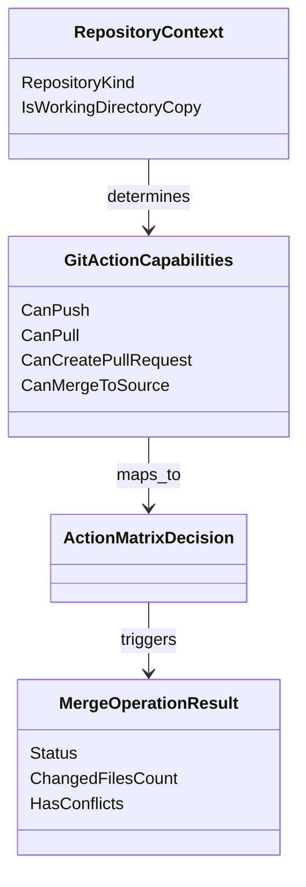

# Anforderungsanalyse – Lokales Verzeichnis Plugin (Kopie-Aktionsmatrix)

> **Dokument-Typ:** Requirements Analysis  
> **Status:** 📋 Geplant  
> **Version:** 1.0.0  
> **Datum:** 2026-05-14

---

## 1. Überblick und Projektkontext
Wenn im Git-Plugin ein lokales Verzeichnis als Quelle verwendet wird und das Arbeitsverzeichnis nur eine Kopie ist, sind klassische Remote-Aktionen (Push/Pull/Pull Request) fachlich irreführend. Ziel ist eine klare, kontextabhängige Aktionssteuerung in der UI: statt Push/Pull/PR soll in diesem Modus ein Merge ins Quellverzeichnis angeboten werden.

**Geschäftsziele:**
- Reduktion fachlich falscher Bedienoptionen
- Erhöhung der Prozesssicherheit bei lokalen Verzeichnis-Workflows
- Klare Trennung zwischen Remote-Git-Flow und lokalem Kopie-Flow

**Stakeholder:** Product Owner, Entwicklung, QA, Endanwender

---

## 2. Funktionale Anforderungen
| Kennung | Beschreibung | Kategorie | Priorität | Status |
|---|---|---|---|---|
| **FR-1** | **Kontextabhängige Aktionssichtbarkeit:** UI blendet Push/Pull/Pull Request aus, wenn `LocalDirectory` + `IsWorkingDirectoryCopy=true` vorliegt; stattdessen wird Merge angeboten. Sichtbarkeitsentscheidung erfolgt deterministisch pro View-Refresh (< 50 ms Entscheidungslogik). → [Architektur-Blueprint](../architecture/lokales-verzeichnis-plugin-kopie-aktionsmatrix-architecture-blueprint.md) · [ERM](../architecture/lokales-verzeichnis-plugin-kopie-aktionsmatrix-entity-relationship-model.md) · [Architecture-Review](../improvements/lokales-verzeichnis-plugin-kopie-aktionsmatrix-architecture-review.md) · [Planning Overview](../planning-overview-lokales-verzeichnis-plugin-kopie-aktionsmatrix.md) | Kern-Feature | MUST HAVE | 📋 Geplant |
| **FR-1.1** | **Push/Pull/PR in Kopie-Modus deaktiviert:** Bei lokalem Kopie-Szenario sind die Aktionen nicht nur deaktiviert, sondern vollständig unsichtbar. | UX / Accessibility | MUST HAVE | 📋 Geplant |
| **FR-1.2** | **Merge in Kopie-Modus sichtbar:** Der Merge-Button ist sichtbar und ausführbar, wenn lokale Änderungen vom Arbeitsverzeichnis ins Quellverzeichnis übernommen werden können. | Kern-Feature | MUST HAVE | 📋 Geplant |
| **FR-2** | **Plugin-Flags für Aktionsmatrix:** Git-Plugin liefert explizite Eigenschaften zur UI-Steuerung (`CanPush`, `CanPull`, `CanCreatePullRequest`, `CanMergeToSource`, `IsWorkingDirectoryCopy`, `RepositoryKind`). → [Architektur-Blueprint](../architecture/lokales-verzeichnis-plugin-kopie-aktionsmatrix-architecture-blueprint.md) · [Planning Overview](../planning-overview-lokales-verzeichnis-plugin-kopie-aktionsmatrix.md) | Kern-Feature | MUST HAVE | 📋 Geplant |
| **FR-2.1** | **Einheitliches Aktionsmodell:** Flags werden als konsistentes Capability-Objekt bereitgestellt, damit alle UI-Komponenten dieselbe Quelle verwenden. | Wartbarkeit | HIGH | 📋 Geplant |
| **FR-3** | **Merge-Ausführung im lokalen Kopie-Flow:** Merge überträgt Änderungen aus Arbeitsverzeichnis ins Quellverzeichnis und gibt ein strukturiertes Ergebnis inkl. Erfolg/Fehler/Betroffene Dateien zurück. | Datenverwaltung | MUST HAVE | 📋 Geplant |
| **FR-4** | **UI-Aktionsmatrix dokumentiert und testbar:** Für jede relevante Kombination aus Repository-Typ und Kopie-Status existiert eine klar definierte Sichtbarkeitsregel. | Qualität | HIGH | 📋 Geplant |

---

## 3. Nicht-funktionale Anforderungen
| Kennung | Beschreibung | Kategorie | Priorität | Status |
|---|---|---|---|---|
| **NFR-1** | **Konsistenz:** Für identischen Plugin-Zustand muss die UI-Aktionsliste in 100 % der Aufrufe identisch sein. | Zuverlässigkeit | MUST HAVE | 📋 Geplant |
| **NFR-2** | **Performance:** Capability-Ermittlung inkl. Mapping zur UI dauert im Mittel < 50 ms und im P95 < 150 ms. | Performance | HIGH | 📋 Geplant |
| **NFR-3** | **Nachvollziehbarkeit:** Entscheidungspfad für Aktionssichtbarkeit ist über strukturierte Logs ohne sensitive Pfade reproduzierbar. | Wartbarkeit | HIGH | 📋 Geplant |
| **NFR-4** | **Rückwärtskompatibilität:** Bestehende Remote-Git-Flows behalten unveränderte Sichtbarkeit/Verfügbarkeit von Push/Pull/PR. | Stabilität | MUST HAVE | 📋 Geplant |
| **NFR-5** | **Fehlertoleranz beim Merge:** Bei Merge-Fehlern bleibt Quellverzeichnis konsistent; Teilzustände werden vermieden oder klar markiert. | Zuverlässigkeit | MUST HAVE | 📋 Geplant |

---

## 4. Akzeptanzkriterien
### User Story US-1 – Lokaler Kopie-Modus zeigt nur sinnvolle Aktionen
- AC-1: Gegeben `RepositoryKind=LocalDirectory` und `IsWorkingDirectoryCopy=true`, wenn die Aktionsleiste geladen wird, dann sind Push/Pull/Pull Request unsichtbar.
- AC-2: Im selben Zustand ist Merge sichtbar.
- AC-3: Die Sichtbarkeit basiert ausschließlich auf Plugin-Capabilities, nicht auf UI-seitigen Heuristiken.

### User Story US-2 – Remote/Git-Standardfluss bleibt erhalten
- AC-4: Gegeben `RepositoryKind!=LocalDirectory` oder `IsWorkingDirectoryCopy=false`, dann gelten bestehende Push/Pull/PR-Regeln unverändert.
- AC-5: Merge ist in Remote-Flows standardmäßig unsichtbar, sofern `CanMergeToSource=false`.

### User Story US-3 – Merge in Quellverzeichnis
- AC-6: Bei Klick auf Merge werden Änderungen aus dem Arbeitsverzeichnis ins Quellverzeichnis übernommen.
- AC-7: Das Ergebnis zeigt mindestens `Status`, `AnzahlGeänderterDateien`, `Konfliktindikator`.
- AC-8: Bei Fehlern wird eine fachlich verständliche Meldung angezeigt; Push/Pull/PR bleiben im Kopie-Modus weiterhin unsichtbar.

### User Story US-4 – Technische Flags vollständig verfügbar
- AC-9: Git-Plugin stellt zur Laufzeit die Flags `CanPush`, `CanPull`, `CanCreatePullRequest`, `CanMergeToSource`, `IsWorkingDirectoryCopy`, `RepositoryKind` bereit.
- AC-10: Für jede Aktionsentscheidung ist ein automatisierter Test vorhanden (Unit und mindestens ein UI-Integrationspfad).

---

## 5. Annahmen und Abhängigkeiten
| Typ | Eintrag | Auswirkung |
|---|---|---|
| Annahme | „Arbeitsverzeichnis ist Kopie“ bedeutet: Änderungen sollen primär zurück ins lokales Quellverzeichnis synchronisiert werden, nicht zu Remote-Origin. | Bei abweichender Fachlogik müsste Aktionsmatrix neu justiert werden. |
| Annahme | Merge im lokalen Kontext ist ein Dateisystem-/Inhaltsabgleich und kein Git-Merge mit Branch-Historie. | Begriff „Merge“ muss in UI-Hilfe klar erklärt werden. |
| Annahme | Pull Request ist nur im Kontext eines Remote-Providers fachlich sinnvoll. | PR-Button bleibt im lokalen Kopie-Modus verborgen. |
| Abhängigkeit | UI konsumiert die Capability-Flags zentral statt einzelner Sonderprüfungen. | Inkonsistenzen zwischen Views werden reduziert. |
| Abhängigkeit | Zielartefakte werden erstellt und mit finaler Schnittstellendefinition abgestimmt. | Siehe Blueprint/ERM/Review/Overview-Links in FR-1/FR-2. |

---

## 6. Scope und Out-of-Scope
**In-Scope ✅**
- Definition und Umsetzung der UI-Aktionsmatrix für lokales Kopie-Szenario
- Bereitstellung der benötigten Plugin-Flags/Eigenschaften
- Merge-Aktion Arbeitsverzeichnis → Quellverzeichnis
- Tests für Sichtbarkeitslogik und Merge-Rückmeldung

**Out-of-Scope ❌**
- Neuer Remote-Provider oder Änderungen an GitHub/GitLab-PR-Prozessen
- Vollständiges Redesign der Projektdetail-UI
- Konflikteditor mit interaktiver Drei-Wege-Darstellung

---

## 7. Domänenmodell und Glossar

**Glossar:**
- **RepositoryKind:** Klassifikation der Repository-Art (z. B. `LocalDirectory`, `RemoteGit`).
- **IsWorkingDirectoryCopy:** Kennzeichen, dass das aktive Arbeitsverzeichnis nur eine Kopie des Quellverzeichnisses ist.
- **GitActionCapabilities:** Plugin-seitig bereitgestellte Eigenschaften zur UI-Steuerung.
- **MergeToSource:** Übernahme von Änderungen aus Arbeitsverzeichnis ins Quellverzeichnis im lokalen Flow.
- **Aktionsmatrix:** Regelwerk zur Sichtbarkeit/Verfügbarkeit von UI-Aktionsbuttons.

---

## 8. Nutzungsfälle (Use Cases)
### UC-1 – Lokales Verzeichnis im Kopie-Modus
1. Nutzer öffnet Projekt mit `LocalDirectory`-Plugin.
2. Plugin meldet `IsWorkingDirectoryCopy=true`.
3. UI blendet Push/Pull/PR aus.
4. UI zeigt Merge.
5. Nutzer führt Merge aus und erhält Ergebnis.

### UC-2 – Standard-Remote-Repository
1. Nutzer öffnet Projekt mit Remote-Git-Kontext.
2. Plugin meldet `CanPush/CanPull/CanCreatePullRequest` entsprechend Berechtigung.
3. UI zeigt bestehende Aktionen; Merge bleibt verborgen.

### UC-3 – Lokales Verzeichnis ohne Kopie-Semantik
1. Nutzer öffnet lokales Verzeichnis mit `IsWorkingDirectoryCopy=false`.
2. UI folgt den durch Capability-Flags definierten Regeln.
3. Keine erzwungene Sichtbarkeit von Merge ohne `CanMergeToSource=true`.

### UI-Aktionsmatrix
| RepositoryKind | IsWorkingDirectoryCopy | Push | Pull | Pull Request | Merge |
|---|---:|---:|---:|---:|---:|
| LocalDirectory | true  | ❌ unsichtbar | ❌ unsichtbar | ❌ unsichtbar | ✅ sichtbar |
| LocalDirectory | false | flag-basiert | flag-basiert | flag-basiert | flag-basiert |
| RemoteGit      | false | flag-basiert | flag-basiert | flag-basiert | i. d. R. ❌ |

**Flag-basiert** bedeutet: Sichtbarkeit folgt direkt `CanPush`, `CanPull`, `CanCreatePullRequest`, `CanMergeToSource`.

---

## 9. Nächste Schritte
1. Capability-Vertrag im Architektur-Blueprint finalisieren.
2. Aktionsmatrix in UI-Layer zentral implementieren (ein Decision-Point).
3. Merge-Operation inkl. Konflikt-/Fehlerverhalten konkretisieren.
4. Testmatrix (Unit + UI-Integration) für alle Matrix-Zeilen erstellen.
5. Architektur-Review gegen Rückwärtskompatibilität durchführen.

---

## 10. Approval & Versionierung
| Version | Datum | Autor | Änderung |
|---|---|---|---|
| 1.0.0 | 2026-05-14 | GitHub Copilot Agent | Initiale strukturierte Anforderungsanalyse für lokale Verzeichnis-Kopie-Aktionsmatrix erstellt |

**Freigabe:** Ausstehend (Product Owner / Tech Lead)
