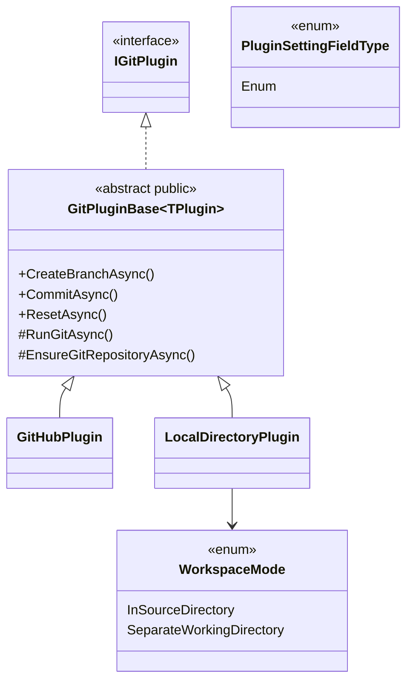

# Anforderungsanalyse – LocalDirectoryPlugin (Git für lokale Verzeichnisse)

> **Dokument-Typ:** Requirements Analysis  
> **Status:** ✅ Umgesetzt und validiert (Code-Review 2026-05-12)  
> **Version:** 1.1.0  
> **Thema:** LocalDirectoryPlugin inkl. Contract-Erweiterungen, GitPluginBase-Refactoring, Settings-UI, Serialisierung und Test-/Build-Validierung

---

## 1. Überblick und Projektkontext

### 1.1 Projektbeschreibung

Das Plugin-System wird um ein `LocalDirectoryPlugin` als SCM-Plugin erweitert. Ziel ist, lokale Verzeichnisse als Git-Arbeitsbasis zu unterstützen und gleichzeitig gemeinsame Git-Logik über `GitPluginBase<TPlugin>` zu zentralisieren.

### 1.2 Geschäftsziele

| # | Ziel | Messbare Erfolgsgröße |
|---|---|---|
| Z-1 | Lokale Projekte ohne Remote-Provider bearbeiten | Clone/Branch/Commit/Reset laufen in beiden `WorkspaceMode`-Varianten erfolgreich |
| Z-2 | Git-Logik konsolidieren | Reduktion redundanter Implementierung in GitHubPlugin durch Basisklasse |
| Z-3 | Bedienbarkeit und Robustheit erhöhen | `WorkspaceMode` als Select/Enum in Settings verfügbar und persistent |
| Z-4 | Regressionen vermeiden | Build + Unit-/Integrationstests in CI lokal reproduzierbar grün |

### 1.3 Stakeholder

| Rolle | Interesse |
|---|---|
| Product Owner | Planbare, risikoarme Erweiterung ohne Regression |
| Entwicklerteam | Wiederverwendbare Contracts und klare Verantwortlichkeiten |
| QA | Nachweisbare Akzeptanzkriterien und stabile Testabdeckung |
| Anwender | Verständliche Konfiguration und vorhersehbares Verhalten bei lokalen Workspaces |

### 1.4 Abgrenzung

- Fokus: Lokale Git-Workflows und Contract-/UI-Erweiterungen.
- Keine Einführung zusätzlicher Remote-Provider.
- Keine Implementierung von Push/Pull/PR/Issues für lokale Verzeichnisse.

---

## 2. Funktionale Anforderungen

| Kennung | Beschreibung | Kategorie | Priorität | Status |
|---------|--------------|-----------|-----------|--------|
| **FR-1** | **LocalDirectoryPlugin bereitstellen:** Neues Git-Plugin für lokale Verzeichnisse mit Unterstützung von `CloneRepositoryAsync`, `CreateBranchAsync`, `CommitAsync` und `ResetAsync` in lokaler Workspace-Logik. → [Lokales Architektur-Blueprint](../architecture/lokales-verzeichnis-plugin-architecture-blueprint.md) · [Lokales ERM](../architecture/lokales-verzeichnis-plugin-entity-relationship-model.md) · [Planungsübersicht](../planning-overview-lokales-verzeichnis-plugin.md) | Kern-Feature | MUST HAVE | ✅ Umgesetzt |
| **FR-1.1** | **WorkspaceMode-gesteuertes Clone-Verhalten:** `CloneRepositoryAsync` interpretiert den Eingabepfad als lokales Source-Verzeichnis und arbeitet abhängig vom Modus direkt im Source oder in einer separaten Working-Kopie; Erfolgsquote in Integrationstests ≥ 95 %. | Datenverwaltung | MUST HAVE | ✅ Umgesetzt |
| **FR-1.2** | **Lokale Git-Operationen konsistent:** Branch/Commit/Reset nutzen den aufgelösten Workspace-Pfad deterministisch (0 Pfadabweichungen in Testmatrix). | Kern-Feature | MUST HAVE | ✅ Umgesetzt |
| **FR-1.3** | **Nicht unterstützte Remote-Funktionen klar behandeln:** `PushBranchAsync`, `PullAsync`, `CreatePullRequestAsync`, `GetRemoteBranchesAsync`, `GetDefaultBranchAsync`, `CheckoutRemoteBranchAsync`, `GetIssuesAsync` liefern für `LocalDirectoryPlugin` ein explizites NotSupported-Verhalten mit verständlicher Meldung. | Fehlerbehandlung | MUST HAVE | ✅ Umgesetzt |
| **FR-2** | **Contracts erweitern und vereinheitlichen:** Im Contracts-Bereich stehen `WorkspaceMode` (`InSourceDirectory`, `SeparateWorkingDirectory`), `PluginSettingFieldType.Enum` und eine wiederverwendbare `GitPluginBase<TPlugin>` zur Verfügung. → [Plugin-Interfaces](../api/plugin-interfaces.md) · [Lokales Architektur-Blueprint](../architecture/lokales-verzeichnis-plugin-architecture-blueprint.md) | Architektur | MUST HAVE | ✅ Umgesetzt |
| **FR-2.1** | **GitHubPlugin auf Basisklasse refaktorieren:** GitHubPlugin delegiert gemeinsame Git-Operationen (Branch/Commit/Reset/Helpers) an `GitPluginBase<TPlugin>`; provider-spezifische Remote-/Auth-Logik bleibt lokal. | Wartbarkeit | MUST HAVE | ✅ Umgesetzt |
| **FR-2.2** | **Basisklasse öffentlich nutzbar:** `GitPluginBase<TPlugin>` ist `public`, damit externe Plugin-Assemblies den Typ direkt referenzieren können. | Wartbarkeit | HIGH | ✅ Umgesetzt |
| **FR-3** | **WorkspaceMode als Setting anbieten:** Plugin-Settings enthalten ein typisiertes Auswahlfeld (Enum/Select) für `WorkspaceMode` mit den beiden zulässigen Werten. → [PluginSettings-Service-Flow](../flows/plugin-settings-service-flow.md) · [Workdir-Resolution-Flow](../flows/workdir-resolution-flow.md) | UX / Accessibility | MUST HAVE | ✅ Umgesetzt |
| **FR-3.1** | **Serialisierung und Persistenz:** `WorkspaceMode` wird als stabiler String-Enumwert serialisiert und im bestehenden Plugin-Setting-Schema (`<PluginPrefix>.<Key>`) gespeichert; Roundtrip-Konsistenz 100 % in Tests. | Datenverwaltung | MUST HAVE | ✅ Umgesetzt |
| **FR-4** | **Sicherheits- und Nutzerentscheidungen umsetzen:** `git init` im Source-Verzeichnis erfordert explizite Nutzerbestätigung vor der ersten Ausführung im Modus `InSourceDirectory`; ohne Bestätigung wird die Operation abgebrochen. | Sicherheit | HIGH | ✅ Umgesetzt |
| **FR-4.1** | **Dirty-Workspace-Regel:** Bei uncommitted changes schlägt `CloneRepositoryAsync`/Moduswechsel mit hartem Fehler fehl (kein stilles Überschreiben); Meldung enthält klare Handlungsanweisung. | Zuverlässigkeit | HIGH | ✅ Umgesetzt |
| **FR-5** | **Qualitätssicherung verpflichtend:** Änderung umfasst Unit- und Integrations-Tests sowie Build-/Test-Validierung (`dotnet build`, `dotnet test`) als Release-Gate. → [Testplan Arbeitsverzeichnis](../tests/testplan-arbeitsverzeichnis.md) · [Systemweiter Testplan](../tests/testplan-systemweit.md) | Qualitätssicherung | MUST HAVE | ✅ Umgesetzt |

---

## 3. Nicht-funktionale Anforderungen

| Kennung | Beschreibung | Kategorie | Priorität | Status |
|---------|--------------|-----------|-----------|--------|
| **NFR-1** | **Kopierrandbedingungen:** Verzeichniskopien in `SeparateWorkingDirectory` haben konfigurierbare Guardrails (Default: Timeout 10 Min., max. 100.000 Dateien oder 10 GB); Überschreitung führt zu kontrolliertem Abbruch. | Performance | MUST HAVE | ✅ Umgesetzt |
| **NFR-2** | **Robuste Fehlersemantik:** Alle nicht unterstützten Remote-Methoden liefern deterministisch denselben Fehlertyp (`NotSupportedException`) inklusive plugin-spezifischer Meldung; 0 uneinheitliche Sonderfälle in Tests. | Zuverlässigkeit | MUST HAVE | ✅ Umgesetzt |
| **NFR-3** | **Persistenzkonformität:** Source-/WorkingDirectory und WorkspaceMode werden in bestehender Plugin-Settings-Persistenz gehalten (Credential Store), keine neue DB-Migration erforderlich. | Wartbarkeit | HIGH | ✅ Umgesetzt |
| **NFR-4** | **Abwärtskompatibilität:** GitHubPlugin-Verhalten bleibt nach Refactoring zu `GitPluginBase<TPlugin>` funktional unverändert; bestehende GitHub-Tests bleiben grün. | Stabilität | MUST HAVE | ✅ Umgesetzt |
| **NFR-5** | **UI-Konsistenz:** Enum-Felder werden in Einstellungen als Select gerendert (kein Freitext), Tastaturbedienbarkeit und sichtbare Labels bleiben erhalten. | UX / Accessibility | MUST HAVE | ✅ Umgesetzt |
| **NFR-6** | **Build-/Test-Laufzeitqualität:** Vollständiger Build und Testlauf der Solution bleibt innerhalb vorhandener CI-Zeitbudgets; keine neuen interaktiven Schritte im Pipeline-Flow. | Zuverlässigkeit | HIGH | ✅ Umgesetzt |

---

## 4. Akzeptanzkriterien

### US-1: Lokales Verzeichnis als Git-Workspace nutzen

**Als** Anwender  
**möchte ich** lokale Quellverzeichnisse als Git-Workspace nutzen,  
**damit** ich ohne Remote-Repository arbeiten kann.

| # | Akzeptanzkriterium | Messung |
|---|---|---|
| AC-1.1 | `LocalDirectoryPlugin` kann ein lokales Verzeichnis in beiden WorkspaceModes vorbereiten. | Integrationstest-Matrix (2 Modi) erfolgreich |
| AC-1.2 | `CreateBranchAsync`, `CommitAsync`, `ResetAsync` laufen auf dem aufgelösten Workspace ohne Pfadverwechslung. | Pfad-Assertions in Tests |
| AC-1.3 | Nicht unterstützte Remote-Operationen liefern überall `NotSupportedException`. | Unit-Tests pro Methode |

### US-2: Sichere Initialisierung und Moduswechsel

**Als** Anwender  
**möchte ich** riskante Operationen klar bestätigt bzw. geschützt haben,  
**damit** meine lokalen Daten nicht unbeabsichtigt verändert werden.

| # | Akzeptanzkriterium | Messung |
|---|---|---|
| AC-2.1 | Vor erstem `git init` im Source-Verzeichnis ist eine explizite Bestätigung erforderlich. | UI-/Service-Test mit Confirm-Flag |
| AC-2.2 | Bei dirty working tree wird Operation mit hartem Fehler abgebrochen. | Negativtest mit uncommitted changes |
| AC-2.3 | Große Verzeichniskopien werden bei Guardrail-Verstoß mit verständlicher Meldung beendet. | Last-/Grenzwerttest |

### US-3: Contracts, UI und Persistenz konsistent

**Als** Entwicklerteam  
**möchte ich** typisierte, wiederverwendbare Contracts und UI-Unterstützung,  
**damit** Plugins konsistent implementierbar bleiben.

| # | Akzeptanzkriterium | Messung |
|---|---|---|
| AC-3.1 | `WorkspaceMode` ist im Contracts-Bereich definiert und von Plugins referenzierbar. | Compile-Time-Nachweis |
| AC-3.2 | `PluginSettingFieldType.Enum` rendert als Select und serialisiert stabil. | Component-/Service-Tests |
| AC-3.3 | `GitHubPlugin` nutzt `GitPluginBase<TPlugin>` für gemeinsame Git-Operationen ohne Funktionsverlust. | Regressionstest GitHubPlugin |

### US-4: Qualitätstor vor Abschluss

**Als** QA/Release-Verantwortliche  
**möchte ich** eine reproduzierbare Build-/Test-Validierung,  
**damit** die Änderung sicher auslieferbar ist.

| # | Akzeptanzkriterium | Messung |
|---|---|---|
| AC-4.1 | `dotnet build` der Solution läuft fehlerfrei. | Build-Log |
| AC-4.2 | Unit- und Integrations-Tests für neue/angepasste Pfade laufen grün. | `dotnet test` Ergebnis |
| AC-4.3 | Es existieren Tests für alle sechs Entscheiderpunkte (Init, Copy-Limit, Dirty-Tree, Persistenz, Issues-Verhalten, Sichtbarkeit Basisklasse). | Testfall-Matrix |

---

## 5. Annahmen und Abhängigkeiten

### 5.1 Verbindliche Annahmen (entschiedene Unklarheiten)

| Kennung | Entscheidung (Annahme) | Begründung | Auswirkung |
|---|---|---|---|
| A-1 | **`git init` im Quellverzeichnis benötigt explizite Bestätigung.** | Verhindert unbeabsichtigte Repos in Produktiv-/Fremdordnern. | Zusätzlicher Confirm-Flow in UI/Service notwendig. |
| A-2 | **Verzeichniskopie erhält harte Limits/Timeouts.** | Schutz vor Hängern bei großen Projekten. | Copy-Service benötigt Abbruch- und Fortschrittsfehler. |
| A-3 | **Uncommitted changes führen zu hartem Fehler.** | Datensicherheit vor Komfort; kein stilles Überschreiben. | Vor jeder riskanten Operation Dirty-Check erforderlich. |
| A-4 | **Source-/WorkingDirectory bleiben im Credential Store, nicht in DB.** | Konsistent mit bestehendem PluginSettings-Schema `<PluginPrefix>.<Key>`. | Keine Migration, aber klare Key-Norm nötig. |
| A-5 | **`GetIssuesAsync` liefert `NotSupportedException`.** | Lokales Plugin hat keine Issues-Domäne; expliziter Fehler klarer als leere Liste. | Aufrufende Schicht muss NotSupported UX-freundlich behandeln. |
| A-6 | **`GitPluginBase<TPlugin>` ist `public`.** | Externe Plugins/Assemblies benötigen zugängliche Basisklasse aus Contracts. | API-Oberfläche stabil dokumentieren. |

### 5.2 Weitere Abhängigkeiten und Risiken

| Typ | Eintrag | Risiko bei Nicht-Erfüllung |
|---|---|---|
| Abhängigkeit | Settings-UI unterstützt Enum/Select generisch. | WorkspaceMode nicht konfigurierbar oder fehleranfällig über Freitext. |
| Abhängigkeit | `ICliRunner` deckt Timeouts/Cancellation robust ab. | Kopier-/Git-Operationen können hängen. |
| Risiko | Uneinheitliche Fehlerbehandlung zwischen Plugins. | Erhöhte Support-Kosten und schwer testbare Sonderpfade. |
| Risiko | Refactoring GitHubPlugin entfernt unbeabsichtigt bestehendes Verhalten. | Regression in produktiven GitHub-Workflows. |

---

## 6. Scope und Out-of-Scope

### In-Scope ✅

| # | Feature |
|---|---|
| S-1 | Neues `LocalDirectoryPlugin` als SCM-Plugin für lokale Verzeichnisse |
| S-2 | Contracts: `WorkspaceMode`, `PluginSettingFieldType.Enum`, `GitPluginBase<TPlugin>` |
| S-3 | Refactoring des bestehenden `GitHubPlugin` auf Basisklasse |
| S-4 | WorkspaceMode-Setting inkl. Select-UI, Serialisierung und Persistenz |
| S-5 | Explizite Behandlung nicht unterstützter Remote-Funktionen |
| S-6 | Unit-/Integrations-Tests sowie Build-/Test-Validierung |

### Out-of-Scope ❌

| # | Feature | Begründung |
|---|---|---|
| O-1 | Implementierung von Push/Pull/PR/Issues für lokale Quellen | Fachlich außerhalb Local-Only-Ansatz |
| O-2 | Einführung neuer SCM-Provider | Nicht Teil dieser Änderung |
| O-3 | Vollständige UX-Neugestaltung der Einstellungsseite | Nur notwendige Enum/Select-Erweiterung gefordert |
| O-4 | Persistenz-Migration in relationale DB | Entscheidung A-4: Credential Store bleibt Standard |

---

## 7. Domänenmodell und Glossar

**Glossar**

- **LocalDirectoryPlugin:** SCM-Plugin für lokale Verzeichnisse ohne Remote-Backend.
- **WorkspaceMode:** Arbeitsmodus mit den Werten `InSourceDirectory` und `SeparateWorkingDirectory`.
- **GitPluginBase<TPlugin>:** Öffentliche, wiederverwendbare Basisklasse für gemeinsame Git-Operationen.
- **Enum-Setting:** Plugin-Einstellungsfeld, das als typisierte Auswahlliste dargestellt und als String-Enum gespeichert wird.

---

## 8. Nutzungsfälle (Use Cases)

### UC-1: Projekt aus lokalem Quellverzeichnis starten

| Feld | Inhalt |
|------|--------|
| **ID** | UC-1 |
| **Name** | Lokales Verzeichnis initialisieren und Branch erstellen |
| **Akteur** | Anwender |
| **Vorbedingung** | Quellverzeichnis existiert; ggf. kein `.git` vorhanden |
| **Auslöser** | Anwender startet Arbeitsprozess mit `InSourceDirectory` |
| **Hauptszenario** | 1) System prüft Git-Status. 2) UI fragt explizite `git init`-Bestätigung ab. 3) System initialisiert Repository. 4) Branch wird erstellt. |
| **Alternativszenario** | Bestätigung abgelehnt oder dirty workspace erkannt → kontrollierter Abbruch mit Fehlermeldung |
| **Nachbedingung** | Git-fähiger lokaler Workspace steht bereit |
| **Anforderungen** | FR-1, FR-1.2, FR-4, FR-4.1 |

### UC-2: Separates Arbeitsverzeichnis nutzen

| Feld | Inhalt |
|------|--------|
| **ID** | UC-2 |
| **Name** | Verzeichniskopie und lokaler Arbeitszweig |
| **Akteur** | Anwender |
| **Vorbedingung** | `WorkspaceMode = SeparateWorkingDirectory` gespeichert |
| **Auslöser** | `CloneRepositoryAsync` wird mit lokalem Source-Pfad aufgerufen |
| **Hauptszenario** | 1) System prüft Copy-Limits/Timeout. 2) Verzeichnis wird kopiert. 3) Git-Operationen laufen im WorkingDirectory. |
| **Alternativszenario** | Limit überschritten → Abbruch mit klarer Meldung |
| **Nachbedingung** | Original bleibt unverändert, Arbeitskopie ist Git-basiert nutzbar |
| **Anforderungen** | FR-1.1, FR-3, NFR-1 |

### UC-3: Nicht unterstützte Remote-Funktion aufrufen

| Feld | Inhalt |
|------|--------|
| **ID** | UC-3 |
| **Name** | Explizite Ablehnung von Remote-Operationen |
| **Akteur** | System / Service-Layer |
| **Vorbedingung** | Aktives Plugin ist `LocalDirectoryPlugin` |
| **Auslöser** | Aufruf z. B. `GetIssuesAsync` oder `PushBranchAsync` |
| **Hauptszenario** | 1) Plugin erkennt nicht unterstützte Operation. 2) `NotSupportedException` mit verständlichem Kontext wird geworfen. |
| **Nachbedingung** | Kein stilles Fehlverhalten, aufrufende Ebene kann Nutzerhinweis darstellen |
| **Anforderungen** | FR-1.3, NFR-2, A-5 |

---

## 9. Nächste Schritte

| # | Schritt | Verantwortlich | Priorität |
|---|---|---|---|
| NS-1 | LocalDirectoryPlugin implementieren (Clone/Branch/Commit/Reset inkl. WorkspaceMode-Logik) | Entwicklung | MUST HAVE |
| NS-2 | Settings-UI um Enum/Select-Rendering erweitern und WorkspaceMode anbinden | Entwicklung | MUST HAVE |
| NS-3 | GitHubPlugin-Refactoring auf `GitPluginBase<TPlugin>` abschließen und Regression prüfen | Entwicklung | MUST HAVE |
| NS-4 | Guardrails für Verzeichniskopie (Timeout/Limits) implementieren | Entwicklung | HIGH |
| NS-5 | Testmatrix (Unit + Integration + Negativfälle) implementieren | Entwicklung/QA | MUST HAVE |
| NS-6 | Build-/Test-Validierung in lokaler Pipeline und CI durchführen | QA/DevOps | MUST HAVE |

---

## 10. Approval & Versionierung

### Freigabe

| Rolle | Name | Status | Datum |
|-------|------|--------|-------|
| Product Owner | _ausstehend_ | ⏳ Ausstehend | — |
| Architektur | _ausstehend_ | ⏳ Ausstehend | — |
| QA Lead | _ausstehend_ | ⏳ Ausstehend | — |
| Autor | GitHub Copilot Agent | ✅ Aktualisiert | 2026-05-12 |

### Versionshistorie

| Version | Datum | Autor | Änderung |
|---------|-------|-------|----------|
| 1.1.0 | 2026-05-12 | GitHub Copilot Agent | Vollständige Überarbeitung gemäß Änderungsanforderung: Contracts (`WorkspaceMode`, `PluginSettingFieldType.Enum`, `GitPluginBase<TPlugin>`), LocalDirectoryPlugin-Scope, GitHub-Refactoring, Settings-UI, Serialisierung, Test-/Build-Gates und entschiedene Annahmen (A-1 bis A-6) ergänzt |
| 1.0.0 | 2026-05-12 | GitHub Copilot Agent | Initiale Anforderungsanalyse erstellt |

---

*Dokument-Pfad: `docs/requirements/lokales-verzeichnis-plugin-requirements-analysis.md` · Projekt: Softwareschmiede · Sprache: Deutsch*
