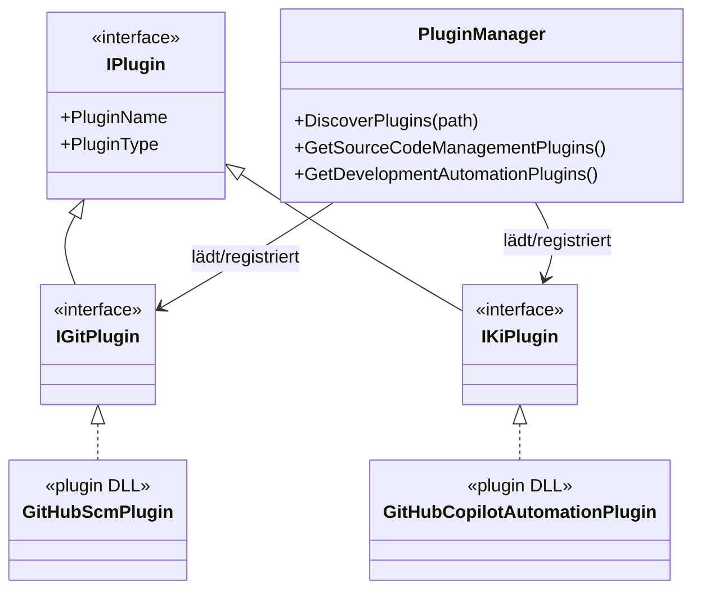

# Anforderungsanalyse – Plugin-Klassenbibliotheken für GitHub und GitHub Copilot

> **Dokument-Typ:** Feature-spezifische Anforderungsanalyse  
> **Projekt:** Softwareschmiede  
> **Primäre Quelle (verbindlich):** [`../../.copilot-task.md`](../../.copilot-task.md)  
> **Status:** ✅ Umgesetzt und testseitig abgedeckt  
> **Version:** 1.0.0

---

## 1. Überblick und Projektkontext

### 1.1 Ausgangslage

Aktuell sind GitHub-Anbindung und GitHub-Copilot-Anbindung jeweils als fest verdrahtete Implementierungen in der Hauptanwendung vorhanden. Die verbindliche Anforderung fordert explizit die Auslagerung in separate Plugin-Klassenbibliotheken im Unterordner `plugins`.

### 1.2 Zielbild

- Die GitHub-SCM-Anbindung wird als eigene Klassenbibliothek implementiert.
- Die GitHub-Copilot-Entwicklungsautomatisierung wird als eigene Klassenbibliothek implementiert.
- Beide Plugin-Projekte liegen strukturell unter `plugins/`.
- Die Hauptanwendung nutzt eine zentrale Serviceklasse `PluginManager`, die Plugins für die Pluginarten **Source Code Management** und **Development Automation** automatisch erkennt.
- Der Build der Solution stellt die Plugin-DLLs automatisch im Laufzeitordner `<Programmverzeichnis>/plugins` bereit.

### 1.3 Stakeholder

| Rolle | Interesse |
|---|---|
| Produktverantwortung | Korrekte Umsetzung der verbindlichen Anforderung ohne erneute Fehlinterpretation |
| Entwicklerteam | Wartbare, austauschbare Integrationen mit klarer Plugin-Grenze |
| Anwender | Unveränderte fachliche Funktionen bei besserer Erweiterbarkeit |

### 1.4 Abgrenzung

- Fokus dieses Dokuments: Plugin-Architektur und Build-Auslieferung.
- Keine Erweiterung auf zusätzliche Provider (z. B. GitLab, Azure DevOps) in diesem Schritt.

---

## 2. Funktionale Anforderungen

| Kennung | Beschreibung | Kategorie | Priorität | Status |
|---------|--------------|-----------|-----------|--------|
| **FR-1** | **Plugin-Auslagerung GitHub & Copilot:** Die bisher fest verdrahteten Integrationen werden in zwei getrennte Klassenbibliotheken ausgelagert (GitHub für SCM, GitHub Copilot für Development Automation), abgelegt unter dem Unterordner `plugins/`. → [Architektur-Blueprint](../architecture/plugin-klassenbibliotheken-github-und-copilot-architecture-blueprint.md) · [Plugin-Interfaces](../api/plugin-interfaces.md) | Kern-Feature | MUST HAVE | ✅ Umgesetzt |
| **FR-1.1** | **GitHub-SCM-Pluginbibliothek:** Es existiert ein separates Projekt für Source-Code-Management-Funktionen (Issue-Abruf, Clone, Branch, Push/Pull, PR) mit Implementierung der definierten Git-Schnittstelle. | Source Code Management | MUST HAVE | ✅ Umgesetzt |
| **FR-1.2** | **GitHub-Copilot-Pluginbibliothek:** Es existiert ein separates Projekt für Development-Automation-Funktionen (Prompt-Ausführung, Agenten, Streaming, Testausführung) mit Implementierung der definierten KI-Schnittstelle. | Development Automation | MUST HAVE | ✅ Umgesetzt |
| **FR-2** | **Automatische Plugin-Erkennung über PluginManager:** Die Hauptanwendung stellt eine Serviceklasse `PluginManager` bereit, die Plugins der Typen „Source Code Management“ und „Development Automation“ automatisch lädt und zur Laufzeit verfügbar macht. → [Architektur-Blueprint](../architecture/plugin-klassenbibliotheken-github-und-copilot-architecture-blueprint.md) · [Plugin-Interfaces](../api/plugin-interfaces.md) | Plugin-Infrastruktur | MUST HAVE | ✅ Umgesetzt |
| **FR-2.1** | **Discovery-Pfad:** `PluginManager` durchsucht beim Start den Ordner `<Programmverzeichnis>/plugins` nach Plugin-DLLs. | Plugin-Infrastruktur | MUST HAVE | ✅ Umgesetzt |
| **FR-2.2** | **Typzuordnung:** Gefundene Plugins werden eindeutig einer Pluginart (`Source Code Management` oder `Development Automation`) zugeordnet und getrennt registriert. | Plugin-Infrastruktur | MUST HAVE | ✅ Umgesetzt |
| **FR-2.3** | **Robustes Fehlerverhalten:** Defekte oder nicht ladbare DLLs blockieren den Anwendungsstart nicht; Fehler werden protokolliert und verständlich ausgewiesen. | Zuverlässigkeit | HIGH | ✅ Umgesetzt |
| **FR-3** | **Automatische Build-Bereitstellung der Plugin-DLLs:** Der Solution-Build kopiert die beiden Plugin-DLLs automatisch in `<Programmverzeichnis>/plugins` der Hauptanwendung; keine manuelle Kopie notwendig. → [Architektur-Blueprint](../architecture/plugin-klassenbibliotheken-github-und-copilot-architecture-blueprint.md) | Build & Deployment | MUST HAVE | ✅ Umgesetzt |
| **FR-3.1** | **Build-Output-Struktur:** Nach erfolgreichem Build existiert der Unterordner `plugins` im Output-Verzeichnis der Hauptanwendung und enthält beide Ziel-DLLs. | Build & Deployment | MUST HAVE | ✅ Umgesetzt |
| **FR-3.2** | **Build-Konfigurationsparität:** Verhalten ist mindestens für Debug und Release identisch. | Build & Deployment | HIGH | ✅ Umgesetzt |
| **FR-4** | **Funktionale Gleichwertigkeit zur bisherigen Integration:** Trotz Auslagerung bleiben bestehende Nutzerfunktionen für GitHub und Copilot fachlich unverändert nutzbar. → [requirements-analysis](requirements-analysis.md) | Rückwärtskompatibilität | MUST HAVE | ✅ Umgesetzt |

---

## 3. Nicht-funktionale Anforderungen

| Kennung | Beschreibung | Kategorie | Priorität | Status |
|---------|--------------|-----------|-----------|--------|
| **NFR-1** | **Austauschbarkeit:** Plugin-Implementierungen sind ohne Änderung der Kernanwendung ersetzbar, solange die Schnittstellenverträge erfüllt sind. → [Plugin-Interfaces](../api/plugin-interfaces.md) | Wartbarkeit | MUST HAVE | ✅ Umgesetzt |
| **NFR-2** | **Startzeit Discovery:** Plugin-Discovery und -Registrierung sind beim App-Start in ≤ 2 Sekunden abgeschlossen (bei bis zu 20 DLLs im Plugin-Ordner). | Performance | HIGH | ✅ Umgesetzt |
| **NFR-3** | **Fehlertoleranz:** Ein defektes Plugin führt nicht zum Absturz der gesamten Anwendung (0 ungefangene Exceptions im Discovery-Pfad). | Zuverlässigkeit | MUST HAVE | ✅ Umgesetzt |
| **NFR-4** | **Nachvollziehbarkeit:** Geladene und abgewiesene Plugins werden mit Grund im Log dokumentiert. | Betriebsfähigkeit | HIGH | ✅ Umgesetzt |
| **NFR-5** | **Build-Reproduzierbarkeit:** Standard-Build der Solution liefert reproduzierbar dieselbe Plugin-Output-Struktur ohne manuelle Zusatzschritte. | Build-Qualität | MUST HAVE | ✅ Umgesetzt |

---

## 4. Akzeptanzkriterien

### US-1: Plugin-Auslagerung korrekt umgesetzt

**Als** Produktverantwortung  
**möchte ich** die GitHub- und Copilot-Integration in getrennten Klassenbibliotheken sehen,  
**damit** die bisherige fest verdrahtete Umsetzung durch ein echtes Plugin-Prinzip ersetzt wird.

| # | Akzeptanzkriterium | Messung |
|---|--------------------|---------|
| AC-1.1 | Es existieren zwei separate Plugin-Projekte unter `plugins/` (SCM + Development Automation). | Projektstruktur im Repository prüfbar. |
| AC-1.2 | Hauptanwendung referenziert keine fest verdrahtete konkrete GitHub-/Copilot-Implementierung mehr als einzige zwingende Laufzeitoption. | Architektur-/Codeprüfung ohne Hard-Wiring. |

### US-2: Plugins werden automatisch gefunden

**Als** Anwender  
**möchte ich** dass Plugins automatisch erkannt werden,  
**damit** ich keine manuelle Registrierung durchführen muss.

| # | Akzeptanzkriterium | Messung |
|---|--------------------|---------|
| AC-2.1 | `PluginManager` lädt beim Start Plugins aus `<Programmverzeichnis>/plugins`. | Startlauf mit Log-Nachweis. |
| AC-2.2 | Mindestens ein SCM-Plugin und ein Development-Automation-Plugin werden bei vorhandenem DLL-Bestand korrekt erkannt. | Verfügbarkeitsanzeige oder Service-Registry enthält beide Typen. |
| AC-2.3 | Fehlerhafte DLL wird übersprungen; Anwendung bleibt bedienbar. | Negativtest mit absichtlich fehlerhafter DLL ohne App-Absturz. |

### US-3: Build liefert lauffähige Plugin-Struktur

**Als** Entwickler  
**möchte ich** dass der Build die Plugins automatisch in den Zielordner bereitstellt,  
**damit** keine manuellen Kopierschritte nötig sind.

| # | Akzeptanzkriterium | Messung |
|---|--------------------|---------|
| AC-3.1 | Nach `dotnet build` existiert im Hauptanwendungs-Output der Ordner `plugins`. | Dateisystemprüfung nach Build. |
| AC-3.2 | Im Ordner `plugins` liegen beide Plugin-DLLs (GitHub, GitHub Copilot). | Datei-Existenzprüfung. |
| AC-3.3 | Verhalten gilt für Debug und Release. | Zwei Builds, identisches Ergebnis. |

---

## 5. Annahmen und Abhängigkeiten

| # | Typ | Beschreibung | Auswirkung bei Nicht-Erfüllung |
|---|-----|--------------|--------------------------------|
| A-1 | Annahme | Die in der primären Quelldatei beschriebene Korrektur ist maßgeblich; frühere abweichende Umsetzung gilt als falsch. | Risiko erneuter Fehlimplementierung trotz Änderung. |
| A-2 | Annahme | Plugin-Schnittstellen (`IGitPlugin`, `IKiPlugin`) bleiben als Integrationsvertrag stabil nutzbar. | Zusätzlicher Refactoring-Aufwand in Plugins und Host. |
| D-1 | Abhängigkeit | Build-/Projektkonfiguration der Solution unterstützt Copy/Publish-Schritte in den Host-Output. | DLLs landen nicht automatisch in `<Programmverzeichnis>/plugins`. |
| D-2 | Abhängigkeit | Laufzeitumgebung erlaubt Laden von DLLs aus dem Programm-Unterordner `plugins`. | PluginManager kann Plugins nicht instanziieren. |
| D-3 | Abhängigkeit | GitHub CLI und Copilot CLI sind weiterhin die technische Basis der konkreten Plugins. | Funktionale Regression in SCM-/KI-Abläufen. |

---

## 6. Scope und Out-of-Scope

### In-Scope ✅

| # | Feature |
|---|---------|
| S-1 | Auslagerung GitHub-SCM in eigene Plugin-Klassenbibliothek unter `plugins/` |
| S-2 | Auslagerung GitHub-Copilot in eigene Plugin-Klassenbibliothek unter `plugins/` |
| S-3 | Einführung einer zentralen Serviceklasse `PluginManager` zur automatischen Erkennung |
| S-4 | Discovery für Pluginarten `Source Code Management` und `Development Automation` |
| S-5 | Automatische Bereitstellung der Plugin-DLLs in `<Programmverzeichnis>/plugins` durch Solution-Build |

### Out-of-Scope ❌

| # | Feature | Begründung |
|---|---------|------------|
| O-1 | Neue zusätzliche Provider-Plugins (z. B. GitLab, Bitbucket, OpenAI) | Fokus liegt auf Entkopplung der vorhandenen Integrationen |
| O-2 | Erweiterte Plugin-Marktplatz-/Download-Mechanismen | Nicht Teil der aktuellen Korrekturanforderung |
| O-3 | Fachliche Erweiterung der Git-/KI-Funktionen | Ziel ist Strukturmigration, nicht Funktionsausbau |

---

## 7. Domänenmodell und Glossar

### 7.1 Domänenmodell (logisch)

### 7.2 Glossar

| Begriff | Definition |
|---|---|
| **PluginManager** | Serviceklasse der Hauptanwendung zur Discovery, Validierung und Registrierung von Plugins |
| **Source Code Management Plugin** | Pluginart für Git-/Repository-Funktionen (z. B. GitHub) |
| **Development Automation Plugin** | Pluginart für KI-gestützte Entwicklung (z. B. GitHub Copilot) |
| **Plugin-Ordner** | Laufzeitordner `<Programmverzeichnis>/plugins`, aus dem DLLs geladen werden |
| **Klassenbibliothek** | Separates .NET-Projekt, das eine Plugin-Schnittstelle implementiert und als DLL bereitgestellt wird |

---

## 8. Nutzungsfälle (Use Cases)

### UC-1: Automatische Plugin-Discovery beim Start

| Feld | Inhalt |
|------|--------|
| **ID** | UC-1 |
| **Name** | Plugin-Discovery beim App-Start |
| **Akteur** | System |
| **Vorbedingung** | Ordner `<Programmverzeichnis>/plugins` ist vorhanden |
| **Auslöser** | Anwendung startet |
| **Hauptszenario** | 1. `PluginManager` scannt den Plugin-Ordner. 2. DLLs werden geladen. 3. Plugins werden nach Typ (SCM/Development Automation) registriert. |
| **Alternativszenario** | DLL fehlerhaft oder inkompatibel → Eintrag im Log, Plugin wird nicht registriert, Start läuft weiter. |
| **Nachbedingung** | Verfügbare Plugins sind im System nutzbar |
| **Anforderungen** | FR-2, FR-2.1, FR-2.2, FR-2.3, NFR-3 |

### UC-2: SCM-Funktion über ausgelagertes GitHub-Plugin

| Feld | Inhalt |
|------|--------|
| **ID** | UC-2 |
| **Name** | Git-Operation über SCM-Plugin |
| **Akteur** | Anwender |
| **Vorbedingung** | GitHub-SCM-Plugin wurde durch `PluginManager` geladen |
| **Auslöser** | Anwender startet eine Git-Aktion (z. B. Pull Request erstellen) |
| **Hauptszenario** | 1. Anwendung fordert SCM-Plugin beim PluginManager an. 2. Plugin führt GitHub-Operation aus. 3. Ergebnis wird in UI/Protokoll zurückgegeben. |
| **Nachbedingung** | Git-Aktion wurde ohne Hard-Wiring über Plugin-Implementierung ausgeführt |
| **Anforderungen** | FR-1.1, FR-2, FR-4 |

### UC-3: Build stellt Plugin-DLLs bereit

| Feld | Inhalt |
|------|--------|
| **ID** | UC-3 |
| **Name** | Automatisierte Plugin-Bereitstellung durch Build |
| **Akteur** | Entwickler / Build-System |
| **Vorbedingung** | Solution enthält Hostprojekt + zwei Pluginprojekte |
| **Auslöser** | `dotnet build` der Solution |
| **Hauptszenario** | 1. Build erzeugt Host-Assembly. 2. Build erzeugt Plugin-DLLs. 3. Build kopiert beide DLLs nach `<Programmverzeichnis>/plugins`. |
| **Nachbedingung** | Host ist direkt mit Plugin-Ordner lauffähig |
| **Anforderungen** | FR-3, FR-3.1, FR-3.2, NFR-5 |

---

## 9. Nächste Schritte

| # | Schritt | Verantwortlich | Priorität |
|---|---------|---------------|-----------|
| NS-1 | Architektur- und Projektstruktur für `plugins/` konkretisieren | Architektur | MUST HAVE |
| NS-2 | `PluginManager`-Service in der Hauptanwendung implementieren | Entwicklung | MUST HAVE |
| NS-3 | GitHub-SCM-Plugin als separate Klassenbibliothek erstellen/migrieren | Entwicklung | MUST HAVE |
| NS-4 | GitHub-Copilot-Plugin als separate Klassenbibliothek erstellen/migrieren | Entwicklung | MUST HAVE |
| NS-5 | Build-Konfiguration für automatisches Kopieren nach `<Programmverzeichnis>/plugins` ergänzen | Entwicklung | MUST HAVE |
| NS-6 | Integrations- und Negativtests für Discovery/Fehlerfälle ergänzen | QA/Entwicklung | HIGH |

### Offene Punkte

| Kennung | Offener Punkt | Vorschlag zur Klärung |
|---|---|---|
| OP-1 | Welches konkrete Metadatenmodell bestimmt die Pluginart (Attribut, Interface-Check, Manifest)? | Im Architektur-Blueprint verbindlich festlegen |
| OP-2 | Wird genau ein aktives Plugin pro Typ oder Multi-Plugin-Auswahl in UI benötigt? | Produktentscheidung dokumentieren |
| OP-3 | Gilt die DLL-Bereitstellung nur für Build oder zusätzlich explizit für Publish/Installer? | Build-/Release-Definition präzisieren |

---

## 10. Approval & Versionierung

### Freigabe

| Rolle | Name | Status | Datum |
|-------|------|--------|-------|
| Auftraggeber / Product Owner | Martin | ⏳ Ausstehend | — |
| Autor | planning-requirements-analysis | ✅ Erstellt | 2026-05-10 |

### Versionshistorie

| Version | Datum | Autor | Änderung |
|---------|-------|-------|----------|
| 1.0.0 | 2026-05-10 | planning-requirements-analysis | Initiale Feature-spezifische Anforderungsanalyse auf Basis der verbindlichen Task-Quelle mit Fokus auf Plugin-Auslagerung und Build-Bereitstellung |

---

*Dokument-Pfad: `docs/requirements/plugin-klassenbibliotheken-github-und-copilot.md` · Projekt: Softwareschmiede · Sprache: Deutsch*
