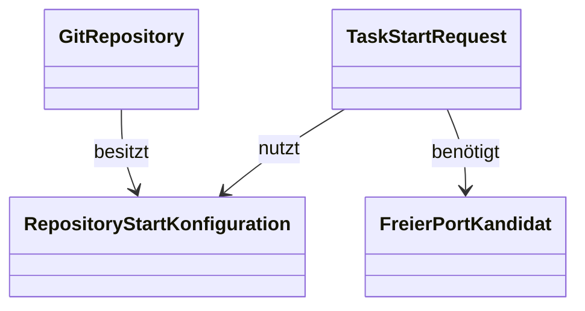

# Anforderungsanalyse – Repository-Startskript mit freier Portzuweisung

> **Dokument-Typ:** Requirements Analysis  
> **Status:** 📋 Geplant  
> **Version:** 1.0.0  
> **Thema:** Beim Aufgabenstart wird ein Repository-Skript ausgeführt, das einen freien Port für den Branch konfiguriert.

---

## 1. Überblick und Projektkontext

Die Softwareschmiede startet Aufgaben in einem branchspezifischen Arbeitsverzeichnis. Für lokale Runs in Visual Studio oder über die App darf der Zielport nicht mit anderen Branch-Kopien kollidieren. Deshalb soll pro Repository ein Startskript auswählbar sein, das bei jedem Aufgabenstart mit einem freien Port versorgt wird.

**Stakeholder:** Anwender, Entwicklung, Support

---

## 2. Funktionale Anforderungen

| Kennung | Beschreibung | Kategorie | Priorität | Status |
|---|---|---|---|---|
| **FR-1** | **Startskript auswählbar:** Für ein Repository kann ein Startskript aus dem Repository-Baum ausgewählt und gespeichert werden. → [Architektur-Blueprint](../architecture/repository-startskript-freier-port-architecture-blueprint.md) · [ERM](../architecture/repository-startskript-freier-port-entity-relationship-model.md) | Projektkonfiguration | MUST HAVE | 📋 Geplant |
| **FR-2** | **Freien Port ermitteln:** Vor der Skriptausführung muss ein freier lokaler Port ermittelt und gegen gleichzeitige Nutzung abgesichert werden. | Laufzeitsteuerung | MUST HAVE | 📋 Geplant |
| **FR-3** | **Skript bei Aufgabenstart ausführen:** Das ausgewählte Skript wird bei jedem Start einer Aufgabe automatisch ausgeführt. | Entwicklungsprozess | MUST HAVE | 📋 Geplant |
| **FR-4** | **Branch-spezifische Portkonfiguration:** Das Skript erhält den ermittelten Port so, dass jeder Branch eine eigene Portzuweisung bekommt. | Laufzeitsteuerung | HIGH | 📋 Geplant |
| **FR-5** | **Sichere Skriptauswahl:** Es dürfen nur Skripte innerhalb des Repositorys ausgewählt werden; Pfadtraversal ist auszuschließen. | Sicherheit | MUST HAVE | 📋 Geplant |
| **FR-6** | **Kontrollierte Fehlerbehandlung:** Fehlt das Skript oder ist kein Port verfügbar, wird der Start mit einer verständlichen Meldung abgebrochen. | Fehlerbehandlung | HIGH | 📋 Geplant |
| **FR-7** | **Regressionstest-Abdeckung:** Portsuche, Skriptausführung und Fehlerszenarien werden durch Tests abgesichert. | Qualität | MUST HAVE | 📋 Geplant |

---

## 3. Nicht-funktionale Anforderungen

| Kennung | Beschreibung | Kategorie | Priorität | Status |
|---|---|---|---|---|
| **NFR-1** | **Determinismus:** Ein Aufgabenstart verwendet reproduzierbar einen freien Port und keinen bereits belegten Standardport. | Zuverlässigkeit | MUST HAVE | 📋 Geplant |
| **NFR-2** | **Sicherheit:** Skriptpfade werden validiert; es werden keine Secrets oder interne Pfade in UI, Logs oder Exceptions offengelegt. | Sicherheit | MUST HAVE | 📋 Geplant |
| **NFR-3** | **Isolation:** Änderungen gelten nur für den betreffenden Branch-Klon und dürfen andere Repositories/Branches nicht beeinflussen. | Stabilität | MUST HAVE | 📋 Geplant |
| **NFR-4** | **Wartbarkeit:** Portsuche und Skriptausführung sind getrennte, testbare Services. | Wartbarkeit | HIGH | 📋 Geplant |
| **NFR-5** | **Performance:** Die Portprüfung soll ohne spürbare Verzögerung vor dem Aufgabenstart erfolgen. | Performance | MEDIUM | 📋 Geplant |

---

## 4. Akzeptanzkriterien

### User Story US-1 – Skript für ein Repository auswählen
- AC-1: In der Repository-Konfiguration kann ein gültiges Startskript gewählt werden.
- AC-2: Der Pfad wird nur akzeptiert, wenn er innerhalb des Repositorys liegt.

### User Story US-2 – Aufgabenstart mit freiem Port
- AC-3: Beim Start einer Aufgabe wird ein freier Port ermittelt.
- AC-4: Das konfigurierte Skript erhält diesen Port als Eingabe.

### User Story US-3 – Konfliktfall
- AC-5: Ist der Zielport belegt, wird ein alternativer freier Port verwendet.
- AC-6: Ist kein Port verfügbar oder fehlt das Skript, bricht der Start mit einem klaren Hinweis ab.

---

## 5. Annahmen und Abhängigkeiten

| Typ | Eintrag | Auswirkung |
|---|---|---|
| Annahme | Das Startskript liegt im Repository und wird dort versioniert. | Branch-spezifische Konfiguration bleibt nachvollziehbar. |
| Annahme | Der Aufgabenstart läuft lokal auf Windows. | PowerShell-Skripte sind primäre Zielplattform. |
| Abhängigkeit | `EntwicklungsprozessService` startet den Aufgabenlauf. | Dort wird die Skriptausführung eingehängt. |
| Abhängigkeit | Repository- und Projektkonfiguration werden persistiert. | Dafür ist ein neues Konfigurationsmodell nötig. |

---

## 6. Scope und Out-of-Scope

**In-Scope ✅**
- Auswahl eines Startskripts pro Repository
- Portsuche und Portvalidierung vor dem Start
- Ausführung des Skripts bei jedem Aufgabenstart
- Benutzerfeedback bei Fehlern

**Out-of-Scope ❌**
- Vollständige GUI zur Skriptbearbeitung
- Eigene Script-IDE oder Syntax-Editor
- Portverwaltung für externe Anwendungen außerhalb der Softwareschmiede

---

## 7. Domänenmodell und Glossar

**Glossar:**
- **RepositoryStartKonfiguration:** Persistierte Auswahl des Startskripts und der Portstrategie.
- **FreierPortKandidat:** Vorübergehend reservierter lokaler Port für einen Branch.
- **TaskStartRequest:** Auslöser für den Aufgabenstart inklusive Skriptlauf.

---

## 8. Nutzungsfälle (Use Cases)

- **UC-1:** Repository konfigurieren → Startskript auswählen und speichern.
- **UC-2:** Aufgabe starten → freier Port wird ermittelt, Skript wird mit Port ausgeführt.
- **UC-3:** Port belegt → alternativer Port wird gewählt.
- **UC-4:** Skript fehlt/ungültig → Start wird mit verständlicher Fehlermeldung abgebrochen.

---

## 9. Nächste Schritte
1. Architekturpfad für Skriptausführung und Portreservierung festlegen.
2. Persistenzmodell für die Repository-Startkonfiguration bestätigen.
3. Tests für freie Portsuche und Skriptvalidierung definieren.
4. Implementierungsreihenfolge für UI, Service und Infrastruktur planen.

---

## 10. Approval & Versionierung

| Version | Datum | Autor | Änderung |
|---|---|---|---|
| 1.0.0 | 2026-05-14 | planning-orchestrator | Initiale Anforderungsanalyse für Repository-Startskript und freie Portzuweisung |

**Freigabe:** Ausstehend (Product Owner)
