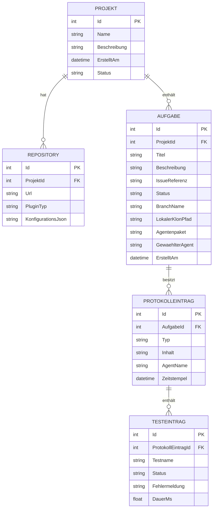
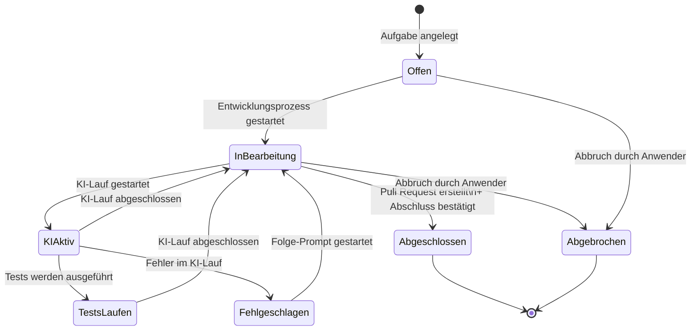
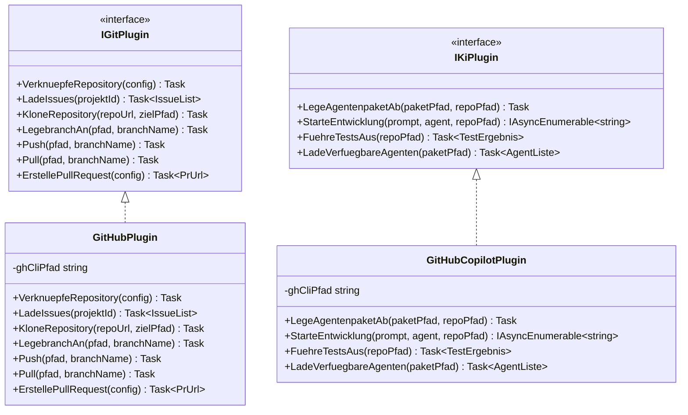

# Anforderungsanalyse – Softwareschmiede

> **Dokument-Typ:** Anforderungsanalyse  
> **Projekt:** Softwareschmiede  
> **Speicherort:** `docs/requirements/requirements-analysis.md`  
> **Status:** 📋 Entwurf  
> **Version:** 1.0.0

---

## Inhaltsverzeichnis

1. [Überblick und Projektkontext](#1-überblick-und-projektkontext)
2. [Funktionale Anforderungen](#2-funktionale-anforderungen)
3. [Nicht-funktionale Anforderungen](#3-nicht-funktionale-anforderungen)
4. [Akzeptanzkriterien](#4-akzeptanzkriterien)
5. [Annahmen und Abhängigkeiten](#5-annahmen-und-abhängigkeiten)
6. [Scope und Out-of-Scope](#6-scope-und-out-of-scope)
7. [Domänenmodell und Glossar](#7-domänenmodell-und-glossar)
8. [Nutzungsfälle (Use Cases)](#8-nutzungsfälle-use-cases)
9. [Nächste Schritte](#9-nächste-schritte)
10. [Approval & Versionierung](#10-approval--versionierung)

---

## 1. Überblick und Projektkontext

### 1.1 Projektbeschreibung

**Softwareschmiede** ist eine webbasierte Einzelnutzer-Anwendung auf Basis von Blazor (interaktiver Server-Modus), die den vollständigen Workflow der KI-gestützten Softwareentwicklung in einer einheitlichen Oberfläche verwaltet. Sie verbindet Projektmanagement, Git-Integration, Aufgabenverwaltung und KI-Steuerung und läuft vollständig lokal auf dem Rechner des Anwenders.

### 1.2 Geschäftsziele

| # | Ziel | Messbare Erfolgsgröße |
|---|------|-----------------------|
| Z-1 | Verwaltung mehrerer Softwareprojekte an einem zentralen Ort | Alle Projekte, Aufgaben und Protokolle aus einer Anwendung heraus erreichbar |
| Z-2 | Strukturierte Erfassung von Anforderungen je Aufgabe | Jede Aufgabe enthält entweder eine freie Beschreibung oder eine Issue-Referenz |
| Z-3 | Automatisierte Umsetzung von Anforderungen durch KI-Plugins | KI-Plugin führt Entwicklungsschritte auf lokalem Klon aus; Ergebnis im Protokoll sichtbar |
| Z-4 | Nachvollziehbarer Verlauf jeder KI-gesteuerten Entwicklungsaufgabe | Vollständiges Protokoll mit Prompts, KI-Antworten, Zeitstempeln und Status-Übergängen |
| Z-5 | Erweiterbarkeit für weitere Git-Provider und KI-Systeme | Neue Plugins über definierte Interfaces ohne Kernänderungen integrierbar |

### 1.3 Stakeholder

| Rolle | Beschreibung | Interesse |
|-------|-------------|-----------|
| **Anwender** | Einzelner Entwickler (Einzelnutzer-Anwendung) | Effizienter KI-gestützter Entwicklungsworkflow; klare Übersicht über alle Aufgaben |
| **Entwickler (Erweiterung)** | Erstellt neue Git- oder KI-Plugins | Stabile, dokumentierte Plugin-Schnittstellen |

### 1.4 Abgrenzung

- Die Anwendung läuft **lokal** auf dem Rechner des Anwenders – kein Cloud-Deployment im initialen Umfang.
- Die Anwendung ist eine **Einzelnutzer-Anwendung** – kein Login, keine Benutzerverwaltung.
- KI-Aktionen finden ausschließlich auf dem **lokalen Repository-Klon** statt; die Hoheit über Push und Pull Request verbleibt beim Anwender.
- **Erstes Git-Plugin:** GitHub (via `gh` CLI); weitere folgen.
- **Erstes KI-Plugin:** GitHub Copilot (via `copilot` CLI); weitere folgen.

---

## 2. Funktionale Anforderungen

### 2.1 Übersicht

| Kennung | Beschreibung | Kategorie | Priorität | Status |
|---------|--------------|-----------|-----------|--------|
| **FR-1** | **Projektverwaltung:** Anwender kann beliebig viele Projekte anlegen, bearbeiten, archivieren und löschen. Projekte enthalten Metadaten (Name, Beschreibung, Erstellungsdatum, Status). Archivierte Projekte sind lesbar, erlauben aber keine neuen Aufgaben. → [Architektur-Blueprint](../architecture/architecture-blueprint.md) · [ERM](../architecture/entity-relationship-model.md) | Kern-Feature | MUST HAVE | 📋 Geplant |
| **FR-1.1** | **Projekt anlegen / bearbeiten:** Formular mit Pflichtfeld Name, optionalem Beschreibungsfeld; Erstellungsdatum wird automatisch gesetzt. | Kern-Feature | MUST HAVE | 📋 Geplant |
| **FR-1.2** | **Projekt archivieren:** Status-Wechsel auf „Archiviert"; keine neuen Aufgaben mehr möglich; bestehende Daten bleiben vollständig lesbar. | Kern-Feature | MUST HAVE | 📋 Geplant |
| **FR-1.3** | **Projekt löschen:** Löschen eines Projekts inkl. aller verknüpften Daten (Aufgaben, Protokolle, Repository-Verknüpfungen) nach Bestätigungsdialog. | Kern-Feature | MUST HAVE | 📋 Geplant |
| **FR-2** | **Git-Plugin-System:** Die Anwendung stellt ein erweiterbares Plugin-System für Git-Provider bereit. Plugins werden registriert, konfiguriert (Token, URL) und über ein definiertes Interface angesprochen. → [Architektur-Blueprint](../architecture/architecture-blueprint.md) | Erweiterbarkeit | MUST HAVE | 📋 Geplant |
| **FR-2.1** | **Repository-Verknüpfung:** Mehrere Repositories können einem Projekt zugeordnet werden; Konfiguration je Plugin (z. B. Token, Organisations-URL). | Git-Integration | MUST HAVE | 📋 Geplant |
| **FR-2.2** | **Issues abrufen:** Beim Öffnen/Auswählen eines Projekts werden automatisch Issues aus dem verknüpften Git-Provider geladen (Felder: Titel, Body, Labels, Milestone). | Git-Integration | MUST HAVE | 📋 Geplant |
| **FR-2.3** | **Repository klonen:** Plugin klont das Repository in ein aufgabenspezifisches lokales Verzeichnis. | Git-Integration | MUST HAVE | 📋 Geplant |
| **FR-2.4** | **Branch anlegen:** Plugin legt im geklonten Repository einen aufgabenspezifischen Branch an (Namenskonvention: `task/<aufgaben-id>-<kurzname>`). | Git-Integration | MUST HAVE | 📋 Geplant |
| **FR-2.5** | **Push:** Plugin pusht den aufgabenspezifischen Branch auf den Remote. | Git-Integration | MUST HAVE | 📋 Geplant |
| **FR-2.6** | **Pull:** Plugin holt Änderungen vom Remote in den lokalen Branch. | Git-Integration | MUST HAVE | 📋 Geplant |
| **FR-2.7** | **Pull Request erstellen:** Plugin erstellt über den Git-Provider-API einen Pull Request für den aufgabenspezifischen Branch. | Git-Integration | MUST HAVE | 📋 Geplant |
| **FR-2.8** | **GitHub-Plugin (gh CLI):** Erstes konkretes Git-Plugin; nutzt `gh`-CLI für alle Operationen (Issues, Klonen, Push, Pull, PR). | Git-Integration | MUST HAVE | 📋 Geplant |
| **FR-3** | **Aufgabenverwaltung:** Projekte enthalten beliebig viele Aufgaben. Aufgaben basieren entweder auf einem Issue (Felder werden übernommen) oder auf einer freien Anforderungsbeschreibung. → [Architektur-Blueprint](../architecture/architecture-blueprint.md) · [ERM](../architecture/entity-relationship-model.md) | Kern-Feature | MUST HAVE | 📋 Geplant |
| **FR-3.1** | **Aufgabe aus Issue anlegen:** Anwender wählt ein Issue aus dem geladenen Issue-Feed; Titel, Body, Labels und Milestone werden übernommen. | Kern-Feature | MUST HAVE | 📋 Geplant |
| **FR-3.2** | **Aufgabe frei anlegen:** Anwender erfasst Titel und freie Anforderungsbeschreibung ohne Issue-Referenz. | Kern-Feature | MUST HAVE | 📋 Geplant |
| **FR-3.3** | **Aufgaben-Attribute:** Pflichtfelder: Titel, Anforderungsbeschreibung/Issue-Referenz. Optionale Felder: Agentenpaket-Auswahl, Agent-Auswahl. Systemfelder: Status, verknüpftes KI-Protokoll. | Kern-Feature | MUST HAVE | 📋 Geplant |
| **FR-3.4** | **Aufgaben-Status-Modell:** Status-Werte: `Offen` → `In Bearbeitung` → `KI aktiv` / `Tests laufen` → `Abgeschlossen` / `Fehlgeschlagen`. Übergänge sind im Protokoll dokumentiert. | Kern-Feature | MUST HAVE | 📋 Geplant |
| **FR-3.5** | **Aufgabe abschließen:** Anwender veranlasst manuell einen Pull Request; nach erfolgreichem PR kann er die Aufgabe als abgeschlossen markieren → lokaler Branch und Klon werden automatisch gelöscht. | Kern-Feature | MUST HAVE | 📋 Geplant |
| **FR-3.6** | **Aufgabe abbrechen:** Anwender bricht Aufgabe jederzeit ab → lokaler Branch und Klon werden gelöscht; keine Änderungen werden gepusht. | Kern-Feature | MUST HAVE | 📋 Geplant |
| **FR-3.7** | **Commit-Verwaltung:** Anwender kann manuell Commits auf dem Branch durchführen. Anwender kann Commits zurücksetzen (soft / mixed / hard). KI kann selbstständig Commits durchführen (abhängig vom KI-Plugin). | Git-Integration | MUST HAVE | 📋 Geplant |
| **FR-4** | **Entwicklungsprozess (KI-gestützt):** Für jede Aufgabe kann der Anwender den KI-gestützten Entwicklungsprozess starten. Die Anwendung klont das Repository, legt einen Branch an, steuert das KI-Plugin und zeigt die Ausgabe in Echtzeit. → [Architektur-Blueprint](../architecture/architecture-blueprint.md) | KI-Integration | MUST HAVE | 📋 Geplant |
| **FR-4.1** | **Prozess starten:** Anwender wählt Agentenpaket und Agenten aus, gibt Anforderungsprompt ein und startet den KI-Lauf. Das KI-Plugin erhält Prompt und Agenten-Kontext. | KI-Integration | MUST HAVE | 📋 Geplant |
| **FR-4.2** | **Echtzeit-Ausgabe:** Ausgabe des KI-Plugins wird per Streaming in Echtzeit im Aufgabenprotokoll angezeigt (< 500 ms Latenz pro Stream-Chunk). | KI-Integration | MUST HAVE | 📋 Geplant |
| **FR-4.3** | **Iterationen / Folge-Prompts:** Nach jedem KI-Lauf kann der Anwender direkt aus dem Protokoll heraus eine Folgeanweisung eingeben, ohne die Seite zu wechseln. | KI-Integration | MUST HAVE | 📋 Geplant |
| **FR-4.4** | **Rollback:** Anwender kann Commits manuell zurücksetzen (soft/mixed/hard). KI kann eigenständig Rollbacks durchführen, sofern das KI-Plugin dies unterstützt. | KI-Integration | MUST HAVE | 📋 Geplant |
| **FR-4.5** | **Tests ausführen und auswerten:** KI-Plugin führt Tests aus; Ergebnisse werden strukturiert im Protokoll abgelegt (Testname, Status, Fehlermeldung, Dauer). | KI-Integration | MUST HAVE | 📋 Geplant |
| **FR-4.6** | **Agenten-Auswahl pro Prompt:** Vor jedem KI-Lauf wählt der Anwender den zu verwendenden Agenten aus der vom KI-Plugin gelieferten Liste aus. Bei Folgeanweisungen ist der Start-Agent vorbelegt, die Auswahl bleibt änderbar und wird nach dem Senden wieder auf den Start-Agenten gesetzt. | KI-Integration | MUST HAVE | 📋 Geplant |
| **FR-5** | **KI-Plugin-System:** Die Anwendung stellt ein erweiterbares Plugin-System für KI-Systeme bereit. Jedes KI-Plugin implementiert ein definiertes Interface. → [Architektur-Blueprint](../architecture/architecture-blueprint.md) | KI-Integration | MUST HAVE | 📋 Geplant |
| **FR-5.1** | **KI-Plugin-Interface:** Schnittstelle umfasst: Prompt entgegennehmen, Agentenpaket ablegen, KI steuern, Tests ausführen, Ergebnisse streamen, verfügbare Agenten liefern. | KI-Integration | MUST HAVE | 📋 Geplant |
| **FR-5.2** | **GitHub-Copilot-Plugin (copilot CLI):** Erstes konkretes KI-Plugin; nutzt `copilot`-CLI; legt das Agentenpaket im `.github/`-Verzeichnis des Branches ab. | KI-Integration | MUST HAVE | 📋 Geplant |
| **FR-6** | **Agentenpakete:** Die Anwendung verwaltet Agentenpakete aus dem festen Verzeichnis `<Programmverzeichnis>/agent-packages/`. Verzeichnis wird beim App-Start automatisch angelegt. Jeder Unterordner ist ein Agentenpaket. → [Architektur-Blueprint](../architecture/architecture-blueprint.md) | Datenverwaltung | MUST HAVE | 📋 Geplant |
| **FR-6.1** | **Agentenpakete einlesen:** Beim App-Start und auf Anfrage werden alle Unterordner in `agent-packages/` als verfügbare Pakete geladen. | Datenverwaltung | MUST HAVE | 📋 Geplant |
| **FR-6.2** | **Agentenpaket auswählen:** Anwender wählt pro Aufgabe ein Agentenpaket aus. | Datenverwaltung | MUST HAVE | 📋 Geplant |
| **FR-6.3** | **Agentenpaket-Vorschau:** Anwender kann Dateiliste, enthaltene Beschreibung und verfügbare Agenten eines Pakets in der Oberfläche einsehen. | Datenverwaltung | MEDIUM | 📋 Geplant |
| **FR-6.4** | **Agenten-Liste liefern:** Das KI-Plugin wertet das gewählte Agentenpaket aus und liefert eine Liste der darin enthaltenen Agenten zurück. | KI-Integration | MUST HAVE | 📋 Geplant |
| **FR-7** | **Aufgabenprotokoll:** Jede Aufgabe besitzt ein vollständiges, chronologisches Protokoll aller KI-Interaktionen inkl. Prompts, Antworten, Zeitstempeln, Test-Ergebnissen und Status-Übergängen. → [Architektur-Blueprint](../architecture/architecture-blueprint.md) · [ERM](../architecture/entity-relationship-model.md) | Datenverwaltung | MUST HAVE | 📋 Geplant |
| **FR-7.1** | **Protokoll anzeigen:** Protokoll ist vollständig in der Anwendung lesbar; Einträge werden in chronologischer Reihenfolge angezeigt. | Datenverwaltung | MUST HAVE | 📋 Geplant |
| **FR-7.2** | **Protokoll durchsuchen:** Volltextsuche über alle Einträge des Protokolls einer Aufgabe. Suchergebnisse werden hervorgehoben. | Datenverwaltung | MUST HAVE | 📋 Geplant |
| **FR-7.3** | **Folge-Prompt aus Protokoll:** Anwender kann direkt aus dem Protokoll heraus einen neuen Prompt eingeben und starten, ohne die Seite zu verlassen. | KI-Integration | MUST HAVE | 📋 Geplant |
| **FR-7.4** | **Test-Ergebnisse im Protokoll:** Test-Ergebnisse werden strukturiert angezeigt: Testname, Status (bestanden / fehlgeschlagen / übersprungen), Fehlermeldung, Dauer. | Datenverwaltung | MUST HAVE | 📋 Geplant |
| **FR-8** | **Dashboard / Startseite:** Die Startseite zeigt eine Übersicht aller aktiven Aufgaben über alle Projekte hinweg mit aktuellem Status. Klick auf eine Aufgabe führt direkt zum Protokoll. → [Architektur-Blueprint](../architecture/architecture-blueprint.md) | Kern-Feature | MUST HAVE | 📋 Geplant |
| **FR-8.1** | **Aktive Aufgaben-Liste:** Alle Aufgaben mit Status `In Bearbeitung`, `KI aktiv` oder `Tests laufen` werden auf der Startseite aufgelistet (projektübergreifend). | Kern-Feature | MUST HAVE | 📋 Geplant |
| **FR-8.2** | **Status-Anzeige:** Je Aufgabe wird der aktuelle Status farblich kodiert angezeigt (z. B. KI aktiv = blau, Fehlgeschlagen = rot, Abgeschlossen = grün). | Kern-Feature | MUST HAVE | 📋 Geplant |

---

## 3. Nicht-funktionale Anforderungen

| Kennung | Beschreibung | Kategorie | Priorität | Status |
|---------|--------------|-----------|-----------|--------|
| **NFR-1** | **Blazor Server-Modus:** Die Anwendung wird als Blazor Web App im interaktiven Server-Modus implementiert. Alle UI-Interaktionen laufen über SignalR. → [Architektur-Blueprint](../architecture/architecture-blueprint.md) | Technologie | MUST HAVE | 📋 Geplant |
| **NFR-2** | **Plugin-Erweiterbarkeit:** Git-Plugins und KI-Plugins sind über klar definierte C#-Interfaces austauschbar. Neue Plugins können ohne Änderungen am Kern hinzugefügt werden. → [Architektur-Blueprint](../architecture/architecture-blueprint.md) | Erweiterbarkeit | MUST HAVE | 📋 Geplant |
| **NFR-3** | **Persistenz via SQLite / EF Core:** Alle Anwendungsdaten (Projekte, Aufgaben, Protokolle, Plugin-Konfigurationen) werden in einer lokalen SQLite-Datenbank über Entity Framework Core gespeichert. → [ERM](../architecture/entity-relationship-model.md) | Technologie | MUST HAVE | 📋 Geplant |
| **NFR-4** | **Sichere Token-Speicherung:** API-Tokens und Zugangsdaten werden ausschließlich im **Windows Credential Store** gespeichert. Kein Klartext in Datenbank, Konfigurationsdateien oder Code. | Sicherheit | MUST HAVE | 📋 Geplant |
| **NFR-5** | **Einzelnutzer-Anwendung:** Kein Login, keine Benutzerverwaltung, keine Mehrbenutzer-Isolation. Die Anwendung ist für genau einen lokalen Anwender ausgelegt. | Skalierbarkeit | MUST HAVE | 📋 Geplant |
| **NFR-6** | **Deutschsprachige Oberfläche:** Alle UI-Texte, Fehlermeldungen und Beschriftungen sind auf Deutsch. Einheitliches, responsives Design für Desktop-Browser (min. 1280 px Breite). | UX / Accessibility | MUST HAVE | 📋 Geplant |
| **NFR-7** | **i18n-Vorbereitung:** Alle UI-Strings werden über `.resx`-Ressourcendateien verwaltet, sodass eine spätere Mehrsprachigkeit ohne Quellcode-Änderungen möglich ist. | Wartbarkeit | MEDIUM | 📋 Geplant |
| **NFR-8** | **Echtzeit-Streaming:** Die Ausgabe des KI-Plugins wird in Echtzeit an die Blazor-Oberfläche gestreamt (Latenz pro Stream-Chunk < 500 ms). Pufferung ist nur für Test-Ergebnisse zulässig. | Performance | MUST HAVE | 📋 Geplant |
| **NFR-9** | **Dateioperationen:** Lese- und Schreibzugriffe auf das lokale Dateisystem (Klone, Agentenpakete) dürfen die UI-Reaktionsfähigkeit nicht blockieren (asynchrone Ausführung). | Performance | MUST HAVE | 📋 Geplant |
| **NFR-10** | **Lokaler Betrieb:** Die Anwendung läuft vollständig lokal; kein Cloud-Deployment, kein externer Datenabfluss (außer über explizit konfigurierte Git- und KI-Plugins). | Sicherheit | MUST HAVE | 📋 Geplant |
| **NFR-11** | **Einheitliches Design-System:** Konsistente Komponenten (Buttons, Formulare, Tabellen, Status-Badges) über alle Seiten hinweg; basierend auf einem definierten Blazor-UI-Framework. | UX / Accessibility | HIGH | 📋 Geplant |
| **NFR-12** | **Fehlerbehandlung:** Alle Plugin-Fehler (CLI-Fehler, Netzwerkfehler) werden abgefangen, im Protokoll festgehalten und dem Anwender verständlich angezeigt. Kein unkontrollierter Absturz. | Zuverlässigkeit | MUST HAVE | 📋 Geplant |

---

## 4. Akzeptanzkriterien

### US-1: Projekt anlegen und verwalten

**Als** Anwender  
**möchte ich** Projekte anlegen, bearbeiten, archivieren und löschen,  
**damit** ich mehrere Softwareprojekte zentral verwalten kann.

| # | Akzeptanzkriterium | Messung |
|---|--------------------|---------|
| AC-1.1 | Neues Projekt kann mit Name (Pflicht) und Beschreibung (optional) angelegt werden. | Formular-Validierung; Projekt erscheint in der Projektliste. |
| AC-1.2 | Archiviertes Projekt ist in der Liste als „Archiviert" gekennzeichnet; der Button „Neue Aufgabe" ist deaktiviert. | Visueller Status-Badge; Button-Zustand. |
| AC-1.3 | Löschen eines Projekts erfordert eine Bestätigung; nach Löschen ist das Projekt inkl. aller Aufgaben und Protokolle nicht mehr abrufbar. | Bestätigungsdialog vorhanden; DB-Eintrag gelöscht. |
| AC-1.4 | Projekte werden nach Erstellungsdatum absteigend sortiert angezeigt. | Reihenfolge der Projektliste. |

---

### US-2: Git-Repository mit Projekt verknüpfen und Issues abrufen

**Als** Anwender  
**möchte ich** ein oder mehrere Git-Repositories mit einem Projekt verknüpfen und Issues automatisch laden,  
**damit** ich Aufgaben direkt aus vorhandenen Issues ableiten kann.

| # | Akzeptanzkriterium | Messung |
|---|--------------------|---------|
| AC-2.1 | Ein Projekt kann mit mind. einem Git-Repository verknüpft werden; mehrere Repositories sind möglich. | Konfigurationsoberfläche erlaubt ≥ 1 Repository je Projekt. |
| AC-2.2 | Beim Öffnen eines Projekts werden Issues automatisch aus dem verknüpften Repository geladen. | Issues mit Titel, Body, Labels und Milestone erscheinen in der Issue-Liste. |
| AC-2.3 | Fehlgeschlagener Issue-Abruf (z. B. ungültiger Token) zeigt eine verständliche Fehlermeldung; die Anwendung bleibt stabil. | Fehlermeldung sichtbar; keine Exception unbehandelt. |

---

### US-3: Aufgabe anlegen und starten

**Als** Anwender  
**möchte ich** eine Aufgabe aus einem Issue oder frei anlegen und den KI-gestützten Entwicklungsprozess starten,  
**damit** die KI den Code auf einem eigenen Branch entwickelt.

| # | Akzeptanzkriterium | Messung |
|---|--------------------|---------|
| AC-3.1 | Aufgabe kann aus Issue-Liste angelegt werden (Felder werden übernommen) oder manuell mit Freitext. | Beide Wege vorhanden und funktionsfähig. |
| AC-3.2 | Nach dem Start des Entwicklungsprozesses existiert ein lokaler Repository-Klon und ein Branch nach dem Schema `task/<id>-<kurzname>`. | Verzeichnis und Branch per `git branch` verifizierbar. |
| AC-3.3 | Die KI-Ausgabe erscheint in Echtzeit im Protokoll; erste Ausgabe innerhalb < 2 Sekunden nach Start. | Messung der Stream-Latenz. |
| AC-3.4 | Status der Aufgabe wechselt beim Start auf „KI aktiv" und nach Abschluss des Laufs auf „In Bearbeitung" (oder „Fehlgeschlagen"). | Status-Badge in der Aufgabendetailseite. |

---

### US-4: Iterativer KI-Dialog

**Als** Anwender  
**möchte ich** aus dem Protokoll heraus einen Folge-Prompt eingeben,  
**damit** ich iterativ mit der KI zusammenarbeiten kann, ohne die Seite zu wechseln.

| # | Akzeptanzkriterium | Messung |
|---|--------------------|---------|
| AC-4.1 | Bei Status „In Bearbeitung" und vorhandener KI-Antwort ist das Feld für Folgeanweisungen mit Agenten-Auswahl sichtbar und nutzbar. | Eingabefeld und Auswahl sind vorhanden und bedienbar. |
| AC-4.2 | Beim Laden der Aufgabe ist in der Agenten-Auswahl der Start-Agent als Standardwert gesetzt. | Vorauswahl entspricht dem in der Aufgabe gespeicherten Start-Agenten. |
| AC-4.3 | Der Anwender kann den Agenten vor jeder Folgeanweisung manuell ändern. | Auswahl kann vor dem Senden auf einen anderen Agenten gestellt werden. |
| AC-4.4 | Die Folgeanweisung wird an den aktuell gewählten Agenten gesendet und die Auswahl wird danach auf den Start-Agenten zurückgesetzt. | Protokoll/Verlauf zeigt gewählten Agenten; nach Senden ist wieder der Start-Agent ausgewählt. |
| AC-4.5 | Das Verhalten des ersten Prompts bleibt unverändert. | Start-Prompt nutzt weiterhin den gewählten Start-Agenten und bleibt fachlich unverändert. |

---

### US-5: Aufgabe abschließen oder abbrechen

**Als** Anwender  
**möchte ich** eine Aufgabe regulär abschließen (nach PR) oder jederzeit abbrechen,  
**damit** lokale Klone und Branches ordentlich aufgeräumt werden.

| # | Akzeptanzkriterium | Messung |
|---|--------------------|---------|
| AC-5.1 | „Abschließen" ist erst nach erfolgtem Pull Request möglich (Button vorher deaktiviert oder Hinweis vorhanden). | UI-Zustand des Buttons geprüft. |
| AC-5.2 | Nach dem Abschließen sind lokaler Klon und Branch gelöscht; Protokoll bleibt erhalten und ist lesbar. | Dateisystem und Protokoll-DB geprüft. |
| AC-5.3 | Nach dem Abbrechen sind lokaler Klon und Branch gelöscht; keine Änderungen wurden gepusht. | Dateisystem und Remote-Branch geprüft. |

---

### US-6: Dashboard-Übersicht

**Als** Anwender  
**möchte ich** auf der Startseite alle aktiven Aufgaben mit Status sehen,  
**damit** ich jederzeit den Überblick über laufende Entwicklungsprozesse habe.

| # | Akzeptanzkriterium | Messung |
|---|--------------------|---------|
| AC-6.1 | Alle Aufgaben mit Status `In Bearbeitung`, `KI aktiv` oder `Tests laufen` aus allen Projekten erscheinen auf der Startseite. | Liste mit allen aktiven Aufgaben vorhanden. |
| AC-6.2 | Klick auf eine Aufgabe in der Dashboard-Liste navigiert direkt zum Aufgabenprotokoll. | Navigation funktioniert; richtiges Protokoll wird geladen. |
| AC-6.3 | Status-Badges sind farblich unterschiedlich (z. B. Blau = KI aktiv, Gelb = Warten, Rot = Fehler). | Visuelle Unterscheidung der Status sichtbar. |

---

### US-7: Agentenpaket-Vorschau

**Als** Anwender  
**möchte ich** ein Agentenpaket in der Oberfläche vorab einsehen,  
**damit** ich das richtige Paket für meine Aufgabe auswählen kann.

| # | Akzeptanzkriterium | Messung |
|---|--------------------|---------|
| AC-7.1 | Vorschau zeigt Dateiliste des gewählten Agentenpakets. | Dateiliste stimmt mit Verzeichnisinhalt überein. |
| AC-7.2 | Vorschau zeigt die vom KI-Plugin ermittelte Liste verfügbarer Agenten. | Agenten-Liste korrekt angezeigt. |

---

## 5. Annahmen und Abhängigkeiten

| # | Typ | Beschreibung | Auswirkung bei Nicht-Erfüllung |
|---|-----|--------------|-------------------------------|
| A-1 | Annahme | Die `gh`-CLI (GitHub CLI) ist auf dem Rechner des Anwenders installiert und konfiguriert. | GitHub-Plugin nicht funktionsfähig. |
| A-2 | Annahme | Die `copilot`-Erweiterung der GitHub CLI ist verfügbar und lizenziert. | GitHub-Copilot-Plugin nicht funktionsfähig. |
| A-3 | Annahme | Der Anwender betreibt die Anwendung unter Windows (für Windows Credential Store). | Token-Speicherung nicht verfügbar; muss für andere OS angepasst werden. |
| A-4 | Annahme | Ausreichend lokaler Festplattenspeicher für Repository-Klone ist vorhanden. | Klonvorgang schlägt fehl; Fehlerbehandlung muss sauber reagieren. |
| A-5 | Annahme | Git ist auf dem Rechner des Anwenders installiert und im PATH verfügbar. | Alle Git-Operationen nicht ausführbar. |
| D-1 | Abhängigkeit | .NET-Runtime (aktuelle LTS-Version) für Blazor-Anwendung. | Anwendung nicht startbar. |
| D-2 | Abhängigkeit | SQLite-Datenbank und EF Core für Datenpersistenz. | Keine Datenspeicherung möglich. |
| D-3 | Abhängigkeit | GitHub-API-Zugriffstoken mit entsprechenden Rechten (repo, issues). | Issues und Pull Requests nicht abrufbar/erstellbar. |
| D-4 | Abhängigkeit | Netzwerkzugang zu GitHub für Issue-Abruf, Push, Pull und Pull Request. | Alle Remote-Operationen nicht verfügbar. |

---

## 6. Scope und Out-of-Scope

### In-Scope ✅

| # | Feature |
|---|---------|
| S-1 | Projektverwaltung (anlegen, bearbeiten, archivieren, löschen) |
| S-2 | Git-Plugin-System mit GitHub-Plugin (gh CLI) |
| S-3 | Issue-Abruf aus GitHub (automatisch beim Projekt-Öffnen) |
| S-4 | Aufgabenverwaltung (aus Issue oder frei; vollständiger Lebenszyklus) |
| S-5 | Repository-Klon und Branch pro Aufgabe (Namenskonvention: `task/<id>-<kurzname>`) |
| S-6 | KI-Plugin-System mit GitHub-Copilot-Plugin (copilot CLI) |
| S-7 | Agentenpakete aus lokalem Verzeichnis (`agent-packages/`) |
| S-8 | Echtzeit-Streaming der KI-Ausgabe im Aufgabenprotokoll |
| S-9 | Iterativer KI-Dialog (Folge-Prompts aus dem Protokoll) |
| S-10 | Commit-Verwaltung (manuell durch Anwender, automatisch durch KI; Reset soft/mixed/hard) |
| S-11 | Push, Pull und Pull Request über Git-Plugin |
| S-12 | Test-Ausführung und strukturierte Test-Ergebnisse im Protokoll |
| S-13 | Dashboard mit aktiven Aufgaben über alle Projekte |
| S-14 | Sichere Token-Speicherung (Windows Credential Store) |
| S-15 | i18n-Vorbereitung (resx-Ressourcendateien) |

### Out-of-Scope ❌

| # | Feature | Begründung |
|---|---------|------------|
| O-1 | Cloud-Deployment / Remote-Betrieb | Bewusst lokale Anwendung im ersten Schritt |
| O-2 | Mehrbenutzer-Unterstützung / Login | Einzelnutzer-Anwendung |
| O-3 | Schreibzugriff auf Issues (Kommentare, Status-Updates) | Für spätere Version vorgesehen |
| O-4 | Automatischer Download / Installation von Agentenpaketen | Rein manuelle Verwaltung |
| O-5 | Export des Aufgabenprotokolls | Nicht vorgesehen |
| O-6 | Mehrsprachige Oberfläche (UI bereits auf Deutsch) | i18n nur vorbereitet, nicht ausgeliefert |
| O-7 | Weitere Git-Provider (GitLab, Bitbucket, …) | Folge-Versionen nach GitHub-Plugin |
| O-8 | Weitere KI-Systeme (OpenAI API, lokale Modelle, …) | Folge-Versionen nach Copilot-Plugin |
| O-9 | Mobile- / Tablet-Ansicht | Desktop-Browser (≥ 1280 px) im ersten Umfang |
| O-10 | Automatische Merges / Konfliktauflösung | Manuell über Git-Workflow |

---

## 7. Domänenmodell und Glossar

### 7.1 Entitäten und Beziehungen

### 7.2 Status-Modell Aufgabe

### 7.3 Plugin-Architektur (Übersicht)

### 7.4 Glossar

| Begriff | Definition |
|---------|------------|
| **Projekt** | Organisationseinheit, die zusammengehörige Aufgaben, Repositories und Protokolle bündelt. |
| **Aufgabe** | Eine konkrete Entwicklungsanforderung, die entweder aus einem Issue oder als Freitext angelegt wird und einen vollständigen Lifecycle besitzt. |
| **Agentenpaket** | Ein Verzeichnis unter `agent-packages/`, das Agenten-, Skill-, Kommando- und Skriptdateien für ein KI-Plugin enthält. |
| **Agent** | Eine benannte Konfiguration innerhalb eines Agentenpakets, die vom KI-Plugin ausgewertet wird (z. B. ein `.agent.md`-Eintrag). |
| **Git-Plugin** | Softwarekomponente, die das `IGitPlugin`-Interface implementiert und die Kommunikation mit einem Git-Provider (z. B. GitHub) kapselt. |
| **KI-Plugin** | Softwarekomponente, die das `IKiPlugin`-Interface implementiert und die Steuerung eines KI-Systems (z. B. GitHub Copilot) kapselt. |
| **Protokolleintrag** | Einzelner Eintrag im Aufgabenprotokoll; kann Typ `Prompt`, `Antwort`, `StatusWechsel` oder `TestErgebnis` haben. |
| **Branch** | Aufgabenspezifischer Git-Branch nach dem Schema `task/<aufgaben-id>-<kurzname>`. |
| **Klon** | Lokale Kopie eines Git-Repositories in einem aufgabenspezifischen Verzeichnis. |
| **Pull Request (PR)** | Zusammenführungsanfrage auf dem Git-Provider; wird manuell durch den Anwender über das Git-Plugin erstellt. |
| **Windows Credential Store** | Sicherer Speicher des Windows-Betriebssystems für Zugangsdaten; wird für API-Tokens genutzt. |
| **gh CLI** | GitHub Command Line Interface; Basis für das GitHub-Git-Plugin. |
| **copilot CLI** | GitHub Copilot Erweiterung der `gh` CLI; Basis für das GitHub-Copilot-KI-Plugin. |
| **Echtzeit-Streaming** | Kontinuierliche Ausgabe der KI-Antwort in Echtzeit über SignalR an die Blazor-Oberfläche, ohne auf die vollständige Antwort zu warten. |

---

## 8. Nutzungsfälle (Use Cases)

### UC-1: Projekt anlegen

| Feld | Inhalt |
|------|--------|
| **ID** | UC-1 |
| **Name** | Projekt anlegen |
| **Akteur** | Anwender |
| **Vorbedingung** | Anwendung ist gestartet. |
| **Auslöser** | Anwender klickt auf „Neues Projekt". |
| **Hauptszenario** | 1. Anwender gibt Name (Pflicht) und Beschreibung (optional) ein. 2. Anwender speichert. 3. Projekt erscheint in der Projektliste mit Status „Aktiv". |
| **Alternativszenario** | Name fehlt → Validierungsfehler; Projekt wird nicht angelegt. |
| **Nachbedingung** | Neues Projekt in DB; in Projektliste sichtbar. |
| **Anforderungen** | FR-1, FR-1.1 |

---

### UC-2: Issues aus GitHub laden

| Feld | Inhalt |
|------|--------|
| **ID** | UC-2 |
| **Name** | Issues aus GitHub laden |
| **Akteur** | Anwender (System automatisch) |
| **Vorbedingung** | Projekt ist mit ≥ 1 GitHub-Repository verknüpft; Token ist im Credential Store hinterlegt. |
| **Auslöser** | Anwender öffnet/wählt ein Projekt. |
| **Hauptszenario** | 1. System ruft GitHub-Plugin auf. 2. Plugin führt `gh issue list` aus. 3. Issues (Titel, Body, Labels, Milestone) werden in der Issue-Liste angezeigt. |
| **Alternativszenario** | Token ungültig oder Netzwerkfehler → Fehlermeldung; Issue-Liste bleibt leer; Anwendung stabil. |
| **Nachbedingung** | Issue-Liste ist befüllt (oder Fehlermeldung sichtbar). |
| **Anforderungen** | FR-2.2, FR-2.8, NFR-12 |

---

### UC-3: Entwicklungsprozess starten

| Feld | Inhalt |
|------|--------|
| **ID** | UC-3 |
| **Name** | Entwicklungsprozess starten |
| **Akteur** | Anwender |
| **Vorbedingung** | Aufgabe existiert im Status „Offen" oder „In Bearbeitung"; Agentenpaket und Agent sind ausgewählt. |
| **Auslöser** | Anwender klickt auf „Entwicklungsprozess starten" und gibt Anforderungsprompt ein. |
| **Hauptszenario** | 1. System klont das verknüpfte Repository in aufgabenspezifisches Verzeichnis. 2. Branch `task/<id>-<kurzname>` wird angelegt. 3. KI-Plugin legt Agentenpaket im `.github/`-Verzeichnis ab. 4. KI-Plugin startet mit Prompt und Agent. 5. Ausgabe wird in Echtzeit im Protokoll angezeigt. 6. Status wechselt auf „KI aktiv". |
| **Alternativszenario A** | Klon schlägt fehl → Fehlermeldung; Status bleibt auf „Offen". |
| **Alternativszenario B** | KI-Plugin liefert Fehler → Status „Fehlgeschlagen"; Fehlermeldung im Protokoll. |
| **Nachbedingung** | Lokaler Klon und Branch vorhanden; Protokoll enthält Prompt und KI-Ausgabe. |
| **Anforderungen** | FR-4, FR-4.1, FR-4.2, FR-5.2, NFR-8 |

---

### UC-4: Folge-Prompt im Protokoll eingeben

| Feld | Inhalt |
|------|--------|
| **ID** | UC-4 |
| **Name** | Folge-Prompt eingeben |
| **Akteur** | Anwender |
| **Vorbedingung** | Aufgabe ist im Status „In Bearbeitung"; mindestens ein KI-Lauf ist abgeschlossen. |
| **Auslöser** | Anwender gibt eine Folgeanweisung im Protokoll-Eingabefeld ein und kann den Agenten anpassen. |
| **Hauptszenario** | 1. Anwender sieht die Folgeanweisung nur bei Status „In Bearbeitung" und vorhandener KI-Antwort. 2. Start-Agent ist als Standardwert sichtbar. 3. Anwender tippt Folgeanweisung und kann einen anderen Agenten wählen. 4. Klickt auf „Prompt senden". 5. System startet den Lauf mit dem gewählten Agenten. 6. Ausgabe wird direkt an das bestehende Protokoll angehängt. 7. Agenten-Auswahl springt zurück auf den Start-Agenten. |
| **Nachbedingung** | Protokoll enthält zusätzlichen Prompt- und Antwort-Eintrag; Folgeagent steht wieder auf Start-Agent; Start-Prompt-Verhalten bleibt unverändert. |
| **Anforderungen** | FR-4.3, FR-4.6, FR-7.3 |

---

### UC-5: Pull Request erstellen und Aufgabe abschließen

| Feld | Inhalt |
|------|--------|
| **ID** | UC-5 |
| **Name** | Pull Request erstellen und Aufgabe abschließen |
| **Akteur** | Anwender |
| **Vorbedingung** | Aufgabe im Status „In Bearbeitung"; Branch auf Remote gepusht. |
| **Auslöser** | Anwender klickt auf „Pull Request erstellen". |
| **Hauptszenario** | 1. Git-Plugin erstellt PR auf GitHub. 2. PR-URL wird im Protokoll festgehalten. 3. Anwender klickt auf „Aufgabe abschließen". 4. Lokaler Klon und Branch werden gelöscht. 5. Status wechselt auf „Abgeschlossen". |
| **Alternativszenario** | PR-Erstellung schlägt fehl → Fehlermeldung; Aufgabe bleibt „In Bearbeitung". |
| **Nachbedingung** | Aufgabe abgeschlossen; lokale Ressourcen bereinigt; Protokoll erhalten. |
| **Anforderungen** | FR-2.7, FR-3.5 |

---

### UC-6: Aufgabe abbrechen

| Feld | Inhalt |
|------|--------|
| **ID** | UC-6 |
| **Name** | Aufgabe abbrechen |
| **Akteur** | Anwender |
| **Vorbedingung** | Aufgabe existiert (beliebiger Status außer „Abgeschlossen"). |
| **Auslöser** | Anwender klickt auf „Aufgabe abbrechen" und bestätigt. |
| **Hauptszenario** | 1. Laufender KI-Prozess wird gestoppt (falls aktiv). 2. Lokaler Klon und Branch werden gelöscht. 3. Keine Änderungen werden gepusht. 4. Status wechselt auf „Abgebrochen". |
| **Nachbedingung** | Aufgabe abgebrochen; lokale Ressourcen bereinigt; kein Remote-Branch angelegt/verändert. |
| **Anforderungen** | FR-3.6 |

---

### UC-7: Agentenpaket auswählen und Vorschau anzeigen

| Feld | Inhalt |
|------|--------|
| **ID** | UC-7 |
| **Name** | Agentenpaket auswählen und Vorschau anzeigen |
| **Akteur** | Anwender |
| **Vorbedingung** | Mindestens ein Agentenpaket ist im Verzeichnis `agent-packages/` vorhanden. |
| **Auslöser** | Anwender öffnet die Agentenpaket-Auswahl in einer Aufgabe. |
| **Hauptszenario** | 1. System liest alle Unterordner aus `agent-packages/`. 2. Liste der Pakete wird angezeigt. 3. Anwender wählt ein Paket aus. 4. Vorschau zeigt Dateiliste und vom KI-Plugin ermittelte Agenten-Liste. |
| **Nachbedingung** | Agentenpaket ist der Aufgabe zugewiesen; Agenten-Liste für Prompt-Auswahl verfügbar. |
| **Anforderungen** | FR-6.1, FR-6.2, FR-6.3, FR-6.4 |

---

## 9. Nächste Schritte

| # | Schritt | Verantwortlich | Priorität |
|---|---------|---------------|-----------|
| NS-1 | Architektur-Blueprint erstellen (`docs/architecture/architecture-blueprint.md`) | Architekt | MUST HAVE |
| NS-2 | Entity-Relationship-Modell erstellen (`docs/architecture/entity-relationship-model.md`) | Architekt | MUST HAVE |
| NS-3 | Plugin-Interfaces (`IGitPlugin`, `IKiPlugin`) als C#-Interfaces definieren und dokumentieren | Entwickler | MUST HAVE |
| NS-4 | Datenbankschema aus ERM ableiten und EF-Core-Migrations anlegen | Entwickler | MUST HAVE |
| NS-5 | GitHub-Plugin-Implementierung (gh CLI): Klonen, Branch, Push, Pull, PR, Issues | Entwickler | MUST HAVE |
| NS-6 | GitHub-Copilot-Plugin-Implementierung (copilot): Streaming, Agenten-Liste, Agentenpaket-Ablage | Entwickler | MUST HAVE |
| NS-7 | Blazor-UI: Projektverwaltung, Aufgabenverwaltung, Protokoll-Komponente | Entwickler | MUST HAVE |
| NS-8 | Dashboard-Komponente mit Echtzeit-Status via SignalR | Entwickler | MUST HAVE |
| NS-9 | Windows Credential Store Integration für Token-Verwaltung | Entwickler | MUST HAVE |
| NS-10 | i18n-Ressourcendateien anlegen (resx) | Entwickler | MEDIUM |

---

## 10. Approval & Versionierung

### Freigabe

| Rolle | Name | Status | Datum |
|-------|------|--------|-------|
| Auftraggeber / Anwender | Martin | ⏳ Ausstehend | — |
| Autor | GitHub Copilot Agent | ✅ Erstellt | 2025-01-01 |

### Versionshistorie

| Version | Datum | Autor | Änderung |
|---------|-------|-------|----------|
| 1.0.0 | 2025-01-01 | GitHub Copilot Agent | Initiale Erstellung der vollständigen Anforderungsanalyse auf Basis der definierten Projektanforderungen |

---

*Dokument-Pfad: `docs/requirements/requirements-analysis.md` · Projekt: Softwareschmiede · Sprache: Deutsch*

