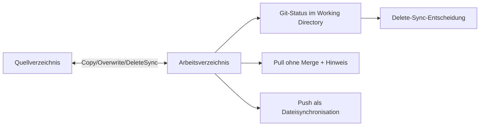

# Anforderungsanalyse – Separates Arbeitsverzeichnis mit Git-Funktionalität

> **Dokument-Typ:** Requirements Analysis  
> **Status:** 📋 Geplant  
> **Version:** 2.0.0  
> **Datum:** 2026-05-13

---

## 1. Überblick und Projektkontext

Das aktuelle Verhalten für lokale Repositories ist inkonsistent:
- Git-Funktionen funktionieren faktisch nur bei `Arbeitsverzeichnis == Quellverzeichnis`.
- Im Modus `SeparateWorkingDirectory` fehlen zentrale Git-Funktionen häufig vollständig (insb. kein sinnvoller Pull/Commit-Flow, oft nur Copy-Fallback).

**Geschäftsziel:** Der Modus `SeparateWorkingDirectory` muss für lokale Quellen vollständig arbeitsfähig sein, inkl. Git-basierter Änderungserkennung und nachvollziehbarer Pull-/Push-Semantik.

**Stakeholder:**
- Anwender:innen (verlässlicher Workflow in separatem Arbeitsverzeichnis)
- Entwicklung/QA (implementierbare, testbare Regeln)
- Support/Betrieb (klare Logs und Fehlerbilder)

**Abgrenzung:**
- Fokus auf lokale Quellen und Plugin-Verhalten im separaten Arbeitsverzeichnis.
- Kein echter Remote-Push/Merge im Sinne eines Git-Server-Workflows.

## 2. Funktionale Anforderungen

| Kennung | Beschreibung | Kategorie | Priorität | Status |
|---------|--------------|-----------|-----------|--------|
| **FR-1** | **Git-Workflow im separaten Arbeitsverzeichnis:** Bei `WorkspaceMode=SeparateWorkingDirectory` werden Git-Funktionen im Arbeitsverzeichnis bereitgestellt; nach initialer Vorbereitung sind lokale Commits im Arbeitsverzeichnis möglich und nachvollziehbar. → [Architektur-Blueprint](../architecture/separates-arbeitsverzeichnis-git-init-fallback-architecture-blueprint.md) · [ERM](../architecture/separates-arbeitsverzeichnis-git-init-fallback-entity-relationship-model.md) · [Architecture-Review](../improvements/separates-arbeitsverzeichnis-git-init-fallback-architecture-review.md) | Kern-Feature | MUST HAVE | 📋 Geplant |
| **FR-1.1** | **Repository-Initialisierung im Working Directory:** Ist im Arbeitsverzeichnis kein Git-Repository vorhanden, wird (abhängig von Settings/Policy) `git init` dort ausgeführt und ein definierter Initial-Commit ermöglicht. | Datenverwaltung | MUST HAVE | 📋 Geplant |
| **FR-2** | **Pull-Semantik ohne Merge:** Ein Pull im separaten Arbeitsverzeichnis führt **keinen Merge** durch. Vor Ausführung wird ein verpflichtender Anwenderhinweis angezeigt: „Kein Merge – Stand wird gemäß definierter Synchronisationslogik aktualisiert“. → [Architektur-Blueprint](../architecture/separates-arbeitsverzeichnis-git-init-fallback-architecture-blueprint.md) · [Architecture-Review](../improvements/separates-arbeitsverzeichnis-git-init-fallback-architecture-review.md) | Kern-Feature | MUST HAVE | 📋 Geplant |
| **FR-3** | **Push als Dateisynchronisation statt Git-Push:** Ein Push im separaten Arbeitsverzeichnis führt **keinen `git push`** aus, sondern kopiert Dateien vom Arbeitsverzeichnis ins Quellverzeichnis und überschreibt vorhandene Dateien vollständig. → [Architektur-Blueprint](../architecture/separates-arbeitsverzeichnis-git-init-fallback-architecture-blueprint.md) · [ERM](../architecture/separates-arbeitsverzeichnis-git-init-fallback-entity-relationship-model.md) | Kern-Feature | MUST HAVE | 📋 Geplant |
| **FR-3.1** | **Delete-Sync über Git-Änderungserkennung:** Gelöschte Dateien werden im Arbeitsverzeichnis über Git-Status erkannt und beim Push im Quellverzeichnis ebenfalls gelöscht; Ergebnis ist eine konsistente Spiegelung der Dateioperationen. | Datenverwaltung | MUST HAVE | 📋 Geplant |
| **FR-4** | **Kompatibilitätsregel für Quellverzeichnis gleich Arbeitsverzeichnis:** Bestehendes Verhalten für `Arbeitsverzeichnis == Quellverzeichnis` bleibt funktionsfähig und wird nicht regressiv verschlechtert. → [Architecture-Review](../improvements/separates-arbeitsverzeichnis-git-init-fallback-architecture-review.md) | Wartbarkeit | HIGH | 📋 Geplant |
| **FR-5** | **Entscheidungs- und Ausführungsprotokollierung:** Für Pull/Push/Init/Commit werden gewählter Pfad, Warnhinweise und angewandte Sync-Aktionen strukturiert protokolliert. → [Architektur-Blueprint](../architecture/separates-arbeitsverzeichnis-git-init-fallback-architecture-blueprint.md) | Reporting & Analyse | HIGH | 📋 Geplant |

## 3. Nicht-funktionale Anforderungen

| Kennung | Beschreibung | Kategorie | Priorität | Status |
|---------|--------------|-----------|-----------|--------|
| **NFR-1** | **Deterministische Synchronisation:** Gleiche Eingaben (Dateistand, Settings, Befehl) erzeugen denselben Sync-Ausgangszustand; Abweichungsrate in Regressionstests = 0 %. → [Architektur-Blueprint](../architecture/separates-arbeitsverzeichnis-git-init-fallback-architecture-blueprint.md) | Zuverlässigkeit | MUST HAVE | 📋 Geplant |
| **NFR-2** | **Transparente UX-Hinweise:** Pull ohne Merge muss vor Ausführung immer mit einem klaren Hinweis erscheinen (100 % der Pull-Aktionen im Modus `SeparateWorkingDirectory`). → [Architecture-Review](../improvements/separates-arbeitsverzeichnis-git-init-fallback-architecture-review.md) | UX / Accessibility | MUST HAVE | 📋 Geplant |
| **NFR-3** | **Konsistenz bei Fehlern:** Bei Abbruch dürfen weder Quell- noch Arbeitsverzeichnis in einen teil-synchronisierten, undefinierten Zustand geraten; Fehlerpfade sind durch Integrationstests abgedeckt. → [ERM](../architecture/separates-arbeitsverzeichnis-git-init-fallback-entity-relationship-model.md) | Zuverlässigkeit | MUST HAVE | 📋 Geplant |
| **NFR-4** | **Performanz für mittlere Repositories:** Push/Sync für bis zu 10.000 Dateien soll unter 60 Sekunden auf Standard-Entwicklungsumgebung abgeschlossen sein. | Performance | HIGH | 📋 Geplant |
| **NFR-5** | **Wartbare Fehlerklassifikation:** Fehlerklassen für `Init`, `PullNoMerge`, `PushCopy`, `DeleteSync` sind technisch trennbar und maschinenlesbar protokolliert. | Wartbarkeit | HIGH | 📋 Geplant |

## 4. Akzeptanzkriterien

### User Story US-1 – Pull ohne Merge
**Als** Anwender:in im separaten Arbeitsverzeichnis  
**möchte ich** beim Pull klar informiert werden, dass kein Merge stattfindet,  
**damit** ich die Konsequenzen verstehe.

**ACs:**
1. Bei jedem Pull im Modus `SeparateWorkingDirectory` wird vor der Aktion ein Hinweistext angezeigt.
2. Der Hinweis enthält explizit „kein Merge“ und die verwendete Aktualisierungslogik.
3. Ohne bestätigten Hinweis startet der Pull nicht.

### User Story US-2 – Push als Copy/Overwrite
**Als** Anwender:in  
**möchte ich** Änderungen aus dem Arbeitsverzeichnis ins Quellverzeichnis übertragen,  
**damit** der Quellstand den Arbeitsstand vollständig widerspiegelt.

**ACs:**
1. Ein Push führt keinen `git push` gegen ein Remote aus.
2. Alle geänderten/neu erstellten Dateien im Arbeitsverzeichnis werden ins Quellverzeichnis kopiert und dort überschrieben.
3. Nach erfolgreichem Push sind Dateiinhalte für alle betroffenen Pfade in Quelle und Arbeitsverzeichnis identisch.

### User Story US-3 – Delete-Sync
**Als** Anwender:in  
**möchte ich** gelöschte Dateien korrekt synchronisieren,  
**damit** Quelle und Arbeitsverzeichnis konsistent bleiben.

**ACs:**
1. Gelöschte Dateien werden im Arbeitsverzeichnis über Git-Änderungserkennung identifiziert.
2. Beim Push werden identifizierte Löschungen im Quellverzeichnis ebenfalls ausgeführt.
3. Integrationstest: Löschung von mindestens 3 Dateien in unterschiedlichen Verzeichnisebenen wird korrekt gespiegelt.

### User Story US-4 – Git-Funktionalität trotz separatem Verzeichnis
**Als** Anwender:in  
**möchte ich** auch im separaten Arbeitsverzeichnis committen können,  
**damit** ich meine Änderungen strukturiert versionieren kann.

**ACs:**
1. Falls kein Git-Repository vorhanden ist, wird ein initialisierbarer Pfad (`git init`) angeboten/ausgeführt.
2. Danach ist mindestens ein lokaler Commit im Arbeitsverzeichnis möglich.
3. Der Commit-Verlauf bleibt im Arbeitsverzeichnis verfügbar und wird durch Push nicht als Remote-Git-Push interpretiert.

## 5. Annahmen und Abhängigkeiten

| Typ | Eintrag | Auswirkung |
|-----|---------|------------|
| Annahme | Git-CLI ist auf dem Ausführungssystem verfügbar. | Ohne Git-CLI sind Delete-Sync und Commit-Flow nicht erfüllbar. |
| Annahme | Schreib-/Löschrechte in Quell- und Arbeitsverzeichnis sind vorhanden. | Push/Overwrite/Delete-Sync kann sonst nicht vollständig ausgeführt werden. |
| Abhängigkeit | `LocalDirectoryPlugin` kapselt Pull/Push/Init-Regeln. | Änderungen sind primär in Plugin- und Orchestrierungslogik umzusetzen. |
| Abhängigkeit | Logging-/Telemetry-Infrastruktur unterstützt strukturierte Events. | Nachvollziehbarkeit und Support-Diagnose werden technisch sicherstellbar. |
| Risiko | Fehlbedienung wegen „Push != git push“. | Muss durch verpflichtenden Hinweistext und klare Begriffe minimiert werden. |
| Risiko | Falsche Delete-Erkennung bei untracked Dateien. | Regeln für tracked/untracked Dateien müssen explizit getestet werden. |

## 6. Scope und Out-of-Scope

### In-Scope ✅
- Pull-/Push-Semantik für lokale Quellen im Modus `SeparateWorkingDirectory`.
- Hinweislogik „Pull ohne Merge“.
- Push als Copy/Overwrite ins Quellverzeichnis.
- Delete-Sync auf Basis von Git-Änderungserkennung im Arbeitsverzeichnis.
- Git-Initialisierung und lokale Commits im Arbeitsverzeichnis.

### Out-of-Scope ❌
- Remote-Repository-Management (`git push` zu Servern, PR-Erstellung).
- Branch-/Merge-Strategien für Hosting-Plattformen.
- Vollständiges Redesign der Benutzeroberfläche.
- Änderung fachfremder Plugins außerhalb des lokalen Verzeichnis-Workflows.

## 7. Domänenmodell und Glossar

**Glossar:**
- **Quellverzeichnis:** Ursprungsverzeichnis der lokalen Codebasis.
- **Arbeitsverzeichnis:** Separates, aufgabenbezogenes Verzeichnis für Bearbeitung.
- **Pull ohne Merge:** Aktualisierungsvorgang im separaten Arbeitsverzeichnis ohne Git-Merge-Operation.
- **Push als Dateisynchronisation:** Übertragung vom Arbeits- ins Quellverzeichnis per Dateikopie/Überschreiben, nicht per `git push`.
- **Delete-Sync:** Spiegelung von Löschoperationen aus dem Arbeits- ins Quellverzeichnis anhand Git-Änderungserkennung.

## 8. Nutzungsfälle (Use Cases)

### UC-1: Pull im separaten Arbeitsverzeichnis
- **Akteur:** Anwender:in
- **Vorbedingungen:** `WorkspaceMode=SeparateWorkingDirectory`
- **Hauptablauf:**
  1. Anwender startet Pull.
  2. System zeigt verpflichtenden Hinweis „kein Merge“.
  3. Nach Bestätigung wird Aktualisierungslogik ohne Merge ausgeführt.
- **Ergebnis:** Arbeitsverzeichnis ist aktualisiert, Merge wurde nicht ausgeführt, Aktion ist geloggt.

### UC-2: Push als Copy/Overwrite
- **Akteur:** Anwender:in
- **Vorbedingungen:** Änderungen im Arbeitsverzeichnis vorhanden
- **Hauptablauf:**
  1. Anwender startet Push.
  2. System sammelt geänderte/neu erstellte Dateien + gelöschte Dateien.
  3. System kopiert geänderte Dateien ins Quellverzeichnis und überschreibt bestehende.
  4. System löscht im Quellverzeichnis alle per Delete-Sync erkannten Dateien.
- **Ergebnis:** Quellverzeichnis entspricht dem gewollten Arbeitsstand.

### UC-3: Initiale Git-Befähigung im Arbeitsverzeichnis
- **Akteur:** Anwender:in / System
- **Vorbedingungen:** Arbeitsverzeichnis enthält noch kein `.git`
- **Hauptablauf:**
  1. System prüft Git-Status.
  2. System führt `git init` gemäß Policy aus.
  3. Anwender kann lokale Commits im Arbeitsverzeichnis erstellen.
- **Ergebnis:** Git-basierter lokaler Arbeitsfluss ist verfügbar.

## 9. Nächste Schritte

1. Technische Feinspezifikation der Pull-/Push-Semantik im `LocalDirectoryPlugin`.
2. Implementierung der verpflichtenden Pull-Hinweislogik.
3. Implementierung von Push-Copy/Overwrite inkl. Delete-Sync-Regeln (tracked/untracked).
4. Testpaket: Unit-, Integrations- und Regressionsfälle gemäß Akzeptanzkriterien.
5. Architektur-/Review-Dokumente auf Version 2.0.0 synchronisieren.

## 10. Approval & Versionierung

### Freigabe
- **Product Owner:** Zur fachlichen Freigabe vor Implementierungsstart
- **Engineering Lead:** Zur technischen Freigabe vor Merge
- **QA Lead:** Zur Freigabe der Abnahmetests vor Release

### Versionierung

| Version | Datum | Autor | Änderung |
|---------|-------|-------|----------|
| 1.0.0 | 2026-05-13 | Planning-Agent | Erstfassung mit Init/Clone/Copy-Fallback |
| 2.0.0 | 2026-05-13 | Planning-Requirements-Analysis Agent | Überarbeitung auf separaten Git-Workflow inkl. Pull-ohne-Merge, Push-Copy-Semantik und Delete-Sync |
