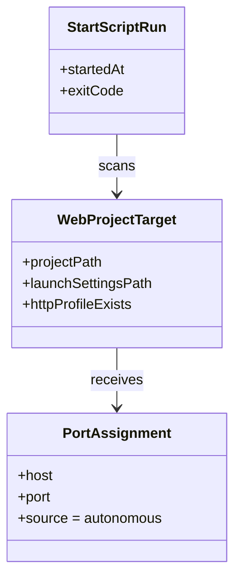

# Anforderungsanalyse – `start.ps1` für Visual-Studio-Debug mit freiem HTTP-Port

> **Dokument-Typ:** Requirements Analysis  
> **Status:** ✅ Abgeschlossen  
> **Version:** 1.1.0  
> **Datum:** 2026-05-14

---

## 1. Überblick und Projektkontext

### 1.1 Projektbeschreibung
Das Repository enthält ein Root-Skript `start.ps1`, das vor dem lokalen Visual-Studio-Debug die HTTP-Startkonfiguration in `launchSettings.json` auf freie Ports setzt. Ziel ist ein robuster lokaler Debug-Workflow ohne manuelle Portpflege.

### 1.2 Geschäftsziele
1. Portkonflikte im lokalen Debug-Betrieb vermeiden.
2. Bedienaufwand reduzieren: Skript ohne Parameter ausführbar.
3. Entkopplung sicherstellen: Anwendung kennt die Skriptlogik nicht.

### 1.3 Stakeholder
- Entwickler:innen, die lokal mehrere Web-Projekte parallel starten.
- Teamverantwortliche für Build-/Run-Konventionen.
- Maintainer der Test- und Skriptinfrastruktur.

### 1.4 Klare Abgrenzung Alt vs. Neu (Breaking Change)

| Aspekt | Alt (bis v1.0.0) | Neu (ab v1.1.0) |
|---|---|---|
| Steuerung | Parameter- und Env-getrieben (`-Port`, `-RepositoryPath`, `SOFTWARESCHMIEDE_*`) | **Parameterloser Start** (`.\start.ps1`) als Standardvertrag |
| Portquelle | Extern reservierter Port hat Vorrang | Skript ermittelt autonom Zielprojekte und freie Ports |
| Kopplung zur Anwendung | Anwendung übergibt Port/Argumente aktiv | Anwendung übergibt **keine** Port-/Skriptsteuerdaten |
| Reichweite | Fokus auf ein festes Projekt (`src/Softwareschmiede`) | Autonome Erkennung relevanter Web-Projekte im Repository |

**Breaking Change:** Der bisherige Parameter-/Env-Vertrag gilt fachlich als abgelöst und darf nicht mehr vorausgesetzt werden.

Verlinkte Referenzdokumente:
- [Architektur-Blueprint](../architecture/start-ps1-visual-studio-freier-http-port-architecture-blueprint.md)
- [ERM-Prüfung](../architecture/start-ps1-visual-studio-freier-http-port-entity-relationship-model.md)
- [Architecture-Review](../improvements/start-ps1-visual-studio-freier-http-port-architecture-review.md)
- [Ablaufdiagramm](../flows/start-ps1-visual-studio-freier-http-port-flow.md)

---

## 2. Funktionale Anforderungen

| Kennung | Beschreibung | Kategorie | Priorität | Status |
|---------|--------------|-----------|-----------|--------|
| **FR-1** | **Parameterloser Skriptvertrag:** `start.ps1` muss ohne übergebene Parameter lauffähig sein (`.\start.ps1`) und darf dafür keine Pflicht-Argumente erwarten. → [Architektur-Blueprint](../architecture/start-ps1-visual-studio-freier-http-port-architecture-blueprint.md) · [Architecture-Review](../improvements/start-ps1-visual-studio-freier-http-port-architecture-review.md) | Kern-Feature | MUST HAVE | 🔄 In Arbeit |
| **FR-1.1** | **Breaking-Contract-Entfernung:** Die Skriptlogik darf funktional nicht von `-Port`, `-RepositoryPath` oder einem von der Anwendung gelieferten Port abhängen. | Kern-Feature | MUST HAVE | 🔄 In Arbeit |
| **FR-2** | **Autonome Projekterkennung:** Das Skript identifiziert selbstständig alle relevanten Web-Projekte im Repository, für die ein freier HTTP-Port benötigt wird (z. B. vorhandenes `Properties/launchSettings.json` mit `profiles.http`). → [Architektur-Blueprint](../architecture/start-ps1-visual-studio-freier-http-port-architecture-blueprint.md) · [Ablaufdiagramm](../flows/start-ps1-visual-studio-freier-http-port-flow.md) | Kern-Feature | MUST HAVE | 📋 Geplant |
| **FR-2.1** | **Mehrprojektfähigkeit:** Für jedes gefundene Zielprojekt wird der HTTP-Port individuell bestimmt und gesetzt; ein Fehler in Projekt A darf Projekt B nicht inkonsistent überschreiben. | Kern-Feature | HIGH | 📋 Geplant |
| **FR-3** | **Freie-Port-Konfiguration:** Das Skript setzt je Zielprojekt im `http`-Profil die `applicationUrl` auf einen zum Laufzeitzeitpunkt freien lokalen Port. Der Host wird nur bei VS-kompatiblen Loopback-Hosts (`localhost`, `127.0.0.1`, `::1`) beibehalten; andernfalls erfolgt Fallback auf `localhost`. → [Architektur-Blueprint](../architecture/start-ps1-visual-studio-freier-http-port-architecture-blueprint.md) | Datenverwaltung | MUST HAVE | 🔄 In Arbeit |
| **FR-4** | **Kontrollierte Fehlerbehandlung:** Fehlende/ungültige `launchSettings.json`, fehlendes `http`-Profil oder Schreibfehler liefern standardisierte Fehlermeldungen mit Exit-Code. → [Architecture-Review](../improvements/start-ps1-visual-studio-freier-http-port-architecture-review.md) | Zuverlässigkeit | MUST HAVE | 🔄 In Arbeit |
| **FR-5** | **Entkopplung zur Anwendung:** Die Anwendung führt das Skript nur aus; sie kennt weder interne Portfindungsregeln noch muss sie Portwerte an Skriptparameter oder spezifische Env-Variablen übergeben. → [ERM-Prüfung](../architecture/start-ps1-visual-studio-freier-http-port-entity-relationship-model.md) · [Architecture-Review](../improvements/start-ps1-visual-studio-freier-http-port-architecture-review.md) | Kern-Feature | MUST HAVE | 📋 Geplant |
| **FR-6** | **Diagnostik pro Lauf:** Konsolenausgabe enthält mindestens Zeitstempel, Zielprojekt/-datei, gewählten Port und Ergebniscode je verarbeitetem Projekt. | Reporting & Analyse | HIGH | 🔄 In Arbeit |

---

## 3. Nicht-funktionale Anforderungen

| Kennung | Beschreibung | Kategorie | Priorität | Status |
|---------|--------------|-----------|-----------|--------|
| **NFR-1** | **Idempotente Konfigurationsänderung:** Mehrfachausführung erzeugt valide `launchSettings.json`-Dateien ohne strukturelle Korruption; ausschließlich relevante HTTP-URL-Werte werden geändert. → [Architecture-Review](../improvements/start-ps1-visual-studio-freier-http-port-architecture-review.md) | Zuverlässigkeit | MUST HAVE | 🔄 In Arbeit |
| **NFR-2** | **Autonomie ohne App-Kopplung:** Die Fachfunktion „freien Port setzen“ bleibt vollständig im Skript gekapselt; keine fachliche Logikduplizierung in C#-Services. | Wartbarkeit | MUST HAVE | 📋 Geplant |
| **NFR-3** | **Performance:** Vollständiger Skriptlauf für bis zu 5 Zielprojekte dauert im Regelfall ≤ 3 Sekunden auf typischer Entwicklerhardware. | Performance | HIGH | 📋 Geplant |
| **NFR-4** | **Sicherheit/Berechtigung:** Keine implizite Rechteeskalation, keine Pfadtraversal außerhalb Repository-Root, keine Ausgabe sensitiver Inhalte in Logs. | Sicherheit | MUST HAVE | 🔄 In Arbeit |
| **NFR-5** | **Portabilität im Team:** Verhalten ist reproduzierbar in lokalen Windows-Entwicklungsumgebungen mit PowerShell und Visual Studio. | Zuverlässigkeit | MUST HAVE | 📋 Geplant |

---

## 4. Akzeptanzkriterien

### User Story US-1 – Parameterloser Start
**Als** Entwickler:in  
**möchte ich** `.\start.ps1` ohne Argumente ausführen  
**damit** das Skript autonom alle relevanten Ziele verarbeitet.

- **AC-1.1:** Aufruf `.\start.ps1` endet ohne Parameterfehler mit Exit-Code `0`, sofern alle Zielprojekte gültig sind.
- **AC-1.2:** Das Skript akzeptiert optional übergebene Alt-Parameter nur noch ohne fachliche Wirkung oder dokumentiert sie als deprecated; das Ergebnis bleibt identisch zum parameterlosen Lauf.
- **AC-1.3:** Kein Testfall setzt für den Erfolg des Skripts zwingend `-Port` oder `-RepositoryPath` voraus.

### User Story US-2 – Autonome Projekterkennung und Portsetzung
**Als** Entwickler:in  
**möchte ich** dass alle relevanten Web-Projekte automatisch erkannt werden  
**damit** keine manuelle Projektliste gepflegt werden muss.

- **AC-2.1:** In einem Test-Repository mit mehreren `launchSettings.json`-Dateien werden alle gültigen `http`-Profile erkannt und verarbeitet.
- **AC-2.2:** Für jedes Zielprojekt wird eine `applicationUrl` mit freiem Port gesetzt; Ports sind pro Lauf eindeutig und > 0.
- **AC-2.3:** Host bleibt nur erhalten, wenn im bestehenden `applicationUrl` ein VS-kompatibler Loopback-Host vorhanden ist (`localhost`, `127.0.0.1`, `::1`); sonst wird `localhost` gesetzt.

### User Story US-3 – Entkopplung von Anwendung und Skriptlogik
**Als** Architekt:in  
**möchte ich** dass die Anwendung keine interne Skriptlogik kennen muss  
**damit** die Startlogik unabhängig weiterentwickelt werden kann.

- **AC-3.1:** `RepositoryStartskriptService` übergibt keine fachlichen Portsteuer-Argumente (`-Port`) an das Skript.
- **AC-3.2:** `RepositoryStartskriptService` setzt keine skriptspezifische Pflicht-Env-Variable für den Port als Funktionsvoraussetzung.
- **AC-3.3:** Anwendungstests validieren nur Ausführung/Fehlerbehandlung, nicht interne Portauflösung des Skripts.

### User Story US-4 – Robuste Fehlerbehandlung
**Als** Entwickler:in  
**möchte ich** klar diagnostizierbare Fehler  
**damit** ich Fehlkonfigurationen schnell beheben kann.

- **AC-4.1:** Fehlende `launchSettings.json` führt reproduzierbar zu Exit-Code `10` mit Pfadhinweis.
- **AC-4.2:** Ungültiges JSON oder fehlendes `http`-Profil führt reproduzierbar zu Exit-Code `11`.
- **AC-4.3:** Schreibfehler führt reproduzierbar zu Exit-Code `13`; temporäre `.tmp`-Dateien werden bereinigt.

---

## 5. Annahmen und Abhängigkeiten

| Typ | Beschreibung | Status |
|---|---|---|
| Abhängigkeit | `start.ps1` bleibt im Repository-Root und wird weiterhin durch `Softwareschmiede.csproj` als linked item referenziert. | Bestätigt |
| Abhängigkeit | Architektur-, ERM- und Review-Dokumente bleiben führende Referenzen für Folgeanpassungen. | Bestätigt |
| Annahme | Relevante Zielprojekte sind über `launchSettings.json` mit `profiles.http` eindeutig identifizierbar. | Zu validieren in Implementierung |
| Annahme | Das gewählte `applicationUrl`-Hostschema muss mit Visual-Studio-Browser-Debugging kompatibel bleiben; bei Inkompatibilität ist `localhost` als Fallback zu erzwingen. | Zu validieren in Implementierung |
| Risiko | TOCTOU zwischen Portfindung und tatsächlichem Debug-Start bleibt technisch möglich. | Akzeptiert, mit Retry-Hinweis |

---

## 6. Scope und Out-of-Scope

### In-Scope ✅
- Umstellung auf parameterlosen Standardvertrag für `start.ps1`.
- Autonome Erkennung relevanter Web-Projekte und freie HTTP-Portvergabe.
- Entfernung widersprüchlicher Vorgaben zu Parameter-/Env-Priorisierung.
- Anpassung automatisierter Tests auf den neuen Vertrag.
- Aktualisierung der Anforderungen inkl. Breaking-Change-Dokumentation.

### Out-of-Scope ❌
- HTTPS-Port-Strategie oder Zertifikatsverwaltung.
- Persistente Speicherung historischer Portvergaben in Datenbank.
- Plattformübergreifende Shell-Portierung (Linux/macOS).
- Änderung der fachlichen Portreservierungslogik außerhalb des Skript-Startpfads.

---

## 7. Domänenmodell und Glossar

### 7.1 Domänenmodell (fachlich, nicht-persistent)

### 7.2 Glossar
- **Autonome Projekterkennung:** Skript findet relevante Zielprojekte selbst, ohne externe Liste oder Parameter.
- **Zielprojekt:** Repository-Projekt mit `launchSettings.json` und gültigem `profiles.http`.
- **Breaking Change:** Inkompatible Vertragsänderung gegenüber bisherigem Parameter-/Env-Verhalten.
- **TOCTOU:** Port kann nach Ermittlung vor tatsächlichem Prozessstart erneut belegt werden.

---

## 8. Nutzungsfälle (Use Cases)

### UC-1: Standardlauf ohne Parameter
- **Akteur:** Entwickler:in
- **Vorbedingungen:** Repository ausgecheckt, `start.ps1` vorhanden.
- **Ablauf:**
  1. Entwickler:in führt `.\start.ps1` aus.
  2. Skript scannt relevante Zielprojekte.
  3. Skript setzt pro Zielprojekt freien HTTP-Port.
  4. Skript protokolliert Ergebnisse und beendet mit Exit-Code `0`.
- **Nachbedingung:** Alle betroffenen `applicationUrl`-Werte sind aktualisiert.

### UC-2: Fehlerfall fehlende Konfigurationsdatei
- **Akteur:** Entwickler:in
- **Ablauf:** Skript erkennt fehlende `launchSettings.json` in Zielprojekt.
- **Ergebnis:** Fehlerdiagnose mit Exit-Code `10`; keine teilweise korrupte Datei.

### UC-3: Aufruf durch Anwendung
- **Akteur:** Anwendung (`RepositoryStartskriptService`)
- **Ablauf:** Anwendung startet Skriptprozess ohne Port-Logik-Vertrag.
- **Ergebnis:** Anwendung erhält nur Erfolg/Fehler des Skriptlaufs; Portentscheidung verbleibt im Skript.

---

## 9. Nächste Schritte

1. **`start.ps1` refactoren:** Parameterabhängige Pfade (`param`, `Resolve-ConfiguredPort`) entfernen bzw. kompatibel ohne Wirkungsabhängigkeit kapseln.
2. **Autonome Projektsuche implementieren:** statt festem Pfad `src\Softwareschmiede\...` alle relevanten `launchSettings.json` im Repository auswerten.
3. **Anwendungsintegration anpassen:** in `src/Softwareschmiede/Application/Services/RepositoryStartskriptService.cs` Argumentaufbau ohne `-Port`/`-RepositoryPath`; Port-Env-Setzung nicht mehr als Skriptvertrag nutzen.
4. **Tests aktualisieren:**
   - `src/Softwareschmiede.IntegrationTests/Scripts/StartPs1IntegrationTests.cs`: Parameter-Prioritätsfall ersetzen durch parameterlosen Mehrprojektfall.
   - `src/Softwareschmiede.Tests/Application/Services/RepositoryStartskriptServiceTests.cs`: Assertions auf `-Port`/Port-Env entfernen, stattdessen auf entkoppelte Ausführung prüfen.
   - Exit-Code-Negativtests (`10/11/13`) vollständig ergänzen.
5. **Dokumentkonsistenz nachziehen:** Architektur-/Review-Artefakte auf neuen parameterlosen Vertrag synchronisieren.

---

## 10. Approval & Versionierung

### 10.1 Freigabestatus
- Fachlich freigegeben als **Änderungsanforderung mit Breaking Change**.
- Umsetzung erst abgeschlossen, wenn Akzeptanzkriterien AC-1.x bis AC-4.x testseitig nachgewiesen sind.

### 10.2 Versionierung

| Version | Datum | Autor | Änderung |
|---|---|---|---|
| 1.1.0 | 2026-05-14 | Requirements Analysis Agent | Überarbeitung auf parameterlosen, autonomen Skriptvertrag; Breaking Change gegenüber Parameter/Env-Ansatz dokumentiert; Scope, ACs und Implementierungs-/Testauswirkungen präzisiert. |
| 1.0.0 | 2026-05-14 | planning-orchestrator | Initiale Analyse für `start.ps1` + freier HTTP-Port im VS-Debug. |
